<p align="center">
    
</p>

<h1 align="center">
    Universidad Peruana de Ciencias Aplicadas
</h1>

<h3 align="center">
    Carrera: Ingeniería de Software
    <br> <br>
    Curso: SI729 - Desarrollo de Aplicaciones Open Source
    <br> <br>
    Sección: 4328
    <br> <br>
    Profesor: Juan Antonio Flores Moroco
    <br> <br>
    Ciclo: 2025-01 
    <br> <br>
    Informe de Trabajo Final
    <br> <br>
    Startup: Pandora
    <br> <br>
    Producto: TravelMatch  
</h3>

<div align="center">

| <div style="width:500px">Alumno</div> | <div style="width:200px">Código</div> |
|:-------------------------------------:|:-------------------------------------:|
|        Aspajo Alvarez, Mathias        |              u202317584               |
|       Briceño De La Cruz, Farid       |              u20211f211               |
|          Galvez Chambi, Jhon          |              u202323270               |
|         Guevara Tejada, Jorge         |              u202316057               |
|        Linares Bernable, Cesar        |              u202019409               |

</div>

<div align="center"> Abril 2025 </div>

<hr>

## Registro de Versiones del Informe

| Versión | Fecha | <div style="width:250px">Autor(es) </div> | <div align="center" style="width:400px">Descripción de la modificación</div> |
|:-------:|:-----:|:-----------------------------------------:|-------------------------------------------------------------|
| TB1 | 26/04/2025 | - Aspajo Alvarez, Mathias<br>- Briceño De La Cruz, Farid<br><br>- Galvez Chambi, Jhon<br>- Guevara Tejada, Jorge<br>- Linares Bernable, Cesar | Para esta entrega se han desarrollado los siguientes capítulos: <br>- Carátula<br>- Registro de Versiones del Informe<br>- Project Report Collaboration Insights<br>- Contenido<br>- Student Outcome<br>- Capítulo I: Introducción<br>- Capítulo II: Requirements Elicitation & Analysis<br>- Capítulo III: Requirements Specification<br>- Capítulo IV: Product Design<br>- Capítulo V: Product Implementation, Validation & Deployment<br>- 5.1. Software Configuration Management<br>- 5.1.1. Software Development Environment Configuration<br>- 5.1.2. Source Code Management<br>- 5.1.3. Source Code Style Guide & Conventions<br>- 5.1.4. Software Deployment Configuration<br>- 5.2. Landing Page, Services & Applications Implementation<br>- 5.2.1. Sprint 1<br>- 5.2.1.1. Sprint Planning 1<br>- 5.2.1.2. Aspect Leaders and Collaborators<br>- 5.2.1.3. Sprint Backlog 1<br>- 5.2.1.4. Development Evidence for Sprint Review<br>- 5.2.1.5. Execution Evidence for Sprint Review<br>- 5.2.1.6. Services Documentation Evidence for Sprint Review<br>- 5.2.1.7. Software Deployment Evidence for Sprint Review<br>- 5.2.1.8. Team Collaboration Insights during Sprint<br>- Avance de Conclusiones, Bibliografía y Anexos |
| TP1 | 16/05/2025 | - Aspajo Alvarez, Mathias<br>- Briceño De La Cruz, Farid<br>- Galvez Chambi, Jhon<br>- Guevara Tejada, Jorge<br>- Linares Bernable, Cesar | Para esta entrega se han desarrollado los siguiente capítulos: <br>- Correciones de la entrega TB1 <br>- Capítulo V: Product Implementation, Validation & Deployment<br> - 5.2.2. Sprint 2<br>- 5.2.2.1. Sprint Planning 2<br>- 5.2.2.2. Aspect Leaders and Collaborators<br>- 5.2.2.3. Sprint Backlog 2<br>- 5.2.2.4. Development Evidence for Sprint Review<br>- 5.2.2.5. Execution Evidence for Sprint Review<br>- 5.2.2.6. Services Documentation Evidence for Sprint Review<br>- 5.2.2.7. Software Deployment Evidence for Sprint Review<br>- 5.2.2.8. Team Collaboration Insights during Sprint<br>- Avance de Conclusiones, Bibliografía y Anexos <br><br> Asimismo, se han actualizado se han actualizado las secciones Registro de Versiones del Informe, Project Report Collaboration Insights y Sección Student Outcome.<br><br>Con respecto a los artefactos, se han desarrollado: <br>- Versión inicial del Frontend Web Applications|
| TB2 | 20/06/2025 | - Aspajo Alvarez, Mathias<br>- Briceño De La Cruz, Farid<br>- Galvez Chambi, Jhon<br>- Guevara Tejada, Jorge<br>- Linares Bernable, Cesar | Para esta entrega se han desarrollado los siguiente capítulos: <br>- Correciones de la entrega TP1 <br>- Capítulo V: Product Implementation, Validation & Deployment<br> - 5.2.3. Sprint 3<br>- 5.2.3.1. Sprint Planning 3<br>- 5.2.3.2. Aspect Leaders and Collaborators<br>- 5.2.3.3. Sprint Backlog 3<br>- 5.2.3.4. Development Evidence for Sprint Review<br>- 5.2.3.5. Execution Evidence for Sprint Review<br>- 5.2.3.6. Services Documentation Evidence for Sprint Review<br>- 5.2.3.7. Software Deployment Evidence for Sprint Review<br>- 5.2.3.8. Team Collaboration Insights during Sprint<br>- 5.3. Validation Interviews<br>- 5.3.1. Diseño de Entrevistas<br>- 5.3.2. Registro  de Entrevistas<br>- 5.3.3. Evaluaciones según heurísticas<br>- 5.4. Video About-the-Product<br>- Avance de Conclusiones, Bibliografía y Anexos <br><br> Asimismo, se han actualizado se han actualizado las secciones Registro de Versiones del Informe, Project Report Collaboration Insights y Sección Student Outcome.<br><br>Con respecto a los artefactos, se han desarrollado: <br>- Versión nueva del Landing Page <br>- Versión nueva del Frontend Web Applications<br>- Versión inicial del Backend Web Services<br>- Versión inicial del Video About-The-Product<br>- Versión inicial del Video About-The-Team|

<hr>

## Project Report Collaboration Insights  

Nuestro Project Report se encuentra en el siguiente repositorio de GitHub: 

🔗[https://github.com/G2-Aplicaciones-Open-Source/docs](https://github.com/G2-Aplicaciones-Open-Source/docs).

- **Flujo de trabajo adoptado**

    Durante el desarrollo colaborativo de este repositorio, hemos decidido adoptar el flujo de trabajo GitHub Flow, debido a su simplicidad, escalabilidad y orientación a la integración continua. Este flujo nos ha permitido:

    - Crear ramas individuales por cada integrante y sección asignada.
    - Realizar pull requests para revisión de cambios antes de integrarlos a la rama principal.
    - Discutir observaciones mediante comentarios en los commits o PRs.
    - Asegurar la integración progresiva, ordenada y sin conflictos del contenido en el informe final.

    Además, hemos establecido una convención de nombres para las ramas utilizando el siguiente esquema: cap[numero-capitulo], lo que facilita la identificación de la sección en proceso de edición. Del mismo modo, los mensajes de commit son claros y están formulados siguiendo la semántica de los commits convencionales, lo que mejora la trazabilidad y comprensión del historial de cambios.

### Colaboración por Entrega

- **TB1:**
    Para la Primera Entrega (TB1) del Project Report, cada miembro del equipo participó activamente en la redacción de secciones específicas. La coordinación se realizó de forma asincrónica y vía reuniones breves en línea para consensuar estilos de redacción y criterios de inclusión.

    - Asignación de secciones por miembro:
        - Aspajo Alvarez, Mathias (AdeXzz): Capitulo 2 (repartido), Capitulo 3
        - Briceño De La Cruz, Farid	(InjustShin): Capitulo 4 (repartido)
        - Galvez Chambi, Jhon (Chaomeum): Capitulo 1, Capitulo 4 (repartido)
        - Guevara Tejada, Jorge	(Jorgito170): Capitulo 2 (repartido)
        - Linares Bernable, Cesar (Cesar-Linares): Capitulo 4 (repartido)
        - Todos: Capitulo 5

    - A continuación, se adjuntan capturas que evidencian el trabajo distribuido:
        - Miembros del equipo en el repositorio:
        <p align="center">
            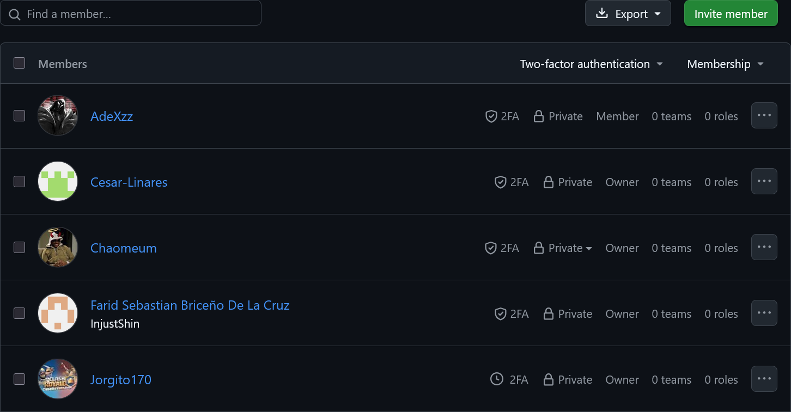
        </p>
        - Creación de ramas por cada capítulo:
        <p align="center">
            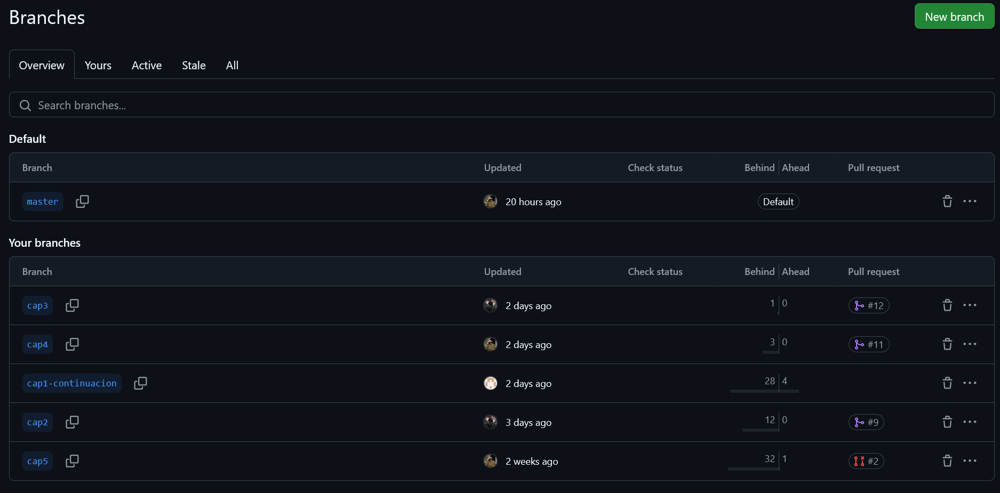
        </p>
        - Commits realizados en las ramas individuales:       
        <p align="center">
            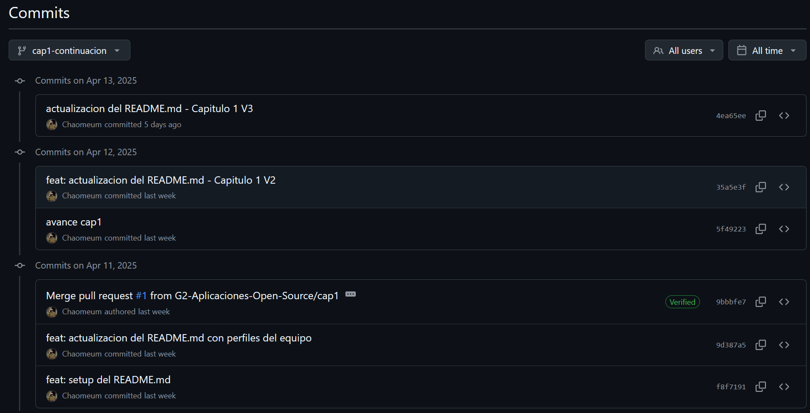
        </p>
        <p align="center">
            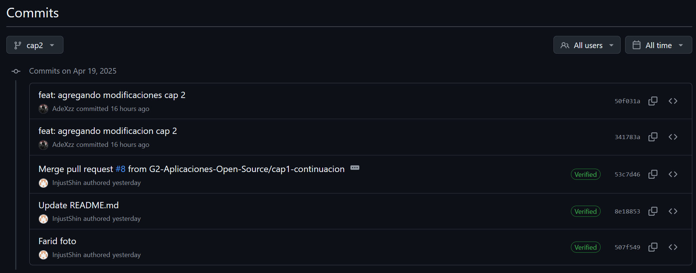
        </p>
        <p align="center">
            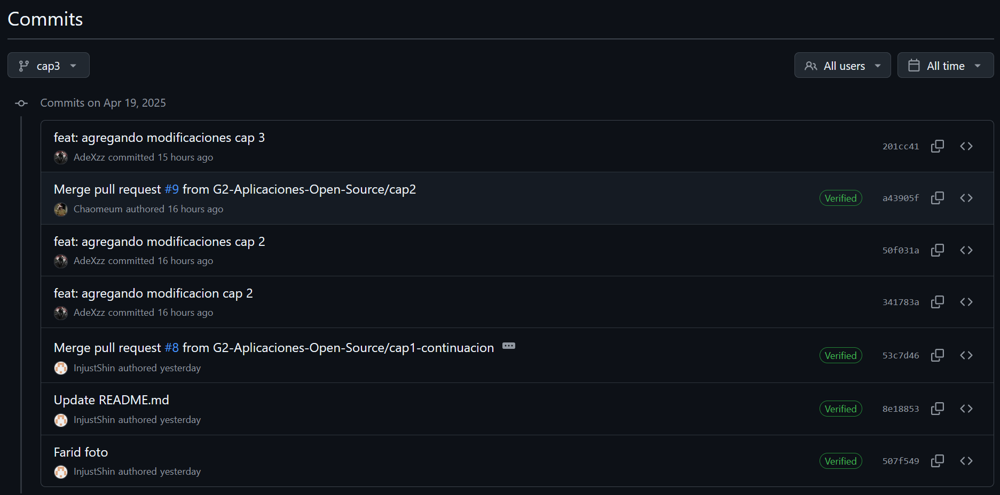
        </p>
        <p align="center">
            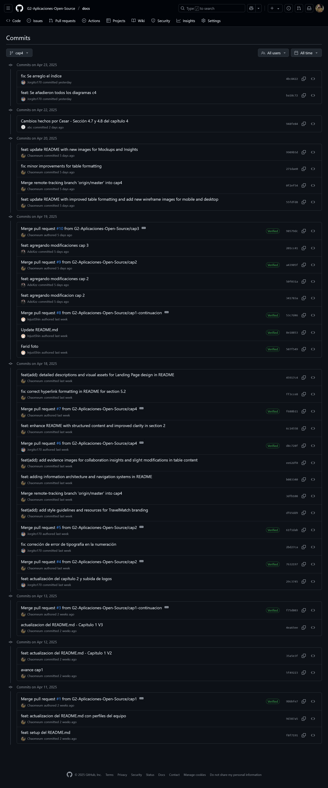
        </p>
        <p align="center">
            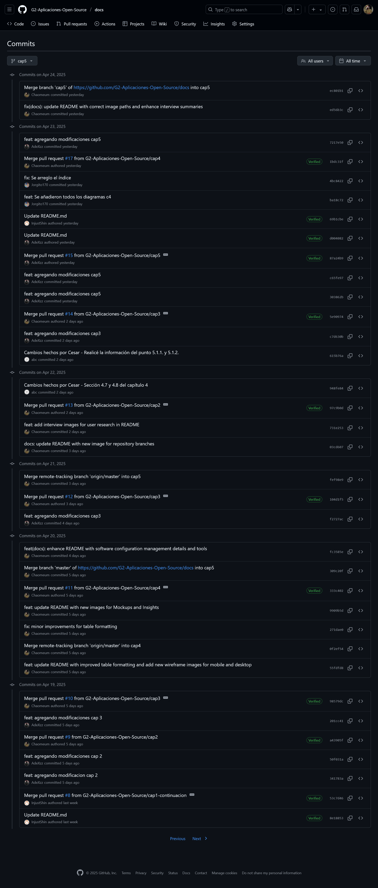
        </p>        
        - Analítica del repositorio con participación de todos los miembros:
        <p align="center">
            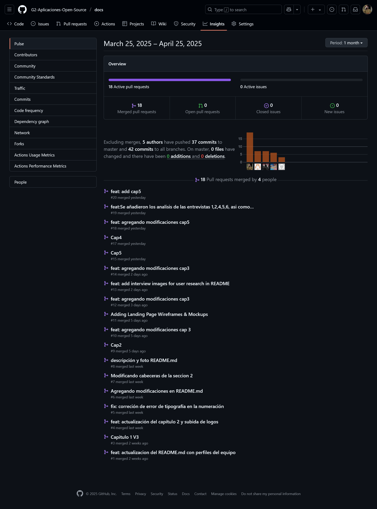
        </p> 
        <p align="center">
            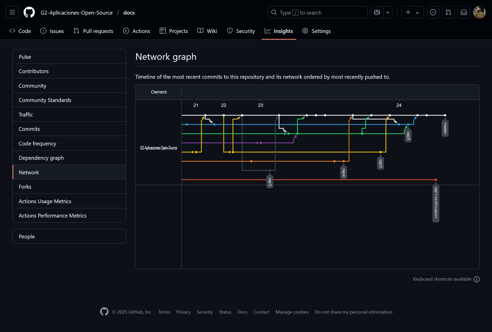
        </p>        

<hr>

## Tabla de Contenidos

[Registro de Versiones del Informe](#registro-de-versiones-del-informe)

[Project Report Collaboration Insights](#project-report-collaboration-insights)

[Tabla de Contenidos](#tabla-de-contenidos)

[Student Outcome](#student-outcome)

[Capítulo I: Introducción](#capítulo-i-introducción)
  - [1.1. Startup Profile](#11-startup-profile)
    - [1.1.1. Descripción de la Startup](#111-descripción-de-la-startup)
    - [1.1.2. Perfiles de Integrantes del Equipo](#112-perfiles-de-integrantes-del-equipo)
  - [1.2. Solution Profile](#12-solution-profile)
    - [1.2.1. Antecedentes y Problemática](#121-antecedentes-y-problemática)
    - [1.2.2. Lean UX Process](#122-lean-ux-process)
      - [1.2.2.1. Lean UX Problem Statements](#1221-lean-ux-problem-statements)
      - [1.2.2.2. Lean UX Assumptions](#1222-lean-ux-assumptions)
      - [1.2.2.3. Lean UX Hypothesis Statements](#1223-lean-ux-hypothesis-statements)
      - [1.2.2.4. Lean UX Canvas](#1224-lean-ux-canvas)
  - [1.3. Segmentos Objetivos](#13-segmentos-objetivos)

[Capítulo II: Requirements Elicitation & Analysis](#capítulo-ii-requirements-elicitation--analysis)
  - [2.1. Competidores](#21-competidores)
    - [2.1.1. Análisis competitivo](#211-análisis-competitivo)
    - [2.1.2. Estrategias y tácticas frente a competidores](#212-estrategias-y-tácticas-frente-a-competidores)
  - [2.2. Entrevistas](#22-entrevistas)
    - [2.2.1. Diseño de entrevistas](#221-diseño-de-entrevistas)
    - [2.2.2. Registro de entrevistas](#222-registro-de-entrevistas)
    - [2.2.3. Análisis de entrevistas](#223-análisis-de-entrevistas)
  - [2.3. Needfinding](#23-needfinding)
    - [2.3.1. User Personas](#231-user-personas)
    - [2.3.2. User Task Matrix](#232-user-task-matrix)
    - [2.3.3. User Journey Mapping](#233-user-journey-mapping)
    - [2.3.4. Empathy Mapping](#234-empathy-mapping)
        - [2.3.4.1. Empathy Mapping Turistas nacionales e internacionales](#2341-empathy-mapping-turistas-nacionales-e-internacionales)
        - [2.3.4.2. Empathy Mapping Agencias de turismo locales](#2342-empathy-mapping-agencias-de-turismo-locales)
        - [2.3.4.3. Empathy Mapping Viajeros por trabajo](#2343-empathy-mapping-viajeros-por-trabajo)
    - [2.3.5. As-is Scenario Mapping](#235-as-is-scenario-mapping)
        - [2.3.5.1. As-is Scenario Mapping Turistas nacionales e internacionales](#2351-as-is-scenario-mapping-turistas-nacionales-e-internacionales)
        - [2.3.5.2. As-is Scenario Mapping Agencias de turismo locales](#2352-as-is-scenario-mapping-agencias-de-turismo-locales)
        - [2.3.5.3. As-is Scenario Mapping Viajeros por trabajo](#2353-as-is-scenario-mapping-viajeros-por-trabajo)
  - [2.4. Ubiquitous Language](#24-ubiquitous-language)

[Capítulo III: Requirements Specification](#capítulo-iii-requirements-specification)
  - [3.1. To-Be Scenario Mapping](#31-to-be-scenario-mapping)
    - [3.1.1. To-Be Scenario Mapping Turistas nacionales e internacionales](#311-to-be-scenario-mapping-turistas-nacionales-e-internacionales)
    - [3.1.2. To-Be Scenario Mapping Agencias de turismo locales](#312-to-be-scenario-mapping-agencias-de-turismo-locales)
    - [3.1.3. To-Be Scenario Mapping Viajeros por trabajo](#313-to-be-scenario-mapping-viajeros-por-trabajo)
  - [3.2. User Stories](#32-user-stories)
  - [3.3. Impact Mapping](#33-impact-mapping)
  - [3.4. Product Backlog](#34-product-backlog)

[Capítulo IV: Product Design](#capítulo-iv-product-design)
- [4.1. Style Guidelines](#41-style-guidelines)
    - [4.1.1. General Style Guidelines](#411-general-style-guidelines)
    - [4.1.2. Web Style Guidelines](#412-web-style-guidelines)
- [4.2. Information Architecture](#42-information-architecture)
    - [4.2.1. Organization Systems](#421-organization-systems)
    - [4.2.2. Labeling Systems](#422-labeling-systems)
    - [4.2.3. SEO Tags and Meta Tags](#423-seo-tags-and-meta-tags)
    - [4.2.4. Searching Systems](#424-searching-systems)
    - [4.2.5. Navigation Systems](#425-navigation-systems)
- [4.3. Landing Page UI Design](#43-landing-page-ui-design)
    - [4.3.1. Landing Page Wireframe](#431-landing-page-wireframe)
    - [4.3.2. Landing Page Mock-up](#432-landing-page-mock-up)
- [4.4. Web Applications UX/UI Design](#44-web-applications-uxui-design)
    - [4.4.1. Web Applications Wireframes.](#441-web-applications-wireframes)
    - [4.4.2. Web Applications Wireflow Diagrams](#442-web-applications-wireflow-diagrams)
    - [4.4.3. Web Applications Mock-ups](#443-web-applications-mock-ups)
    - [4.4.4. Web Applications User Flow Diagrams](#444-web-applications-user-flow-diagrams)
- [4.5. Web Applications Prototyping](#45-web-applications-prototyping)
- [4.6. Domain-Driven Software Architecture](#46-domain-driven-software-architecture)
    - [4.6.1. Software Architecture Context Diagrams](#461-software-architecture-context-diagrams)
    - [4.6.2. Software Architecture Container Diagrams](#462-software-architecture-container-diagrams)
    - [4.6.3. Software Architecture Components Diagrams](#463-software-architecture-components-diagrams)
- [4.7. Software Object-Oriented Design](#47-software-object-oriented-design)
    - [4.7.1. Class Diagrams](#471-class-diagrams)
    - [4.7.2. Class Dictionary](#472-class-dictionary)
- [4.8. Database Design](#48-database-design)
    - [4.8.1. Database Diagram](#481-database-diagram)

[Capítulo V: Product Implementation, Validation & Deployment](#capítulo-v-product-implementation-validation--deployment)
  - [5.1. Software Configuration Management](#51-software-configuration-management)
    - [5.1.1. Software Development Environment Configuration](#511-software-development-environment-configuration)
    - [5.1.2. Source Code Management](#512-source-code-management)
    - [5.1.3. Source Code Style Guide & Conventions](#513-source-code-style-guide--conventions)
    - [5.1.4. Software Deployment Configuration](#514-software-deployment-configuration)
  - [5.2. Landing Page, Services & Applications Implementation](#52-landing-page-services--applications-implementation)
    - [5.2.1. Sprint 1](#521-sprint-1)
      - [5.2.1.1. Sprint Planning 1](#5211-sprint-planning-1)
      - [5.2.1.2. Aspect Leaders and Collaborators](#5212-aspect-leaders-and-collaborators)
      - [5.2.1.3. Sprint Backlog 1](#5213-sprint-backlog-1)
      - [5.2.1.4. Development Evidence for Sprint Review](#5214-development-evidence-for-sprint-review)
      - [5.2.1.5. Execution Evidence for Sprint Review](#5215-execution-evidence-for-sprint-review)
      - [5.2.1.6. Services Documentation Evidence for Sprint Review](#5216-services-documentation-evidence-for-sprint-review)
      - [5.2.1.7. Software Deployment Evidence for Sprint Review](#5217-software-deployment-evidence-for-sprint-review)
      - [5.2.1.8. Team Collaboration Insights during Sprint](#5218-team-collaboration-insights-during-sprint)
    - [5.2.2. Sprint 2](#522-sprint-2)
      - [5.2.2.1. Sprint Planning 2](#5221-sprint-planning-2)
      - [5.2.2.2. Aspect Leaders and Collaborators](#5222-aspect-leaders-and-collaborators)
      - [5.2.2.3. Sprint Backlog 2](#5223-sprint-backlog-2)
      - [5.2.2.4. Development Evidence for Sprint Review](#5224-development-evidence-for-sprint-review)
      - [5.2.2.5. Execution Evidence for Sprint Review](#5225-execution-evidence-for-sprint-review)
      - [5.2.2.6. Services Documentation Evidence for Sprint Review](#5226-services-documentation-evidence-for-sprint-review)
      - [5.2.2.7. Software Deployment Evidence for Sprint Review](#5227-software-deployment-evidence-for-sprint-review)
      - [5.2.2.8. Team Collaboration Insights during Sprint](#5228-team-collaboration-insights-during-sprint)
    - [5.2.3. Sprint 3](#523-sprint-3)
      - [5.2.3.1. Sprint Planning 3](#5231-sprint-planning-3)
      - [5.2.3.2. Aspect Leaders and Collaborators](#5232-aspect-leaders-and-collaborators)
      - [5.2.3.3. Sprint Backlog 3](#5233-sprint-backlog-3)
      - [5.2.3.4. Development Evidence for Sprint Review](#5234-development-evidence-for-sprint-review)
      - [5.2.3.5. Execution Evidence for Sprint Review](#5235-execution-evidence-for-sprint-review)
      - [5.2.3.6. Services Documentation Evidence for Sprint Review](#5236-services-documentation-evidence-for-sprint-review)
      - [5.2.3.7. Software Deployment Evidence for Sprint Review](#5237-software-deployment-evidence-for-sprint-review)
      - [5.2.3.8. Team Collaboration Insights during Sprint](#5238-team-collaboration-insights-during-sprint)
  - [5.3. Validation Interviews](#53-validation-interviews)
    - [5.3.1. Diseño de Entrevistas](#531-diseño-de-entrevistas)
    - [5.3.2. Registro de Entrevistas](#532-registro-de-entrevistas)
    - [5.3.3. Evaluaciones según heurísticas](#533-evaluaciones-segun-heuristicas)
  - [5.4. Video About-the-Product](#54-video-about-the-product)

[Conclusiones](#conclusiones)
  - [Conclusiones y Recomendaciones](#conclusiones-y-recomendaciones)
  - [Video About-The-Team](#video-about-the-team)

[Bibliografía](#bibliografía)

[Anexos](#anexos)

<hr>

## Student Outcome

El curso contribuye al cumplimiento del Student Outcome ABET:

**ABET – EAC - Student Outcome 3**

Criterio: Capacidad de comunicarse efectivamente con un rango de audiencias. 
En el siguiente cuadro se describe las acciones realizadas y enunciados de conclusiones por parte del grupo,
que permiten sustentar el haber alcanzado el logro del ABET – EAC - Student Outcome 3.

| <div style="width:100px">Criterio específico</div> | <div align="center" style="width:250px">Acciones Realizadas</div> | <div align="center" style="width:250px">Conclusiones</div> |
|:-------------------:|-------------------|------------|
|Comunica oralmente con efectividad a diferentes rangos de audiencia| **- Mathias Aspajo** <br> **TB1:** En esta entrega me encargué de comunicarle a mi equipo cuál sería la metodología de trabajo. Además, participé activamente en la revisión retroactiva de los avances de mis compañeros. También apoyé en la preparación del material de presentación para nuestras reuniones internas.<br> **TP:** Durante esta etapa participé en la organización del repositorio para el despliegue del frontend. Apoyé en la verificación del correcto funcionamiento de los componentes visuales y validé que la interfaz se adaptara a los lineamientos definidos por el equipo. También colaboré en la revisión final antes del despliegue en el entorno productivo.  <br> **TB2:** <br> **TF:** <br> <br> **- Farid Briceño** <br> **TB1:** No aplica <br> **TP:** Me encargué de configurar el entorno de desarrollo para el frontend y realicé el despliegue de la primera versión en la plataforma seleccionada. También solucioné errores relacionados con la carga de componentes y aseguré que los recursos estáticos se visualizaran correctamente en producción. <br> **TB2:** En esta entrega me encargué de la realización del bounded context geolocation que se encarga de agregar el registro de ubicación de una experiencia en concreto. También del desarrollo de las preguntas de validación para los segmentos objetivos definidos. <br> **TF:** <br> <br> **- Jhon Galvez** <br> **TB1:** En esta entrega me encargue de comunicarle a mi equipo cual seria la metodología de trabajo, asimismo colabore con la revision retroactiva de los avances de mis compañeros indicándoles que puntos de la documentación se podrían mejorar. Adicionalmente, realice entrevistas para dos segmentos objetivos <br> **TP:** Apoyé en la implementación inicial de las vistas principales del frontend. Verifiqué la correcta integración entre las rutas del sitio y revisé que la interfaz reflejara fielmente el diseño propuesto. También contribuí a la solución de errores menores durante el proceso de despliegue. <br> **TB2:** <br> **TF:** <br> <br> **- Jorge Guevara** <br> **TB1:** En esta entrega me encargué de comunicarle a mi equipo cuál sería la metodología de trabajo. Además, realicé tres entrevistas enfocadas en el segmento de turistas nacionales e internacionales, con el propósito de entender mejor sus necesidades y expectativas. Asimismo, colaboré con la revisión retroactiva de los avances de mis compañeros, brindándoles observaciones sobre los puntos de la documentación que podrían ser mejorados. <br> **TP:** Participé en la revisión funcional del frontend antes del despliegue. Verifiqué que las secciones clave estuvieran alineadas con las necesidades de los usuarios identificadas en entrevistas anteriores. Además, brindé soporte para validar la experiencia de usuario final tras el despliegue. <br> **TB2:** En esta entrega, me encargué de explicar al equipo los avances realizados en el backend, detallando el funcionamiento de los nuevos endpoints desarrollados para Availabilities, Experiences y Experience Media. Participé activamente en reuniones internas para resolver dudas técnicas y asegurar la alineación entre el backend y el frontend. Asimismo, brindé retroalimentación a mis compañeros sobre mejoras posibles en la integración y validación funcional, fortaleciendo así la comunicación técnica dentro del equipo. <br> **TF:** <br> <br> **- Cesar Linares** <br> **TB1:** En esta entrega, me encargué de escuchar lo que el equipo quiere que haga y avancé con mis mandatos para una colaboración amena <br> **TP:** Contribuí en la implementación visual de la interfaz del frontend, asegurando que los estilos y elementos gráficos fueran consistentes. También colaboré en pruebas de visualización desde distintos dispositivos antes del despliegue para asegurar su correcto comportamiento. <br> **TB2:** <br> **TF:** <br> <br>| **TB1:** Cada miembro participó en sus actividades asignadas, manteniendo una comunicación activa y eficaz que fortaleció la confianza mutua. Esto mejoró el trabajo en equipo, un valor crucial para proyectos colaborativos <br> **TP:** En esta etapa, cada integrante del equipo asumió un rol activo en el desarrollo y despliegue de la primera versión del frontend. La colaboración constante permitió resolver obstáculos técnicos con agilidad y asegurar una interfaz funcional y coherente con los objetivos del proyecto. El compromiso colectivo facilitó un despliegue exitoso y fortaleció nuestras capacidades de coordinación técnica y trabajo en equipo. <br>|
|Comunica por escrito con efectividad a diferentes rangos de audiencia| **- Mathias Aspajo** <br> **TB1:** Colabore con la elaboración de las pautas y alineamientos que nuestro equipo seguiría durante el proceso de desarrollo de software. Asimismo, me encargue de elaborar el Capitulo 2 y 3.<br> **TP:** <br> **TB2:** En esta entrega, me encargué de documentar el apartado 5.2.2.1 relacionado con el Sprint Planning 2, detallando las tareas priorizadas, objetivos del sprint y planificación del equipo. Además, participé activamente en los apartados grupales, como la evidencia de desarrollo, ejecución, despliegue y colaboración del equipo durante el sprint. <br> **TF:** <br> <br> **- Farid Briceño** <br> **TB1:** No aplica <br> **TP:** Durante esta etapa, colaboré con la redacción del apartado 5.2.2.6, aportando evidencia documentada de los servicios implementados para el Sprint Review. Asimismo, contribuí en la elaboración conjunta de los puntos sobre la evidencia de desarrollo, ejecución, despliegue del software y reflexiones sobre el trabajo en equipo. <br> **TB2:** En esta etapa se desarrolló el backend del proyecto. En el reporte me encargué del diseño de entrevista de validación (5.3.1) para que los 3 segmentos objetivos puedan dejar su feedback y mejorar las próximas versiones de software.  <br> **TF:** <br> <br> **- Jhon Galvez** <br> **TB1:** Colabore con la elaboración de las pautas y alineamientos que nuestro equipo seguiría durante el proceso de desarrollo de software. Asimismo, me encargue de elaborar el Capitulo 1 y el Landing Page UI Design. <br> **TP:** Me encargué de desarrollar el punto 5.2.2.6, donde se presenta la evidencia documentada de los servicios implementados y su funcionalidad para el Sprint Review. Además, participé activamente en la construcción colectiva de la documentación sobre el desarrollo, ejecución, despliegue del software y dinámica de trabajo colaborativo. <br> **TB2:** <br> **TF:** <br> <br> **- Jorge Guevara** <br> **TB1:** Colabore con la elaboración de los alineamientos que el equipo seguiría durante el proceso de desarrollo. También, me encargue de hacer los capítulos 2 y 4.<br> **TP:** En esta entrega, desarrollé el punto 5.2.2.3 referente al Sprint Backlog 2, detallando las tareas seleccionadas, responsables y tiempos estimados. Asimismo, participé junto al equipo en los apartados grupales relacionados con la evidencia de desarrollo, ejecución, despliegue del software y aprendizajes del trabajo colaborativo. <br> **TB2:** En esta entrega, documenté de manera estructurada los avances técnicos del backend. Me encargué de redactar los apartados 5.2.3.4 (Evidencia de desarrollo), 5.2.3.5 (Evidencia de ejecución) y 5.2.3.6 (Evidencia de los servicios implementados) para el Sprint Review. Estas secciones detallan el comportamiento, validación y resultados obtenidos de los endpoints desarrollados, facilitando su comprensión por parte de cualquier lector, técnico o no técnico, y aportando claridad y trazabilidad al trabajo realizado durante el sprint. <br> **TF:** <br> <br> **- Cesar Linares** <br> **TB1:** En esta entrega, me encargué de la creación del class y database diagram, en orden de tener un modelo físico y estructurado de todos nuestros datos almacenados. También, con el punto 5.1.1 y 5.1.2, los cuales listan las tecnologías que hemos usado para la realización del proyecto <br> **TP:** Me encargué de redactar el apartado 5.2.2.2 sobre los Aspect Leaders and Collaborators, detallando los roles asumidos por cada miembro del equipo durante el sprint. Asimismo, colaboré en la elaboración de los contenidos colectivos que evidencian el desarrollo, ejecución, despliegue del software y reflexiones sobre la colaboración del equipo. <br> **TB2:** <br> **TF:** <br> <br> | **TB1:** Cada miembro participó en sus actividades asignadas, manteniendo una comunicación activa y eficaz que fortaleció la confianza mutua. Esto mejoró el trabajo en equipo, un valor crucial para proyectos colaborativos<br> **TP:** Cada miembro asumió con responsabilidad sus tareas durante el despliegue de la primera versión del frontend, cumpliendo con los entregables asignados. La coordinación fluida y el enfoque en objetivos comunes permitieron lograr una implementación técnica exitosa. Además, el trabajo conjunto en la documentación, pruebas y despliegue fortaleció la dinámica del equipo y reafirmó nuestro compromiso con la calidad del producto. <br> |

<hr>

## Capítulo I: Introducción 

### 1.1. Startup Profile

#### 1.1.1. Descripción de la Startup

Nuestra startup, TravelMatch, surge a partir de una problemática latente en el sector turístico: la fragmentación de la oferta de actividades y experiencias locales, lo que dificulta a los turistas planificar sus viajes de forma personalizada, segura y eficiente. Hoy en día, quienes viajan deben navegar por múltiples sitios, redes sociales y foros para encontrar excursiones o experiencias, muchas veces enfrentándose a información incompleta, desactualizada o poco confiable.

Por otro lado, las agencias de turismo locales carecen de canales digitales eficientes para visibilizar sus servicios, competir con grandes operadores y gestionar sus reservas en tiempo real.

Ante este contexto, proponemos una plataforma web de turismo y actividades personalizadas, que actúe como puente entre turistas y agencias locales. Nuestra solución permite a los viajeros explorar y reservar experiencias según destino, tipo de actividad y presupuesto, mientras que ofrece a las agencias una interfaz intuitiva para gestionar su catálogo y atender reservas con agilidad.

La propuesta de valor se centra en:

- Para los turistas: una experiencia de búsqueda fluida, segura y adaptada a sus preferencias.
- Para las agencias: visibilidad digital, herramientas de gestión y potencial de crecimiento.

El modelo de negocio se sustentará en:

- Comisiones por cada reserva gestionada a través de la plataforma.

- Planes premium para agencias que deseen destacar sus servicios y acceder a beneficios adicionales.

| Misión | Visión |
|:-------:|:-------:|
|Ofrecer una plataforma digital intuitiva y confiable que conecte a turistas con experiencias auténticas, promoviendo el turismo local y facilitando la digitalización de pequeñas y medianas agencias.|Convertirnos en la plataforma líder en experiencias turísticas personalizadas en Peru, siendo reconocidos por nuestra innovación, impacto social y compromiso con el desarrollo del turismo sostenible.|

#### 1.1.2. Perfiles de Integrantes del Equipo

- Mathias Aspajo Alvarez - u202317584 (Ingeniería de Software)

<p align="center">
    
</p>

Mi nombre es Mathias Aspajo, tengo 19 años y actualmente me encuentro en el 5to ciclo de la carrera de Ing. de Software, me considero una persona responsable y colaborativa con cualquier trabajo que tenga. Pienso dar lo mejor de mí para desarrollar un buen proyecto.

- Farid Briceño De La Cruz - u20211f211 (Ingeniería de Software)

<p align="center">
    
</p>

Soy estudiante de Ingeniería de Software con un fuerte interés en el desarrollo de productos digitales y la tecnología. En mi tiempo libre, me gusta jugar videojuegos. También tengo un interés especial en la música, lo que me ayuda a equilibrar mi vida académica y personal. Cuento con habilidades en gestión de bases de datos y me gusta informmarme de las soluciones actuales, lo que me ayuda a tomar decisiones informadas y crear soluciones efectivas.

- Jhon Alexander Galvez Chambi - u202323270 (Ingeniería de Software)

<p align="center">
    
</p>

Soy una persona responsable y comprometida con la consecución de los mejores resultados en trabajo en equipo. Poseo experiencia en diversos lenguajes de programación, incluyendo Python, JavaScript y C++, así como en varios de los frameworks asociados a estos lenguajes. Además, tengo conocimientos en tecnologías emergentes como Cloud Computing e Internet de las Cosas (IoT), y estoy dispuesto a aportar mi experiencia en estas áreas para contribuir al éxito de los proyectos en los que participo.

- Jorge Guevara Tejada - u202316057 (Ingeniería de Software)

<p align="center">
    
</p>

Soy un estudiante que se caracteriza por su alto sentido de la responsabilidad y un fuerte compromiso con su equipo. Me esfuerzo continuamente por superar los desafíos académicos, dedicando tiempo adicional a mejorar en las áreas donde siento que puedo crecer. Mi objetivo no es sólo alcanzar un rendimiento académico satisfactorio, sino también contribuir de manera significativa al éxito del equipo, asegurando que cada proyecto en el que participó refleja nuestro esfuerzo y dedicación colectivos.

- Cesar Linares Bernable - u202019409 (Ingeniería de Software)

<p align="center">
        
</p>

Soy una persona responsable y trabajadora que cumple las tareas encomendadas cuanto antes sea posible. Tengo conocimientos en SQL, C++, Python y lo básico de CSS y Javascript. Me gusta aprender por mi cuenta lenguajes de programación como Rust y uso ese conocimiento para ayudar a mi equipo.


#### 1.2. Solution Profile

#### 1.2.1. Antecedentes y problemática

En los últimos años, el sector turístico ha experimentado una transformación significativa, impulsada principalmente por la digitalización y los cambios en las preferencias de los viajeros. De acuerdo con un estudio realizado por Google, el interés por el término 'viajar' en Perú registró un incremento superior al 33% durante el año 2022. Adicionalmente, según un informe del Ministerio de Comercio Exterior y Turismo (Mincetur), la llegada de turistas internacionales al país experimentó un aumento del 39,2% entre los meses de enero y agosto de 2024.

A pesar de este creciente interés, los turistas enfrentan desafíos al planificar sus itinerarios, especialmente en lo que respecta a la reserva de actividades y experiencias locales. La información dispersa, la falta de plataformas centralizadas y la escasa presencia digital de muchas agencias locales dificultan la personalización y seguridad en la planificación de viajes.

Paralelamente, el sector de agencias de viajes en Perú enfrenta problemas de informalidad. En 2022, el Ministerio de Comercio Exterior y Turismo (Mincetur) clausuró varias agencias en Lima por operar sin licencia y sin personal calificado . Esta situación no solo afecta la confianza de los turistas, sino que también limita el desarrollo sostenible del turismo local.

Por consiguiente, con el propósito de obtener una comprensión más precisa de las necesidades de nuestros usuarios, hemos llevado a cabo un estudio de sus antecedentes históricos y la problemática en cuestión utilizando la metodología de las 5W y 2H. 

**Análisis 5W2H**

| **Pregunta** | **Respuesta** |
|:-----:|:-----:|
|**What (¿Qué?)** <br> ¿Cuál es el problema?|Existe una desconexión significativa entre los turistas y las agencias de turismo locales, dificultando la planificación y reserva de actividades auténticas y seguras.|
|**When (¿Cuándo?)** <br> ¿Cuándo sucede el problema?|Este problema se ha intensificado en los últimos años, especialmente tras la pandemia de COVID-19, que obligó a muchas agencias a cerrar o reducir sus operaciones, y con el aumento del interés en viajes nacionales e internacionales.|
|**Where (¿Dónde?)** <br> ¿Dónde se presenta el problema de negocio?|Principalmente en Perú, donde destinos turísticos populares como Cusco, Lima y Arequipa presentan una alta demanda, pero también una oferta fragmentada y, en ocasiones, informal.|
|**Who (¿Quién?)** <br> ¿Quiénes están involucrados?|Turistas nacionales e internacionales que buscan experiencias locales auténticas, y agencias de turismo locales que carecen de herramientas digitales para promocionar y gestionar sus servicios.|
|**Why (¿Por qué?)** <br> ¿Por qué se origina el problema?|La falta de plataformas digitales centralizadas, la escasa presencia en línea de muchas agencias locales y la informalidad en el sector impiden a los viajeros acceder fácilmente a experiencias personalizadas y confiables.|
|**How (¿Cómo?)** <br> ¿Cómo afecta este problema a las personas involucradas?|Los turistas enfrentan dificultades para encontrar opciones seguras, personalizadas y verificadas, lo que puede afectar negativamente su experiencia de viaje. Por otro lado, las agencias locales pierden oportunidades de negocio, visibilidad y competitividad en un mercado cada vez más digitalizado.|
|**How much (¿Cuánto?)** <br> ¿Cuánto impacto genera el problema en la sociedad?|El impacto es significativo, ya que limita el desarrollo del sector turístico formal, fomenta la informalidad y la desconfianza, y reduce el potencial económico de comunidades locales que dependen del turismo para su sustento. También frena la innovación y la digitalización del ecosistema turístico nacional.|

#### 1.2.2. Lean UX Process

#### 1.2.2.1. Lean UX Problem Statements

Actualmente, los turistas enfrentan dificultades para encontrar opciones de actividades turísticas que se alineen con sus intereses y necesidades específicas. Esta falta de acceso a información clara, organizada y relevante limita su capacidad de tomar decisiones informadas.

Por otro lado, muchas agencias de viaje locales, a pesar de ser formales, tienen problemas para obtener visibilidad en un mercado donde predomina la oferta informal difundida principalmente a través de redes sociales y plataformas no reguladas. Esta situación reduce su competitividad, afecta su sostenibilidad y contribuye a la desconfianza general en los servicios turísticos disponibles.

Esta desconexión entre turistas y agencias está afectando negativamente la confianza de los usuarios y el desarrollo del sector turístico formal en Perú.

#### 1.2.2.2. Lean UX Assumptions

**Business Assumptions**

1. Creemos que nuestros clientes necesitan encontrar y reservar experiencias turísticas personalizadas de forma confiable y eficiente.
2. Estas necesidades se resuelven con una plataforma web que centralice ofertas de actividades de agencias verificadas, con filtros por interés, ubicación y presupuesto.
3.	Nuestros clientes iniciales serán turistas nacionales y extranjeros que visitan Perú, así como agencias de turismo formalmente constituidas que buscan digitalizar sus servicios.
4.  El valor más importante de lo que el cliente requiere de nuestro servicio es una experiencia de viaje personalizada, segura y sin complicaciones.
5.	El cliente puede tener los siguientes beneficios adicionales: acceso a reseñas de otros usuarios, itinerarios organizados, descuentos exclusivos, y soporte digital durante el viaje.
6.	Vamos a adquirir clientes mediante estrategias de marketing digital (SEO, redes sociales, influencers de viajes), alianzas con agencias y posicionamiento en buscadores de experiencias.
7.	Haremos dinero a través de comisiones por reservas realizadas a través de la plataforma y planes premium para agencias.
8.	Nuestra competencia principal serán plataformas internacionales como Booking, Airbnb Experiences y la oferta informal en redes sociales.
9.	Los venceremos ya que nuestra plataforma tiene un enfoque local, curaduría de experiencias auténticas, alianza con agencias formales, y una interfaz intuitiva con filtros relevantes.
10.	Nuestro mayor riesgo es la baja adopción por parte de agencias o la falta de confianza de los usuarios en nuevas plataformas.
11.	Resolveremos esto mediante estrategias de onboarding amigables, incentivos iniciales, verificación pública de agencias y testimonios visibles de clientes satisfechos.
12. Qué otras suposiciones tenemos que, si resultan falsas, harán que nuestro negocio/proyecto fracase?
    - Que los turistas están dispuestos a reservar experiencias turísticas por adelantado desde una plataforma digital.
    - Que las agencias formales ven valor en integrarse a un sistema centralizado y están dispuestas a adaptarse a su uso.

**User Assumptions**

1.	¿Quién será nuestro usuario? 
    - Turistas nacionales y extranjeros con acceso a internet, con intención de explorar nuevas experiencias en sus destinos.
    - Representantes de agencias de turismo interesadas en aumentar su visibilidad y reservas.
2.	¿Dónde encaja nuestro producto en su vida?
    - En la etapa de planificación de viaje, al buscar actividades que enriquezcan su experiencia.
    - En el caso de agencias, como parte de su canal de ventas y atención al cliente.
3.	¿Qué problemas resuelve nuestro producto?
    - Dificultad para encontrar experiencias confiables, personalizadas y seguras.
    - Desorganización de itinerarios.
    - Limitada presencia digital de agencias locales confiables.
4.	¿Cómo y Cuándo es usado nuestro producto?
    - Antes del viaje (exploración y reservas) y durante el viaje (gestión de itinerarios y asistencia).
    - En dispositivos móviles y de escritorio, principalmente mediante el navegador web.
5.	¿Qué características son importantes?
	- Filtros de búsqueda por intereses, ubicación, precio, reseñas.
    - Perfil y catálogo de agencias.
    - Organización del itinerario.
    - Pago seguro y notificaciones.
6.  ¿Cómo luce y se comporta nuestro producto?
    - Con una interfaz limpia, intuitiva y confiable, accesible para distintos niveles de experiencia tecnológica.
    - Rápida carga, navegación fluida, diseño adaptado a dispositivos móviles.

#### 1.2.2.3. Lean UX Hypothesis Statements

- **Creemos que**, si ofrecemos a los turistas una plataforma donde puedan explorar actividades segmentadas por tipo de experiencia, destino, presupuesto y duración, entonces podrán tomar decisiones más informadas, mejorando su experiencia de viaje. **Sabremos que** hemos logrado este resultado **cuando** observemos un incremento sostenido en la cantidad de reservas exitosas y una tasa alta de satisfacción del usuario (medida por reseñas y feedback post-actividad).

- **Creemos que**, al proporcionar a las agencias una interfaz administrativa sencilla para gestionar su catálogo, recibir notificaciones de reservas y analizar métricas básicas, aumentará su participación activa y la disponibilidad de oferta formal. **Sabremos que** esta hipótesis es válida **cuando** se registre un incremento progresivo en el número de agencias registradas y publicaciones activas.

- **Creemos que**, si promovemos exclusivamente agencias registradas y verificadas (según regulaciones del MINCETUR), entonces generaremos mayor confianza en el usuario final y fomentaremos la formalización del sector. **Sabremos que** esta hipótesis se confirma **cuando** veamos un crecimiento sostenido en la base de usuarios activos y una reducción en las quejas relacionadas a malas experiencias con proveedores.

- **Creemos que**, si integramos herramientas de personalización (como recomendaciones según el historial o intereses declarados), entonces los usuarios encontrarán actividades más alineadas a sus expectativas. **Sabremos que** esto es cierto **cuando** aumente el tiempo de navegación en la plataforma y la tasa de conversión de visitas en reservas.

#### 1.2.2.4. Lean UX Canvas

<p align="center">
    
</p>

### 1.3. Segmentos Objetivos

Los siguientes segmentos clave permiten establecer una base sólida para el lanzamiento de la aplicación.
Su elección busca facilitar la conexión entre turistas y agencias, y sentar las bases para el crecimiento
del turismo personalizado en la plataforma.

- **Segmento objetivo 1: Agencias de turismo locales**

| _Aspectos demográficos_ | _Aspectos geográficos_ | _Aspectos psicográficos_ |
|-------------------------|------------------------|--------------------------|
| Sexo: masculino y femenino <br> Edades: entre 25-60 años <br> Nivel socioeconómico: clases B y C (media-alta y media) | Nacionalidad: Peruana <br> Zona geográfica: Urbana y zonas turísticas <br> Departamento: Diversas regiones del Perú, especialmente Lima, Cusco, Arequipa, Ica, Puno y Madre de Dios | Necesidad de expandir su presencia digital y aumentar su cartera de clientes <br> Interesadas en herramientas que automaticen reservas y muestren su oferta de forma atractiva. <br> Valoran plataformas que reduzcan su carga operativa, sean fáciles de usar y mejoren su competitividad frente a grandes operadores turísticos. |


- **Segmento objetivo 2: Turistas nacionales e internacionales**

| _Aspectos demográficos_ | _Aspectos geográficos_ | _Aspectos psicográficos_ |
|-------------------------|------------------------|--------------------------|
| - Sexo: masculino y femenino <br> - Edades: entre 18-65 años <br> - Nivel socioeconómico: clases A, B y C (alta, media-alta y media) | - Nacionalidad: Peruana y extranjera <br> - Zona geográfica: Urbana (para salidas) y destinos turísticos del Perú <br> - Departamento: Origen en Lima, Cusco, Arequipa u otros, con desplazamiento hacia zonas de interés turístico | - Buscan experiencias personalizadas, prácticas y seguras durante sus viajes <br> - Valoran la facilidad de comparar, filtrar y reservar actividades desde una sola plataforma <br> - Dispuestos a pagar por experiencias únicas y auténticas, adaptadas a sus intereses y presupuesto |

- **Segmento objetivo 3: Viajeros por trabajo (Turismo corporativo)**

| _Aspectos demográficos_ | _Aspectos geográficos_ | _Aspectos psicográficos_ |
|-------------------------|------------------------|--------------------------|
| - Sexo: masculino y femenino <br> - Edades: entre 25-55 años <br> - Nivel socioeconómico: clases A y B (alta y media-alta) | - Nacionalidad: Peruana y extranjera <br> - Zona geográfica: Urbana (ciudades principales con movimiento empresarial) <br> - Departamento: Principalmente Lima Metropolitana, Arequipa, Trujillo, Cusco | - Buscan aprovechar su tiempo libre durante viajes laborales para conocer la ciudad o relajarse <br> - Valoran la eficiencia, rapidez y calidad del servicio al reservar actividades de corta duración <br> - Interesados en experiencias bien organizadas, con horarios compatibles con su agenda de trabajo y disponibles cerca de su ubicación |

<hr>

## Capítulo II: Requirements Elicitation & Analysis

### 2.1. Competidores

**1.- GetYourGuide** es una empresa tecnológica fundada en 2009 en Berlín que ofrece una plataforma para reservar tours, actividades y experiencias turísticas personalizadas en destinos de todo el mundo. La plataforma permite a los usuarios filtrar experiencias por ubicación, precio, duración y tipo de actividad. GetYourGuide trabaja directamente con proveedores locales, cobra una comisión por cada reserva y también ofrece servicios promocionales premium para sus socios. La empresa ha recibido importantes rondas de inversión y tiene presencia en más de 150 países.

**2.- Viator** es una subsidiaria de TripAdvisor, fundada en 1995, que se especializa en la reserva de tours y actividades turísticas. Su plataforma permite a los usuarios explorar miles de experiencias guiadas y autoguiadas, personalizables por destino, temática o precio. Viator ofrece a los proveedores de servicios turísticos una herramienta para gestionar sus actividades, precios y disponibilidad en tiempo real. La plataforma monetiza mediante comisiones por reserva y programas de visibilidad para agencias destacadas.

**3.- Klook** es una plataforma de viajes y actividades fundada en 2014 en Hong Kong que conecta a los viajeros con experiencias personalizadas, entradas a atracciones, transporte y paquetes turísticos. Klook permite reservar en línea con confirmación inmediata, y se enfoca en brindar experiencias locales auténticas. Los proveedores de servicios pueden gestionar su inventario mediante una herramienta integrada. Klook se financia por comisiones por venta y ha expandido su presencia a más de 100 países con apoyo de múltiples rondas de inversión.

#### 2.1.1. Análisis competitivo

<table><tr><th colspan="6" valign="top"><a name="_dns5lxqlpwhz"></a>Competitive Analysis Landscape </th></tr>
<tr><td colspan="2" rowspan="2" valign="top"><p></p><p>¿Por qué llevar a cabo este análisis?</p></td><td colspan="4" rowspan="2" valign="top"><p>El objetivo principal de realizar este análisis de la competencia es poder identificar las fortalezas, debilidades, oportunidades y amenazas de la propia empresa en comparación con los principales competidores del mercado.</p><p>Esto nos permitirá tomar decisiones informadas sobre la mejor manera de posicionarnos, diferenciarnos y aprovechar las oportunidades que el mercado nos ofrece.</p></td></tr>
<tr></tr>
</table>

<table><tr>
    <th colspan="2" valign="top"></th>
    <th valign="top">
      <p>TravelMatch</p>
      
    </th>
    <th valign="top">
      <p>GetYourGuide</p>
      
    </th>
    <th valign="top">
      <p>Viator</p>
      
    </th>
    <th valign="top">
      <p>Klook</p>
      
    </th>
  </tr>
<tr><td rowspan="2" valign="top"><p></p><p>Perfil</p></td><td valign="top">Overview</td><td valign="top">Es una plataforma web que conecta a turistas con agencias para reservar actividades personalizadas según destino, experiencia y presupuesto. Las agencias gestionan su catálogo y reservas en tiempo real. El modelo de negocio incluye comisiones y suscripciones premium.</td><td valign="top">Es una plataforma que permite a los viajeros reservar tours y actividades en todo el mundo. Ofrece experiencias filtradas por destino, precio y tipo, y conecta a turistas con proveedores locales. Utiliza un modelo de comisión por reserva y servicios premium para agencias.. </td><td valign="top">Es una plataforma respaldada por TripAdvisor que ofrece reservas de actividades turísticas personalizadas. Permite a los usuarios buscar experiencias por ubicación y tipo, y a los proveedores gestionar su catálogo en tiempo real. Su modelo se basa en comisiones y promoción destacada.</td><td valign="top"><p>Es una app de origen asiático que facilita la reserva de experiencias locales, entradas y transporte en más de 100 países. Brinda confirmación inmediata y herramientas para que los proveedores gestionen su oferta. Monetiza mediante comisiones y servicios de visibilidad.</p><p></p></td></tr>
<tr><td valign="top">Ventaja competitiva ¿Qué valor ofrece a los clientes?</td><td valign="top">Conecta a turistas con agencias para crear experiencias completamente personalizadas según sus preferencias y presupuesto, ofreciendo una alternativa flexible y enfocada en la personalización.</td><td valign="top">Ofrece una amplia selección de actividades verificadas en todo el mundo con una plataforma fácil de usar, lo que brinda confianza, variedad y flexibilidad a los viajeros al momento de reservar.</td><td valign="top">Permite acceder a miles de experiencias turísticas respaldadas por TripAdvisor, integrando reseñas y comparaciones que facilitan la toma de decisiones informadas al reservar.</td><td valign="top">Facilita la reserva rápida de experiencias auténticas con confirmación inmediata y precios competitivos, ideal para viajeros que buscan comodidad y eficiencia.</td></tr>
<tr><td rowspan="2" valign="top"><p></p><p>Perfil de Marketing </p></td><td valign="top">Mercado objetivo</td><td valign="top">Agencias de turismo que desean digitalizar su oferta, turistas nacionales e internacionales que buscan actividades personalizadas, y viajeros por trabajo que desean optimizar su tiempo libre con experiencias locales.</td><td valign="top">Turistas internacionales y locales que buscan experiencias organizadas, excursiones y actividades en destinos populares, principalmente de ocio y cultura.</td><td valign="top"><p>Viajeros globales interesados en tours guiados, actividades culturales y excursiones, especialmente aquellos que valoran las reseñas y la confiabilidad de una marca reconocida como TripAdvisor.</p><p></p></td><td valign="top">Turistas jóvenes, viajeros independientes y tecnológicos, especialmente en Asia y grandes ciudades, que buscan experiencias rápidas, auténticas y accesibles desde el mó</td></tr>
<tr><td valign="top">Estrategias de marketing</td><td valign="top"><p>Implementa campañas en redes sociales dirigidas a turistas y agencias, estrategias de posicionamiento SEO local e internacional, alianzas con agencias regionales y marketing de contenidos enfocado en experiencias personalizadas. Además, utiliza promociones cruzadas y testimonios para generar confianza y atraer nuevos usuarios.</p><p></p></td><td valign="top">Utiliza marketing digital intensivo, incluyendo SEO, publicidad en Google Ads, redes sociales y colaboraciones con influencers de viajes. También invierte en contenido optimizado y campañas en plataformas de video para generar confianza y visibilidad global.</td><td valign="top">Aprovecha la integración con TripAdvisor para captar tráfico orgánico, destacando actividades dentro de sus páginas. Además, emplea campañas de email marketing, publicidad digital y alianzas con operadores turísticos para ampliar su alcance.</td><td valign="top"><p>Se enfoca en marketing de contenidos, redes sociales y colaboraciones con influencers y youtubers de viajes, especialmente en el mercado asiático. También lanza promociones exclusivas, descuentos en fechas especiales y campañas móviles con notificaciones push.</p><p></p></td></tr>
<tr><td rowspan="3" valign="top"><p></p><p>Perfil de producto</p></td><td valign="top">Productos & Servicios</td><td valign="top"><p>Ofrece paquetes turísticos personalizados, excursiones, actividades locales según intereses y presupuesto, sistema de reservas en tiempo real, catálogo digital para agencias, y opciones de visibilidad premium dentro de la plataforma.</p><p></p></td><td valign="top"><p>Ofrece tours guiados, entradas a atracciones turísticas, excursiones de un día, experiencias gastronómicas, actividades de aventura, traslados y servicios personalizados en múltiples destinos.</p><p></p></td><td valign="top">Brinda acceso a tours y excursiones, entradas sin colas, actividades culturales y de entretenimiento, experiencias únicas (como clases de cocina o catas), y paquetes combinados con cancelación flexible.</td><td valign="top">Proporciona entradas a atracciones, experiencias locales, transporte (trenes, buses, tarjetas SIM), actividades temáticas, eventos especiales, paquetes turísticos y servicios adicionales como seguros de viaje.</td></tr>
<tr><td valign="top">Precios & Costos</td><td valign="top">Variados</td><td valign="top">Variados</td><td valign="top">Variados</td><td valign="top">Variados</td></tr>
<tr><td valign="top">Canales de distribución (Web y/o Móvil)</td><td valign="top">Web/Móvil</td><td valign="top">Web/Móvil</td><td valign="top">Web/Móvil</td><td valign="top">Web/Móvil</td></tr>
<tr><td rowspan="5" valign="top"><p></p><p>Análisis SWOT</p></td><td colspan="5" valign="top">Realice esto para su startup y sus competidores. Sus fortalezas deberían apoyar sus oportunidades y contribuir a lo que ustedes definen como su posible ventaja competitiva</td></tr>
<tr><td valign="top">Fortalezas</td><td valign="top"><p>Ofrece experiencias personalizadas para turistas y agencias.</p><p>Conecta directamente a agencias de turismo con clientes, eliminando intermediarios.</p><p>Sistema de reservas en tiempo real, lo que optimiza la experiencia del cliente.</p><p>Modelo de negocio flexible basado en comisiones y suscripciones.</p><p></p></td><td valign="top"><p>Gran variedad de actividades en múltiples destinos.</p><p>Reputación confiable gracias a las reseñas de usuarios.</p><p>Plataforma fácil de usar con opciones de pago flexibles.</p><p>Presencia global en más de 150 países.</p><p></p></td><td valign="top"><p>Respaldo y confianza de TripAdvisor, lo que genera credibilidad.</p><p>Amplia gama de tours y actividades a nivel mundial.</p><p>Fuerte presencia en mercados desarrollados.</p><p></p></td><td valign="top"><p>Enfoque en experiencias auténticas y locales.</p><p>Fuerte presencia en Asia y popularidad creciente en mercados occidentales.</p><p>Amplia oferta de productos (transporte, entradas, actividades).</p><p>Plataforma móvil optimizada.</p><p></p></td></tr>
<tr><td valign="top">Debilidades</td><td valign="top"><p>Necesidad de atraer a un volumen significativo de agencias para ser competitiva.</p><p>Competencia con plataformas establecidas como Viator y GetYourGuide.</p><p>Dependencia de la calidad de las agencias asociadas.</p><p></p></td><td valign="top"><p>Alta competencia con otras plataformas de reservas de actividades.</p><p>Dependencia de las comisiones de los proveedores, lo que puede afectar los márgenes.</p><p>Limitada personalización de las experiencias en algunos casos.</p><p></p></td><td valign="top"><p>Fuerte dependencia de TripAdvisor para la generación de tráfico.</p><p>Poca flexibilidad en la personalización de experiencias para turistas.</p><p>La competencia directa de plataformas como GetYourGuide y Klook.</p><p></p></td><td valign="top"><p>Dependencia de un mercado asiático que puede volverse saturado.</p><p>Limitada presencia en algunos mercados turísticos importantes como Europa y América Latina.</p><p>Escasa personalización en algunos servicios.</p><p></p></td></tr>
<tr><td valign="top">Oportunidades</td><td valign="top"><p>Expansión a mercados globales con un enfoque local.</p><p>Crecimiento de la demanda de experiencias personalizadas post-pandemia.</p><p>Colaboraciones con agencias de turismo locales y servicios complementarios.</p><p></p></td><td valign="top"><p>Expansión en mercados emergentes y destinos menos explotados.</p><p>Crecimiento en el turismo post-pandemia con nuevas experiencias.</p><p>Colaboraciones con agencias de turismo locales para diversificar la oferta.</p><p></p></td><td valign="top"><p>Expansión en mercados emergentes, especialmente en Asia y América Latina.</p><p>Innovación en la experiencia del usuario con tecnologías emergentes (realidad aumentada, inteligencia artificial).</p><p>Creación de alianzas estratégicas con agencias turísticas locales.</p><p></p></td><td valign="top"><p>Expansión en mercados globales fuera de Asia.</p><p>Alianzas con grandes empresas de turismo para ofrecer paquetes exclusivos.</p><p>Expansión de la oferta de servicios más allá de las actividades turísticas.</p><p></p></td></tr>
<tr><td valign="top">Amenazas</td><td valign="top"><p>Alta competencia en el mercado de reservas de actividades turísticas.</p><p>Cambios en las regulaciones locales o internacionales de turismo.</p><p>Riesgo de no diferenciarse suficientemente en un mercado con muchas opciones similares.</p><p></p></td><td valign="top"><p>Inestabilidad en la industria del turismo debido a factores globales (crisis económicas, pandemias).</p><p>Cambios en las regulaciones de viajes y turismo en distintos países.</p><p>Competencia creciente de plataformas como Viator, Klook y nuevas startups.</p><p></p></td><td valign="top"><p>Cambios en las regulaciones turísticas o políticas de reembolsos.</p><p>La creciente demanda de experiencias personalizadas que pueden no ser completamente cubiertas por Viator.</p><p>Aumento de la competencia con plataformas más flexibles.</p><p></p></td><td valign="top"><p>Competencia fuerte con otras plataformas globales como GetYourGuide y Viator.</p><p>Cambios en las preferencias de los viajeros hacia experiencias más personalizadas y sostenibles.</p><p>Riesgo de saturación de mercado en Asia.</p><p></p></td></tr>
</table>

#### 2.1.2. Estrategias y tácticas frente a competidores

**1. Estrategias de Crecimiento y Expansión:**

- **#1 Expansión de alianzas con agencias de turismo locales e internacionales:**

    TravelMatch forjará colaboraciones estratégicas con agencias de turismo locales y globales, permitiendo que estas se integren de manera fluida en la plataforma para ofrecer una variedad más amplia de paquetes turísticos y experiencias personalizadas. Esto impulsará el crecimiento de la plataforma al aumentar la base de agencias asociadas y diversificar la oferta para los usuarios.

- **#2 Creación de un programa de fidelización para turistas frecuentes:**

    TravelMatch lanzará un programa de recompensas y membresía premium para turistas frecuentes. Este programa incentivará a los viajeros a realizar más reservas dentro de la plataforma, con beneficios como descuentos exclusivos, acceso anticipado a ofertas especiales y experiencias VIP, fomentando la lealtad de los usuarios a largo plazo.

- **#3 Expansión a mercados internacionales con enfoque local:**

    TravelMatch se expandirá a nuevos mercados internacionales, comenzando con destinos turísticos populares, pero ofreciendo un enfoque altamente localizado, adaptado a las preferencias culturales y necesidades de los viajeros en esas regiones. Esto permitirá captar una base de usuarios diversa y brindar experiencias altamente relevantes.

**2. Estrategias de Innovación y Diferenciación:**

- **#1 Personalización mediante análisis de preferencias del usuario:**

    TravelMatch implementará un sistema que permita personalizar las recomendaciones de paquetes turísticos y actividades en función de las preferencias y comportamientos de los usuarios. Aunque no se utilicen IA avanzadas, se podrán crear filtros que permitan a los usuarios explorar opciones adaptadas a su destino, tipo de experiencia y presupuesto.

- **#2 Mejora de la experiencia de usuario a través de un diseño optimizado y funcional:**
    La plataforma se diseñará de forma sencilla, intuitiva y fácil de navegar, permitiendo a los usuarios encontrar rápidamente las actividades que desean. Esto incluirá filtros detallados, clasificación de destinos y actividades, y un proceso de reserva claro y rápido, mejorando la experiencia del usuario y facilitando la toma de decisiones.

- **#3 Ofrecimiento de paquetes de viaje personalizados por agentes locales:**
    En lugar de depender de algoritmos complejos, TravelMatch ofrecerá la posibilidad de crear itinerarios de viaje personalizados con la ayuda de agentes de viajes locales que conozcan los destinos de manera profunda. Esto agregará un valor adicional, ya que los usuarios podrán recibir recomendaciones de expertos que comprendan el destino y sus necesidades.

**3. Tácticas:**

- **Desarrollo de Producto:**
    - **Ciclos de desarrollo ágil:** Implementar procesos ágiles para realizar iteraciones rápidas en la plataforma, mejorando constantemente la experiencia del usuario basándose en los comentarios y el feedback directo de los turistas y agencias.
    - **Pruebas A/B continuas:** Realizar pruebas A/B para optimizar la experiencia de usuario, desde la interfaz de usuario hasta las funcionalidades del sistema de reservas, asegurando que las mejoras se basen en datos reales de uso y preferencias de los usuarios.

- **Fidelización del Usuario:**
    - **Programa de lealtad y membresías premium:** Crear un sistema de recompensas para los viajeros recurrentes y agencias destacadas. Las membresías premium otorgarán beneficios exclusivos, como descuentos, acceso prioritario y visibilidad aumentada en la plataforma para las agencias de turismo.
    - **Feedback y mejora continua:** Establecer canales de comunicación directa con los usuarios (tanto turistas como agencias) para recibir sugerencias y mejorar la plataforma. Utilizar análisis de datos de interacciones pasadas para ofrecer una experiencia más satisfactoria en futuras reservas.

- **Expansión Tecnológica:**
    - **Optimización multiplataforma:** Asegurar que TravelMatch funcione de manera óptima tanto en dispositivos móviles como en plataformas web, garantizando un acceso constante y sin interrupciones a la plataforma desde cualquier dispositivo, en cualquier lugar y momento.


### 2.2. Entrevistas

#### 2.2.1. Diseño de entrevistas

En esta sección de preguntas, nuestro objetivo es comprender mejor las necesidades, motivaciones y preferencias de nuestros segmentos objetivos dentro del ecosistema turístico. A continuación, se muestran las preguntas:

- **Segmento #1: Agencias de turismo locales**

    **Preguntas principales:**
    -  ¿Qué canales usas actualmente para promocionar tus paquetes turísticos? ¿Qué tan efectivos los consideras?
    -  ¿Con qué frecuencia recibes reservas online? ¿Qué retos enfrentas en su gestión?
    -  ¿Qué importancia le das a tener una presencia digital sólida frente a la competencia?
    -  ¿Estás satisfecho con las herramientas tecnológicas actuales que usas para tu agencia? ¿Por qué?
    -  ¿Qué funcionalidades consideras más útiles en una plataforma que conecte agencias con turistas?
    -  ¿Has tenido dificultades para destacar frente a agencias más grandes o con más recursos?
    -  ¿Qué valoras más al elegir una herramienta digital: facilidad de uso, alcance de clientes, personalización o soporte técnico?

    **Preguntas complementarias:**
    -  ¿Qué tipo de turistas suelen contratar tus servicios (edad, nacionalidad, intereses)?
    -  ¿Qué porcentaje de tus reservas proviene de canales digitales?
    -  ¿Te interesa acceder a planes premium o suscripciones que te den mayor visibilidad?
    -  ¿Cuáles son las temporadas donde más te gustaría tener apoyo digital para la gestión de tu oferta?
    -  ¿Qué tan dispuesto estarías a pagar una comisión por cada reserva concretada a través de una plataforma?

- **Segmento #2: Turistas nacionales e internacionales**

    **Preguntas principales:**
    -  ¿Cómo sueles planificar tus viajes dentro del Perú? ¿Qué herramientas usas para ello?
    -  ¿Qué tan importante es para ti personalizar tus experiencias de viaje según tus intereses?
    -  ¿Has tenido dificultades encontrando actividades o excursiones que se adapten a tu presupuesto o estilo de viaje?
    -  ¿Qué tipo de actividades valoras más al viajar (culturales, aventura, gastronomía, relax, etc.)?
    -  ¿Prefieres reservar todo por separado o en paquetes que combinen varias experiencias?
    -  ¿Qué tan relevante es para ti poder comparar precios, duración y valoraciones desde una sola plataforma?
    -  ¿Qué factores te dan más confianza al reservar actividades en línea (opiniones, reputación de la agencia, medios de pago, seguridad)?

    **Preguntas complementarias:**
    -  ¿Estás dispuesto a pagar un poco más por una experiencia auténtica y personalizada?
    -  ¿Te interesaría recibir recomendaciones de actividades según tu ubicación y tus intereses?
    -  ¿Qué tan cómodo te resulta hacer reservas desde tu celular cuando estás viajando?
    -  ¿Te gustaría tener la opción de contactar directamente con la agencia antes de reservar?
    -  ¿Te ha pasado que llegaste a un destino sin saber qué actividades hacer y dónde contratarlas?

- **Segmento #3: Viajeros por trabajo (Turismo corporativo)**

    **Preguntas principales:**
    - ¿Con qué frecuencia viajas por motivos laborales dentro del país?
    -  ¿Sueles tener tiempo libre entre reuniones o compromisos laborales cuando viajas?
    -  ¿Qué tipo de actividades te gustaría realizar durante tu tiempo libre? (Tours cortos, experiencias gastronómicas, relajación, etc.)
    -  ¿Qué valoras más al reservar actividades durante viajes de trabajo: rapidez, ubicación cercana, disponibilidad inmediata, etc.?
    -  ¿Utilizas apps o plataformas para organizar tu tiempo libre cuando estás fuera por trabajo? ¿Cuáles?
    -  ¿Te resulta complicado encontrar actividades con horarios flexibles o compatibles con tus jornadas laborales?
    -  ¿Estás interesado en experiencias personalizadas que se adapten a tu perfil profesional y tus gustos personales?

    **Preguntas complementarias:**
    -  ¿Prefieres reservar actividades antes de viajar o una vez ya estás en la ciudad?
    - ¿Te gustaría recibir recomendaciones automáticas según tu horario, ubicación y tipo de viaje?
    -  ¿Qué tan cómodo te sentirías usando una app que combine actividades turísticas y servicios prácticos para viajeros de negocio?
    -  ¿Qué nivel de confianza necesitas para reservar con una agencia nueva o desconocida?
    -  ¿Consideras útil una opción para generar comprobantes o facturas automáticamente al reservar?

#### 2.2.2. Registro de entrevistas

<!-- Segmento objetivo 1: AGENCIAS -->

- **Entrevista 1:**

<p align="center">
    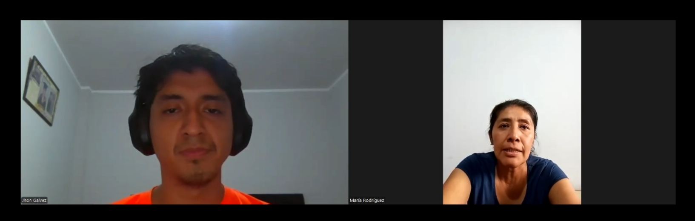
</p>

<div align="center">

| Entrevistado | Maria Rodriguez Benites |
|----|-----|
|Edad|44|
|Residencia|Lima|
|Segmento|Agencia|
|Enlace de la entrevista| [https://youtu.be/hdzxGndELyA](https://youtu.be/hdzxGndELyA)|

</div>

_Resumen:_ La entrevistada menciona que en su agencia utilizan principalmente redes sociales (Facebook, Instagram, TikTok) y plataformas como Google Ads y TripAdvisor para promocionar paquetes turísticos, lo cual ha sido efectivo para atraer turistas. Ademas, menciona que la mayoría de sus reservas proviene de canales digitales, pero enfrentan retos como la sincronización en tiempo real de la disponibilidad de los paquetes, especialmente en temporadas altas como verano y feriados. Considera que si bien las herramientas tecnológicas actuales cumplen con lo básico, desea soluciones más integradas para gestionar reservas, pagos y marketing. Valora funcionalidades como disponibilidad en tiempo real, opciones de pago flexibles y un buen soporte técnico. Por ultimo, se encuentra dispuesta a pagar una comisión razonable por cada reserva si la plataforma ofrece un buen retorno en visibilidad y eficiencia.

---

- **Entrevista 2:**

<p align="center">
    
</p>

<div align="center">

| Entrevistado | Tony Blades Sarmiento |
|----|-----|
|Edad|28|
|Residencia|Lima|
|Segmento|Agencia|
|Enlace de la entrevista| [https://youtu.be/zkip_T6onFg](https://youtu.be/zkip_T6onFg)|

</div>

_Resumen:_ El entrevistado comenta que utilizan redes sociales como Facebook, Instagram y WhatsApp. También disponen de una página web con optimizaciones limitadas para sus necesidades. Si bien considera útiles estas herramientas, no las percibe como eficientes. Además, señala que uno de los principales desafíos que enfrenta es la confirmación de pagos y la falta de coordinación cuando los clientes dudan en concretar una compra. Asimismo, menciona que le gustaría contar con una plataforma intuitiva que integre funcionalidades de pago, mensajería y análisis de datos, facilitando así la conexión con sus clientes. Finalmente, expresa su disposición a pagar una suscripción para obtener beneficios durante las temporadas de mayor demanda.

---

**Entrevista 3:**

<p align="center">
    
</p>

<div align="center">

| Entrevistado | David Perez Garcia |
|----|-----|
|Edad|22|
|Residencia|Lima|
|Enlace de la entrevista| [https://youtu.be/5S-RLPOGsRA](https://youtu.be/5S-RLPOGsRA)|

</div>

_Resumen:_ El entrevistado trabaja para una agencia de turismo peruana, utiliza redes sociales y WhatsApp para promocionar sus servicios, lo cual es efectivo para clientes jóvenes y locales, pero limitado para turistas extranjeros. Aunque las reservas online son comunes en temporada alta, la gestión de múltiples canales genera problemas. Pérez reconoce la necesidad de una sólida presencia digital y herramientas integradas con calendarios en tiempo real, chat directo, gestión de pagos, estadísticas y un perfil completo para competir y generar confianza. Su agencia se enfoca en jóvenes de 20 a 35 años interesados en experiencias auténticas, con un 70% de reservas online. Está dispuesto a invertir en soluciones digitales transparentes y fáciles de usar que mejoren la visibilidad, especialmente en temporadas altas.

---

<!-- Segmento objetivo 2: TURISTAS NACIONALES E INTERNACIONALES -->

**Entrevista 4:**

<p align="center">
    
</p>

<div align="center">

| Entrevistado | Adrian Yañez Mendez |
|----|-----|
|Edad|20|
|Residencia|Lima|
|Segmento|Turista Nacional|
|Enlace de la entrevista| [https://youtu.be/EetEBccMXDg](https://youtu.be/EetEBccMXDg)|

</div>

_Resumen:_ El entrevistado, un turista limeño de 20 años, organiza sus viajes inspirándose en redes sociales como Instagram y TikTok, y complementa su planificación con Google Maps, TripAdvisor y blogs de viaje. Le da gran importancia a la personalización de sus experiencias, priorizando actividades culturales, de aventura y fotografía. Aunque prefiere paquetes turísticos bien estructurados, a menudo encuentra opciones costosas o genéricas, por lo que valora plataformas que permitan comparar precios, duración y opiniones en un solo lugar. Está dispuesto a pagar más por experiencias auténticas y personalizadas, y le resulta cómodo hacer reservas desde su celular, siempre que la app sea intuitiva. También considera esencial poder comunicarse con la agencia antes de reservar y recibir recomendaciones según su ubicación e intereses.

---

**Entrevista 5:**

<p align="center">
    
</p>

<div align="center">

| Entrevistado | Sebastian Arevalo Torres |
|----|-----|
|Edad|23|
|Residencia|Chile|
|Segmento|Turista Internacional|
|Enlace de la entrevista| [https://youtu.be/3z10bH6wOBY](https://youtu.be/3z10bH6wOBY)|

</div>

_Resumen:_ El entrevistado, turista chileno de 23 años, organiza sus viajes por Perú con anticipación usando Google Travel, Booking.com y YouTube, priorizando experiencias auténticas alejadas del turismo convencional. Valora especialmente las actividades culturales y gastronómicas, como visitar mercados y museos, y suele reservar por separado para tener mayor control, aunque considera paquetes si están bien estructurados. Le resulta esencial comparar precios, duración y opiniones desde una sola plataforma, y confía principalmente en las reseñas de otros viajeros. Está dispuesto a pagar más por experiencias únicas que beneficien a comunidades locales, y aprecia recibir recomendaciones personalizadas según su ubicación e intereses. Además, considera muy cómodo hacer reservas desde su celular y le parece crucial poder contactar a la agencia antes de reservar, especialmente para resolver dudas sobre idioma, disponibilidad o detalles del tour.

---

**Entrevista 6:**

<p align="center">
    
</p>

<div align="center">

| Entrevistado | Diego Santiago Lima |
|----|-----|
|Edad|21|
|Residencia|Arequipa|
|Segmento|Turista Nacional|
|Enlace de la entrevista| [https://youtu.be/CLrBogoQrVM](https://youtu.be/CLrBogoQrVM)|

</div>

_Resumen:_ El entrevistado, mochilero arequipeño de 21 años, organiza sus viajes de forma espontánea utilizando grupos de Facebook, Telegram y TikTok para encontrar recomendaciones de última hora. Valora la personalización de sus experiencias y prefiere improvisar sobre la marcha, adaptando sus actividades según su estado de ánimo, el clima o la gente que conoce. Sus intereses se centran en la gastronomía y actividades culturales accesibles o gratuitas. Prefiere reservar servicios por separado para mantener flexibilidad y controlar su presupuesto. Considera crucial poder comparar precios y valoraciones en una sola plataforma, y confía en las opiniones de otros jóvenes mochileros. Aunque busca opciones económicas, está dispuesto a pagar más por experiencias únicas. Para él, es fundamental recibir recomendaciones personalizadas según su ubicación y contar con opciones de pago como Yape o Plin. Además, valora poder contactar con la agencia antes de reservar y suele llegar a destinos sin itinerario fijo, confiando en su celular como herramienta principal para planificar y reservar en el camino.

---

<!-- Segmento objetivo 3: TURISTAS CORPORATIVOS -->

**Entrevista 7:**

<p align="center">
    
</p>

<div align="center">

| Entrevistado | Cesar Vasquez Lopez |
|----|-----|
|Edad|55|
|Residencia|Lima|
|Enlace de la entrevista| [https://youtu.be/AeP60c6hXrs](https://youtu.be/AeP60c6hXrs)|

</div>

_Resumen:_ El entrevistado, quien por su trabajo viaja con frecuencia a Paracas, Nazca, Chincha e Ica, tiene interés en visitar atractivos turísticos como las Líneas de Nazca, las Islas Ballestas y la Huacachina en su tiempo libre. Para él, la puntualidad del servicio es primordial en una plataforma de gestión de paquetes turísticos. Actualmente, utiliza WhatsApp y Google Maps para organizar sus itinerarios laborales, pero le resulta difícil encontrar tiempo libre. Por ello, valoraría una aplicación que se adapte a sus horarios personales y laborales, brindándole la oportunidad de realizar visitas turísticas. Finalmente, considera crucial la recomendación de otros clientes al elegir una agencia de viajes.

---

**Entrevista 8:**

<p align="center">
    
</p>

<div align="center">

| Entrevistado | Eduardo Montalvo |
|----|-----|
|Edad| 25 |
|Residencia|Lima|
|Enlace de la entrevista| [https://youtu.be/_GoZZZpl_5c](https://youtu.be/_GoZZZpl_5c)|

</div>

_Resumen:_ El entrevistado es un viajero corporativo en Perú que viaja laboralmente dos veces al mes (Lima, Trujillo, Arequipa, ocasionalmente Cusco/Chiclayo) y a veces tiene tiempo libre. Prefiere tours cortos o gastronomía local cerca de su alojamiento, valorando la rapidez y disponibilidad inmediata. Usa Google Maps y TripAdvisor, pero desearía una app para viajeros de negocios con horarios flexibles y recomendaciones personalizadas según su ubicación y agenda, idealmente con reserva en destino. Le atraería una app que combine actividades, servicios y facturación automática, confiando en agencias con buenas reseñas y contacto claro.

---

**Entrevista 9:**

<p align="center">
    
</p>

<div align="center">

| Entrevistado | Abigail Goñe |
|----|-----|
|Edad|21|
|Residencia|Lima|
|Enlace de la entrevista| [https://www.youtube.com/watch?v=XB2zMZLNVMY](https://www.youtube.com/watch?v=XB2zMZLNVMY)|

</div>

_Resumen:_  La entrevistada viaja laboralmente tres veces al mes (Arequipa, Trujillo, Piura) y a veces tiene 1-2 horas libres. Prefiere visitas cortas a sitios arqueológicos o gastronomía local, valorando rapidez y cercanía. Usa Google Maps, Yelp y TikTok, pero desearía una app con opciones turísticas, tiempos y reservas integradas. Le cuesta encontrar actividades con horarios flexibles. Le interesan sugerencias personalizadas y prefiere reservar en destino por cambios de agenda. Idealmente, busca una app con recomendaciones automáticas según su ubicación y horario, que combine actividades y servicios prácticos, incluyendo facturación automática. Confía en agencias nuevas con buenas opiniones, web actualizada y atención rápida.

---

#### 2.2.3. Análisis de entrevistas

- **Segmento objetivo 1 - Dueños de agencia de viajes**

    Las entrevistas con María Rodríguez, Tony Blades y David Pérez revelan puntos en común significativos que validan la propuesta de valor de TravelMatch para las agencias de turismo locales.

    - _Dependencia de Canales Digitales y Limitaciones:_ Las tres fuentes coinciden en la importancia de los canales digitales para la captación de clientes. El 100% de las agencias entrevistadas utilizan activamente redes sociales (Facebook e Instagram son recurrentes), y al menos una de ellas (33%) menciona el uso de plataformas de publicidad online como Google Ads y TripAdvisor. Sin embargo, a pesar de su efectividad para ciertos segmentos, reconocen limitaciones para alcanzar audiencias más amplias (turistas extranjeros) o para una gestión integral de sus operaciones.

    - _Prevalencia de Reservas Online y Desafíos de Gestión:_ Tanto María como David señalan que una parte significativa de sus reservas proviene de canales digitales (María indica "la mayoría" y David un 70%). No obstante, esto conlleva desafíos importantes. El 67% de las agencias (María y David) experimentan problemas con la sincronización en tiempo real de la disponibilidad, especialmente en temporadas altas. Además, la gestión de múltiples canales (redes sociales, WhatsApp, web propia, plataformas de publicidad) genera ineficiencias y dificulta la coordinación, como lo destaca Tony con los problemas en la confirmación de pagos y el seguimiento de clientes indecisos.

    - _Necesidad de Soluciones Integradas:_ Existe un consenso unánime (100% de las agencias) en la necesidad de herramientas tecnológicas más integradas. Expresan el deseo de funcionalidades que vayan más allá de las soluciones básicas que utilizan actualmente (mencionado por María).

    - _Disposición a Invertir por Valor:_ Las tres fuentes muestran una disposición a invertir en una plataforma como TravelMatch si esta ofrece un valor claro. María está dispuesta a pagar una comisión "razonable" por un buen retorno en visibilidad y eficiencia. Tony considera pagar una suscripción por beneficios en temporadas altas. David también está dispuesto a invertir en soluciones "transparentes y fáciles de usar" que mejoren la visibilidad y los resultados, especialmente en temporadas de alta demanda. Esto sugiere una sensibilidad al modelo de negocio propuesto (comisiones y planes premium), siempre y cuando se demuestre un retorno tangible.

    - **Conclusiones**

        - Existe una clara validación de la problemática identificada: la fragmentación de la gestión y la necesidad de canales digitales más eficientes e integrados para las agencias locales.
        - La propuesta de valor de TravelMatch resuena con las necesidades expresadas, especialmente en cuanto a la integración de funcionalidades clave como la gestión de disponibilidad, pagos y comunicación con los clientes.
        - El modelo de negocio basado en comisiones y planes premium parece viable, dado la disposición de las agencias a invertir a cambio de mayor visibilidad y eficiencia, especialmente en temporadas altas.
        - La facilidad de uso y un buen soporte técnico serán cruciales para la adopción y el éxito de la plataforma entre las agencias.

- **Segmento objetivo 2 - Turistas nacionales e internacionales**
    
    Las entrevistas con Adrián Yáñez, Sebastián Arévalo y Diego Santiago, a pesar de sus diferencias en estilo de viaje, revelan necesidades y comportamientos comunes que TravelMatch puede abordar.

    - _Influencia de Plataformas Digitales en la Planificación:_ Los tres entrevistados utilizan activamente plataformas digitales para inspirarse y planificar sus viajes. El 100% menciona redes sociales (Instagram y TikTok son populares), y herramientas como Google Maps, TripAdvisor, Google Travel, YouTube, blogs de viaje y grupos de Facebook/Telegram también son relevantes. Esto subraya la importancia de una sólida presencia online y la capacidad de TravelMatch para integrarse o ser descubierto a través de estos canales.

    - _Valoración de la Personalización y la Autenticidad:_ Los tres turistas demuestran un fuerte interés en la personalización de sus experiencias. Adrián prioriza actividades culturales, de aventura y fotografía; Sebastián busca experiencias auténticas alejadas del turismo convencional, con foco en lo cultural y gastronómico; y Diego valora la improvisación y actividades gastronómicas y culturales accesibles. El 100% busca experiencias que se adapten a sus intereses específicos y valoran la autenticidad.

    - _Necesidad de Comparación y Transparencia:_ Los tres entrevistados resaltan la importancia de poder comparar precios, duración y opiniones en un solo lugar. Adrián y Sebastián lo mencionan explícitamente, mientras que Diego considera crucial comparar precios y valoraciones. Esto indica una necesidad de TravelMatch de ofrecer una interfaz clara y completa para la comparación de opciones.

    - _Disposición a Pagar por Experiencias de Valor:_ Si bien Diego busca opciones económicas, los tres están dispuestos a pagar más por experiencias auténticas, personalizadas o únicas. Adrián menciona estar dispuesto a pagar más por experiencias auténticas y personalizadas, Sebastián por experiencias únicas que beneficien a comunidades locales, y Diego por experiencias únicas. Esto sugiere que el precio no es el único factor determinante, y que TravelMatch puede ofrecer experiencias premium si el valor percibido es alto.

    - _Importancia de la Reserva Móvil y la Comunicación:_ Los tres consideran cómodo o esencial poder hacer reservas desde su celular y valoran la posibilidad de comunicarse con la agencia antes de reservar. Adrián y Sebastián lo mencionan directamente, y Diego confía en su celular para planificar y reservar en el camino. Esto enfatiza la necesidad de una app móvil intuitiva y funcionalidades de comunicación directa dentro de la plataforma.

    - _Preferencias de Pago:_ Diego menciona la importancia de opciones de pago locales como Yape o Plin, lo cual es un factor a considerar para la adopción local.

    - **Conclusiones**

        - Preferencias de Pago: Diego menciona la importancia de opciones de pago locales como Yape o Plin, lo cual es un factor a considerar para la adopción local.
        - La propuesta de valor de TravelMatch de ofrecer una experiencia de búsqueda fluida, segura y adaptada a las preferencias del turista es altamente relevante para este segmento.
        - La funcionalidad de comparación de precios, duración y opiniones será crucial para atraer y retener a los usuarios.        
        - TravelMatch debe ser lo suficientemente flexible para atender tanto a viajeros que planifican con anticipación como a aquellos más espontáneos.

    
- **Segmento objetivo 3 - Turistas corporativos**
    
    Las entrevistas con César Vásquez, Eduardo Montalvo y Abigail Goñe ofrecen una perspectiva sobre las necesidades de los viajeros corporativos que buscan aprovechar su tiempo libre durante sus desplazamientos laborales.

    - _Oportunidades de Turismo en Tiempo Libre Limitado:_ César Vásquez, quien viaja con frecuencia por trabajo en la región de Ica, expresa un claro interés en visitar atractivos turísticos locales en su tiempo libre, aunque actualmente le resulta difícil encontrarlo. Esto sugiere una oportunidad para TravelMatch de ofrecer actividades que se ajusten a las ventanas de tiempo libre de los viajeros corporativos. Eduardo y Abigail también mencionan tener tiempo libre limitado entre sus compromisos laborales.

    - _Valoración de la Puntualidad y la Adaptabilidad Horaria:_ Para César, la puntualidad del servicio es primordial. Además, valora una aplicación que se adapte a sus horarios personales y laborales. Esta necesidad de flexibilidad horaria y confiabilidad en los tiempos es un factor clave para este segmento. Eduardo y Abigail también resaltan la dificultad de encontrar actividades con horarios compatibles con sus jornadas laborales.

    - _Uso de Herramientas Digitales Básicas y Deseo de Integración:_ César utiliza WhatsApp y Google Maps para su logística laboral, pero no para actividades turísticas. Eduardo y Abigail utilizan Google Maps y otras plataformas generales (TripAdvisor, Yelp, TikTok) pero expresan el deseo de una app específica para viajeros de negocios que integre opciones turísticas, tiempos estimados y reservas. Esto refuerza la necesidad de una plataforma integrada como TravelMatch que simplifique la búsqueda y reserva de actividades.

    - _Interés en Experiencias Específicas:_ Eduardo prefiere tours cortos o gastronomía local, mientras que Abigail se inclina por visitas cortas a sitios arqueológicos o gastronomía local. Esto sugiere que, si bien el tiempo es limitado, existe un interés en experiencias culturales y gastronómicas concisas.

    - _Relevancia de la Personalización y las Recomendaciones Automáticas:_ Eduardo y Abigail desean recomendaciones personalizadas según su ubicación, horario e intereses. Abigail también busca recomendaciones automáticas. Esto valida la importancia de un motor de recomendaciones inteligente dentro de TravelMatch que considere el contexto del viaje de negocios.

    - **Conclusiones**

        - Existe una oportunidad para TravelMatch de atender las necesidades de los viajeros corporativos que desean aprovechar sus limitados periodos de tiempo libre para realizar actividades turísticas.
        - La plataforma debe priorizar la puntualidad, la flexibilidad horaria y la conveniencia de ubicación de las actividades ofrecidas.
        - Un sistema de recomendaciones basado en la ubicación, el horario disponible y los intereses del viajero corporativo es crucial.       
        - Generar confianza a través de reseñas y perfiles de agencia detallados es fundamental para la adopción.


### 2.3. Needfinding

#### 2.3.1. User Personas
Basados en los resultados de las entrevistas y el análisis de datos, hemos definido las características clave de cada segmento objetivo estudiado. Esta información nos permitió desarrollar User Personas detallados para cada grupo, con el fin de comprender a profundidad su contexto, metas, motivaciones, dolores y perfil general. Para la creación de estos User Personas, empleamos la plataforma colaborativa UXPressia como herramienta principal de diseño.

<p align="center">
    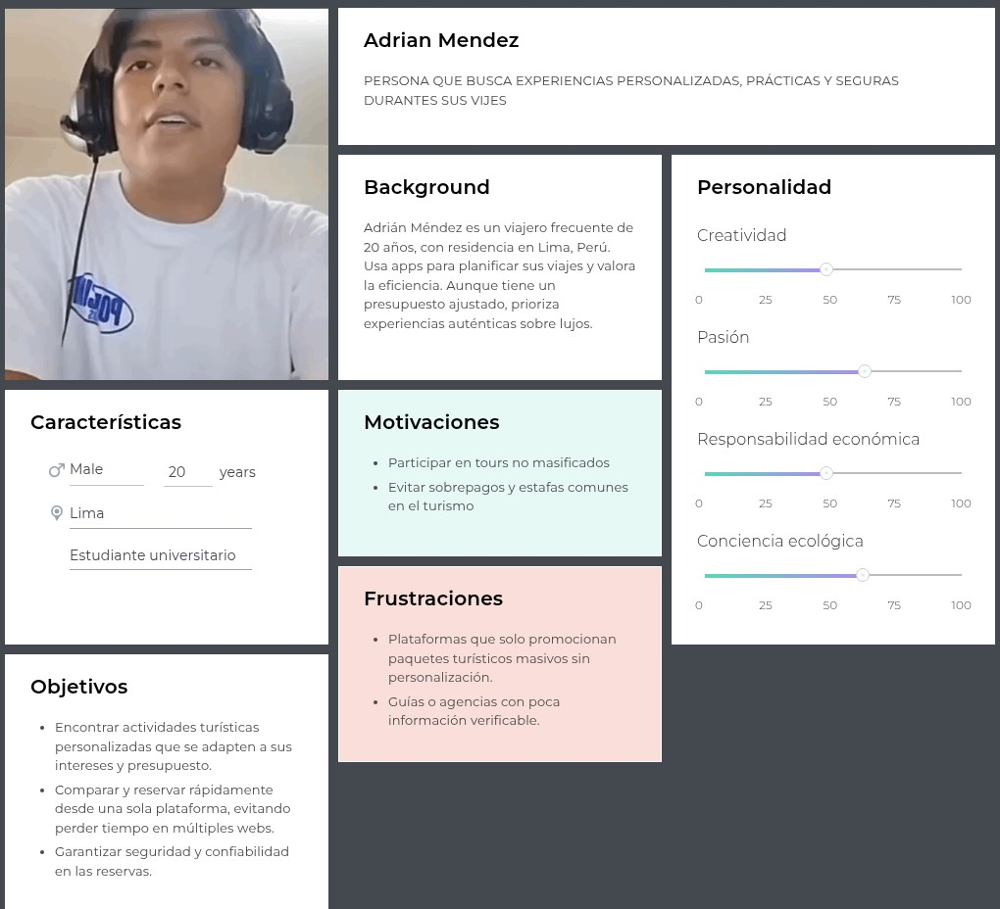
</p>

<p align="center">
    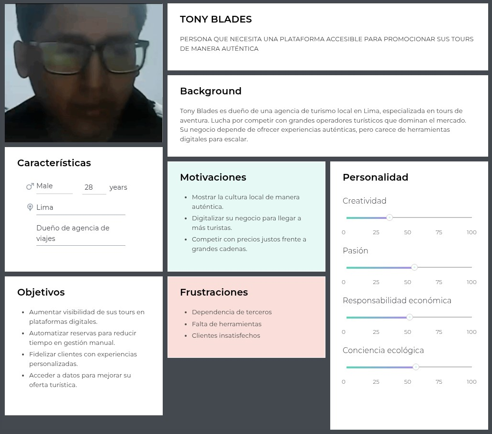
</p>

<p align="center">
    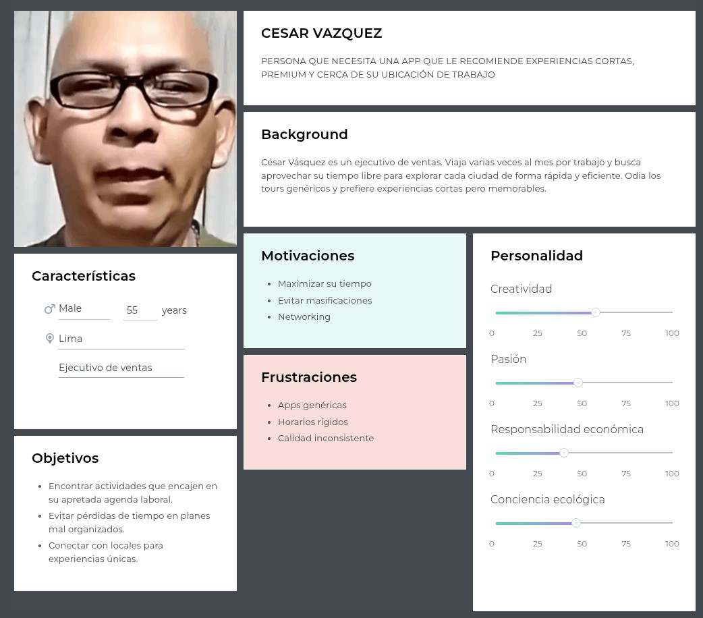
</p>

#### 2.3.2. User Task Matrix

***Segmento 1: Dueños de agencia de viajes***

|**Tony Blades**|||
| :-: | :- | :- |
|**Actividades**|**Frecuencia**|**Importancia**|
|Publicar en 3-5 redes sociales|Alta|Alta|
|Crear anuncios en Google Ads de forma manual|Alta|Alta|
|Recibir consultas por WhatsApp/email|Alta|Alta|
|Actualizar disponibilidad en hojas de cálculo|Media|Alta|
|Coordinar con proveedores por teléfono|Media|Media|
|Imprimir vouchers manualmente|Media|Alta|

***Segmento 2: Turistas nacionales e internacionales***

|**Adrián Méndez**|||
| :-: | :- | :- |
|**Actividades**|**Frecuencia**|**Importancia**|
|Buscar en Google, blogs y TikTok|Alta|Alta|
|Guardar opciones en favoritos|Alta|Alta|
|Abrir 5 pestañas para comparar precios|Alta|Alta|
|Preguntar a amigos por WhatsApp|Media|Alta|
|Reservar en 3 plataformas distintas|Media|Alta|
|Descargar vouchers en PDF|Media|Media|
|Coordinar transporte y horarios por separado|Media|Alta|

***Segmento 3: Turistas corporativos***

|**César Vásquez**|||
| :-: | :- | :- |
|**Actividades**|**Frecuencia**|**Importancia**|
|Usar Google Maps para encontrar atracciones cercanas|Alta|Alta|
|Revisar TripAdvisor en el celular|Alta|Alta|
|LLamar a agencias para confirmar disponibilidad|Alta|Alta|
|Enviar emails con detalles de horarios|Alta|Alta|
|Usar Uber para llegar al tour|Media|Alta|
|Revisar itinerario en notas del móvil|Alta|Alta|
|Buscar WiFi para subir fotos a LinkedIn|Media|Media|
|Intentar reclamar por servicio deficiente|Media|Media|


#### 2.3.3. User Journey Mapping

Introducción al End-to-End Journey:
El viaje del usuario ilustrado abarca un ciclo completo desde la exploración inicial hasta la retroalimentación post-experiencia, enfocándose en facilitar actividades adaptadas a necesidades específicas, como agendas laborales ajustadas o preferencias personales.

Descubrimiento: Los usuarios buscan actividades alineadas con sus intereses y disponibilidad, enfrentando desafíos como catálogos desorganizados, horarios inflexibles y descripciones poco claras.

Selección: Comparan opciones basándose en opiniones, ubicación y duración, pero tropiezan con información contradictoria o métodos de pago no locales que ralentizan la decisión.

Reserva: Priorizan rapidez y seguridad, especialmente en contextos corporativos, aunque procesos largos de verificación y falta de integración con plataformas de pago ágiles generan fricción.

Experiencia y Feedback: Buscan disfrutar sin complicaciones logísticas, pero la falta de incentivos o mecanismos simplificados para compartir opiniones resulta en baja participación.

***Segmento 1: Dueños de agencia de viajes***

<p align="center">
    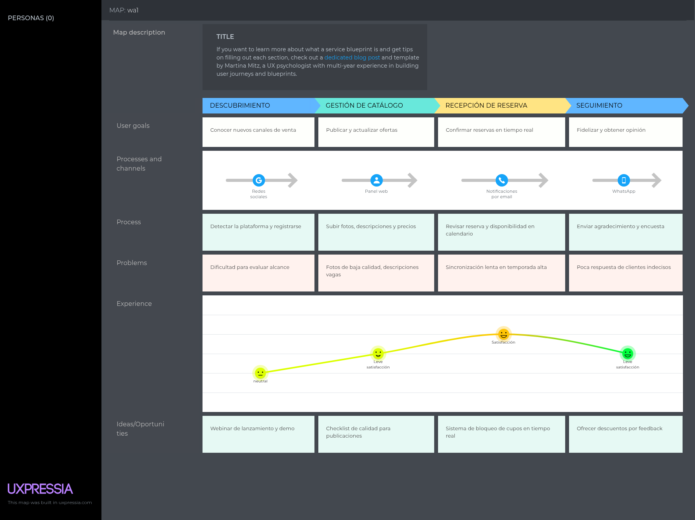
</p>

***Segmento 2: Turistas nacionales e internacionales***

<p align="center">
    
</p>

***Segmento 3: Turistas corporativos***

<p align="center">
    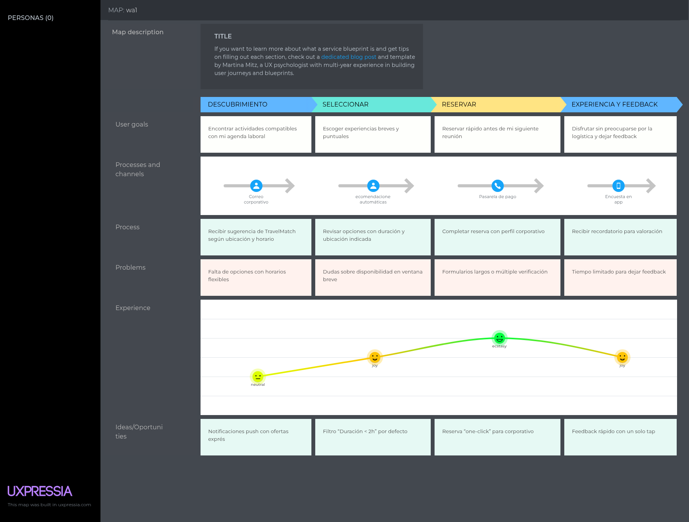
</p>

#### 2.3.4. Empathy Mapping

#### 2.3.4.1. Empathy Mapping Turistas nacionales e internacionales

<p align="center">
    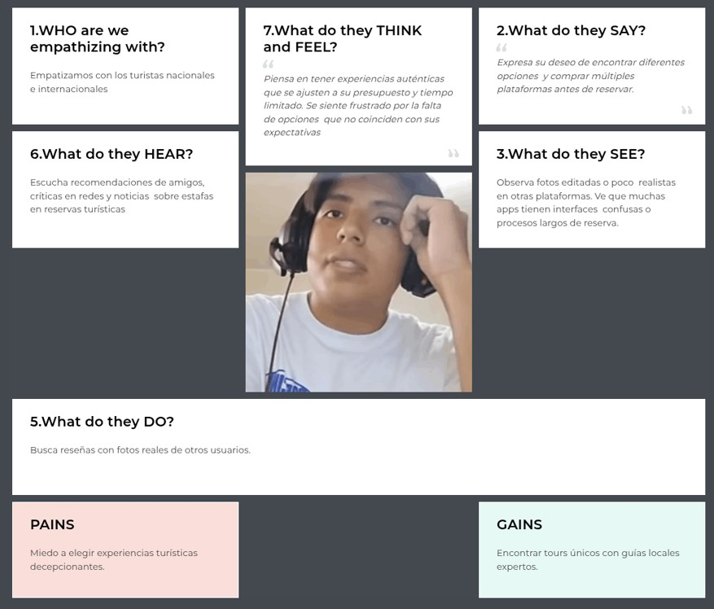
</p>

#### 2.3.4.2. Empathy Mapping Agencias de turismo locales

<p align="center">
    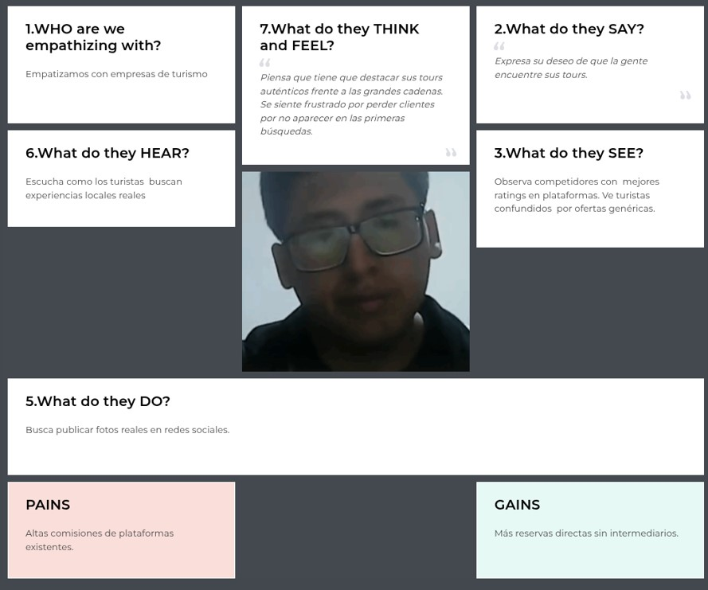
</p>

#### 2.3.4.3. Empathy Mapping Viajeros por trabajo

<p align="center">
    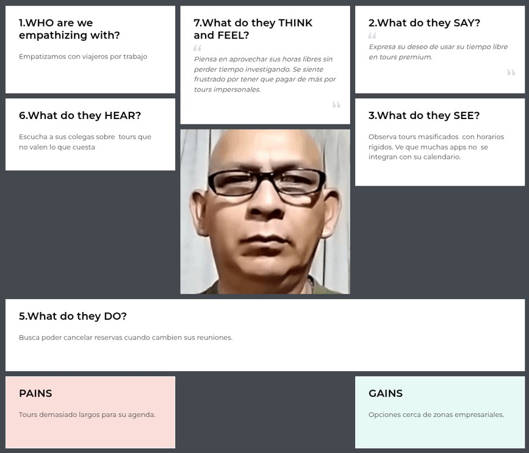
</p>

#### 2.3.5. As-is Scenario Mapping

#### 2.3.5.1. As-is Scenario Mapping Turistas nacionales e internacionales

<p align="center">
    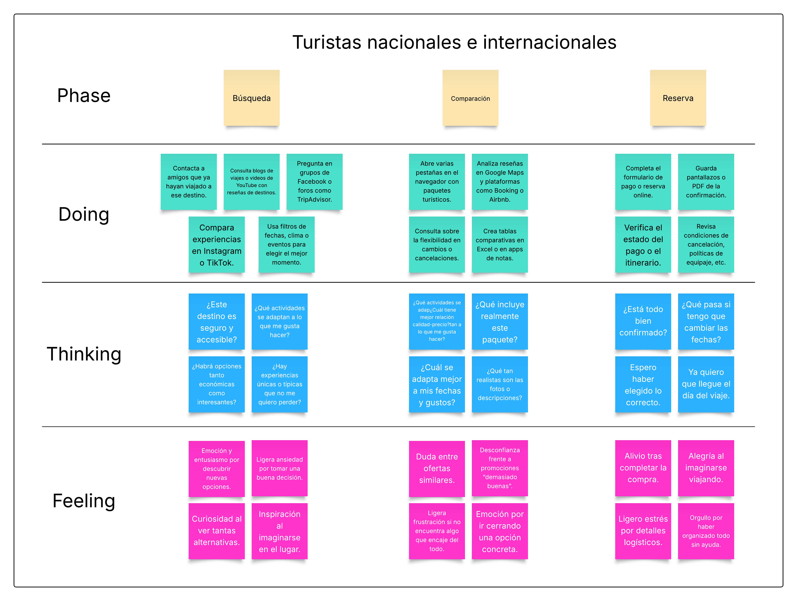
</p>

#### 2.3.5.2. As-is Scenario Mapping Agencias de turismo locales

<p align="center">
    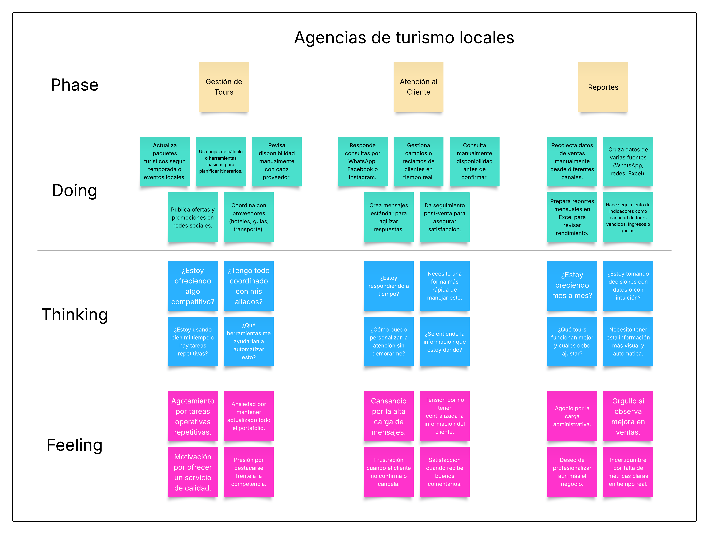
</p>

#### 2.3.5.3. As-is Scenario Mapping Viajeros por trabajo

<p align="center">
    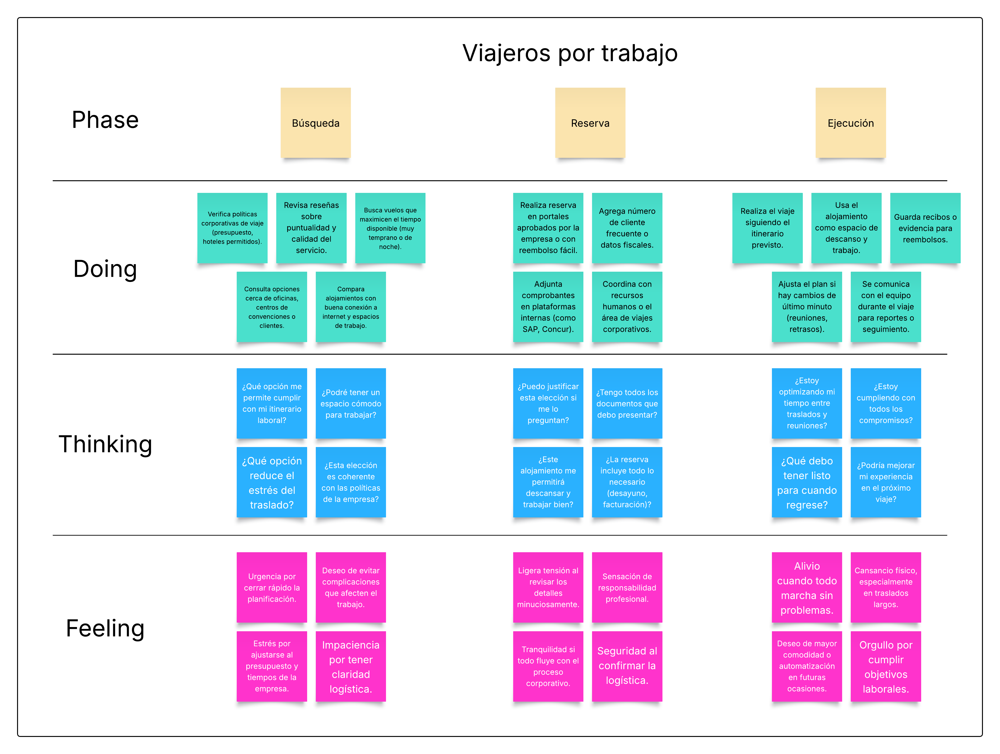
</p>

### 2.4. Ubiquitous Language

| **Término (Inglés)**       | **Término (Español)**       | **Descripción** |
|----------------------------|----------------------------|----------------|
| **Traveler**               | Viajero                    | Usuario de la plataforma que busca descubrir, reservar o personalizar experiencias turísticas, ya sea de forma individual o en grupo. |
| **Travel Agency**          | Agencia de viajes          | Entidad registrada en la plataforma que ofrece paquetes turísticos, experiencias personalizadas o servicios relacionados con viajes. |
| **Experience**             | Experiencia                | Actividad o conjunto de actividades que conforman un paquete turístico (cultural, gastronómico, deportivo, etc.). |
| **Recommended Plan**       | Plan recomendado           | Propuesta de actividades generadas automáticamente según los intereses, preferencias y perfil del viajero. |
| **Match**                  | Coincidencia / Compatibilidad | Grado de afinidad entre un viajero y una agencia o experiencia, basado en intereses, presupuesto y ubicación. |
| **Booking Request**        | Solicitud de reserva       | Acción mediante la cual un viajero inicia el proceso de reservar una experiencia o paquete. |
| **Availability**           | Disponibilidad             | Periodo de tiempo y capacidad en los que una agencia puede ofrecer una experiencia. |
| **Profile**                | Perfil                     | Datos personales y preferencias de viaje asociados a un usuario (viajero o agencia). |
| **Feedback**               | Retroalimentación          | Opiniones, comentarios o calificaciones de los viajeros después de realizar una experiencia. |
| **Tour Package**           | Paquete turístico          | Conjunto de servicios y actividades agrupadas (transporte, alojamiento, alimentación, etc.). |
| **Local Partner**          | Aliado local               | Proveedor asociado a una agencia que ofrece servicios específicos (guías, restaurantes, transportistas). |
| **Seasonality**            | Estacionalidad             | Variación en la demanda o disponibilidad según la época del año, festividades o clima. |
| **Target Audience**        | Audiencia objetivo         | Grupo de personas con características específicas (edad, intereses) al que va dirigida una experiencia. |

<hr>

## Capítulo III: Requirements Specification

### 3.1. To-Be Scenario Mapping

El equipo realizó un análisis detallado para definir los futuros escenarios de uso de la plataforma, considerando los diferentes perfiles de usuarios y sus necesidades específicas. Para esto, se identificaron tres segmentos clave que representan los principales grupos de usuarios:

#### 3.1.1. To-Be Scenario Mapping Turistas nacionales e internacionales

<p align="center">
    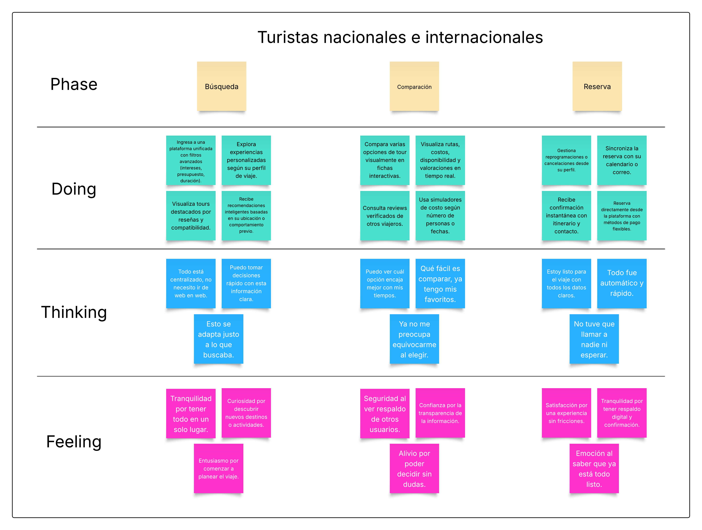
</p>

#### 3.1.2. To-Be Scenario Mapping Agencias de turismo locales

<p align="center">
    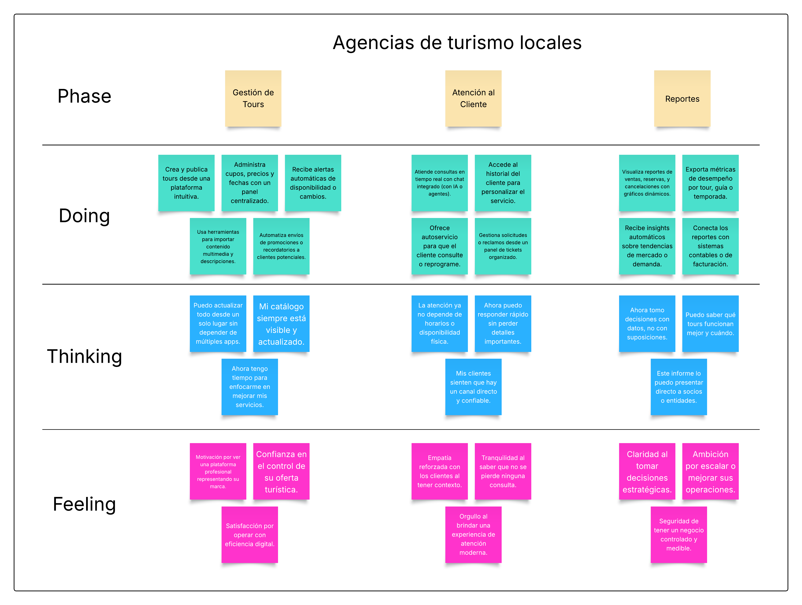
</p>

#### 3.1.3. To-Be Scenario Mapping Viajeros por trabajo

<p align="center">
    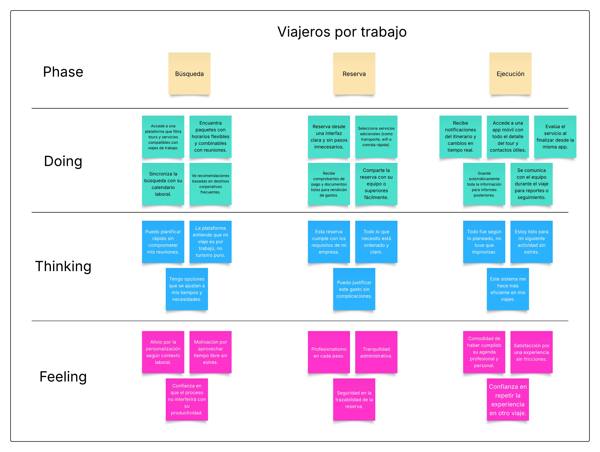
</p>

### 3.2. User Stories

En esta sección se presentan las historias de usuario que describen las necesidades y expectativas de los diferentes perfiles que interactúan con la plataforma, incluyendo usuarios generales, turistas y agencias. Cada historia detalla los objetivos, acciones esperadas y criterios de aceptación para asegurar que se cumplan los requisitos funcionales del sistema, promoviendo una experiencia óptima y personalizada para cada tipo de usuario.

| Epic / Story ID | Título | Descripción | Criterios de Aceptación | Relacionado con (Epic ID) |
| :-: | :-: | :- | :- | :- |
|EP01|Gestión de usuarios|Como usuario, quiero gestionar mi perfil y preferencias para personalizar mi experiencia.|-|-|
|EP02|Búsqueda y reserva|Como turista, quiero explorar y reservar actividades fácilmente para planificar mi viaje sin estrés.|-|-|
|EP03|Herramientas para agencias|Como agencia, quiero administrar mis tours y clientes para optimizar mis operaciones.|-|-|
|EP04|Seguridad y Pagos|Como usuario, quiero realizar transacciones seguras y como administrador, quiero garantizar la integridad financiera y la seguridad de la plataforma.|-|-|
|EP05|Visibilidad y Contenido Estático (Landing Page)|Como visitante, quiero encontrar información relevante sobre TravelMatch y sus servicios para comprender el valor de la plataforma.|-|-|
|EP06|Integración y Mantenimiento de API|Como desarrollador, quiero asegurar la correcta comunicación de datos y la escalabilidad del sistema para soportar las funcionalidades de la plataforma.|-|-|
| US01 | Registro básico | Como nuevo usuario, quiero registrarme con un email para acceder a la plataforma. | - Scenario 1: Registro exitoso:<br> Dado que estoy en la pantalla de registro, cuando ingreso mi email y una contraseña válida, entonces recibo un email de confirmación.<br><br>- Scenario 2: Email inválido:<br> Dado que estoy en la pantalla de registro, cuando ingreso un email sin "@", entonces el sistema muestra "Ingrese un email válido". | EP01 |
| US02 | Inicio de sesión | Como usuario registrado, quiero iniciar sesión para gestionar mis reservas. | - Scenario 1: Credenciales correctas:<br> Dado que tengo credenciales válidas, cuando las ingreso, entonces accedo a mi perfil.<br><br>- Scenario 2: Contraseña incorrecta:<br> Dado que ingreso un email válido, cuando ingreso una contraseña errónea, entonces el sistema muestra "Credenciales inválidas". | EP01 |
| US03 | Perfil corporativo | Como viajero corporativo, quiero vincularme con mi empresa para obtener beneficios exclusivos. | - Scenario 1: Verificación exitosa:<br> Dado que soy usuario corporativo, cuando subo mi credencial laboral válida, entonces mi perfil muestra un sello verificador.<br><br>- Scenario 2: Documento rechazado:<br> Dado que subo un documento ilegible, cuando el sistema lo revisa, entonces muestra "Documento no válido". | EP01 |
| US04 | Preferencias de viaje | Como turista, quiero seleccionar mis intereses para recibir recomendaciones personalizadas. | - Scenario 1: Actualización exitosa:<br> Dado que actualizo mis preferencias, cuando busco actividades, entonces veo opciones relevantes.<br><br>- Scenario 2: Sin preferencias:<br> Dado que no selecciono intereses, cuando busco actividades, entonces veo recomendaciones generales. | EP01 |
| US05 | Recuperar contraseña | Como usuario, quiero restablecer mi contraseña si la olvido para recuperar el acceso. | - Scenario 1: Solicitud exitosa:<br> Dado que solicito restablecer la contraseña, cuando ingreso mi email registrado, entonces recibo un enlace temporal.<br><br>- Scenario 2: Email no registrado:<br> Dado que ingreso un email no existente, cuando solicito el restablecimiento, entonces el sistema muestra "Email no encontrado". | EP01 |
| US06 | Verificación de identidad | Como usuario premium, quiero verificar mi identidad para desbloquear reservas exclusivas. | - Scenario 1: Verificación aprobada:<br> Dado que subo mi documento de identidad válido, cuando es aprobado, entonces puedo reservar tours premium.<br><br>- Scenario 2: Documento vencido:<br> Dado que subo un DNI vencido, cuando el sistema lo revisa, entonces muestra "Documento no válido". | EP01 |
| US07 | Notificaciones push | Como usuario, quiero recibir alertas sobre ofertas para no perderme promociones. | - Scenario 1: Notificación recibida:<br> Dado que activo las notificaciones, cuando hay una oferta en mis favoritos, entonces recibo una alerta.<br><br>- Scenario 2: Notificación desactivada:<br> Dado que desactivo las notificaciones, cuando hay una oferta, entonces no recibo alertas. | EP01 |
| US08 | Idiomas | Como usuario internacional, quiero cambiar el idioma de la app para entender mejor. | - Scenario 1: Cambio a inglés:<br> Dado que selecciono "Inglés", cuando guardo los cambios, entonces toda la interfaz se traduce.<br><br>- Scenario 2: Idioma no disponible:<br> Dado que selecciono un idioma no soportado, cuando intento guardar, entonces el sistema muestra "Idioma no disponible". | EP01 |
| US09 | Publicar reseñas | Como viajero, quiero compartir mis reseñas para ayudar a otros turistas a elegir sus experiencias. | - Scenario 1: Reseña publicada:<br> Dado que completo una actividad, cuando escribo una reseña, entonces aparece en mi perfil público.<br><br>- Scenario 2: Reseña vacía:<br> Dado que no ingreso texto, cuando intento publicar, entonces el sistema muestra "Escribe tu opinión". | EP01 |
| US10 | Editar/Eliminar reseñas | Como viajero, quiero modificar o eliminar mis reseñas para asegurar que reflejen mi experiencia con precisión. | - Scenario 1: Edición de reseña:<br> Dado que he publicado una reseña, cuando accedo a mi perfil, entonces puedo editar el texto y la calificación de mi reseña.<br><br>- Scenario 2: Eliminación de reseña:<br> Dado que he publicado una reseña, cuando selecciono "Eliminar", entonces mi reseña desaparece del perfil público. | EP01 |
| US11 | Eliminar cuenta | Como viajero, quiero borrar mi cuenta para proteger mi privacidad. | - Scenario 1: Eliminación confirmada:<br> Dado que solicito eliminar mi cuenta, cuando confirmo, entonces todos mis datos se borran en 72 horas.<br><br>- Scenario 2: Cancelación de eliminación:<br> Dado que inicio el proceso, cuando cancelo, entonces mi cuenta permanece activa. | EP01 |
| US12 | Acceso a boletos digitales | Como usuario, quiero acceder a mis boletos/vouchers con código QR para facilitar el check-in en las actividades. | - Scenario 1: Visualización de boleto:<br> Dado que tengo una reserva confirmada, cuando accedo a mis reservas, entonces veo un boleto digital con un código QR válido.<br><br>- Scenario 2: Boleto en la app (offline):<br> Dado que no tengo conexión a internet, cuando accedo a mis boletos desde la app, entonces puedo visualizar mis vouchers previamente descargados. | EP01 |
| US13 | Contactar al equipo de soporte (versión usuario) | Como usuario con dudas, quiero enviar un mensaje al soporte para resolver mis inquietudes. | - Scenario 1: Envío exitoso:<br> Dado que completo el formulario, cuando hago clic en "Enviar", entonces recibo un email de confirmación.<br><br>- Scenario 2: Campos obligatorios:<br> Dado que dejo el email vacío, cuando intento enviar, entonces el sistema muestra "Campo requerido". | EP01 |
| US14 | Filtros avanzados | Como turista, quiero filtrar actividades por precio y tipo para encontrar opciones relevantes. | <p>- Scenario 1: Filtrado por precio exitoso<br>Dado que uso los filtros, cuando aplico "precio < $50", entonces veo solo tours económicos.</p><p>- Scenario 2: Sin resultados coincidentes<br>Dado que filtro por "precio < S/.20", cuando no hay tours disponibles, entonces el sistema muestra "No encontramos coincidencias".</p> | EP02 |
| US15 | Comparar tours | Como usuario, quiero comparar múltiples tours en una vista para tomar la mejor decisión. | <p>- Scenario 1: Comparación exitosa<br>Dado que selecciono 3 tours, cuando hago clic en "Comparar", entonces veo diferencias claras en una tabla.</p><p>- Scenario 2: Selección insuficiente<br>Dado que selecciono solo 1 tour, cuando intento comparar, entonces el sistema muestra "Seleccione al menos 2 tours".</p> | EP02 |
| US16 | Gestión de Cancelación de Reservas | Como turista, quiero cancelar una reserva con anticipación para ajustar mis planes de viaje. | <p>- Scenario 1: Cancelación dentro del plazo<br>Dado que reservo un tour, cuando cancelo 24h antes, entonces recibo reembolso automático.</p><p>- Scenario 2: Cancelación tardía<br>Dado que cancelo 12h antes, cuando intento reembolsar, entonces el sistema muestra "Fuera del plazo de cancelación".</p> | EP02 |
| US17 | Reservas grupales | Como viajero corporativo, quiero reservar para mi equipo para simplificar la logística. | <p>- Scenario 1: Reserva grupal exitosa<br>Dado que añado 5 participantes, cuando completo el pago, entonces todos reciben confirmación por email.</p><p>- Scenario 2: Límite excedido<br>Dado que intento añadir 15 personas, cuando el tour tiene límite de 10, entonces el sistema muestra "Cupo máximo alcanzado".</p> | EP02 |
| US18 | Favoritos | Como usuario, quiero guardar actividades interesantes para revisarlas después. | <p>- Scenario 1: Guardar en favoritos<br>Dado que hago clic en "Guardar", cuando voy a "Mis Favoritos", entonces veo la actividad listada.</p><p>- Scenario 2: Eliminar de favoritos<br>Dado que elimino un tour de favoritos, cuando actualizo la página, entonces desaparece de la lista.</p> | EP02 |
| US19 | Chat con guías | Como usuario, quiero preguntar detalles a los guías antes de reservar para aclarar dudas. | <p>- Scenario 1: Respuesta en horario de atención<br>Dado que envío una pregunta durante el horario de atención, cuando el guía responde, entonces recibo la respuesta en el tiempo establecido.</p><p>- Scenario 2: Fuera de horario<br>Dado que pregunto a las 3 a.m., cuando el guía no está disponible, entonces el sistema muestra "Respuesta en 8-12h".</p> | EP02 |
| US20 | Mapas interactivos | Como turista, quiero ver la ubicación exacta de los tours para planificar mi ruta. | <p>- Scenario 1: Visualización de ruta<br>Dado que abro un tour, cuando hago clic en "Ver mapa", entonces se muestra la ruta exacta con puntos de interés.</p><p>- Scenario 2: Sin conexión a internet<br>Dado que no tengo internet, cuando intento cargar el mapa, entonces el sistema muestra "Active su conexión".</p> | EP02 |
| US21 | Vista previa de tours | Como turista, quiero ver fotos y videos detallados de los tours para evaluar la experiencia antes de reservar. | <p>- Scenario 1: Visualización de multimedia exitosa<br>Dado que selecciono un tour, cuando hago clic en "Galería", entonces veo al menos 5 fotos HD y 1 video promocional.</p><p>- Scenario 2: Contenido insuficiente<br>Dado que un tour solo tiene 2 fotos, cuando reviso la galería, entonces el sistema muestra "Contenido en actualización".</p> | EP02 |
| US22 | Itinerarios automáticos | Como viajero, quiero generar un itinerario diario automático para optimizar mi tiempo. | <p>- Scenario 1: Itinerario generado<br>Dado que selecciono actividades, cuando hago clic en "Planificar", entonces recibo una agenda ordenada por horarios.</p><p>- Scenario 2: Actividades incompatibles<br>Dado que selecciono tours con horarios superpuestos, cuando intento planificar, entonces el sistema muestra "Conflicto de horarios".</p> | EP02 |
| US23 | Contactar para consultas comerciales | Como visitante del segmento de agencias, quiero usar el formulario de contacto para hacer consultas o proponer colaboraciones. | <p>- Scenario: Envío de mensaje<br>Dado que el visitante llega a la sección "Contáctanos", cuando completa los campos obligatorios y hace clic en "Enviar", entonces recibe una confirmación de que su mensaje ha sido enviado.</p> | EP05 |
| US24 | Subir nuevos tours | Como agencia, quiero subir nuevos tours con fotos y descripciones para atraer clientes. | <p>- Scenario 1: Publicación exitosa<br>Dado que completo el formulario, cuando lo envío, entonces el tour aparece tras aprobación en 24h.</p><p>- Scenario 2: Fotos faltantes<br>Dado que no subo imágenes, cuando intento publicar, entonces el sistema muestra "Agregue al menos 3 fotos".</p> | EP03 |
| US25 | Editar Detalles de Tour | Como agencia, quiero editar los detalles de un tour publicado (descripción, puntos de encuentro, inclusiones) para mantener la información actualizada. | <p>- Scenario 1: Actualización de detalles<br>Dado que selecciono un tour, cuando modifico su descripción y guardo, entonces los cambios se reflejan en la página del tour.</p> | EP03 |
| US26 | Calendario en tiempo real | Como agencia, quiero actualizar la disponibilidad para evitar sobre-reservas. | <p>- Scenario 1: Actualización exitosa<br>Dado que modifico fechas, cuando guardo cambios, entonces los usuarios ven slots actualizados al instante.</p><p>- Scenario 2: Fechas inválidas<br>Dado que ingreso una fecha pasada, cuando intento guardar, entonces el sistema muestra "Seleccione una fecha futura".</p> | EP03 |
| US27 | Analytics | Como agencia, quiero ver métricas de reservas para mejorar mis estrategias. | <p>- Scenario 1: Visualización de datos<br>Dado que accedo al dashboard, cuando filtro por mes, entonces veo gráficos de rendimiento con porcentajes.</p><p>- Scenario 2: Sin datos disponibles<br>Dado que no tengo reservas en el mes, cuando reviso analytics, entonces el sistema muestra "No hay datos para mostrar".</p> | EP03 |
| US28 | Alertas de reservas | Como agencia, quiero recibir notificaciones de nuevas reservas para prepararme. | <p>- Scenario 1: Notificación inmediata<br>Dado que hay una reserva nueva, cuando se confirma, entonces recibo un email/app notification con detalles.</p><p>- Scenario 2: Notificaciones silenciadas<br>Dado que desactivo alertas, cuando hay una reserva, entonces no recibo notificaciones.</p> | EP03 |
| US29 | Crear promociones | Como agencia, quiero ofrecer descuentos en temporada baja para atraer más clientes. | <p>- Scenario 1: Promoción activada<br>Dado que creo una promoción, cuando la publico, entonces aparece un sello "Oferta" en el tour.</p><p>- Scenario 2: Descuento inválido<br>Dado que intento aplicar un 200% de descuento, cuando guardo, entonces el sistema muestra "Máximo 50% de descuento".</p> | EP03 |
| US30 | Gestión de Precios por Categoría | Como agencia, quiero definir precios diferentes para adultos y niños en mis tours para ajustarme a la demanda. | <p>- Scenario 1: Precios por categoría definidos<br>Dado que edito un tour, cuando especifico el precio para adultos y niños, entonces los usuarios ven ambas opciones al reservar.</p> | EP03 |
| US31 | Gestión de guías | Como agencia, quiero asignar guías a tours específicos para organizar mi equipo. | <p>- Scenario 1: Asignación exitosa<br>Dado que asigno un guía, cuando guardo los cambios, entonces el guía recibe una notificación con detalles.</p><p>- Scenario 2: Guía no disponible<br>Dado que selecciono un guía en otra actividad, cuando intento asignar, entonces el sistema muestra "Guía ocupado en esas fechas".</p> | EP03 |
| US32 | Encuestas a clientes | Como agencia, quiero enviar encuestas post-viaje para medir la satisfacción. | <p>- Scenario 1: Encuesta enviada<br>Dado que un tour finaliza, cuando envío la encuesta, entonces recibo respuestas en mi dashboard en 48h.</p><p>- Scenario 2: Cliente no responde<br>Dado que pasan 7 días, cuando el cliente no contesta, entonces el sistema marca "No respondida".</p> | EP03 |
| US33 | Soporte prioritario | Como agencia, quiero acceder a soporte rápido para resolver problemas urgentes. | <p>- Scenario 1: Notificación de consulta recibida<br>Dado que contacto a soporte, cuando envío mi consulta, entonces recibo una confirmación de recepción.</p><p>- Scenario 2: Información sobre el plazo de respuesta<br>Dado que el sistema confirma la recepción de mi consulta, cuando reviso la confirmación, entonces veo el plazo de respuesta esperado de 24 horas.</p> | EP03 |
| US34 | Integración con redes | Como agencia, quiero compartir mis tours en redes sociales para aumentar mi visibilidad. | <p>- Scenario 1: Publicación automática<br>Dado que hago clic en "Compartir", cuando elijo Instagram, entonces se publica con fotos y descripción.</p><p>- Scenario 2: Red no conectada<br>Dado que no vinculé mi Facebook, cuando intento compartir, entonces el sistema muestra "Conecte su cuenta primero".</p> | EP03 |
| US35 | Contactar al equipo de soporte (Versión agencia) | Como agencia asociada, quiero contactar al soporte técnico especializado para resolver problemas operativos urgentes. | <p>- Scenario 1: Solicitud prioritaria<br>Dado que selecciono 'Problema operativo', cuando envío mi consulta marcando 'Urgente', entonces la consulta es marcada como prioritaria en el sistema de soporte.</p><p>- Scenario 2: Consulta sobre API<br>Dado que tengo dudas sobre integración, cuando adjunto capturas de error, entonces el soporte me envía documentación técnica complementaria.</p> | EP03 |
| US36 | Verificación de Agencia | Como agencia, quiero verificar mi negocio para ganar la confianza de los clientes. | <p>- Scenario 1: Inicio de verificación<br>Dado que subo todos los documentos requeridos, cuando se inicia el proceso de verificación, entonces recibo una notificación indicando que mi solicitud está en revisión.</p><p>- Scenario 2: Documentación incompleta<br>Dado que no subo mi RUC, cuando intento verificar mi negocio, entonces el sistema muestra el mensaje: "Falta documentación legal".</p> | EP04 |
| US37 | Pago en Cuotas | Como usuario, quiero dividir el pago en cuotas para gestionar mejor mi presupuesto. | <p>- Scenario 1: Pago fraccionado<br>Dado que selecciono la opción "Pagar en cuotas", cuando elijo 3 meses, entonces el monto total se divide en tres partes iguales.</p><p>- Scenario 2: Límite de cuotas excedido<br>Dado que intento dividir el pago en 12 cuotas, cuando el límite es 6, entonces el sistema muestra el mensaje: "Máximo 6 cuotas permitidas".</p> | EP04 |
| US38 | Reportar Problemas o Fraude | Como usuario, quiero reportar tours inapropiados o actividades sospechosas para mantener la seguridad y calidad de la plataforma. | <p>- Scenario 1: Reporte exitoso<br>Dado que detecto un tour sospechoso, cuando lo reporto, entonces recibo una confirmación de que mi reporte ha sido recibido correctamente.</p> | EP04 |
| US39 | Navegación por el landing page | Como visitante, quiero navegar fácilmente por el landing page para acceder a todas las secciones principales. | <p>- Scenario 1: Navegación exitosa<br>Dado que estoy en la página principal, cuando hago clic en cualquier item del menú, entonces soy redirigido a la sección correspondiente.</p><p>- Scenario 2: Menú desplegable en móvil<br>Dado que accedo desde un celular, cuando toco el ícono de hamburguesa, entonces el menú se despliega correctamente.</p> | EP05 |
| US40 | Ver información del startup | Como visitante, quiero conocer al equipo para entender quiénes están detrás del proyecto. | <p>- Scenario 1: Visualización de perfiles<br>Dado que voy a "Nuestro equipo", cuando hago scroll, entonces veo los nombres de cada miembro.</p><p>- Scenario 2: Información incompleta<br>Dado que un miembro no tiene foto, cuando veo su perfil, entonces muestra un avatar por defecto.</p> | EP05 |
| US41 | Conocer la misión de la startup | Como visitante, quiero entender la misión y valores para evaluar su alineación con mis necesidades. | <p>- Scenario 1: Lectura de valores<br>Dado que accedo a "Sobre nosotros", cuando leo la sección de misión, entonces encuentro al menos 3 valores clave.</p><p>- Scenario 2: Versión resumida<br>Dado que estoy en móvil, cuando veo esta sección, entonces el contenido se adapta visualmente a la pantalla móvil.</p> | EP05 |
| US42 | Visualización responsive | Como visitante, quiero ver la página correctamente adaptada a mi pantalla para una experiencia óptima. | <p>- Scenario 1: Ajuste automático<br>Dado que accedo desde un dispositivo móvil, cuando giro la pantalla, entonces el contenido se reordena correctamente.</p><p>- Scenario 2: Menú adaptado<br>Dado que uso una tablet, cuando navego, entonces los botones tienen tamaño táctil adecuado.</p> | EP05 |
| US43 | Modelo de Monetización | Como agencia turística, quiero entender claramente cómo generaré ingresos mediante la plataforma para planificar mi estrategia. | <p>- Scenario 1: Visualización de comisiones<br>Dado que accedo a "Para Agencias", cuando reviso la sección monetización, entonces veo una calculadora interactiva de comisiones por reserva.</p><p>- Scenario 2: Beneficios premium<br>Dado que soy agencia verificada, cuando consulto planes de suscripción, entonces el sistema muestra comparativas de features y costos.</p> | EP05 |
| US44 | Explorar servicios disponibles | Como visitante del segmento de viajeros, quiero explorar los servicios disponibles para encontrar opciones que se adapten a mis intereses de viaje. | <p>- Scenario 1: Exploración de servicios<br>Dado que el visitante accede a la sección 'Nuestros Servicios', cuando revisa esta sección, entonces ve una lista de los tipos de actividades o categorías principales ofrecidas.</p> | EP05 |
| US45 | Revisar testimonios de otros viajeros | Como visitante del segmento de viajeros, quiero leer testimonios de otros usuarios para tener confianza en las experiencias ofrecidas. | <p>- Scenario 1: Revisión de testimonios<br>Dado que el visitante accede a la sección 'Testimonios', cuando revisa los comentarios, entonces ve al menos 5 testimonios con nombre y puntaje.</p> | EP05 |
| US46 | Contactar para más información | Como visitante del segmento de viajeros, quiero poder enviar un mensaje para resolver dudas sobre los servicios ofrecidos. | <p>- Scenario 1: Notificación de envío de mensaje<br>Dado que el visitante accede a la sección 'Contáctanos', cuando completa el formulario de contacto y hace clic en 'Enviar', entonces recibe una confirmación de que su mensaje ha sido enviado.</p> | EP05 |
| US47 | Registro para viajeros | Como visitante del segmento de viajeros, quiero registrarme fácilmente desde la landing para comenzar a explorar experiencias de viaje. | <p>- Scenario 1: Registro desde botón<br>Dado que la opción "Registrarse" está visible, cuando el visitante hace clic en ella, entonces es redirigido al formulario de registro para viajeros.</p> | EP05 |
| US48 | Conocer cómo funciona la plataforma | Como visitante del segmento de agencias, quiero entender cómo funciona la plataforma para saber si es compatible con mis servicios. | <p>- Scenario 1: Lectura de “Cómo Funciona”<br>Dado que el visitante accede a la sección 'Cómo Funciona', cuando lee los pasos indicados, entonces ve una descripción clara y concisa del proceso para agencias.</p> | EP05 |
| US49 | Revisar testimonios de otras agencias | Como visitante del segmento de agencias, quiero leer testimonios de otros usuarios para validar la efectividad de la plataforma. | <p>- Scenario 1: Revisión de testimonios<br>Dado que el visitante accede a la sección 'Testimonios', cuando revisa los comentarios, entonces ve testimonios de otras agencias con sus valoraciones y comentarios.</p> | EP05 |
| US50 | Cambiar vista a viajeros | Como visitante del segmento de agencias, quiero cambiar a la vista de viajeros para conocer el contenido y servicios disponibles para ese público. | <p>- Scenario 1: Cambio de vista<br>Dado que la opción "Para Viajeros" está visible, cuando hace clic en esa opción, entonces la vista cambia para mostrar contenido para viajeros.</p> | EP05 |
| US51 | Registro para agencias | Como visitante del segmento de agencias, quiero registrarme desde la landing para empezar a formar parte de la plataforma. | <p>- Scenario 1: Registro desde botón<br>Dado que la opción "Registrarse" está visible, cuando el visitante hace clic en ella, entonces es redirigido al formulario de registro para agencias.</p> | EP05 |
|TS01|API: Registro de usuarios|Como Developer, quiero una API para registrar nuevos usuarios para soportar la funcionalidad de registro de la plataforma.|- Scenario 1: Registro exitoso<br> Dado que recibo una solicitud POST a /api/v1/users/register con email y contraseña válidos,<br> Cuando proceso la solicitud,<br> Entonces la base de datos registra al usuario y la API responde con un 201 Created y los datos del usuario (sin contraseña).<br><br>- Scenario 2: Email duplicado<br> Dado que recibo una solicitud POST a /api/v1/users/register con un email ya registrado,<br> Cuando intento registrar el usuario,<br> Entonces la API responde con un 409 Conflict y un mensaje de error.|EP06|
|TS02|API: Inicio de sesión de usuarios|Como Developer, quiero una API para autenticar usuarios para permitirles acceder a sus perfiles.|- Scenario 1: Inicio de sesión exitoso<br> Dado que recibo una solicitud POST a /api/v1/users/login con credenciales válidas,<br> Cuando verifico las credenciales,<br> Entonces la API responde con un 200 OK y un token de autenticación.<br><br>- Scenario 2: Credenciales inválidas<br> Dado que recibo una solicitud POST a /api/v1/users/login con credenciales incorrectas,<br> Cuando intento autenticar,<br> Entonces la API responde con un 401 Unauthorized y un mensaje de error.|EP06|
|TS03|API: Gestión de Perfil de Usuario|Como Developer, quiero una API para que los usuarios gestionen sus datos de perfil para permitir la actualización de información personal.|- Scenario 1: Actualización de perfil exitosa<br> Dado que recibo una solicitud PUT a /api/v1/users/{id} con datos válidos de perfil y un token de autenticación,<br> Cuando actualizo el perfil del usuario,<br> Entonces la base de datos se actualiza y la API responde con un 200 OK y el perfil actualizado.<br><br>- Scenario 2: Datos inválidos<br> Dado que recibo una solicitud PUT a /api/v1/users/{id} con datos de perfil inválidos,<br> Cuando intento actualizar el perfil,<br> Entonces la API responde con un 400 Bad Request y un mensaje de error de validación.|EP06|
|TS04|API: Carga de Tours por Agencia|Como Developer, quiero una API para que las agencias suban información de tours para mostrar su oferta en la plataforma.|- Scenario 1: Carga de tour exitosa<br> Dado que recibo una solicitud POST a /api/v1/agencies/{agency_id}/tours con datos válidos del tour (incluyendo imágenes) y un token de agencia,<br> Cuando creo el registro del tour y proceso las imágenes,<br> Entonces la base de datos registra el tour y la API responde con un 201 Created y los detalles del tour creado.<br><br>- Scenario 2: Datos de tour incompletos<br> Dado que recibo una solicitud POST a /api/v1/agencies/{agency_id}/tours con datos de tour faltantes (ej. sin precio o descripción),<br> Cuando intento crear el tour,<br> Entonces la API responde con un 400 Bad Request y un mensaje indicando los campos requeridos.|EP06|
|TS05|API: Consulta de Tours|Como Developer, quiero una API para consultar tours con filtros para soportar la búsqueda de actividades por parte de los usuarios.|- Scenario 1: Consulta con filtros exitosa<br> Dado que recibo una solicitud GET a /api/v1/tours con parámetros de filtro (ej. ?priceMax=50&type=aventura),<br> Cuando realizo la consulta en la base de datos aplicando los filtros,<br> Entonces la API responde con un 200 OK y una lista de tours que cumplen los criterios.<br><br>- Scenario 2: Sin resultados para filtros<br> Dado que recibo una solicitud GET a /api/v1/tours con filtros que no coinciden con ningún tour,<br> Cuando realizo la consulta,<br> Entonces la API responde con un 200 OK y una lista vacía.|EP06|
|TS06|API: Creación de Reservas|Como Developer, quiero una API para crear reservas de tours para registrar las transacciones de los usuarios.|- Scenario 1: Reserva exitosa<br> Dado que recibo una solicitud POST a /api/v1/bookings con el ID del tour, la fecha, el número de participantes y el ID de usuario/agencia (si es grupal),<br> Cuando valido la disponibilidad y creo la reserva,<br> Entonces la base de datos registra la reserva y la API responde con un 201 Created y los detalles de la reserva.<br><br>- Scenario 2: Tour no disponible<br> Dado que recibo una solicitud POST a /api/v1/bookings para un tour no disponible en la fecha/cantidad solicitada,<br> Cuando intento crear la reserva,<br> Entonces la API responde con un 409 Conflict y un mensaje de error.|EP06|
|TS07|API: Procesamiento de Pagos|Como Developer, quiero una API para procesar pagos de reservas de manera segura para manejar las transacciones financieras.|- Scenario 1: Pago exitoso<br> Dado que recibo una solicitud POST a /api/v1/payments con el ID de la reserva y los datos de pago (ej. token de tarjeta),<br> Cuando proceso el pago a través del gateway de pago,<br> Entonces el pago se confirma, la reserva se marca como pagada y la API responde con un 200 OK y un ID de transacción.<br><br>- Scenario 2: Pago rechazado<br> Dado que recibo una solicitud POST a /api/v1/payments con datos de pago inválidos o insuficientes fondos,<br> Cuando el gateway de pago rechaza la transacción,<br> Entonces la API responde con un 400 Bad Request (o 402 Payment Required) y un mensaje de error del pago.|EP06|
|TS08|API: Gestión de Disponibilidad de Tours|Como Developer, quiero una API para que las agencias actualicen la disponibilidad de sus tours para evitar sobre-reservas.|- Scenario 1: Actualización de disponibilidad exitosa<br> Dado que recibo una solicitud PUT a /api/v1/agencies/{agency_id}/tours/{tour_id}/availability con las nuevas fechas/cupos disponibles,<br> Cuando actualizo la disponibilidad en la base de datos,<br> Entonces la base de datos se actualiza y la API responde con un 200 OK y los datos de disponibilidad actualizados.<br><br>- Scenario 2: Fechas inválidas<br> Dado que recibo una solicitud PUT con fechas pasadas o formato incorrecto,<br> Cuando intento actualizar la disponibilidad,<br> Entonces la API responde con un 400 Bad Request y un mensaje de error de validación.|EP06|
|TS09|API: Moderación de Contenido (Reseñas/Tours)|Como Developer, quiero una API para que los administradores moderen reseñas y tours para asegurar la calidad y formalidad de la plataforma.|- Scenario 1: Aprobación de tour/reseña<br> Dado que recibo una solicitud PUT a /api/v1/moderation/tours/{id}/approve (o reseña) con un token de administrador,<br> Cuando cambio el estado del tour/reseña a "aprobado",<br> Entonces el tour/reseña se hace visible para los usuarios y la API responde con un 200 OK.<br><br>- Scenario 2: Rechazo de tour/reseña<br> Dado que recibo una solicitud PUT a /api/v1/moderation/tours/{id}/reject con un token de administrador y un motivo,<br> Cuando cambio el estado del tour/reseña a "rechazado",<br> Entonces el tour/reseña no es visible y la API responde con un 200 OK.|EP06|
|TS10|API: Gestión de Usuarios Corporativos|Como Developer, quiero una API para gestionar la vinculación de usuarios corporativos para aplicar beneficios exclusivos.|- Scenario 1: Verificación de credencial corporativa<br> Dado que recibo una solicitud POST a /api/v1/users/{id}/corporate-verify con la credencial laboral adjunta,<br> Cuando el sistema procesa la credencial,<br> Entonces el estado de verificación corporativa del usuario se actualiza y la API responde con un 200 OK.<br><br>- Scenario 2: Acceso a beneficios corporativos<br> Dado que un usuario corporativo verificado intenta acceder a un beneficio exclusivo mediante una solicitud,<br> Cuando el sistema valida su estado corporativo,<br> Entonces la API le permite el acceso y responde con un 200 OK (o un 403 Forbidden si no está verificado).|EP06|
|TS11|API: Sincronización de Inventario|. Como Developer, quiero una API que permita a los sistemas de agencias sincronizar automáticamente su inventario y precios con TravelMatch para reducir la carga manual de gestión.|- Scenario 1: Sincronización de disponibilidad<br> Dado que el sistema de la agencia envía una actualización de disponibilidad a /api/v1/sync/tours/{id}/availability, cuando la API procesa la solicitud, entonces la disponibilidad del tour en TravelMatch se actualiza al instante.<br><br>- Scenario 2: Sincronización de precios<br> Dado que el sistema de la agencia envía una actualización de precios a /api/v1/sync/tours/{id}/prices, cuando la API procesa la solicitud, entonces los precios del tour en TravelMatch se actualizan.|EP06|

### 3.3. Impact Mapping

<p align="center">
    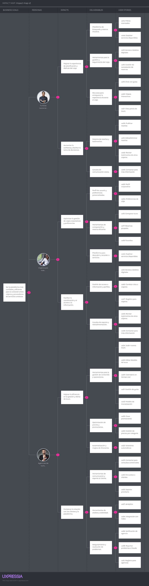
</p>

### 3.4. Product Backlog

| Orden | User Story Id | Título                                | Descripción                                                                                                                                         | Story Points |
| ----- | ------------- | ------------------------------------- | --------------------------------------------------------------------------------------------------------------------------------------------------- | ------------ |
| 1     | US39          | Navegación por el landing page        | Como visitante, quiero navegar fácilmente por el landing page para acceder a todas las secciones principales. | 2            |
| 2     | US40          | Ver información del startup        | Como visitante, quiero conocer al equipo para entender quiénes están detrás del proyecto. | 3            |
| 3     | US41          | Conocer la misión de la startup        | Como visitante, quiero entender la misión y valores para evaluar su alineación con mis necesidades. | 3            |
| 4     | US42          | Visualización responsive        | Como visitante, quiero ver la página correctamente adaptada a mi pantalla para una experiencia óptima. | 5            |
| 5     | US43          | Modelo de Monetización        | Como agencia turística, quiero entender claramente cómo generaré ingresos mediante la plataforma para planificar mi estrategia. | 5            |
| 6     | US44          | Explorar servicios disponibles        | Como visitante del segmento de viajeros, quiero explorar los servicios disponibles para encontrar opciones que se adapten a mis intereses de viaje. | 3            |
| 7     | US45          | Revisar testimonios de otros viajeros        | Como visitante del segmento de viajeros, quiero leer testimonios de otros usuarios para tener confianza en las experiencias ofrecidas. | 3            |
| 8     | US46          | Contactar para más información        | Como visitante del segmento de viajeros, quiero poder enviar un mensaje para resolver dudas sobre los servicios ofrecidos. | 5            |
| 9     | US47          | Registro para viajeros        | Como visitante del segmento de viajeros, quiero registrarme fácilmente desde la landing para comenzar a explorar experiencias de viaje. | 3            |
| 10     | US48          | Conocer cómo funciona la plataforma        | Como visitante del segmento de agencias, quiero entender cómo funciona la plataforma para saber si es compatible con mis servicios. | 3            |
| 11     | US49          | Revisar testimonios de otras agencias        | Como visitante del segmento de agencias, quiero leer testimonios de otros usuarios para validar la efectividad de la plataforma. | 3            |
| 12     | US50          | Cambiar vista a viajeros        | Como visitante del segmento de agencias, quiero cambiar a la vista de viajeros para conocer el contenido y servicios disponibles para ese público. | 2            |
| 13     | US51          | Registro para agencias        | Como visitante del segmento de agencias, quiero registrarme desde la landing para empezar a formar parte de la plataforma. | 3            |
| 14     | US24          | Subir nuevos tours        | Como agencia, quiero subir nuevos tours con fotos y descripciones para atraer clientes. | 8            |
| 15     | US25          | Editar Detalles de Tour        | Como agencia, quiero editar los detalles de un tour publicado (descripción, puntos de encuentro, inclusiones) para mantener la información actualizada. | 5            |
| 16     | US09          | Publicar reseñas        | Como viajero, quiero compartir mis reseñas para ayudar a otros turistas a elegir sus experiencias. | 5            |
| 17     | US10          | Editar/Eliminar reseñas        | Como viajero, quiero modificar o eliminar mis reseñas para asegurar que reflejen mi experiencia con precisión. | 5            |
| 18     | US11          | Eliminar cuenta        | Como viajero, quiero borrar mi cuenta para proteger mi privacidad. | 8            |
| 19     | US14          | Filtros avanzados        | Como turista, quiero filtrar actividades por precio y tipo para encontrar opciones relevantes. | 8            |
| 20     | US15          | Comparar tours        | Como usuario, quiero comparar múltiples tours en una vista para tomar la mejor decisión. | 8            |
| 21     | US16          | Gestión de Cancelación de Reservas        | Como turista, quiero cancelar una reserva con anticipación para ajustar mis planes de viaje. | 8            |
| 22     | US17          | Reservas grupales        | Como viajero corporativo, quiero reservar para mi equipo para simplificar la logística. | 8            |
| 23     | US18          | Favoritos        | Como usuario, quiero guardar actividades interesantes para revisarlas después. | 5            |
| 24     | US19          | Chat con guías        | Como usuario, quiero preguntar detalles a los guías antes de reservar para aclarar dudas. | 8            |
| 25     | US20          | Mapas interactivos        | Como turista, quiero ver la ubicación exacta de los tours para planificar mi ruta. | 8            |
| 26     | US21          | Vista previa de tours        | Como turista, quiero ver fotos y videos detallados de los tours para evaluar la experiencia antes de reservar. | 5            |
| 27     | US22          | Itinerarios automáticos        | Como viajero, quiero generar un itinerario diario automático para optimizar mi tiempo. | 8            |
| 28     | US26          | Calendario en tiempo real        | Como agencia, quiero actualizar la disponibilidad para evitar sobre-reservas. | 8            |
| 29     | US27          | Analytics        | Como agencia, quiero ver métricas de reservas para mejorar mis estrategias. | 8            |
| 30     | US28          | Alertas de reservas        | Como agencia, quiero recibir notificaciones de nuevas reservas para prepararme. | 5            |
| 31     | US29          | Crear promociones        | Como agencia, quiero ofrecer descuentos en temporada baja para atraer más clientes. | 8            |
| 32     | US30          | Gestión de Precios por Categoría        | Como agencia, quiero definir precios diferentes para adultos y niños en mis tours para ajustarme a la demanda. | 8            |
| 33     | US31          | Gestión de guías        | Como agencia, quiero asignar guías a tours específicos para organizar mi equipo. | 8            |
| 34     | US32          | Encuestas a clientes        | Como agencia, quiero enviar encuestas post-viaje para medir la satisfacción. | 8            |
| 35     | US34          | Integración con redes        | Como agencia, quiero compartir mis tours en redes sociales para aumentar mi visibilidad. | 8            |
| 36     | US36          | Verificación de Agencia        | Como agencia, quiero verificar mi negocio para ganar la confianza de los clientes. | 8            |
| 37     | US37          | Pago en Cuotas        | Como usuario, quiero dividir el pago en cuotas para gestionar mejor mi presupuesto. | 8            |
| 38     | US38          | Reportar Problemas o Fraude        | Como usuario, quiero reportar tours inapropiados o actividades sospechosas para mantener la seguridad y calidad de la plataforma. | 5            |
| 39     | TS01          | API: Registro de usuarios        | Como Developer, quiero una API para registrar nuevos usuarios para soportar la funcionalidad de registro de la plataforma. | 5            |
| 40     | TS02          | API: Inicio de sesión de usuarios        | Como Developer, quiero una API para autenticar usuarios para permitirles acceder a sus perfiles. | 5            |
| 41     | TS03          | API: Gestión de Perfil de Usuario        | Como Developer, quiero una API para que los usuarios gestionen sus datos de perfil para permitir la actualización de información personal. | 8            |
| 42     | TS04          | API: Carga de Tours por Agencia        | Como Developer, quiero una API para que las agencias suban información de tours para mostrar su oferta en la plataforma. | 8            |
| 43     | TS05          | API: Consulta de Tours        | Como Developer, quiero una API para consultar tours con filtros para soportar la búsqueda de actividades por parte de los usuarios. | 8            |
| 44     | TS06          | API: Creación de Reservas        | Como Developer, quiero una API para crear reservas de tours para registrar las transacciones de los usuarios. | 8            |
| 45     | TS07          | API: Procesamiento de Pagos        | Como Developer, quiero una API para procesar pagos de reservas de manera segura para manejar las transacciones financieras. | 8            |
| 46     | TS08          | API: Gestión de Disponibilidad de Tours        | Como Developer, quiero una API para que las agencias actualicen la disponibilidad de sus tours para evitar sobre-reservas. | 8            |
| 47     | TS09          | API: Moderación de Contenido (Reseñas/Tours)        | Como Developer, quiero una API para que los administradores moderen reseñas y tours para asegurar la calidad y formalidad de la plataforma. | 8            |
| 48     | TS10         | API: Gestión de Usuarios Corporativos        | Como Developer, quiero una API para gestionar la vinculación de usuarios corporativos para aplicar beneficios exclusivos. | 8            |
| 49     | TS11          | API: Sincronización de Inventario        | Como Developer, quiero una API que permita a los sistemas de agencias sincronizar automáticamente su inventario y precios con TravelMatch para reducir la carga manual de gestión. | 8            |
| 50     | US01          | Registro básico        | Como nuevo usuario, quiero registrarme con un email para acceder a la plataforma. | 5            |
| 51     | US02          | Inicio de sesión        | Como usuario registrado, quiero iniciar sesión para gestionar mis reservas. | 5            |
| 52     | US03          | Perfil corporativo        | Como viajero corporativo, quiero vincularme con mi empresa para obtener beneficios exclusivos. | 8            |
| 53     | US04          | Preferencias de viaje        | Como turista, quiero seleccionar mis intereses para recibir recomendaciones personalizadas. | 5            |
| 54     | US05          | Recuperar contraseña        | Como usuario, quiero restablecer mi contraseña si la olvido para recuperar el acceso. | 5            |
| 55     | US06          | Verificación de identidad        | Como usuario premium, quiero verificar mi identidad para desbloquear reservas exclusivas. | 8            |
| 56     | US07          | Notificaciones push        | Como usuario, quiero recibir alertas sobre ofertas para no perderme promociones. | 5            |
| 57     | US08          | Idiomas        | Como usuario internacional, quiero cambiar el idioma de la app para entender mejor. | 5            |
| 58     | US12          | Acceso a boletos digitales        | Como usuario, quiero acceder a mis boletos/vouchers con código QR para facilitar el check-in en las actividades. | 8            |
| 59     | US13          | Contactar al equipo de soporte (versión usuario)        | Como usuario con dudas, quiero enviar un mensaje al soporte para resolver mis inquietudes. | 5            |
| 60     | US23          | Contactar para consultas comerciales        | Como visitante del segmento de agencias, quiero usar el formulario de contacto para hacer consultas o proponer colaboraciones. | 5            |
| 61     | US33          | Soporte prioritario        | Como agencia, quiero acceder a soporte rápido para resolver problemas urgentes. | 5            |
| 62     | US35          | Contactar al equipo de soporte (Versión agencia)        | Como agencia asociada, quiero contactar al soporte técnico especializado para resolver problemas operativos urgentes. | 5            |


<hr>

## Capítulo IV: Product Design

### 4.1. Style Guidelines

Esta sección establece un conjunto de directrices visuales y de interacción coherentes que funcionarán como fuente central de referencia para el equipo de diseño, desarrollo y comunicación de TravelMatch.
El objetivo es garantizar una presentación unificada, profesional y alineada con la esencia de la marca: conectar a turistas con experiencias auténticas, de manera simple y confiable.

#### 4.1.1. General Style Guidelines

- _Branding:_    
    - La identidad visual de TravelMatch es moderna, cercana y confiable. El logotipo incorpora dos figuras humanas estilizadas unidas en un gesto de conexión, lo que simboliza el espíritu colaborativo y humano de la plataforma.
    - Uso del logotipo: El logotipo debe usarse preferentemente sobre fondos claros (beige, blanco o pastel neutro). En fondos oscuros, se permite una versión monocromática blanca o en azul marino (#1C1F2B).
    - No se permite:
        - Rotar el logotipo.
        - Aplicar sombras, contornos o degradados.
        - Cambiar la tipografía original de la palabra TravelMatch.

<p align="center">
    
</p>

- _Typography:_
    - La tipografía utilizada en el logotipo es una fuente sans-serif geométrica, amigable y legible. Para mantener coherencia, se adoptará un sistema tipográfico similar en toda la aplicación.

    - Fuente primaria: Nunito Sans
        - Uso: Títulos, botones, navegación.
        - Estilos permitidos: Regular, SemiBold, Bold.

    - Fuente secundaria: Inter
        - Uso: Cuerpos de texto largos, formularios.

    - Tamaños recomendados:
        - Título principal (H1): 32px / 700
        - Subtítulo (H2): 24px / 600
        - Texto normal: 16px / 400
        - Nota o ayuda: 12px / 400

<div align="center">    

| Nombre de fuente | Tipografia |
|:----------------:|:----------:|
| Nunito Sans | 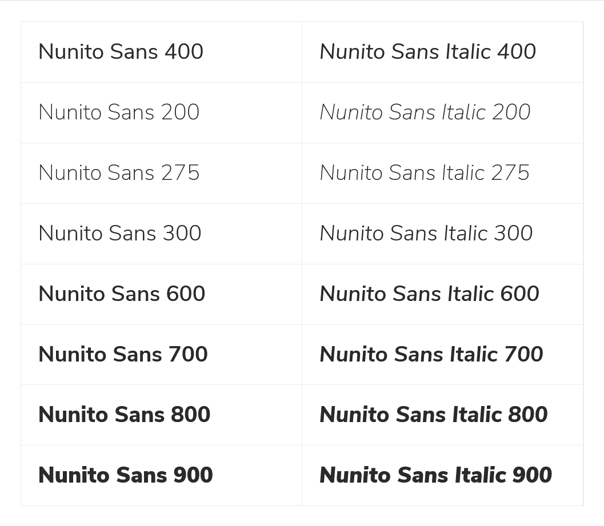 |
| Inter | 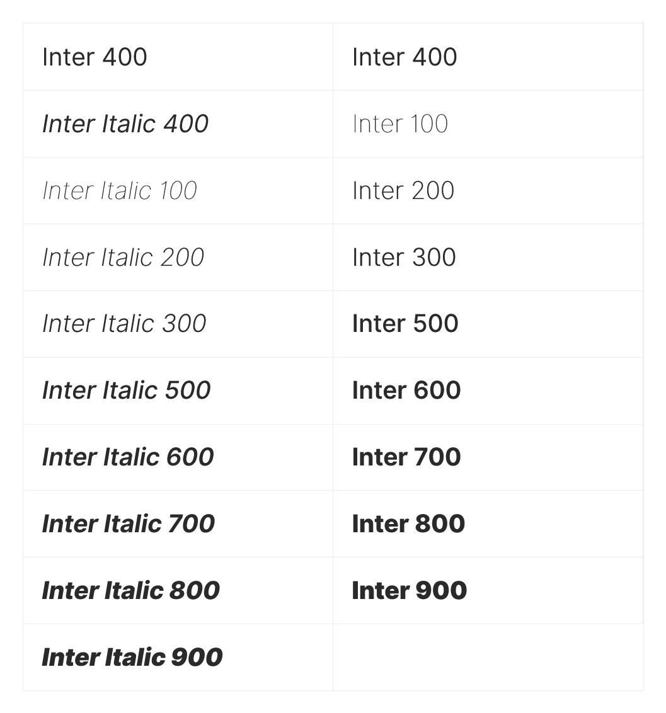 |  
    
</div>      
              
- _Colors:_
    - La paleta de TravelMatch se basa en contrastes suaves y un color protagonista: azul marino profundo, que transmite confianza y estabilidad. Se acompaña de colores neutros y un acento cálido para llamados a la acción

<div align="center">    

| Color | Hex | Uso Principal | 
|:-----:|:---:|:-------------:|
|Azul Marino| #1C1F2B | Texto principal, logotipo, botones|
|Beige Claro| #F5F0E6 | Fondo base|
|Gris Suave| #B3B3B3 | Bordes, textos secundarios|
|Azul Claro| #3A71C1 | Enlaces, botones secundarios|
|Amarillo Arena| #FFD479| Llamado a la acción / iconos |
|Blanco| #FFFFFF|Fondos, tarjetas, formularios|

</div>

<p align="center">
    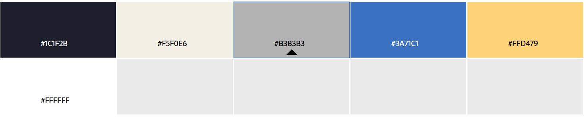
</p>

- _Spacing:_
    - La coherencia en el espaciado es clave para una interfaz limpia y clara.
        - Espaciado entre secciones principales: 32px
        - Margen interno de botones y campos: 12px vertical / 20px horizontal
        - Separación entre elementos repetitivos (cards, ítems): 16px
        - Padding general de contenedores: 24px

- _Tono de comunicación y lenguaje:_
    - El tono de TravelMatch es cercano, entusiasta y profesional.

<div align="center">    

| Estilo de redacción | Tono predominante |
|---------------------|-------------------|
| 1. Amigable y claro <br> 2. Sin tecnicismos innecesarios <br> 3. Verbos en voz activa <br> 4. Enfocado en beneficios (“Descubre experiencias únicas”, “Reserva en segundos”)| 1. Formal-casual: Respetuoso, pero no rígido. <br> 2. Entusiasta: Inspirador, motivador, acogedor. <br> 3. Directo: Frases cortas y llamadas a la acción claras. |

</div>


#### 4.1.2. Web Style Guidelines

- _Responsive Design Standards:_  
    TravelMatch está diseñado como una aplicación web mobile-first, adaptándose fluidamente a diferentes dispositivos:

    - **Mobile (360px - 768px):**  
        - Navegación tipo hamburguesa.  
        - Cards apiladas en columna.  
        - Botones grandes y legibles.  

    - **Tablet (769px - 1024px):**  
        - Layout en 2 columnas.  
        - Menú lateral colapsable.  

    - **Desktop (1025px en adelante):**  
        - Menú principal visible.  
        - Layout de 3 columnas donde sea posible.  

    Todos los componentes deben utilizar **flexbox/grid** con puntos de quiebre en 768px y 1024px.

- _Interactivity:_  
    - **Botones:**  
        - Bordes redondeados (border-radius: 12px).  
        - Hover: cambio de fondo o sombra suave (box-shadow: 0px 2px 8px rgba(0, 0, 0, 0.1)).  
        - Feedback claro al clic (cambio de color, animación sutil).  

    - **Transiciones y animaciones:**  
        - Duración: 200–300ms.  
        - Usar ease-in-out.  
        - Aplicables en sliders, modales, tooltips y feedback de formularios.

- _Accessibility:_  
    - Contrastes de texto cumplen con **WCAG AA** como mínimo.  
    - Todo ícono debe tener alternativa textual (aria-label o alt).  
    - Navegación compatible con teclado (Tab, Enter, Esc).  
    - Uso de role, aria-expanded, aria-hidden en componentes dinámicos.  
    - Fuente mínima: 16px.

- _UI Consistency:_  
    - Uso de un sistema de componentes reutilizables: botones, tarjetas, inputs, modales.  
    - Evitar cambios de estilo arbitrarios entre páginas.  
    - Todos los formularios deben compartir un estilo común:  
        - Etiqueta arriba, campo debajo, mensaje de error abajo.  
        - Validaciones claras y mensajes amigables.

### 4.2. Information Architecture

La arquitectura de la información de TravelMatch está diseñada para asegurar que tanto visitantes nuevos como usuarios recurrentes puedan encontrar, descubrir e interactuar con el contenido de manera natural e intuitiva. Esta estructura se adapta a las necesidades específicas de cada entorno (Landing Page, Aplicación Web y Aplicación Móvil) manteniendo consistencia visual, semántica y funcional.

Los sistemas de organización, etiquetado, navegación y búsqueda han sido definidos considerando la diversidad de usuarios, el volumen de información creciente y la importancia de una experiencia centrada en el usuario.

#### 4.2.1. Organization Systems

La estructura de organización de contenido en TravelMatch combina distintas estrategias según el tipo de información presentada y la etapa del recorrido del usuario:

- _Visual Hierarchy (Jerarquía Visual)_

    Se utilizará ampliamente en todas las interfaces (Landing Page, Home de la App, Detalles de experiencia) para facilitar la comprensión inmediata del contenido. La disposición jerárquica prioriza los elementos según su importancia relativa, estableciendo tamaños, colores y posiciones diferenciadas para:    

    - Títulos y encabezados principales.
    - Imágenes destacadas (experiencias recomendadas, destinos top).
    - Llamados a la acción (botones de "Reservar", "Explorar", "Ver más").

    Esto permitirá que el usuario escanee el contenido rápidamente y entienda qué acciones tomar en cada momento.

- _Sequential Organization (Organización Secuencial)_

    Se aplicará principalmente en los flujos de interacción del usuario, especialmente en procesos donde se requiere una acción paso a paso, como:

    - Registro de usuario y onboarding personalizado.
    - Filtros para construir recomendaciones de experiencia.
    - Proceso de reserva y confirmación.
    - Creación de perfil o preferencias de viaje.

    Cada uno de estos pasos se presentará de forma clara y continua, indicando el progreso del usuario y minimizando fricciones en la interacción.

- _Matricial (Matrix Organization)_

    Este sistema será utilizado en secciones donde el usuario debe explorar múltiples opciones simultáneamente, sin un orden específico, como:

    - Búsqueda de experiencias por filtros combinables.
    - Exploración de destinos por tipo de actividad (gastronomía, aventura, cultura, etc.).
    - Vista de resultados personalizados o tendencias.

    Los usuarios podrán elegir entre distintos atributos (ubicación, duración, tipo de experiencia, nivel de actividad, etc.) y la interfaz responderá dinámicamente.

- _Categorización de Contenido_

    Para optimizar la navegación y la personalización de la experiencia del usuario, TravelMatch adopta una categorización estratégica que responde tanto a las expectativas de los turistas como a las necesidades operativas de la plataforma. Los esquemas de categorización se aplicarán según el contexto de uso y el tipo de información, permitiendo al usuario filtrar, explorar y decidir con facilidad.

    - **Por tópicos:** Las experiencias se agruparán por categorías temáticas (Ej. “Aventura al aire libre”, “Gastronomía local”, “Arte y cultura”).
    - **Por audiencia:** Algunas secciones estarán personalizadas para distintos perfiles de usuario (parejas, viajeros solitarios, familias, etc.).
    - **Cronológico:** Se utilizará en listas de reservas pasadas y próximas, así como en contenido destacado por temporada o eventos locales.
    - **Alfabético:** Aplicable para listados largos como ciudades, destinos o idiomas disponibles en preferencias.

#### 4.2.2. Labeling Systems

En TravelMatch, el sistema de etiquetado ha sido diseñado para maximizar la claridad y minimizar la carga cognitiva del usuario. Todas las etiquetas empleadas en la plataforma —tanto en la navegación como en el contenido— están orientadas a la simplicidad, consistencia semántica y a un lenguaje cercano, inclusivo y fácil de comprender, sin sacrificar la precisión funcional.

- _Principios clave del sistema de etiquetado:_  
    - **Claridad ante todo:**  
        Las etiquetas evitarán tecnicismos o ambigüedades. Se utilizarán palabras comunes para que cualquier usuario —sin importar su nivel de experiencia digital o cultural— pueda entenderlas.  
    - **Consistencia terminológica:**  
        Un mismo concepto se nombrará de la misma forma en todos los entornos (web, móvil, comunicaciones, emails transaccionales).  
    - **Longitud mínima:**  
        Se privilegiará el uso de etiquetas cortas (1 a 3 palabras), pero descriptivas.  
    - **Prioridad visual:**  
        Se jerarquizará tipográficamente cada tipo de etiqueta, destacando acciones o categorías principales con estilos tipográficos definidos en la guía de estilo.

- _Etiquetas principales por área:_  
    - **Navegación global:**  
        - Explorar  
        - Mi Perfil  
        - Favoritos  
        - Recomendaciones  
        - Mis Reservas  
        - Ayuda  

    - **Landing Page:**  
        - Encuentra tu próxima aventura  
        - ¿Cómo funciona TravelMatch?  
        - Experiencias destacadas  
        - Únete como agencia  
        - Testimonios  

    - **Filtrado y búsqueda:**  
        - Tipo de experiencia (Ej. “Cultural”, “Aventura”, “Relax”)  
        - Duración (Ej. “Medio día”, “1 día completo”, “Fin de semana”)  
        - Nivel de actividad (Ej. “Baja”, “Moderada”, “Alta”)  
        - Destino  
        - Precio  

    - **Acciones del usuario:**  
        - Reservar ahora  
        - Guardar experiencia  
        - Compartir  
        - Ver más detalles  
        - Editar perfil  
        - Cerrar sesión  

    - **Agencias (vista especial):**  
        - Publicar nueva experiencia  
        - Gestionar reservas  
        - Estadísticas  
        - Planes y visibilidad  
        - Mensajes recibidos  

- _Asociaciones entre etiquetas:_  
    - Se utilizarán etiquetas compuestas en ciertos casos para clarificar relaciones entre conceptos, como:  
        - “Experiencia recomendada”  
        - “Destino popular”  
        - “Nuevo mensaje”  
        - “Agencia verificada”  

    - Las etiquetas de acciones estarán siempre acompañadas de íconos representativos para reforzar la asociación visual y acelerar la comprensión.  
    - En formularios y filtros, los campos estarán precedidos por etiquetas que indiquen claramente qué se espera del usuario (Ej. “Selecciona una fecha”, “Elige un destino”).

#### 4.2.3. SEO Tags and Meta Tags

Para TravelMatch, contar con una estructura sólida de SEO y metadatos es esencial para maximizar la visibilidad orgánica en motores de búsqueda y mejorar la experiencia al compartir enlaces en redes sociales y otras plataformas. A continuación, se definen los valores clave que serán implementados tanto en la Landing Page como en la Web Application, alineados con nuestra propuesta de valor y el tono de la marca.

- _Landing Page:_  
    - **Title:**  
        TravelMatch | Conecta con tu próxima experiencia de viaje personalizada  
    - **Meta Description:**  
        Descubre viajes únicos con agencias locales verificadas. En TravelMatch conectamos turistas con experiencias a medida, sin complicaciones.  
    - **Meta Keywords:**  
        viajes personalizados, agencias locales, experiencias de viaje, turismo inteligente, tours recomendados, actividades, destinos  
    - **Meta Author:**  
        TravelMatch Team  
    - **Open Graph Tags (para redes sociales):**  
        ```html
        <meta property="og:title" content="TravelMatch | Conecta con tu próxima experiencia de viaje personalizada" />
        <meta property="og:description" content="Descubre viajes únicos con agencias locales verificadas. En TravelMatch conectamos turistas con experiencias a medida, sin complicaciones." />
        <meta property="og:image" content="https://travelmatch.app/assets/social-preview.jpg" />
        <meta property="og:url" content="https://travelmatch.app" />
        <meta property="og:type" content="website" />
        ```
    - **Twitter Cards (formato enriquecido):**  
        ```html
        <meta name="twitter:card" content="summary_large_image" />
        <meta name="twitter:title" content="TravelMatch | Conecta con tu próxima experiencia de viaje personalizada" />
        <meta name="twitter:description" content="Descubre viajes únicos con agencias locales verificadas. En TravelMatch conectamos turistas con experiencias a medida, sin complicaciones." />
        <meta name="twitter:image" content="https://travelmatch.app/assets/social-preview.jpg" />
        ```

- _Web Application (post-login):_  
    - **Title:**  
        TravelMatch | Tu espacio de viajes personalizados  
    - **Meta Description:**  
        Gestiona tus experiencias, descubre nuevas aventuras y mantente en contacto con agencias confiables. Todo en un solo lugar.  
    - **Meta Keywords:**  
        perfil viajero, gestionar reservas, recomendaciones de viaje, experiencias favoritas, viajes a medida  
    - **Meta Author:**  
        TravelMatch Platform  
    - **Canonical URL:**  
        Las páginas clave de la app tendrán URLs canónicas bien definidas para evitar problemas de contenido duplicado, especialmente en vistas filtradas.

- _Consideraciones adicionales:_  
    - Se implementarán etiquetas dinámicas en la web app para experiencias individuales y perfiles de agencia, lo cual permitirá SEO personalizado por contenido.  
    - Se aplicarán **alt attributes** descriptivos y útiles en todas las imágenes, especialmente aquellas que se vinculen con experiencias o destinos.  
    - Se cuidará el rendimiento de carga (**Core Web Vitals**) como parte del SEO técnico, priorizando tiempos rápidos de respuesta en dispositivos móviles. 

#### 4.2.4. Searching Systems

El sistema de búsqueda de TravelMatch está diseñado para facilitar a los usuarios la localización rápida y eficiente de experiencias turísticas relevantes. El objetivo es minimizar la frustración del usuario y maximizar la descubribilidad del contenido, aún ante grandes volúmenes de información y diversidad de ofertas.

- _Turistas: Búsqueda de experiencias:_  
    Los turistas acceden a un motor de búsqueda central ubicado en la vista principal de la plataforma. Este sistema incluirá:  
    - **Barra de búsqueda por palabra clave:**  
        - Autocompletado inteligente para sugerir términos relevantes.  
    - **Filtros dinámicos combinables:**  
        - Tipo de actividad (aventura, cultural, gastronómica, relajación, etc.).  
        - Ubicación geográfica (país, ciudad, región).  
        - Precio (rango mínimo y máximo).  
        - Duración estimada de la experiencia.  
        - Idioma del guía.  
        - Fecha de disponibilidad.  
        - Valoración promedio.  
    - **Sistema de etiquetado (tags):**  
        Los resultados podrán filtrarse también por etiquetas asignadas por agencias o derivadas del comportamiento de otros usuarios (ej. “para familias”, “eco-friendly”, “pet-friendly”).  

    Los resultados serán presentados en formato de tarjetas visuales, que incluirán:  
    - Imagen destacada.  
    - Nombre de la experiencia.  
    - Ubicación.  
    - Duración.  
    - Precio base.  
    - Valoración promedio.  

    Además, se ofrecerán opciones para:  
    - Ordenar los resultados por relevancia, precio, popularidad o evaluación.  
    - Guardar filtros personalizados para futuras búsquedas.  

- _Agencias: Búsqueda en publicaciones y reservas:_  
    Las agencias contarán con una funcionalidad de búsqueda interna dentro del panel de administración:  
    - **Búsqueda por nombre de experiencia publicada.**  
    - **Filtros por estado:**  
        - Activa, inactiva, pendiente de revisión.  
    - **Filtro por número de reservas recibidas.**  
    - **Búsqueda en histórico de reservas:**  
        - Por fecha, turista, experiencia o estado de pago.  

    Este sistema permitirá una gestión ágil de contenido y facilitará la toma de decisiones basada en información organizada y accesible.

- _Resultados adaptables y responsivos:_  
    Todos los resultados de búsqueda están diseñados para ser responsive y adaptables a dispositivos móviles, manteniendo legibilidad, interactividad y consistencia visual. El sistema incluye:  
    - Vista en cuadrícula o lista, según preferencia del usuario.  
    - Indicadores visuales para destacar promociones o nuevos lanzamientos.  

- _Mejoras futuras:_  
    Está prevista la integración de un sistema de búsqueda semántica e inteligencia artificial, que permitirá sugerencias personalizadas basadas en:  
    - Historial de navegación.  
    - Comportamiento previo.  
    - Perfiles similares.  

    Esto enriquecerá la experiencia del usuario y aumentará la conversión de búsquedas en reservas concretadas.  

#### 4.2.5. Navigation Systems

La navegación en TravelMatch está diseñada para ser intuitiva, fluida y centrada en la experiencia del usuario, tanto en la Landing Page como en la Web Application. El objetivo es que cada tipo de usuario —turista o agencia— pueda alcanzar sus metas con el menor número de clics y sin fricción.

- _Landing Page:_  
    La navegación principal está orientada a captar y guiar nuevos visitantes. Se estructura mediante una barra superior fija con los siguientes elementos:  
    - **Logo**  
    - **Cómo Funciona**  
    - **Explorar**
    - **Para Agencias**  
    - **Nosotros**
    - **Iniciar sesión / Registrarse** (con botón destacado)  

    Se emplea una navegación jerárquica horizontal con anclas que guían a secciones específicas del mismo sitio (scroll suave), y una estructura de **one-page design** para mantener la continuidad narrativa.  

    Además, en la sección inferior se encuentra un footer informativo, con accesos a:  
    - **Política de privacidad**  
    - **Términos y condiciones**  
    - **Contacto**  
    - **Redes sociales**  

- _Web Application (Post-login):_  
    Una vez autenticado, el usuario accede a un entorno altamente funcional, que prioriza la usabilidad y eficiencia en la navegación.  

    - **Para Turistas:**  
        Barra lateral con:  
        - 🏠 Inicio  
        - 🔍 Buscar experiencias  
        - ❤️ Mis favoritos  
        - 🧾 Mis reservas  
        - 👤 Perfil  
        - 🚪 Cerrar sesión  

    - **Para Agencias:**  
        Barra lateral con:  
        - 🏠 Panel de control  
        - ✍️ Publicar experiencia  
        - 📈 Mis publicaciones  
        - 📥 Reservas recibidas  
        - 👤 Perfil de agencia  
        - 🚪 Cerrar sesión  

    Se utilizará una navegación persistente y contextual:  
    - **Breadcrumbs:** Se mostrarán en vistas con múltiples niveles para reforzar el contexto.  
    - **Accesos rápidos:** Las acciones importantes estarán disponibles a través de FAB (Floating Action Button) o menús flotantes en dispositivos móviles.  
    - **Diseño responsive:** La navegación lateral se adaptará a un menú hamburguesa en dispositivos móviles, sin perder funcionalidad.  

- _Comportamientos adicionales:_  
    - **Estado activo:** El ítem de navegación actual se resaltará para reforzar el contexto del usuario.  
    - **Transiciones suaves:** Se aplicarán animaciones ligeras en los cambios de vista, favoreciendo la comprensión del flujo.  
    - **Redirección inteligente:** Después del login, el usuario será redirigido al dashboard o sección de interés dependiendo de su rol (turista o agencia).  

### 4.3. Landing Page UI Design

El Landing Page de TravelMatch representa la materialización visual de las decisiones tomadas en torno a la arquitectura de información, la identidad de marca y las guías de estilo establecidas previamente.

El diseño del Landing Page ha sido pensado para captar la atención de los visitantes desde el primer momento, comunicar de forma clara el valor diferencial de la plataforma, y facilitar una navegación intuitiva y responsiva hacia los distintos componentes clave del sitio.

Este diseño refleja:

- La jerarquía visual establecida en los Organization Systems, priorizando elementos como el mensaje principal, el buscador de experiencias, y los llamados a la acción (CTAs).

- La coherencia con el Design System de TravelMatch, respetando la paleta cromática corporativa inspirada en su logotipo, el uso tipográfico moderno y legible, y los principios de accesibilidad e inclusión.

- Una arquitectura de información que orienta al usuario de manera fluida, reduciendo la carga cognitiva y facilitando la conversión desde la primera interacción.

- La incorporación de patrones reconocibles en UI/UX para generar confianza, claridad y familiaridad con la experiencia.

#### 4.3.1. Landing Page Wireframe

Los wireframes del Landing Page de TravelMatch definen la estructura base de la interfaz, enfocándose en la distribución de contenido y elementos interactivos antes de aplicar el diseño visual definitivo. Se han diseñado versiones específicas para navegadores de escritorio y navegadores móviles, con el objetivo de garantizar una experiencia consistente, accesible y optimizada para cada tipo de dispositivo.
Principios Aplicados

- Jerarquía visual clara: Se priorizan los elementos esenciales como el hero section, buscador de experiencias, CTA de registro, y testimonios. Esto facilita la exploración progresiva del contenido por parte del usuario.

- Diseño inclusivo: Las estructuras propuestas contemplan contrastes adecuados, fuentes legibles y navegación intuitiva tanto por clic como por scroll.

- Consistencia estructural: Se respeta la arquitectura de información definida, agrupando secciones por tópicos (e.g., ¿cómo funciona?, beneficios para agencias, beneficios para turistas, etc.).

- Adaptabilidad: Los wireframes aseguran una transición fluida entre vistas de escritorio y móviles mediante una disposición responsiva, donde los elementos se reorganizan verticalmente sin perder prioridad visual.

**Desktop:**

<p align="center">
    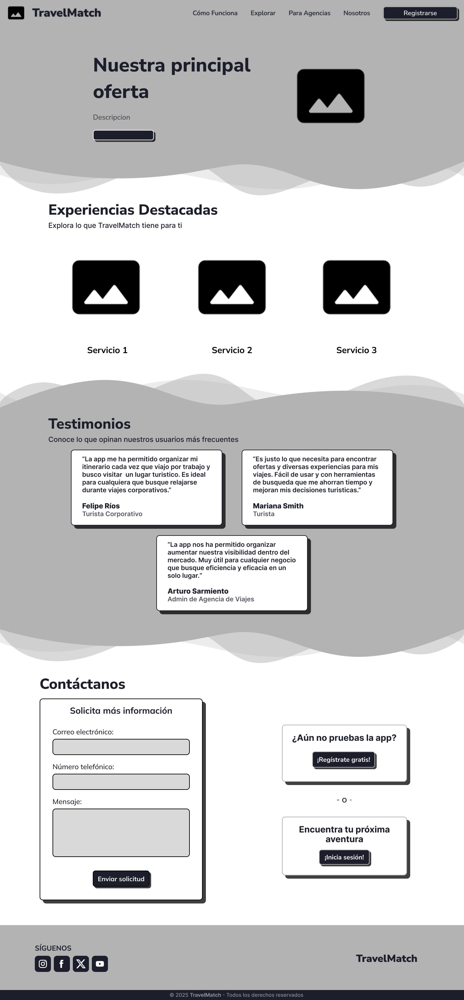
</p>

**Mobile:**

<p align="center">
    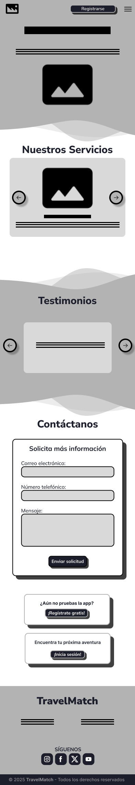
</p>

#### 4.3.2. Landing Page Mock-up

Los mock-ups de la Landing Page de TravelMatch representan la traducción visual completa del wireframe, incorporando la identidad visual, la paleta cromática, la tipografía, iconografía y todos los elementos del Design System previamente definido. Estos mock-ups ofrecen una vista precisa de cómo lucirá el producto final en navegadores web de escritorio y dispositivos móviles.

**Desktop:**

<p align="center">
    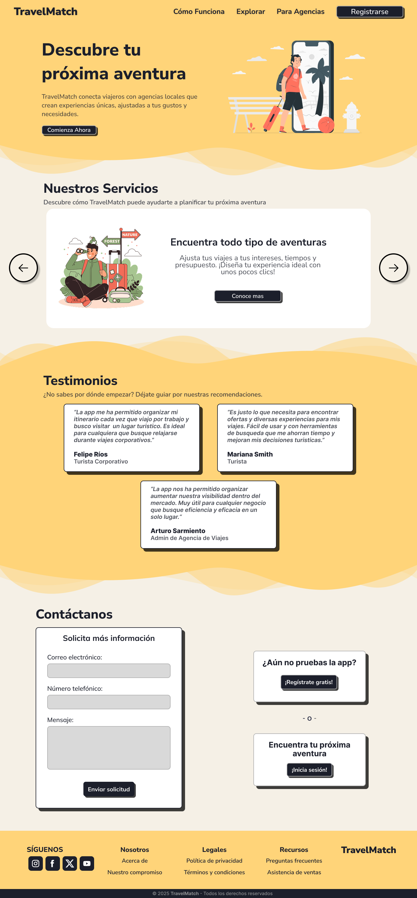
</p>

**Mobile:**

<p align="center">
    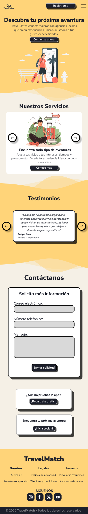
</p>

### 4.4. Web Applications UX/UI Design

#### 4.4.1. Web Applications Wireframes.

<p align="center">
    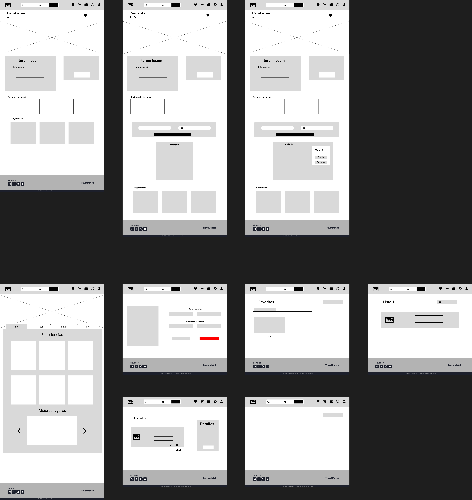
</p>

#### 4.4.2. Web Applications Wireflow Diagrams

<p align="center">
    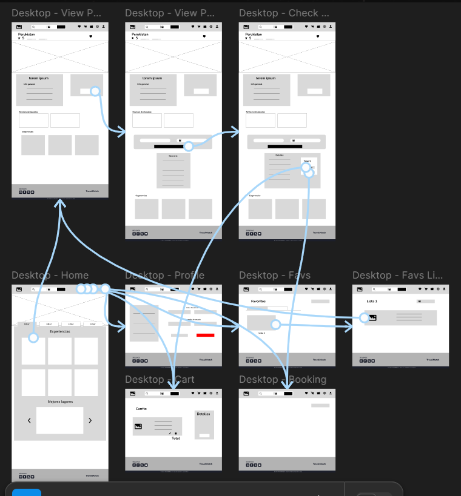
</p>

#### 4.4.3. Web Applications Mock-ups

<p align="center">
    
</p>

#### 4.4.4. Web Applications User Flow Diagrams

<p align="center">
    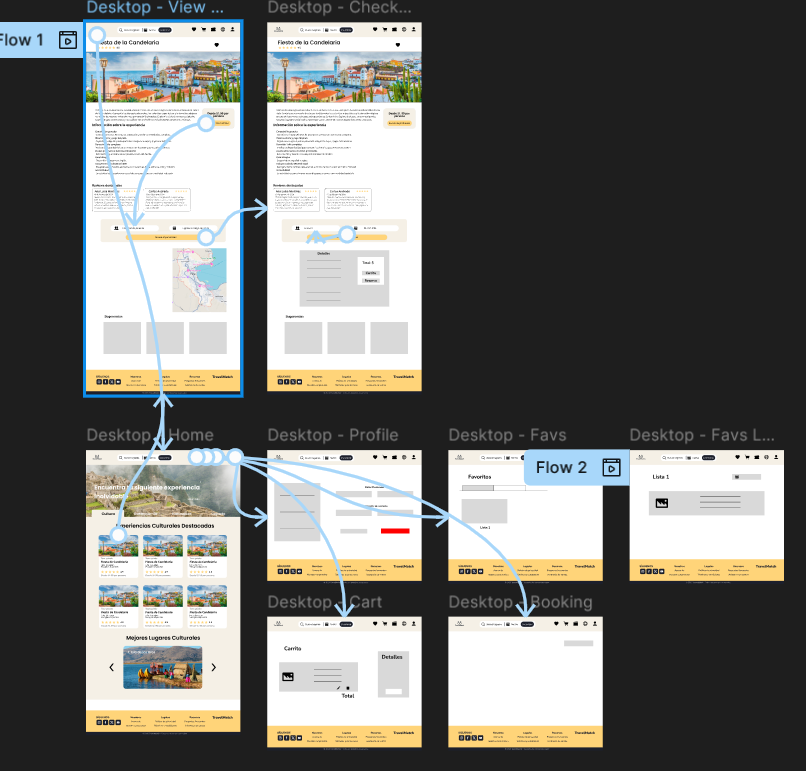
</p>

Enlace al Figma de desarrollo de Web Application: https://www.figma.com/design/GYNFGzIxOsYoaH4UDZpRne/TravelMatch---Frontend?node-id=2039-83&t=MJXW7lJoEYDmKuW2-1

### 4.5. Web Applications Prototyping

- Usuario encuentra un paquete turistico y accede a la operacion de compra

    - El usuario inicia en la vista home de la pagina principal:
        <p align="center">
            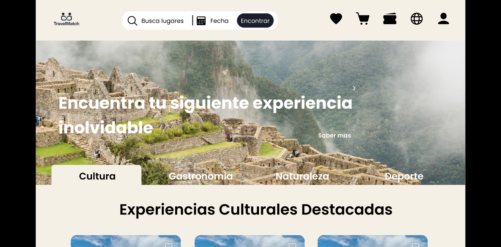
        </p>
    
    - El usuario desciende hasta la zona de experiencias filtradas por categoria. Cuando se interesa en una experiencia, hace clic sobre una de ellas para revisar mas detalles:
        <p align="center">
            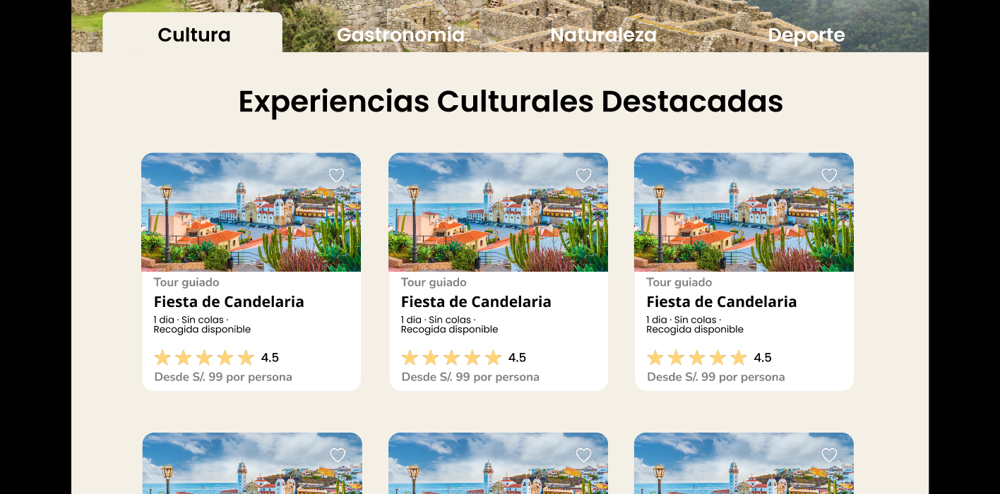
        </p>

    - El usuario accede a la vista detalla en donde se muestra informacion detallada sobre la experiencia:
        <p align="center">
            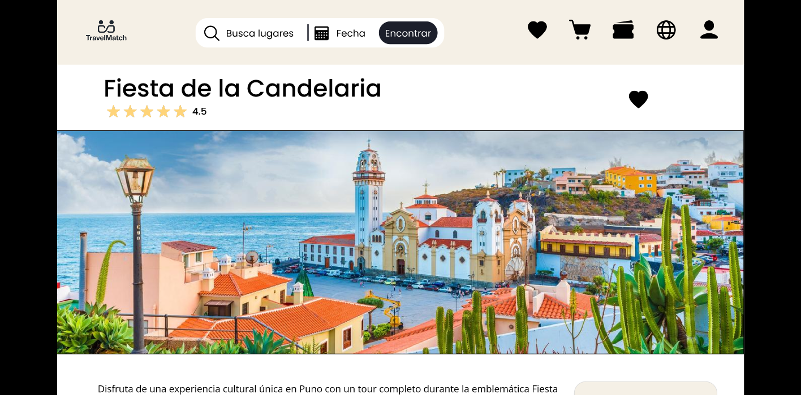
        </p>

    - El usuario visualiza una seccion con el precio y el boton "Revisar disponibilidad" que redirige a una seccion para que filtre resultados de paquetes turisticos:
        <p align="center">
            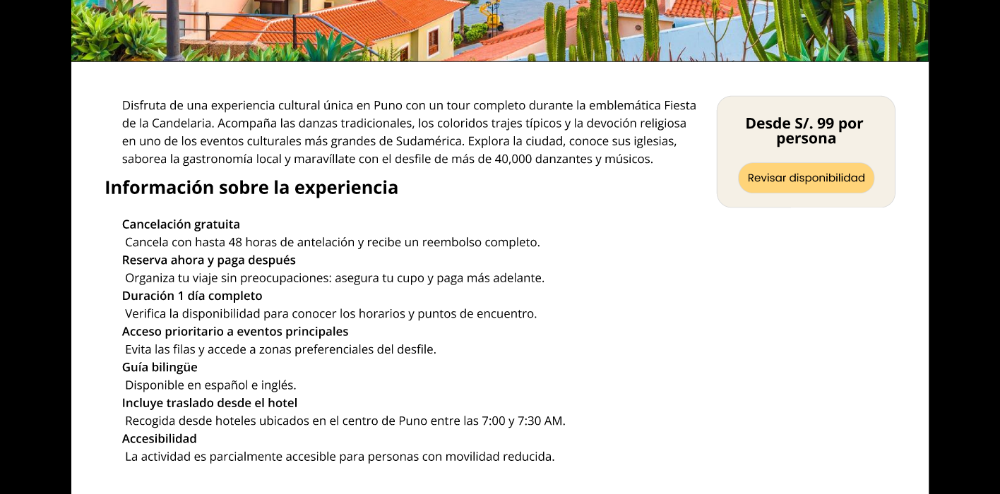
        </p>

    - El usuario ingresa valores para ambos campos y presiona el boton revisar disponibilidad:
        <p align="center">
            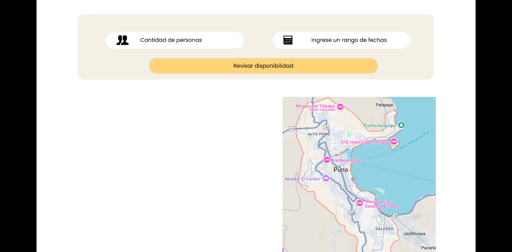
        </p>

    - Se muestran los resultados obtenidos y se brinda la opcion de agregar el paquete a un carrito de compras:
        <p align="center">
            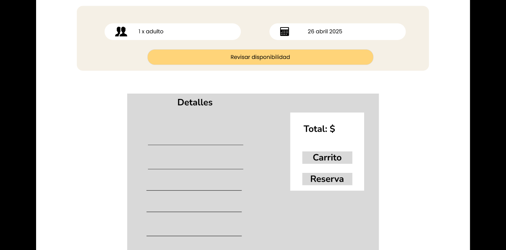
        </p>

    - El usuario accede a la vista del carrito de compras donde decide que hara con el paquete elegido:
        <p align="center">
            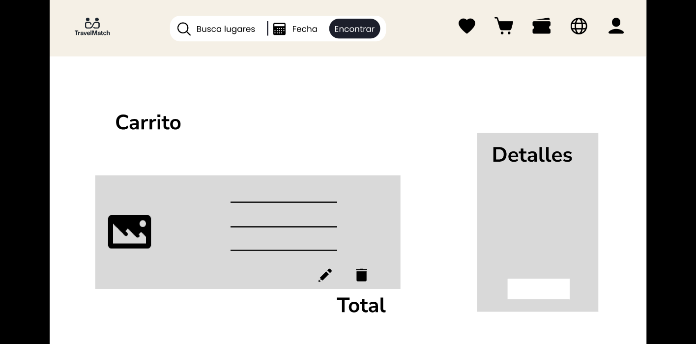
        </p>


    Enlace a la prueba de prototipo: [upc-pre-202510-1asi0729-4328-Pandora-prototype-navigation-sprint-1](https://youtu.be/a66X-oEHVRI)

### 4.6. Domain-Driven Software Architecture

#### 4.6.1. Software Architecture Context Diagrams

<p align="center">
    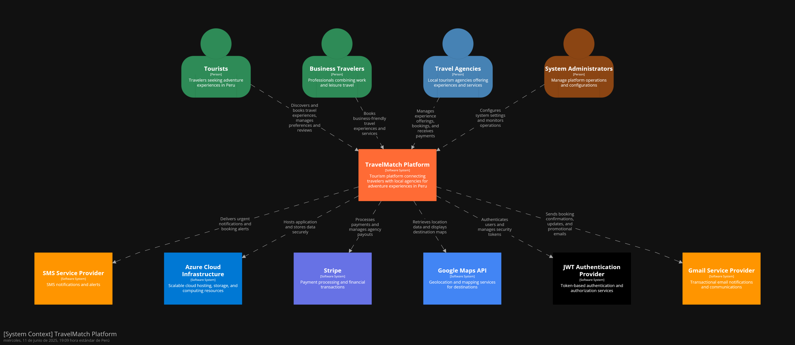
</p>

#### 4.6.2. Software Architecture Container Diagrams

<p align="center">
 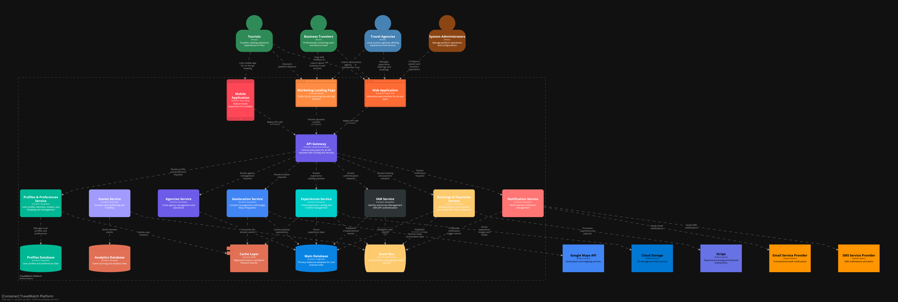
</p>

#### 4.6.3. Software Architecture Components Diagrams

- Bounded Context IAM

<p align="center">
    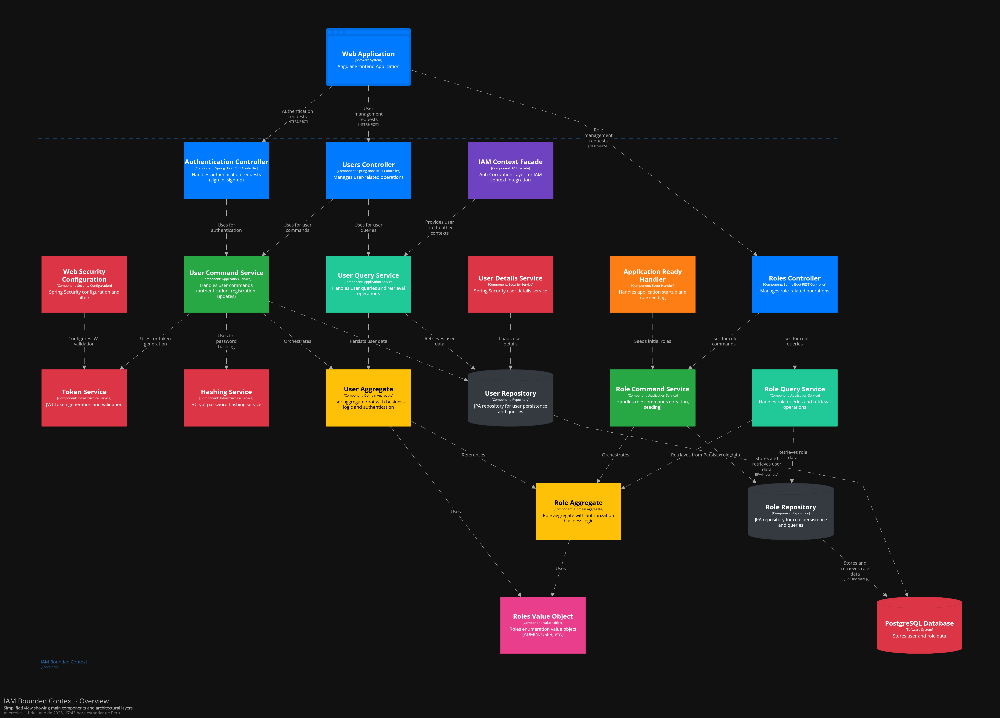
</p>

- Bounded Context Profiles
<p align="center">
    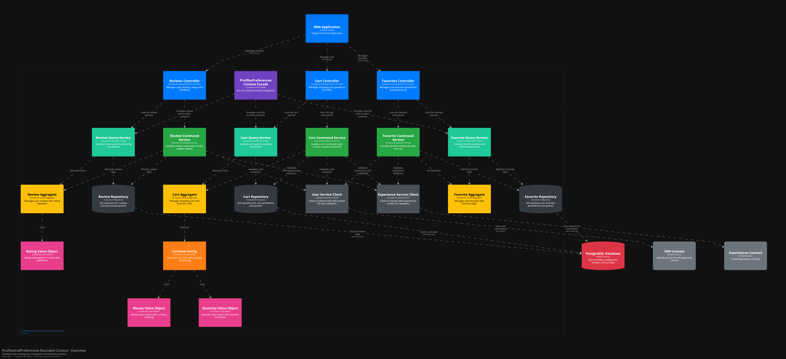
</p>

- Bounded Context Events
<p align="center">
    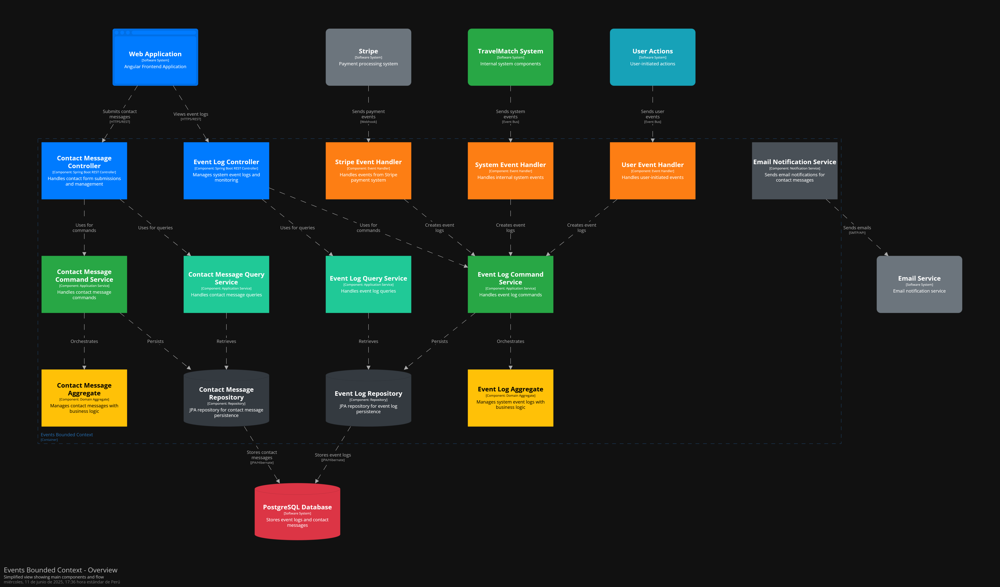
</p>

### 4.7. Software Object-Oriented Design

La orientación a objetos será fundamental en nuestro proyecto. Organizamos el software siguiendo nuestras reglas de negocio, lo que nos permite desarrollar componentes claros para su implementación en un sistema real, además de facilitar su adaptación y mantenimiento.

#### 4.7.1. Class Diagrams

<p align="center">
    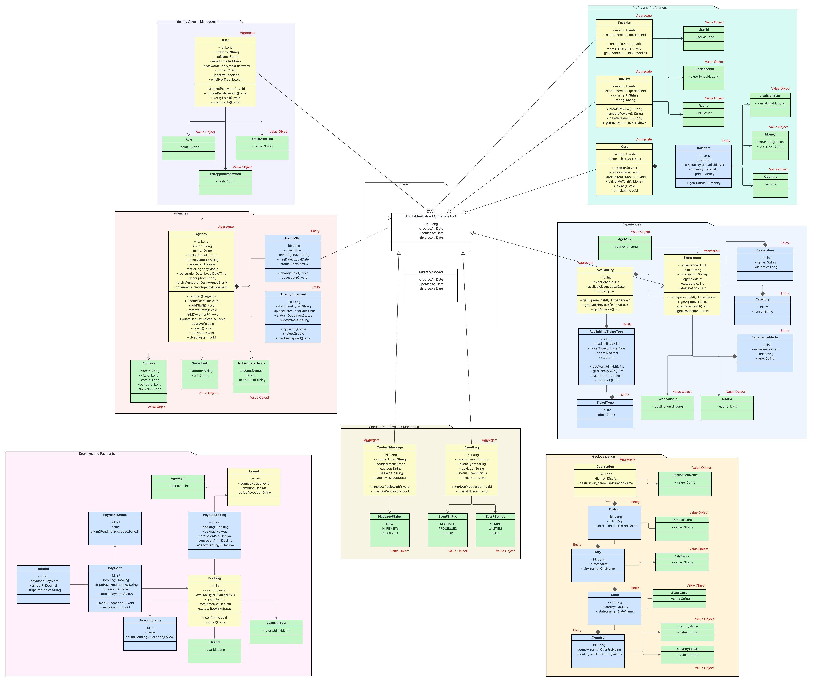
</p>

Enlace del diagrama de clases elaborado en Lucidchart: https://lucid.app/lucidchart/5c82ad83-e062-47f4-8289-d3979877fb1e/edit?invitationId=inv_38e8006a-95da-4b3f-86b2-2d30cfb7cd0b

#### 4.7.2. Class Dictionary

| **Clase** | **Nombre de atributo** | **Descripción** | **Tipo de dato**
|:---------:|:----------------------:|:---------------:|:----------------:|
| Usuario | id | Identificador único | String |
| Usuario | nombre | Nombre de usuario | String |
| Usuario | email | Correo electrónicio del usuario | String |
| Usuario | contrasenia | Contraseña encriptada | String |
| Usuario | telefono | Contacto opcional | String |
| Turista | nacionalidad | País de origen | String |
| Turista | pasaporte | Número de documento | String |
| ViajeroCorporativo | empresa | Nombre de la compañía | String |
| ViajeroCorporativo | ruc | Identificador fiscal | String |
| AgenciaTurismo | ruc | Identificador fiscal | String |
| AgenciaTurismo | direccionLegal | Domicilio registrado | String |
| AgenciaTurismo | licenciaTuristica | Número de autorización | String |
| Reserva | fechaCreacion | Fecha de registro | Date |
| Reserva | fechaServicio | Fecha agendada | Date |
| Reserva | estado | El estado de la reserva (Pendiente/Confirmada/Cancelada) | ENUM |
| Reserva | montoTotal | Precio final | Float |
| Pago | metodo | El método de pago usado en la reserva (Tarjeta/Transferencia/Efectivo) | ENUM |
| Pago | monto | Valor pagado | Float |
| Pago | fecha | Fecha de realización del pago | Date |
| Pago | estado | Estado del pago (Pendiente/Confirmado/Denegado) | ENUM |
| Disponibilidad | fechaInicio | Fecha del inicio del rango disponible | Date |
| Disponibilidad | fechaFin | Fecha del fin del rango disponible | Date |
| Disponibilidad | cuposDisponibles | Cantidad restante de cupos | Int |
| ServicioTuristico | nombre | Título del servicio | String |
| ServicioTuristico | descripcion | Descripción concisa del servicio | String |
| ServicioTuristico | precioBase | Precio del servicio | Float |
| Ubicacion | direccion | Ubicación exacta | String |
| Ubicacion | coordenadas | Latitud/Longitud | String |
| Notificacion | fecha | Fecha de generación de la notificación | Date |
| Notificacion | contenido | Texto personalizado | String |
| Notificacion | canal | Medio en el que se envían las notificaciones (Email/SMS) | ENUM |
| Notificacion | estado | Estado de la notificación (Enviada, Pendiente, Fallida) | ENUM |
| PlantillaNotificacion | asunto | Línea de asunto | String |
| PlantillaNotificacion | cuerpo | Texto base con placeholders | String |
| PlantillaNotificacion | tipo | Tipo de notificación enviada (Mantenimiento, Noticias) | ENUM |

### 4.8. Database Design

El diseño de base de datos es fundamental para estructurar y almacenar todos los datos a utilizar en el proyecto. Su propósito principal es el de organizar los datos de forma lógica y cohesiva, permitiendo el recuperar, modificar o borrar según las acciones de los usuarios.

#### 4.8.1. Database Diagram

<p align="center">
    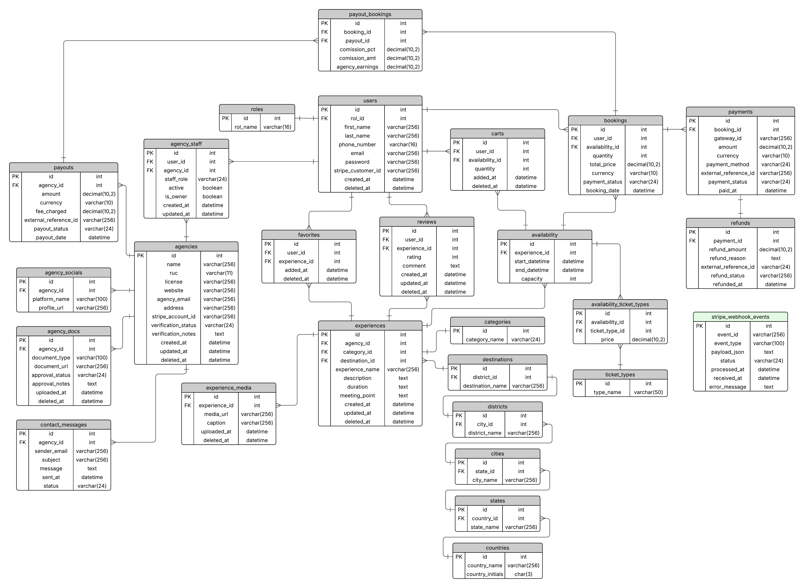
</p>

Enlace del diagrama elaborado en Lucidchart: 
https://lucid.app/lucidchart/6497903f-9318-4fee-af17-767b96f4ed6d/edit?viewport_loc=-1038%2C173%2C4955%2C1796%2C0_0&invitationId=inv_65a78cce-432f-486d-aaa1-6ab80aae3a48

<hr>

## Capítulo V: Product Implementation, Validation & Deployment

### 5.1. Software Configuration Management.

Para asegurar la consistencia, trazabilidad y calidad del producto digital TravelMatch durante todo su ciclo de vida, el equipo ha definido una estrategia de gestión de configuración de software. Esta estrategia cubre la configuración del entorno de desarrollo, la gestión del código fuente, las convenciones de codificación y la configuración del despliegue de los productos. El enfoque está alineado con buenas prácticas de ingeniería de software y metodologías ágiles.

#### 5.1.1. Software Development Environment Configuration.

| Categoría | Herramienta | Propósito | Tipo de acceso/enlace |
|:----:|:----:|:----:|:----:|
| Project Management | Trello | Gestión del backlog y tareas del equipo mediante tableros Scrum. | https://trello.com |
| Requirements Management | UXPressia | Creación y documentación de User Personas y customer journeys. | https://uxpressia.com |
| Product UX/UI Design | Figma | Creación de wireframes y mockups de la interfaz de usuario. | https://figma.com |
| Modelado de Software | Visual Paradigm | Modelado de arquitectura de software: diagramas de contexto, Bounded Contexts, etc. | https://visual-paradigm.com |
| Frontend Development | Visual Studio Code | Editor de código para el desarrollo del Landing Page y Frontend (Angular). | https://code.visualstudio.com |
| Backend Development | IntelliJ IDEA | Entorno de desarrollo para el backend en Java con Spring Boot. | https://www.jetbrains.com/idea/ |
| Version Control | GitHub | Repositorio de control de versiones para todos los productos digitales. | https://github.com |
| Software Documentation | Markdown | Redacción de documentación técnica del proyecto. | Compatible con GitHub / editores de texto |

#### 5.1.2. Source Code Management

El equipo de TravelMatch utiliza Git como sistema de control de versiones y GitHub como plataforma de alojamiento y colaboración en el desarrollo de los distintos productos digitales que conforman la solución. Esta estrategia garantiza un seguimiento efectivo de los cambios realizados en el código fuente, la colaboración entre miembros del equipo, y la trazabilidad de las decisiones tomadas durante el ciclo de desarrollo.

Los repositorios utilizados para el desarrollo de código fuente son los siguientes:

<div align="center">

| Producto Digital | URL del Repositorio | 
|:----------------:|:-------------------:|
| Landing Page | [https://github.com/G2-Aplicaciones-Open-Source/landing-page-v2](https://github.com/G2-Aplicaciones-Open-Source/landing-page-v2) | 
| Web Services (Backend API) | [https://github.com/G2-Aplicaciones-Open-Source/backend-java](https://github.com/G2-Aplicaciones-Open-Source/backend-java)|
| Frontend Web Application | [https://github.com/G2-Aplicaciones-Open-Source/frontend-angular](https://github.com/G2-Aplicaciones-Open-Source/frontend-angular) |

</div>

**Modelos de Ramificación**

El equipo ha optado por utilizar distintos modelos de ramificación según el tipo de repositorio, con el fin de adecuarse a las necesidades específicas de colaboración y control de versiones:

- **Repositorio de Documentación General del Proyecto (docs):**

    Para el repositorio de documentación (README.md y secciones del informe final), se ha adoptado GitHub Flow. Este modelo de trabajo, orientado a la integración continua y simplicidad, ha permitido:

    - Crear ramas individuales por capítulo y responsable.
    - Realizar pull requests para revisión antes de integrar contenido a la rama principal.
    - Discutir mejoras u observaciones mediante comentarios en los commits y PRs.
    - Mantener una integración progresiva, ordenada y sin conflictos.
    - **Convención de nombres de ramas:**  `cap[numero]` (por ejemplo, `cap4`), lo que facilita la identificación de la sección correspondiente.  
    - **Mensajes de commits:**  Se sigue la especificación de **Conventional Commits**, lo que asegura claridad en el historial y facilita la generación automática de changelogs.

- **Repositorios con Código Fuente (Landing Page, Frontend, Backend):**

    Para estos repositorios se implementará GitFlow, un modelo de ramificación más estructurado, el cual permite separar de manera clara las etapas de desarrollo, pruebas, liberación y mantenimiento. La elección de GitFlow responde a que GitHub Flow depende en gran medida de pruebas automatizadas para validar los cambios antes de integrarlos a la rama principal, y como en este curso no se contempla la integración continua ni un pipeline de testing automatizado, GitFlow resulta más adecuado para mantener la estabilidad del código sin depender de estas herramientas externas.

    **La estructura de ramas en GitFlow será:**

    - _Main_: Contiene el código en estado estable y listo para producción.
    - _Develop_: Rama de integración para desarrollo activo.
    - _Feature branches_: Para nuevas funcionalidades.
        - Convención: `feature/nombre-descriptivo`  
        - Ejemplo: `feature/US007-business-profiles`
    - _Release branches_: Para preparar versiones antes de pasar a producción.
        - Convención: `release/X.Y.Z`  
        - Ejemplo: `release/1.0.0`
    - _Hotfix branches_: Para correcciones urgentes.
        - Convención: `hotfix/X.Y.Z`  
        - Ejemplo: `hotfix/1.0.1`        

    **Versionado Semántico (Semantic Versioning)**

    - Se utiliza Semantic Versioning 2.0.0, con el esquema MAJOR.MINOR.PATCH:

        - **MAJOR:** Cambios incompatibles.
        - **MINOR:** Funcionalidades nuevas retrocompatibles.
        - **PATCH:** Correcciones retrocompatibles.

        **Ejemplos de versiones:**  
        `v1.0.0`, `v1.1.0`, `v1.1.1`.
    
    **Convenciones para Commits**

    El equipo sigue el estándar de Conventional Commits para los mensajes de commits, lo que permite claridad en el historial y facilita la generación automática de changelogs:

    `<type>[optional scope]: <description>`

    Tipos comunes:

    - `feat`: Nueva funcionalidad.
    - `fix`: Corrección de errores.
    - `docs`: Cambios en documentación.
    - `style`: Cambios de formato sin impacto funcional.
    - `refactor`: Reestructuración del código.
    - `test`: Relacionados con pruebas.
    - `chore`: Tareas de mantenimiento.

    Ejemplo:
    ```plaintext
    feat(auth): implement login via OAuth
    fix(api): handle null user tokens

#### 5.1.3. Source Code Style Guide & Conventions
El equipo ha adoptado guías de estilo y convenciones de codificación para cada uno de los lenguajes utilizados. Estas convenciones permiten que todos los miembros del equipo desarrollen bajo un estándar común y que el código sea comprensible tanto para desarrolladores actuales como futuros.

**Nomenclatura general:**

- Todos los identificadores, comentarios y documentación del código se escribirán en inglés.
- Se utilizará el sistema de control de calidad en revisiones por pull request para verificar que las convenciones se cumplan antes de fusionar el código a la rama `develop`.

---

**Backend: Java con Spring Boot**

Para el desarrollo de los servicios web de TravelMatch, se utilizará **Java 17** junto con el framework **Spring Boot**. Se adoptan las siguientes convenciones:

- **Guía de estilo base:**  
  [Google Java Style Guide](https://google.github.io/styleguide/javaguide.html)

- **Estructura de paquetes basada en Domain-Driven Design (DDD):**  
  - `com.travelmatch.domain`  
  - `com.travelmatch.application`  
  - `com.travelmatch.infrastructure`  
  - `com.travelmatch.api`  

- **Nomenclatura:**  
  - Clases nombradas en **CamelCase**:  
    Ejemplo: `TravelExperienceService`, `UserProfileRepository`  
  - Métodos y variables en **lowerCamelCase**:  
    Ejemplo: `findAllExperiences()`, `userEmail`  

- **Documentación:**  
  - Uso obligatorio de **Javadoc** para describir métodos y clases públicas.

- **Separación lógica del código:**  
  - Cada capa debe tener responsabilidades claras:  
    - Controladores (`@RestController`)  
    - Servicios (`@Service`)  
    - Repositorios (`@Repository`)  
    - Modelos  

- **Anotaciones de Spring:**  
  - Uso de anotaciones como `@RestController`, `@Service`, `@Repository` para reforzar la estructura y mantener la claridad del código.

---

**Frontend: Angular Framework (TypeScript, HTML, CSS)**

Para el desarrollo del frontend, el equipo utilizará **Angular 19**, basado en **TypeScript**, junto con **HTML** y **CSS**. Las convenciones son:

- **Guías de estilo base:**  
  - [Angular Style Guide (Oficial)](https://angular.io/guide/styleguide)  
  - [Google TypeScript Style Guide](https://google.github.io/styleguide/tsguide.html)

- **Estructura modular y escalable:**  
  - Cada componente, servicio o módulo tendrá su propio directorio.

- **Nomenclatura de archivos:**  
  - Archivos nombrados con **kebab-case**:  
    - Componentes: `featured-experience.component.ts`  
    - Servicios: `auth.service.ts`  
    - HTML y CSS asociados seguirán el mismo nombre base.

- **Nomenclatura de clases y componentes:**  
  - Componentes y clases en **UpperCamelCase**:  
    Ejemplo: `FeaturedExperienceComponent`, `AuthService`, `UserModel`  
  - Variables, métodos y propiedades en **lowerCamelCase**.

- **Modelos de datos:**  
  - Uso de **interfaces** para definir modelos de datos (e.g., `User`, `Experience`, `Agency`) y asegurar tipado fuerte.

- **HTML:**  
  - Buenas prácticas semánticas y accesibles:  
    Uso de etiquetas apropiadas (`<main>`, `<section>`, `<button>`, etc.).

- **CSS:**  
  - Convenciones basadas en el [Google HTML/CSS Style Guide](https://google.github.io/styleguide/htmlcssguide.html):  
    - Nombres de clase descriptivos en inglés:  
      Ejemplo: `.experience-card`, `.agency-header`  
    - Agrupación por tipo de selector.  
    - Estilos reutilizables mediante clases utilitarias.

#### 5.1.4. Software Deployment Configuration
La configuración de despliegue para TravelMatch contempla mecanismos organizados para publicar correctamente cada uno de los productos digitales del sistema: **Landing Page**, **Web Services (Backend)** y **Frontend Web Application**. Esta configuración garantiza que el equipo pueda replicar y mantener el proceso de despliegue con consistencia y trazabilidad.

---

**Despliegue del Landing Page**

- **Tecnología:**  
  HTML5, CSS3, JavaScript (Vanilla), diseño responsivo.

- **Repositorio GitHub:**  
  [https://github.com/G2-Aplicaciones-Open-Source/landing-page](https://github.com/G2-Aplicaciones-Open-Source/landing-page)

- **Plataforma de despliegue:**  
  GitHub Pages

- **Método de despliegue:**  
  - La rama `main` contiene la versión estable y publicada del sitio.  
  - El contenido del directorio raíz se mantiene como fuente para GitHub Pages.  
  - Los cambios aprobados en `develop` son fusionados a `main` mediante pull request.  
  - GitHub Pages actualiza automáticamente la publicación al detectar cambios en `main`.

---

**Despliegue del Backend (Web Services)**

- **Tecnología:**  
  Java 17 + Spring Boot.

- **Repositorio GitHub:**  
  [https://github.com/G2-Aplicaciones-Open-Source/backend-java](https://github.com/G2-Aplicaciones-Open-Source/backend-java)

- **Plataforma de despliegue:**  
  Render o Railway (por definir).

- **Método de despliegue:**  
  - El backend se empaqueta como un archivo `.jar` con Gradle o Maven.  
  - Se configura un pipeline de despliegue automático o manual desde el repositorio hacia el servicio en la nube.  
  - Las variables de entorno (como credenciales de base de datos) se almacenan de forma segura en la plataforma de hosting.  
  - El servicio se expone mediante una URL pública que el frontend puede consumir vía HTTP/REST.

---

**Despliegue del Frontend Web Application**

- **Tecnología:**  
  Angular 19 (TypeScript, HTML, SCSS/CSS).

- **Repositorio GitHub:**  
  [https://github.com/G2-Aplicaciones-Open-Source/frontend-angular](https://github.com/G2-Aplicaciones-Open-Source/frontend-angular) 

- **Plataforma de despliegue:**  
  Vercel o Netlify (por definir).

- **Método de despliegue:**  
  - Angular se compila con `ng build --prod` para generar los archivos estáticos de producción.  
  - La rama `main` sirve como fuente para el despliegue.  
  - La plataforma detecta cambios en `main` y publica automáticamente la nueva versión del frontend.  
  - El archivo `environment.ts` de producción incluirá la URL pública del backend para permitir integración total.

---

**Consideraciones Finales**

- Se documentará el procedimiento de despliegue paso a paso en la wiki del repositorio principal.  
- Los entornos de desarrollo y producción estarán claramente separados mediante archivos de configuración.  
- Se establecerán pruebas manuales básicas post-despliegue para verificar la disponibilidad y funcionalidad de los servicios.  
- Si el tiempo lo permite, se evaluará la incorporación de **GitHub Actions** para automatizar los flujos de despliegue continuo (CI/CD).

### 5.2. Landing Page, Services & Applications Implementation

#### 5.2.1. Sprint 1

##### 5.2.1.1. Sprint Planning 1

En este primer sprint, el equipo se reunió para planificar el alcance del desarrollo inicial del proyecto. El objetivo principal es establecer las bases para una aplicación efectiva y bien estructurada, comenzando con la creación de una página de aterrizaje (landing page) que sirva como el primer punto de contacto con los usuarios. Este enfoque permitirá validar las ideas iniciales del producto, medir el interés del público objetivo y generar una presencia digital sólida desde las primeras etapas del proyecto.

|**Sprint #**|Sprint 1|
| :- | :- |
|**Date**|2025-04-23|
|**Time**|1:30 PM|
|**Location**|Virtual - Meet|
|**Prepared By**|Jhon Galvez|
|**Attendees (to planning meeting)**|Jhon Galvez, Mathias Aspajo, Farid Briceño, Jorge Guevara, Cesar Linares|
|**Sprint n - 1 Review Summary**|Este es el primer Sprint, por lo que este campo no aplica|
|**Sprint n - 1 Retrospective Summary**|Este es el primer Sprint, por lo que este campo no aplica|
|**Sprint 1 Goal**|En este sprint, nos enfocaremos en desarrollar la landing page de nuestra aplicación, ya que consideramos que será clave para ofrecer una presentación atractiva y efectiva del producto a los potenciales usuarios. Evaluaremos el éxito de esta implementación cuando el número de visitas a la página alcance un umbral previamente establecido.|
|**Sprint 1 Velocity**|Nuestro equipo puede aceptar hasta 35 story points|
|**Sum of Story Points**|La suma de Story Points atendidos es de 32 story points|

##### 5.2.1.2. Aspect Leaders and Collaborators

En el Sprint 1 se definieron los siguientes aspectos clave para la implementación del Landing Page:

1. **UI/UX Design**  
2. **Maquetación HTML/CSS**  
3. **Desarrollo JavaScript**  
4. **Documentación de Servicios**  
5. **Despliegue**  

A continuación la matriz de Liderazgo y Colaboración (LACX), donde “L” indica el líder de cada aspecto y “C” a sus colaboradores:

| **Team Member (Last Name, First Name)** | **GitHub Username** | **UI/UX Design** | **Maquetación HTML/CSS** | **Desarrollo JavaScript** | **Documentación de Servicios** | **Despliegue** |
|-----------------------------------------|---------------------|:----------------:|:------------------------:|:-------------------------:|:------------------------------:|:--------------:|
| Aspajo Alvarez, Mathias        | AdeXzz             | C                | L                        | C                         | C                              | C              |
| Galvez Chambi, Jhon                  | Chaomeum           | C                | C                        | L                         | C                              | C              |
| Guevara Tejada, Jorge           | Jorgito170              | C                | C                        | C                         | L                              | C              |
| Linares Bernable, Cesar           | Cesar-Linares          | L                | C                        | C                         | C                              | L              |
|


##### 5.2.1.3. Sprint Backlog 1

El Sprint Backlog 1 representa la lista de tareas y elementos de trabajo priorizados para la primera iteración del proyecto. En esta fase inicial, el enfoque principal es construir los componentes esenciales de la página de inicio, asegurar una experiencia de usuario fluida y establecer una base sólida para las futuras iteraciones. El objetivo es crear una landing page atractiva y funcional que permita a los usuarios registrarse, conocer la misión de la startup y navegar de manera intuitiva, mientras se incorporan funcionalidades críticas como formularios de contacto y optimización para dispositivos móviles.

Enlace del board donde se trabajo el Sprint Backlog #1: https://trello.com/invite/b/6838d8b7029ba5c316ca24aa/ATTI952051c0dd3aa65a5c203ecc4c9c04ccB68B8104/travelmatch-sprint-1


<p align="center">
    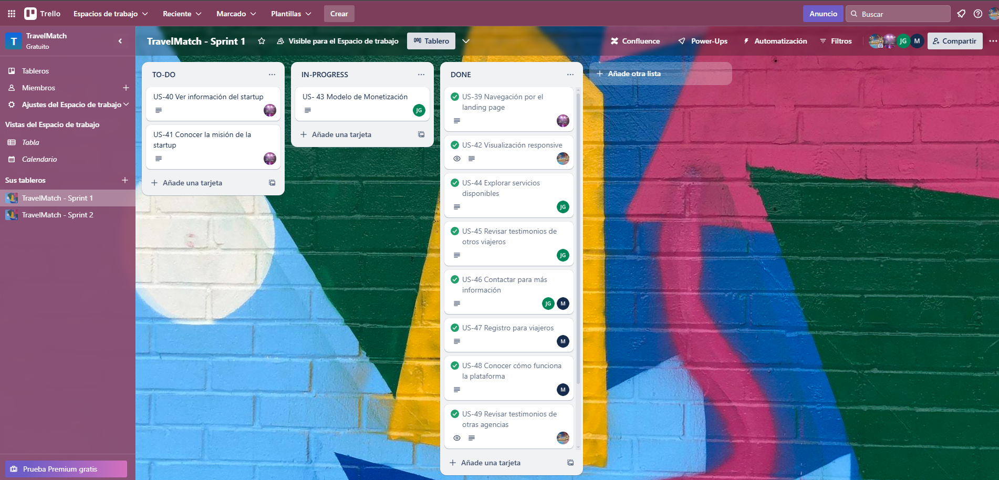
</p>


| Sprint #       | Sprint 1                              |                    |                                    |                                                               |                     |                 |            |
| -------------- | ------------------------------------- | ------------------ | ---------------------------------- | ------------------------------------------------------------- | ------------------- | --------------- | ---------- |
| **User Story** |                                       | **Work-Item/task** |                                    |                                                               |                     |                 |            |
| **ID**         | **Title**                             | **Id**             | **Title**                          | **Description**                                               | **Estimation(Hrs)** | **Assigned To** | **Status** |
| US-39          | Navegación por el landing page        | T39-1              | Implementar navegación anclada     | Programar redirección a secciones por ítems del menú          | 1                   | Linares Bernable, Cesar            | Done       |
| US-39          | Navegación por el landing page        | T39-2              | Adaptar menú móvil                 | Implementar menú hamburguesa y desplegable en móviles         | 1                   | Linares Bernable, Cesar            | Done       |
| US-40          | Ver información del startup           | T40-1              | Diseñar layout del equipo          | Crear diseño para sección "Nuestro equipo"                    | 0.5                 | Linares Bernable, Cesar            | To-do       |
| US-40          | Ver información del startup           | T40-2              | Mostrar perfiles                   | Mostrar nombre y rol por cada miembro del equipo              | 0.5                 | Linares Bernable, Cesar            | To-do       |
| US-40          | Ver información del startup           | T40-3              | Mostrar avatar por defecto         | Mostrar imagen por defecto si no hay foto disponible          | 0.5                 | Linares Bernable, Cesar            | To-do       |
| US-41          | Conocer la misión de la startup       | T41-1              | Redactar valores clave             | Redactar 3 valores clave en sección misión                    | 0.5                 | Linares Bernable, Cesar            | To-do       |
| US-41          | Conocer la misión de la startup       | T41-2              | Adaptar contenido a móvil          | Asegurar visualización adaptativa en pantallas pequeñas       | 0.5                 | Linares Bernable, Cesar            | To-do       |
| US-42          | Visualización responsive              | T42-1              | Reorganizar contenido en rotación  | Usar media queries para reordenar contenido al rotar pantalla | 1                   | Guevara Tejada, Jorge            | Done       |
| US-42          | Visualización responsive              | T42-2              | Ajustar botones táctiles           | Ampliar botones y mejorar su disposición en tablets           | 0.5                 | Guevara Tejada, Jorge            | Done       |
| US-43          | Modelo de Monetización                | T43-1              | Mostrar calculadora de comisiones  | Implementar calculadora interactiva de comisiones             | 1.5                 | Galvez Chambi, Jhon            | In-Progress       |
| US-43          | Modelo de Monetización                | T43-2              | Comparativa de planes              | Mostrar tabla comparativa de features/costos para agencias    | 1                   | Galvez Chambi, Jhon            | In-Progress       |
| US-44          | Explorar servicios disponibles        | T44-1              | Crear sección de servicios         | Diseñar e implementar sección de servicios para viajeros      | 0.5                 | Galvez Chambi, Jhon            | Done       |
| US-44          | Explorar servicios disponibles        | T44-2              | Mostrar categorías principales     | Mostrar lista de categorías con íconos o etiquetas            | 0.5                 | Galvez Chambi, Jhon            | Done       |
| US-45          | Revisar testimonios de otros viajeros | T45-1              | Implementar sección de testimonios | Mostrar al menos 5 testimonios con nombre y puntaje           | 1                   | Galvez Chambi, Jhon            | Done       |
| US-46          | Contactar para más información        | T46-1              | Crear formulario de contacto       | Crear formulario con campos básicos y botón de envío          | 0.5                 | Galvez Chambi, Jhon            | Done       |
| US-46          | Contactar para más información        | T46-2              | Implementar notificación           | Mostrar confirmación tras enviar el mensaje                   | 0.5                 | Aspajo Alvarez, Mathias            | Done       |
| US-47          | Registro para viajeros                | T47-1              | Agregar botón de registro          | Añadir botón visible "Registrarse" en el landing              | 0.5                 | Aspajo Alvarez, Mathias            | Done       |
| US-47          | Registro para viajeros                | T47-2              | Redireccionar a formulario         | Programar redirección al formulario de registro               | 0.5                 | Aspajo Alvarez, Mathias            | Done       |
| US-48          | Conocer cómo funciona la plataforma   | T48-1              | Crear sección "Cómo funciona"      | Redactar y estructurar pasos claros para agencias             | 1                   | Aspajo Alvarez, Mathias            | Done       |
| US-49          | Revisar testimonios de otras agencias | T49-1              | Agregar testimonios de agencias    | Mostrar al menos 3 testimonios de agencias con comentarios    | 1                   | Guevara Tejada, Jorge            | Done       |
| US-50          | Cambiar vista a viajeros              | T50-1              | Implementar botón “Para Viajeros”  | Agregar botón visible en vista agencia                        | 0.5                 | Guevara Tejada, Jorge            | Done       |
| US-50          | Cambiar vista a viajeros              | T50-2              | Redireccionar vista                | Redirigir correctamente al landing de viajeros                | 0.5                 | Guevara Tejada, Jorge            | Done       |
| US-51          | Registro para agencias | T51-1              | Agregar botón “Registrarse”         | Añadir botón visible en el landing para agencias         | 0.5                 | Guevara Tejada, Jorge            | Done       |
| US-51          | Registro para agencias | T51-2              | Redirigir al formulario de registro | Redireccionar al visitante al formulario correspondiente | 0.5                 | Guevara Tejada, Jorge            | Done       |


##### 5.2.1.4. Development Evidence for Sprint Review

En esta parte, mostramos el proceso que seguimos para diseñar y mantener actualizada la landing page.

|**Repository**|**Branch**|**Commit ID**|**Commit Message**|<p>**Commit Message**</p><p>` `**Body**</p>|**Commited on (Date)**|
| :- | :- | :- | :- | :- | :- |
|G2-Aplicaciones-Open-Source/Landing-Page|develop|a859949|feat: Implementación de contenido en las secciones de la landing page||23/04/2025|
|G2-Aplicaciones-Open-Source/Landing-Page|develop|645844c|feat: Implementación de navegación y redireccionamientos||23/04/2025|
|G2-Aplicaciones-Open-Source/Landing-Page|develop|5265378|feat: Mejora de responsividad y funcionalidades interactivas||23/04/2025|
|G2-Aplicaciones-Open-Source/Landing-Page|develop|7ab1366|feat: Implementación de las vistas para el registro e inicio de sesion||23/04/2025|

##### 5.2.1.5. Execution Evidence for Sprint Review

Durante el Sprint 1, se logró implementar completamente la página de aterrizaje (landing page) de la aplicación, cumpliendo con todos los criterios de aceptación definidos en las historias de usuario. El equipo desarrolló un sitio web funcional, atractivo y adaptable a diferentes dispositivos, incluyendo secciones clave como el registro e inicio de sesión, información del equipo y misión de la startup, formularios de contacto diferenciados para usuarios y agencias, así como una sección informativa sobre el modelo de monetización. Este entregable constituye un primer paso fundamental para validar el producto con usuarios reales y establecer una presencia sólida en línea.


Demo del Landing Page: [upc-pre-202510-1asi0729-4328-Pandora-landing-navigation-sprint-1](https://youtu.be/ijkidI-RlOQ)

**Evidencias visuales**

<p align="center">
    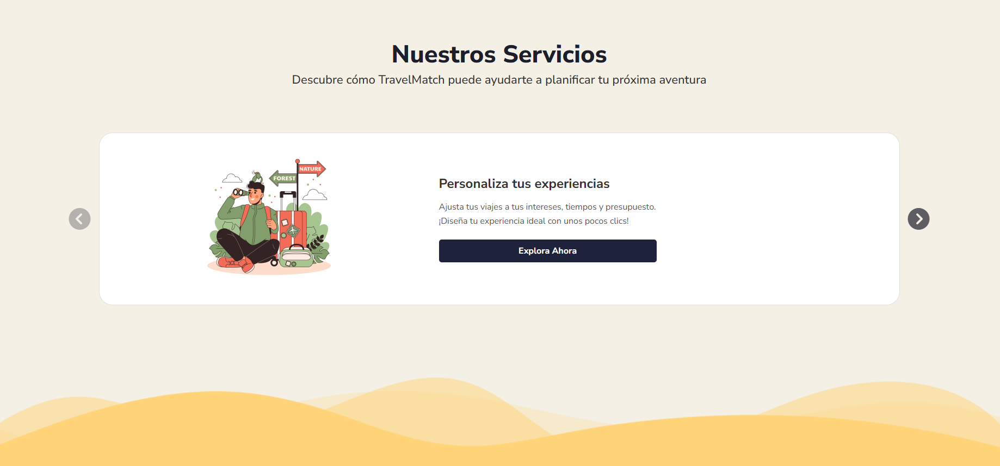    
</p>

<p align="center">
    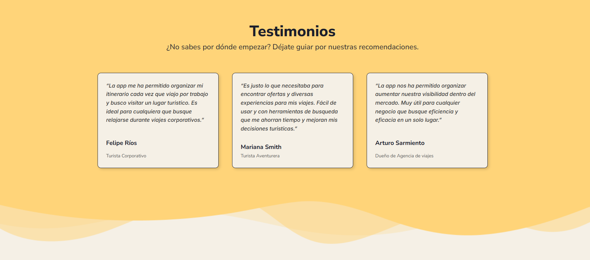    
</p>

<p align="center">
    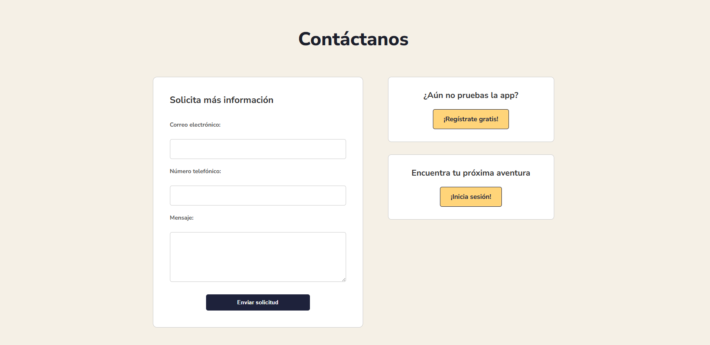    
</p>

<p align="center">
    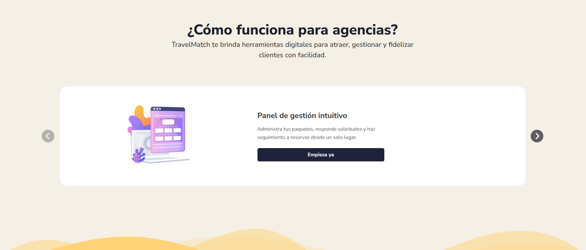    
</p>

<p align="center">
    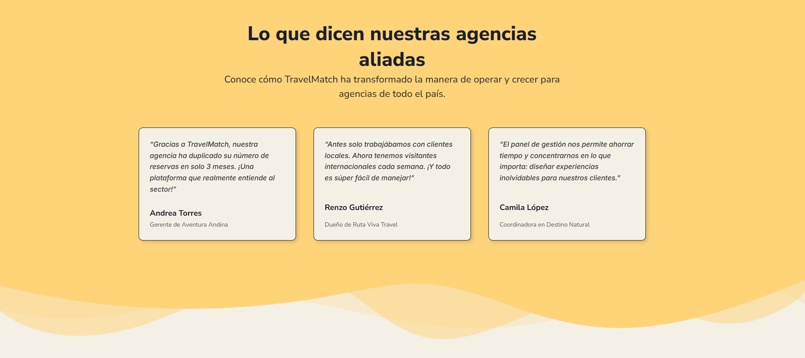    
</p>

<p align="center">
    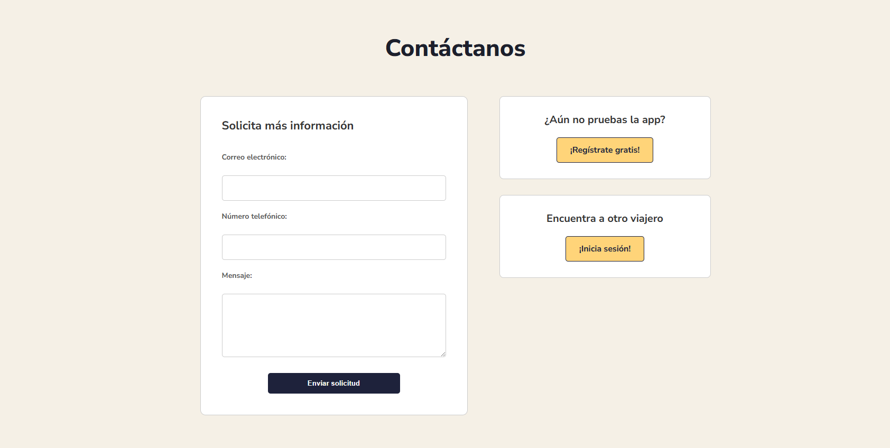    
</p>

##### 5.2.1.6. Services Documentation Evidence for Sprint Review

En este Sprint, el foco estuvo centrado exclusivamente en el desarrollo del frontend estático (Landing Page) del proyecto TravelMatch. Por esta razón, no se han trabajado endpoints ni funcionalidades relacionadas con servicios web o APIs RESTful.

La documentación de Web Services utilizando OpenAPI/Swagger será considerada en futuros Sprints, una vez que se inicie la implementación del backend del sistema.

##### 5.2.1.7. Software Deployment Evidence for Sprint Review

Durante este Sprint, se llevó a cabo el despliegue de la landing page del proyecto TravelMatch, como primer paso en la publicación progresiva de los productos del sistema. Esta actividad se enmarca dentro del objetivo de validar visualmente los avances de diseño e interacción con el cliente y equipo docente.

**Actividades Realizadas**

- Configuración del repositorio GitHub y estructura inicial de carpetas.
- Implementación de flujo de trabajo con Git Flow, manteniendo los cambios en la rama develop.
- Realización de un merge desde develop hacia la rama main, de acuerdo a las convenciones definidas en la sección 5.1.2.
- Activación de GitHub Pages como servicio de despliegue estático, apuntando al contenido de la rama main.
- Publicación exitosa de la landing page accesible a través de una URL pública.

**URL de la landing page desplegada:** https://g2-aplicaciones-open-source.github.io/landing-page-v2/

**Evidencias visuales**

- Configuración del repositorio GitHub y estructura inicial de carpetas.

    - Creamos un repositorio para la landing page dentro de la organizacion. La configuramos para que sea de tipo publico
    <p align="center">
        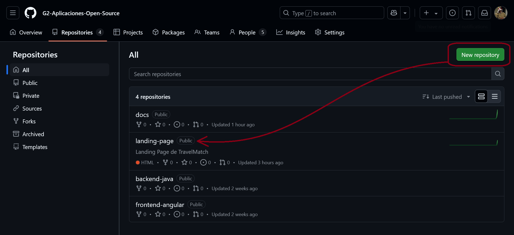
    </p>

    - Una vez dentro copiamos la direccion HTTPS del repositorio y la clonamos en nuestro entorno local con el comando `git clone`. Preparamos una estructura de carpetas similar a la siguiente en nuestra maquina:
    <p align="center">
        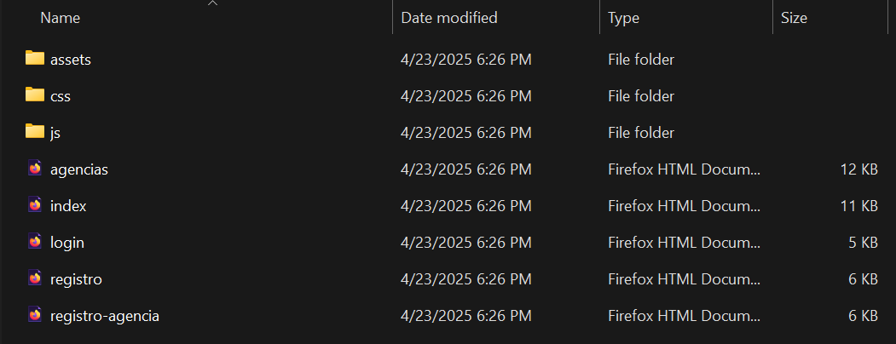
    </p>

- Implementación de flujo de trabajo con Git Flow, manteniendo los cambios en la rama `develop`.
    - Desde la consola, creamos un push inicial en la rama remota `main` usando el comando `git push origin main` con un mensaje commit descriptivo.
    <p align="center">
        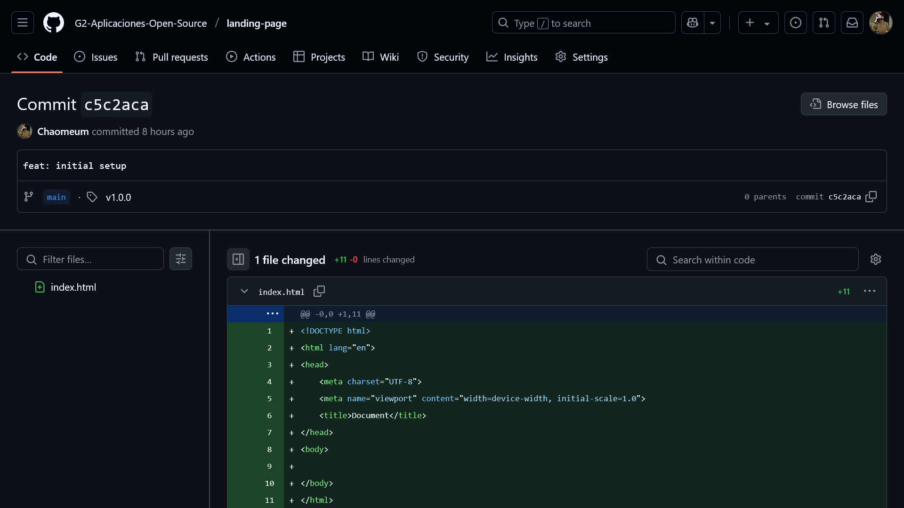
    </p>

    - El siguiente paso es crear la rama local `develop` usando el comando `git checkout -b develop`, la creamos de manera remota con `git push origin develop`. Las ramas `feature/*` se crearan de la misma forma, pero hay que tener en cuenta que siempre se deben crear a partir de la rama `develop`, por lo que un paso previo es asegurarnos que estamos en la rama correcta con `git checkout develop`. El resultado de este proceso es el siguiente:
    <p align="center">
        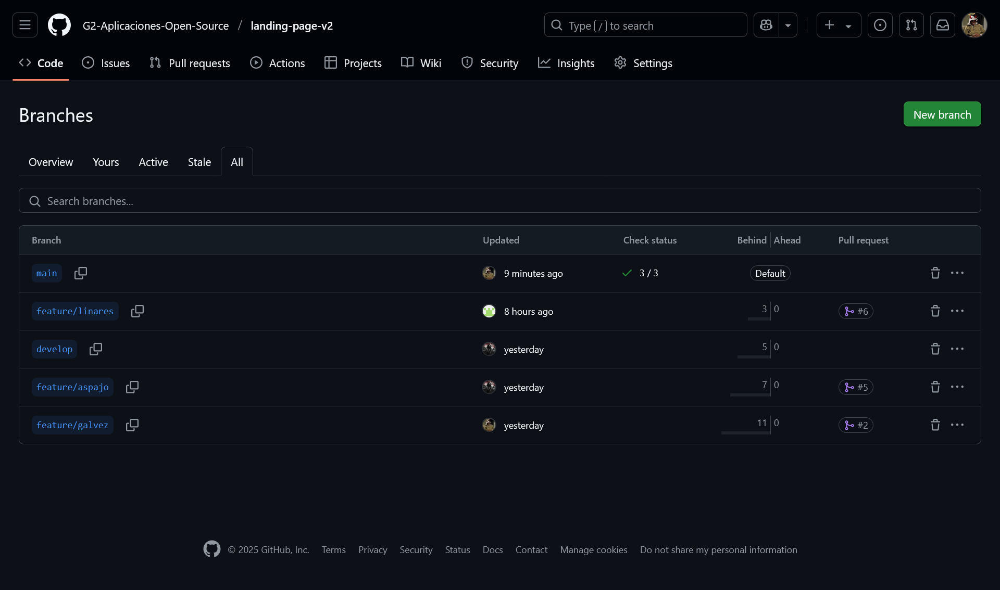
    </p>

- Realización de un merge desde develop hacia la rama main, de acuerdo a las convenciones definidas en la sección 5.1.2.
    - Antes de realizar el merge, se revisaron los cambios mediante un pull request en GitHub, asegurando que no existieran conflictos y que el código cumpliera con los estándares definidos.        
    - Se realizaron pruebas manuales usando la extension Live Server para verificar la funcionalidad de la landing page antes de fusionar los cambios.    

- Activación de GitHub Pages como servicio de despliegue estático, apuntando al contenido de la rama main.
    - En la configuración del repositorio, se seleccionó la rama `main` como fuente para GitHub Pages. Esto se realizó desde la pestaña "Settings" > "Pages" en GitHub.    
    - Se verificó que la URL generada por GitHub Pages estuviera activa y mostrara correctamente el contenido de la landing page.
    <p align="center">
        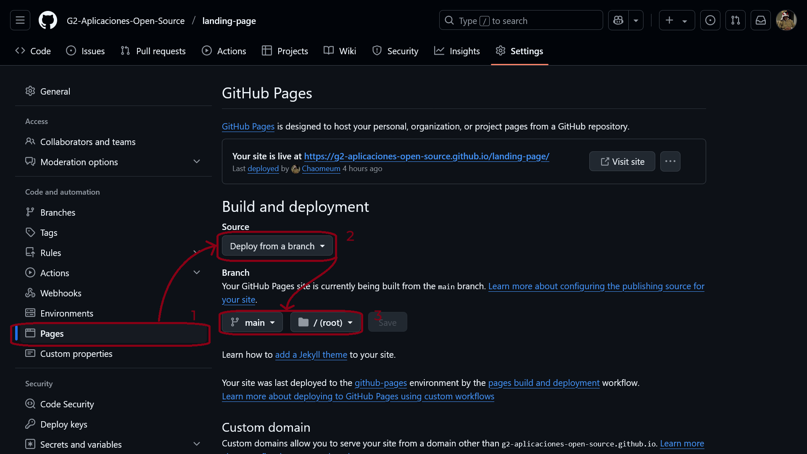
    </p>

- Publicación exitosa de la landing page accesible a través de una URL pública.

<p align="center">
    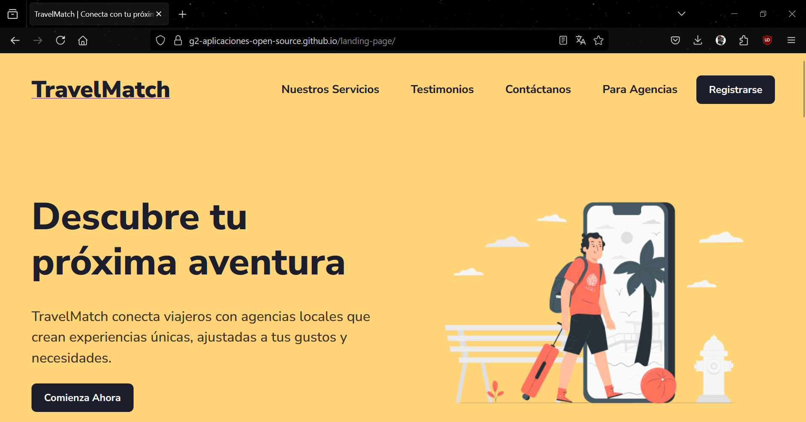    
</p>

<p align="center">
    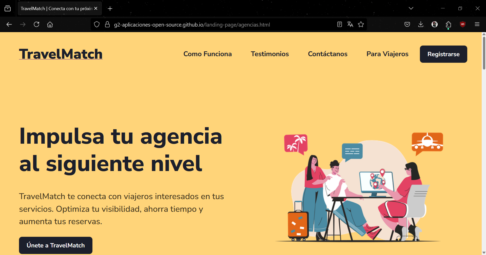    
</p>

<p align="center">
    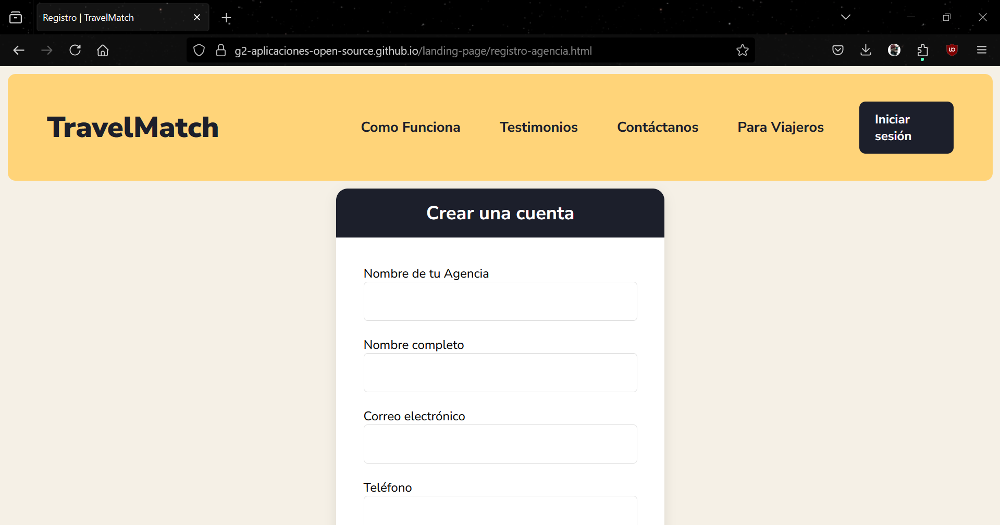    
</p>

<p align="center">
    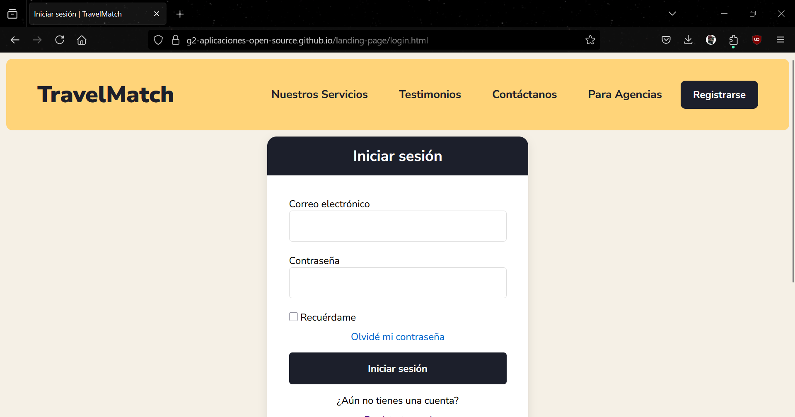    
</p>

##### 5.2.1.8. Team Collaboration Insights during Sprint

Durante este Sprint, el equipo colaboró activamente en el desarrollo de la landing page de TravelMatch, siguiendo las buenas prácticas de control de versiones con Git, estructuración del trabajo bajo el flujo Git Flow, y división de responsabilidades alineada con los roles de desarrollo y diseño definidos desde el inicio del proyecto.

**Estrategia de colaboración empleada:**

- Uso de ramas específicas (feature/, develop, main) para el desarrollo organizado de funcionalidades.

- Implementación de convenciones de commits mediante Conventional Commits, facilitando la trazabilidad.

- Pull requests revisadas por otros miembros antes de integrarse a develop.

- Reuniones cortas (dailys o check-ins semanales) para seguimiento y desbloqueo de tareas.

- Evidencia de avance por miembro:

    - Jhon Galvez: Commits relacionados a hojas de estilo, assets y index principal
    <p align="center">
        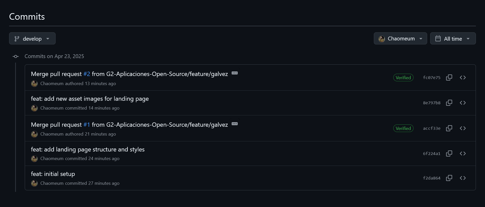    
    </p>

    - Mathias Aspajo: Commits relacionados a la vista del login y su hoja de estilo
    <p align="center">
        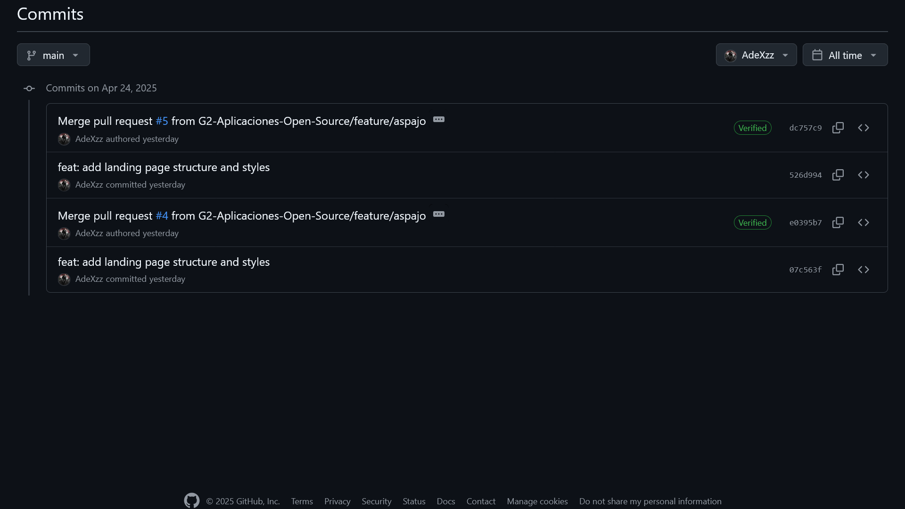    
    </p>

    - Jorge Guevara: Commits relacionados a las vistas de registro y su hoja de estilo
    <p align="center">
        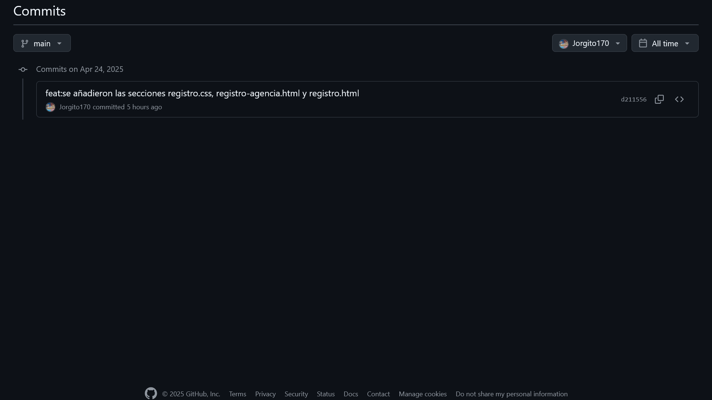    
    </p>

    - Cesar Linares: Commits relacionados a scripts de la pagina
    <p align="center">
        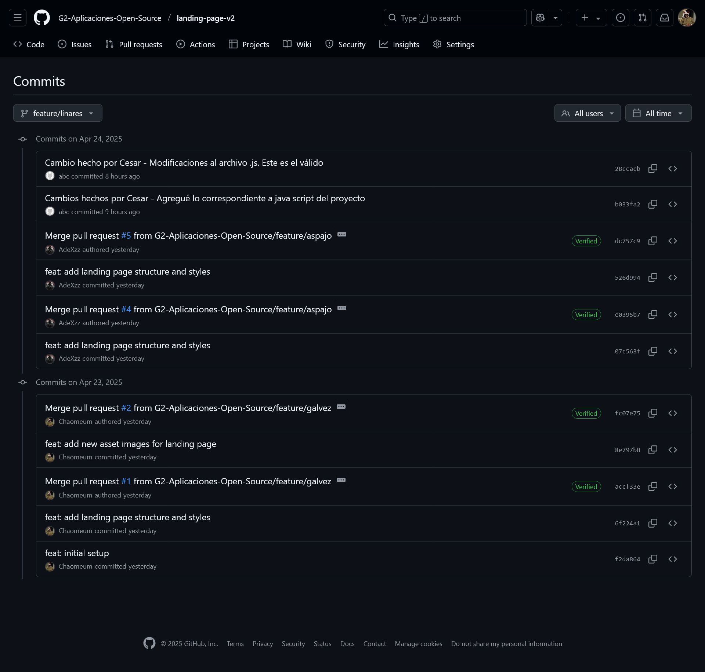    
    </p>   

    - Insights del repositorio
    <p align="center">
        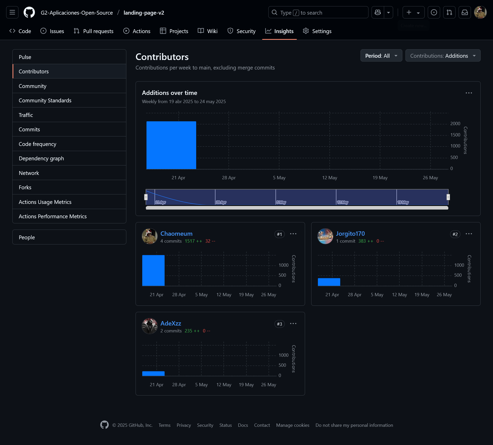    
    </p>  

<hr>

#### 5.2.2. Sprint 2

##### 5.2.2.1. Sprint Planning 2

Tras establecer la landing page en el Sprint 1, el Sprint Planning 2 se centró en la construcción y la implementación de la interfaz front-end de TravelMatch. El equipo priorizó la experiencia de usuario fluida e intuitiva, desarrollando funcionalidades clave como el inicio de sesión, el perfil corporativo, filtros avanzados, favoritos y vistas previas de tours, sentando así las bases visuales y funcionales de la aplicación.

<table>
  <tr>
    <th> Sprint # </th>
    <th> Sprint 2 </th>
  </tr>
  <tr>
    <td style="font-weight: bold;" colspan="2"> Sprint Planning Background </td>
  </tr>
  <tr>
    <td style="font-weight: bold;"> Date </td>
    <td> 12/05/2025 </td>
  </tr>
  <tr>
    <td style="font-weight: bold;"> Time </td>
    <td> 23:00 horas (GMT-5) </td>
  </tr>
  <tr>
    <td style="font-weight: bold;"> Location </td>
    <td> Virtual (Zoom) </td>
  </tr>
  <tr>
    <td style="font-weight: bold;"> Prepared By </td>
    <td> Galvez Chambi, Jhon </td>
  </tr>
  <tr>
    <td style="font-weight: bold;"> Attendees (to planning meeting) </td>
    <td>
      Aspajo Alvarez, Mathias<br>
      Briceño De La Cruz, Farid<br>
      Galvez Chambi, Jhon<br>
      Guevara Tejada, Jorge<br>
      Linares Bernable, Cesar
    </td>
  </tr>
  <tr>
    <td style="font-weight: bold;"> Sprint 2 Review Summary </td>
    <td> Durante este sprint, nos concentramos en la construcción del front-end y la implementación inicial de la plataforma TravelMatch. Logramos finalizar las funcionalidades esenciales de la landing page, brindando a los usuarios una primera experiencia de navegación y descubrimiento del servicio. El equipo alcanzó los objetivos de entrega dentro del cronograma establecido, consolidando además las bases de la interfaz gráfica para próximas iteraciones. </td>
  </tr>
  <tr>
    <td style="font-weight: bold;"> Sprint 2 Retrospective Summary </td>
    <td> Este sprint, aunque centrado en el desarrollo técnico, reveló oportunidades para optimizar nuestra dinámica colaborativa. El análisis retrospectivo destacó en optimizar la duración de las sincronizaciones diarias, rebalancear la asignación de tareas según especialidades e implementar planning individual con hitos verificables. Estas acciones buscan aumentar la eficiencia en próximas iteraciones. </td>
  </tr>
  <tr>
    <td style="font-weight: bold;" colspan="2"> Sprint Goal & User Stories </td>
  </tr>
  <tr>
    <td style="font-weight: bold;"> Sprint 2 Goal </td>
    <td> Este ciclo de desarrollo está focalizado en la construcción e implementación de la interfaz front-end para TravelMatch, con el propósito de ofrecer una experiencia de navegación fluida e intuitiva, presentar las funcionalidades clave de la plataforma y entregar una Landing Page operativa que comunique efectivamente el valor diferencial del servicio </td>
  </tr>
  <tr>
    <td style="font-weight: bold;"> Sprint 2 Velocity </td>
    <td> <strong>10 </strong><br> El equipo ha definido una capacidad de 10 Story Points para este sprint, basándose en la complejidad de las tareas de front-end, la disponibilidad real de horas y el aprendizaje de sprints anteriores </td>
  </tr>
  <tr>
    <td style="font-weight: bold;"> Sum of Story Points </td>
    <td> 10 </td>
  </tr>
</table>

##### 5.2.2.2. Aspect Leaders and Collaborators.

En el Sprint 2 se definieron los siguientes aspectos clave para la implementación del Landing Page:

1. **UI/UX Design**  
2. **Maquetación HTML/CSS**  
3. **Desarrollo TypeScript**  
4. **Documentación de Servicios**  
5. **Despliegue**  

A continuación la matriz de Liderazgo y Colaboración (LACX), donde “L” indica el líder de cada aspecto y “C” a sus colaboradores:

| **Team Member (Last Name, First Name)** | **GitHub Username** | **UI/UX Design** | **Maquetación HTML/CSS** | **Desarrollo JavaScript** | **Documentación de Servicios** | **Despliegue** |
|-----------------------------------------|---------------------|:----------------:|:------------------------:|:-------------------------:|:------------------------------:|:--------------:|
| Aspajo Alvarez, Mathias        | AdeXzz             | C                | L                        | C                         | C                              | C              	|
| Briceño De la Cruz, Farid	| InjustShin	| C			| C		| C			| C		 | C							|
| Galvez Chambi, Jhon                  | Chaomeum           | C                | C                        | L                         | C                              | L              |
| Guevara Tejada, Jorge           | Jorgito170              | C                | C                        | C                         | L                              | C              |
| Linares Bernable, Cesar           | Jorgito170          | L                | C                        | C                         | C                              | C             	|


##### 5.2.2.3. Sprint Backlog 2

El Sprint Backlog 2 se enfoca en la mejora continua del frontend tras el despliegue de la primera versión. En esta fase, se priorizan tareas para optimizar la experiencia del usuario, incorporar nuevas funcionalidades y refinar aspectos visuales y de rendimiento. El objetivo es consolidar las bases establecidas en el primer sprint, ajustando elementos clave en la interfaz, mejorando la navegación y añadiendo nuevas secciones para ofrecer una experiencia más completa y atractiva.

Enlace del board donde se trabajo el Sprint Backlog #2: https://trello.com/invite/b/6826db6e08d45246c899ed3d/ATTI962f63ff73675acf8c8c469dc078ac353023599A/travelmatch-sprint-2

<p align="center">
        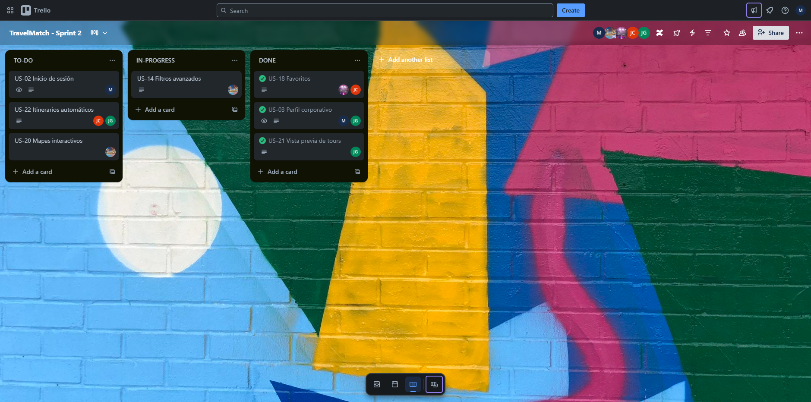
    </p>

|**Sprint #**|**Sprint 2**|||||||
| :- | :- | :- | :- | :- | :- | :- | :- |
|**User Story**||**Work-Item / Task**||||||
|**ID**|**Title**|**Id**|**Title**|**Description**|**Estimation (Hrs)**|**Assigned To**|**Status**|
|US-02|Inicio de sesión|T02-1|Diseñar y maquetar interfaz de login|Crear la interfaz visual de la pantalla de inicio de sesión con campos de usuario/contraseña.|0\.5|Aspajo Alvarez, Mathias|To-do|
|US-02|Inicio de sesión|T02-2|Implementar lógica de autenticación|Desarrollar la funcionalidad de validación de credenciales y generación de token de sesión.|0\.5|Aspajo Alvarez, Mathias|To-do|
|US-03|Perfil corporativo|T03-2|Diseñar y maquetar vista de perfil corporativo|Crear la interfaz para la visualización de la información de la empresa.|1|Galvez Chambi, Jhon|Done|
|US-03|Perfil corporativo|T03-2|Implementar edición de datos corporativos|Desarrollar la funcionalidad para que la empresa pueda actualizar su información de perfil.|1|Aspajo Alvarez, Mathias|Done|
|US-14|Filtros avanzados|T14-1|Diseñar componentes de filtro UI|Crear los elementos visuales (dropdowns, checkboxes) para los diferentes criterios de búsqueda avanzada.|1\.5|Guevara Tejada, Jorge|In-Progress|
|US-14|Filtros avanzados|T14-2|Implementar lógica de filtrado backend|Desarrollar la API y la lógica de base de datos para aplicar múltiples filtros a los resultados de búsqueda.|1\.5|Guevara Tejada, Jorge|In-Progress|
|US-18|Favoritos|T18-1|Implementar funcionalidad "Añadir a Favoritos"|Desarrollar la lógica para guardar ítems en una lista de favoritos del usuario.|1|Linares Bernable, Cesar|Done|
|US-18|Favoritos|T18-2|Mostrar lista de ítems favoritos|Crear la interfaz donde el usuario puede ver, organizar y eliminar sus elementos guardados como favoritos.|1|Briceño De La Cruz, Farid|Done|
|US-20|Mapas interactivos|T20-1|Implementar renderizado de mapas base|Configurar la visualización inicial de mapas con zoom y desplazamiento.|1|Guevara Tejada, Jorge|To-do|
|US-20|Mapas interactivos|T20-2|Añadir marcadores para puntos de interés|Desarrollar la funcionalidad para colocar pines interactivos en el mapa que representen lugares relevantes.|1|Guevara Tejada, Jorge|To-do|
|US-21|Vista previa de tours|T21-1|Desarrollar componente de vista previa de tours|Crear el módulo UI para mostrar un resumen atractivo de cada tour.|0\.5|Galvez Chambi, Jhon|Done|
|US-21|Vista previa de tours|T21-2|Implementar navegación a detalle del tour|Asegurar que al seleccionar la vista previa, se redirija a la página de detalles completos del tour.|0\.5|Galvez Chambi, Jhon|Done|
|US-22|Itinerarios automáticos|T22-1|Desarrollar algoritmo de generación de itinerarios|Implementar la lógica para crear rutas y actividades sugeridas basadas en preferencias del usuario.|1\.5|Briceño De La Cruz, Farid|To-do|
|US-22|Itinerarios automáticos|T22-2|Integrar con API de mapas para visualización|Conectar el algoritmo con un servicio de mapas para mostrar los itinerarios de forma visual.|1\.5|Galvez Chambi, Jhon|To-do|

##### 5.2.2.4. Development Evidence for Sprint Review

En esta parte, mostramos el proceso que seguimos para diseñar y mantener actualizada nuestro Frontend.

|**Repository**|**Branch**|**Commit ID**|**Commit Message**|<p>**Commit Message**</p><p>` `**Body**</p>|**Commited on (Date)**|
| :- | :- | :- | :- | :- | :- |
|G2-Aplicaciones-Open-Source/frontend-angular|develop|33ff4ac|feat: add configuration for routes, navbar component, and language switcher||15/05/2025|
|G2-Aplicaciones-Open-Source/frontend-angular|develop|9194e1d|feat: add home component view, public components and language switcher|15/05/2025|
|G2-Aplicaciones-Open-Source/frontend-angular|develop|312c4dd|feat: add favorite service functionalities|15/05/2025|
|G2-Aplicaciones-Open-Source/frontend-angular|develop|0f39be0|feat: add cart component|15/05/2025|
|G2-Aplicaciones-Open-Source/frontend-angular|develop|0fd285d|feat: demo version for profile component|15/05/2025|
|G2-Aplicaciones-Open-Source/frontend-angular|develop|5f4f9e1|feat: add faves component|15/05/2025|
|G2-Aplicaciones-Open-Source/frontend-angular|develop|58df3a5|feat: add i18n assets, components translation and production env setup|15/05/2025|

##### 5.2.2.5. Execution Evidence for Sprint Review

Durante el Sprint 2, el equipo de desarrollo de TravelMatch se centró en la construcción e implementación del front-end, logrando avances significativos en la interfaz de usuario. Se completaron funcionalidades clave que enriquecen la interacción del usuario con la plataforma, incluyendo el diseño y maquetación de la interfaz de inicio de sesión, y la implementación de la lógica para el perfil corporativo, permitiendo la visualización y edición de datos. Además, se desarrolló la funcionalidad para añadir y mostrar ítems favoritos, proporcionando una experiencia más personalizada. Se avanzó en la creación de componentes UI para filtros avanzados y se trabajó en la vista previa de tours, asegurando una navegación más fluida y una presentación atractiva del contenido. Este sprint consolidó la interfaz gráfica, integrando las bases visuales para las futuras iteraciones y ampliando la funcionalidad más allá de la landing page inicial

Demo del Frontend Web Application: [Enlace](https://youtu.be/GDcZcjMXcGM)


Evidencias de las vistas implementadas

<p align="center">
    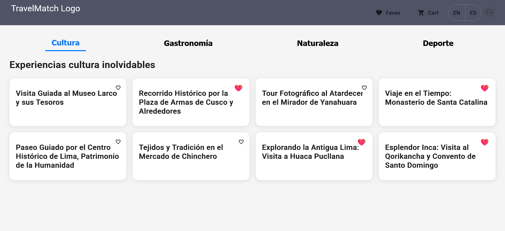    
</p>

<p align="center">
    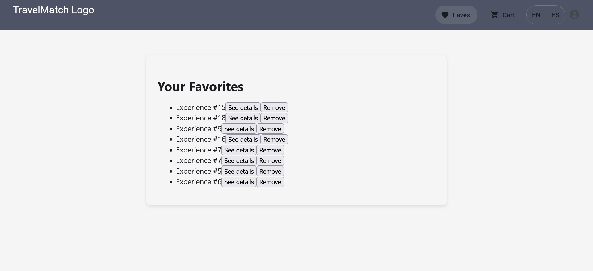    
</p>

<p align="center">
    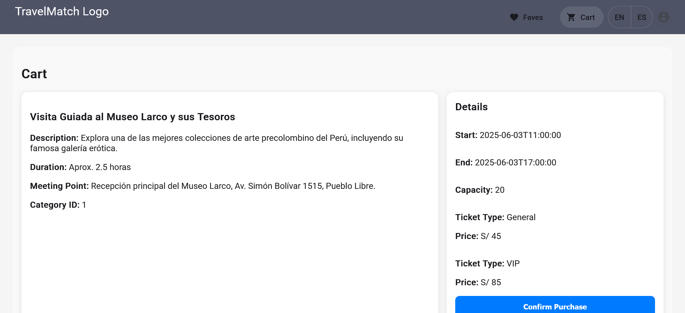    
</p>

<p align="center">
    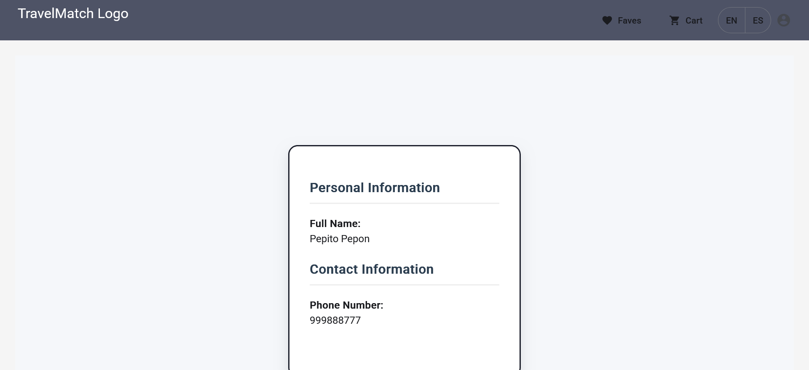    
</p>


##### 5.2.2.6. Services Documentation Evidence for Sprint Review

En este Sprint, el foco estuvo centrado exclusivamente en el desarrollo del frontend del proyecto TravelMatch. Se trabajaron los siguientes endpoints para este sprint:

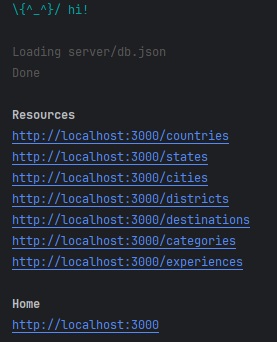

La documentación de Web Services utilizando OpenAPI/Swagger será considerada en futuros Sprints, una vez que se inicie la implementación del backend del sistema.

##### 5.2.2.7. Software Deployment Evidence for Sprint Review

Durante este Sprint, se llevó a cabo el despliegue del frontend del proyecto TravelMatch utilizando Firebase Hosting, marcando el segundo paso en la publicación progresiva de los productos del sistema. Esta actividad fue crucial para validar las funcionalidades del frontend desarrolladas durante el Sprint 2 y permitir la interacción con el cliente y el equipo docente en un entorno accesible.

**Actividades Realizadas**

* **Configuración del repositorio GitHub y estructura inicial de carpetas:**

  * Se mantuvo la estructura de repositorio existente, con la rama `main` conteniendo la versión desplegable y la rama `develop` para el trabajo en progreso.

  * Se aseguró la consistencia del proyecto local con el repositorio remoto.

* **Implementación de flujo de trabajo con Git Flow, manteniendo los cambios en la rama `develop`:**

  * Todo el desarrollo del frontend se realizó en ramas de características (`feature/*`) a partir de `develop`, siguiendo las convenciones de Git Flow.

  * Se realizaron commits frecuentes y mensajes descriptivos para mantener la trazabilidad de los cambios.

* **Realización de un merge desde `develop` hacia la rama `main`, de acuerdo a las convenciones definidas en la sección 5.1.2:**

  * Antes del despliegue, se realizó un Pull Request (PR) desde `develop` a `main` para asegurar la revisión del código por parte del equipo.

  * Se verificó la ausencia de conflictos y se realizaron las pruebas finales de integración antes de la fusión.

  * El merge se llevó a cabo una vez que todas las pruebas de funcionalidad del frontend fueron exitosas.

* **Configuración de Firebase para el despliegue del frontend, apuntando al contenido de la rama `main`:**

  * **Creación y configuración del proyecto Firebase:** Se creó un nuevo proyecto en la consola de Firebase específicamente para el frontend de TravelMatch.

    <p align="center">
      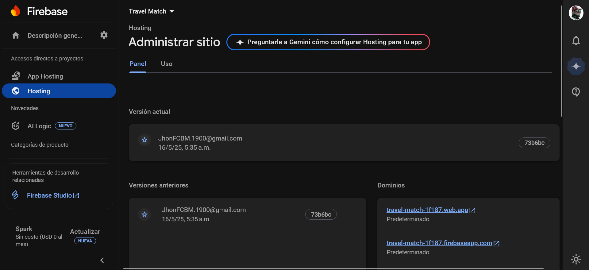
    </p>

  * **Inicialización de Firebase en el proyecto local:** Se utilizó el comando `firebase init` en el directorio raíz del proyecto frontend para configurar Firebase Hosting. Esto incluyó la selección del proyecto Firebase creado y la especificación del directorio público (`build` o `dist`, según la configuración del proyecto).

    <p align="center">
      
    </p>

  * **Conexión de Firebase Hosting con el repositorio GitHub (si aplica):** Se configuró la integración continua (CI/CD) de Firebase Hosting con el repositorio de GitHub para que cada fusión a la rama `main` activara automáticamente un nuevo despliegue. *(Nota: si no se configuró CI/CD automático, este punto puede omitirse o ajustarse).*

    <p align="center">
      
    </p>

* **Publicación exitosa del frontend accesible a través de una URL pública:**

  * Una vez configurado y desplegado, el frontend de TravelMatch estuvo accesible a través de la URL generada por Firebase Hosting.

  * 

---

**URL del Frontend desplegado:** https://travel-match-1f187.web.app

---

**Evidencias visuales**

* **Configuración del repositorio GitHub y estructura inicial de carpetas:**

  * La organización del repositorio se mantuvo, con el código del frontend reflejando los avances del Sprint 2 en la rama `develop`.

    <p align="center">
      
    </p>

* **Implementación de flujo de trabajo con Git Flow:**

  * Visualización de las ramas de desarrollo y la rama `develop` actualizada con los cambios del Sprint 2.

    <p align="center">
      
    </p>

* **Realización de un merge desde `develop` hacia la rama `main`:**

  * Captura de pantalla de la fusión exitosa del Pull Request en GitHub.

    <p align="center">
      
    </p>

* **Configuración de Firebase para el despliegue del frontend:**

  * Panel de control de Firebase Hosting mostrando el estado del despliegue y la URL pública.

    <p align="center">
      
    </p>

* **Publicación exitosa del frontend accesible a través de una URL pública:**

  * Capturas de pantalla del frontend desplegado, mostrando las nuevas funcionalidades como la página de login o el perfil de usuario.

    <p align="center">
      
    </p>

    <p align="center">
      
    </p>

    <p align="center">
      
    </p>


##### 5.2.2.8. Team Collaboration Insights during Sprint

Durante este Sprint, el equipo colaboró activamente en el desarrollo del frontend de TravelMatch, siguiendo las buenas prácticas de control de versiones con Git, estructuración del trabajo bajo el flujo Git Flow, y división de responsabilidades alineada con los roles de desarrollo y diseño definidos desde el inicio del proyecto.

**Estrategia de colaboración empleada:**

- Uso de ramas específicas (feature/, develop, main) para el desarrollo organizado de funcionalidades.

- Implementación de convenciones de commits mediante Conventional Commits, facilitando la trazabilidad.

- Pull requests revisadas por otros miembros antes de integrarse a develop.

- Reuniones cortas (dailys o check-ins semanales) para seguimiento y desbloqueo de tareas.

- Evidencia de avances del sprint:

	- Insights:

  	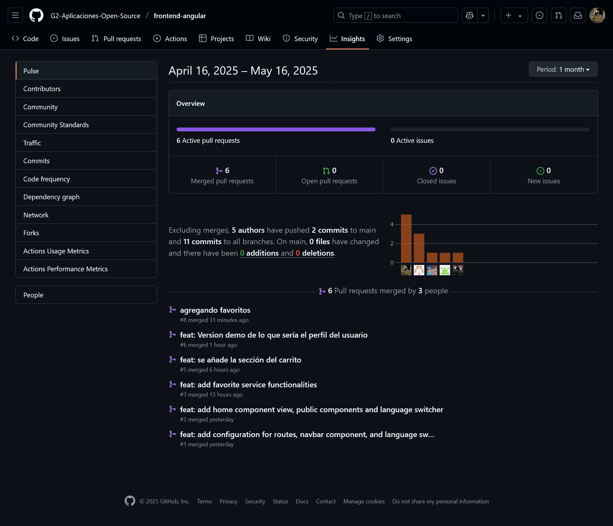

  	- Analíticas:

  	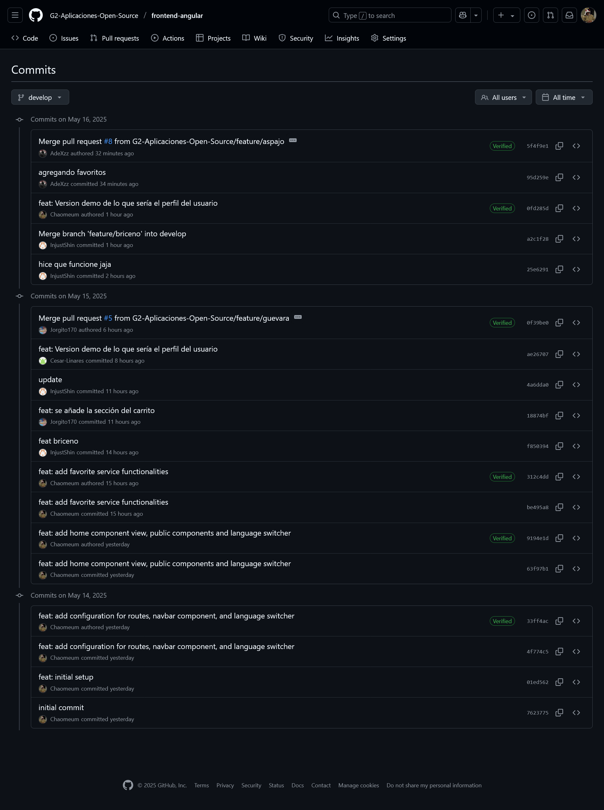

  	- Gitflow:

	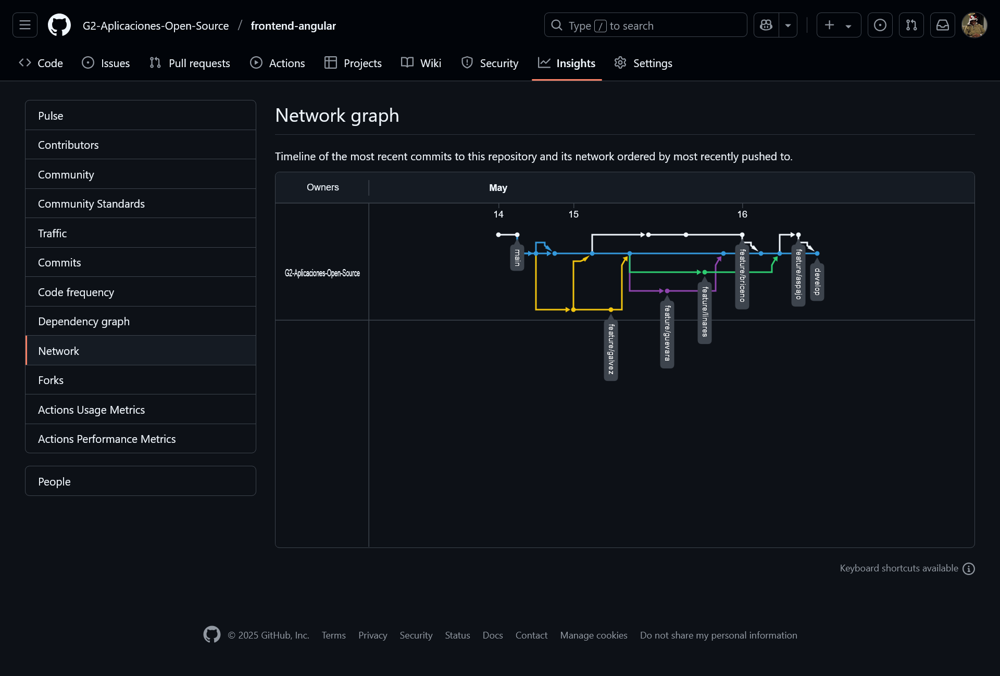
 

#### 5.2.3. Sprint 3

##### 5.2.3.1. Sprint Planning 3.

##### 5.2.3.2. Aspect Leaders and Collaborators

##### 5.2.3.3. Sprint Backlog 3.

##### 5.2.3.4. Development Evidence for Sprint Review.

A continuación, se presenta un cuadro con los commits realizados en el repositorio del backend de TravelMatch durante el sprint. Esta evidencia refleja el trabajo de implementación y mejoras en la aplicación, incluyendo endpoints, estructura modular, configuración de despliegue y documentación técnica. Cada commit corresponde a una funcionalidad o ajuste clave desarrollado en la rama principal del proyecto.


| **Repository**                           | **Branch** | **Commit ID** | **Commit Message**                                                                                | **Body** | **Commited on (Date)** |
| :--------------------------------------- | :--------- | :------------ | :------------------------------------------------------------------------------------------------ | :------- | :--------------------- |
| G2-Aplicaciones-Open-Source/backend-java | main       | 94125b6       | feat: implement ExperienceMedia endpoint with full CRUD, validation and OpenAPI docs              |          | 2025-06-21             |
| G2-Aplicaciones-Open-Source/backend-java | main       | 9a2148b       | refactor: github workflow structure                                                               |          | 2025-06-21             |
| G2-Aplicaciones-Open-Source/backend-java | main       | 3203e88       | feat: merge initial backend version from develop into main                                        |          | 2025-06-21             |
| G2-Aplicaciones-Open-Source/backend-java | main       | 417d8ae       | feat: add deployment configuration                                                                |          | 2025-06-21             |
| G2-Aplicaciones-Open-Source/backend-java | main       | 1d9fd37       | feat: downgrade java version for compatibility                                                    |          | 2025-06-21             |
| G2-Aplicaciones-Open-Source/backend-java | main       | 4e4de44       | feat: implement deploy workflow for main branch                                                   |          | 2025-06-21             |
| G2-Aplicaciones-Open-Source/backend-java | main       | d56f694       | feat: add swagger url                                                                             |          | 2025-06-21             |
| G2-Aplicaciones-Open-Source/backend-java | main       | 0becca2       | feat(profiles): complete bounded context implementation for profiles module                       |          | 2025-06-21             |
| G2-Aplicaciones-Open-Source/backend-java | main       | d680fe3       | feat(profiles): implement carts controller for profile management                                 |          | 2025-06-21             |
| G2-Aplicaciones-Open-Source/backend-java | main       | 3852d40       | feat(profiles): add rest interface layer resources and assemblers                                 |          | 2025-06-21             |
| G2-Aplicaciones-Open-Source/backend-java | main       | 601a634       | feat(profiles): adjust return types in CartCommandService                                         |          | 2025-06-20             |
| G2-Aplicaciones-Open-Source/backend-java | main       | 4cfab9d       | feat(profiles): refactor cart query service implementation                                        |          | 2025-06-20             |
| G2-Aplicaciones-Open-Source/backend-java | main       | 5cca391       | feat(profiles): add commands for clearing cart, updating cart items, and querying cart item count |          | 2025-06-20             |
| G2-Aplicaciones-Open-Source/backend-java | main       | dc03129       | feat(profiles): implement favorites controller for profile mananagement                           |          | 2025-06-20             |
| G2-Aplicaciones-Open-Source/backend-java | main       | c1d90c1       | feat(profiles): implement review controller for profile management                                |          | 2025-06-20             |
| G2-Aplicaciones-Open-Source/backend-java | main       | ff442ed       | feat(experiences): refactor externalIamService to resolve bean naming conflicts in Spring Boot    |          | 2025-06-20             |
| G2-Aplicaciones-Open-Source/backend-java | main       | 53c6ccb       | fix: solver merge issues in application properties                                                |          | 2025-06-20             |
| G2-Aplicaciones-Open-Source/backend-java | main       | dd9aee8       | feat(profiles): add review command service initial implementation                                 |          | 2025-06-20             |
| G2-Aplicaciones-Open-Source/backend-java | main       | be06862       | feat: add agencies bounded context                                                                |          | 2025-06-20             |
| G2-Aplicaciones-Open-Source/backend-java | main       | c4f4094       | agregando cambios                                                                                 |          | 2025-06-20             |
| G2-Aplicaciones-Open-Source/backend-java | main       | bf2af6a       | feat\:implement CRUD operations and ACL validation                                                |          | 2025-06-17             |
| G2-Aplicaciones-Open-Source/backend-java | main       | 410628a       | feat: agregando Agencies                                                                          |          | 2025-06-15             |
| G2-Aplicaciones-Open-Source/backend-java | main       | 266924b       | Merge remote-tracking branch 'origin/develop' into feature/galvez                                 |          | 2025-06-10             |
| G2-Aplicaciones-Open-Source/backend-java | main       | 0d0098a       | feat(profiles): add inbound and outbound contracts                                                |          | 2025-06-10             |
| G2-Aplicaciones-Open-Source/backend-java | main       | 17244c7       | feat(experiences): implement experience management module with availability and ticket types      |          | 2025-06-10             |
| G2-Aplicaciones-Open-Source/backend-java | main       | cb289d9       | refactor(profiles): modify acl interfaces and review command service                              |          | 2025-06-10             |
| G2-Aplicaciones-Open-Source/backend-java | main       | e05af63       | resolve merge conflicts with develop                                                              |          | 2025-06-10             |
| G2-Aplicaciones-Open-Source/backend-java | main       | a459a59       | feat(profiles): add cart, favorite and review query services implementation                       |          | 2025-06-09             |
| G2-Aplicaciones-Open-Source/backend-java | main       | 93ef874       | fix(profiles): resolve JPA annotation conflicts in domain models                                  |          | 2025-06-09             |
| G2-Aplicaciones-Open-Source/backend-java | main       | 1e72356       | feat(iam): implement jwt-based authentication and authorization service                           |          | 2025-06-08             |
| G2-Aplicaciones-Open-Source/backend-java | main       | 43bb7bd       | feat(iam): Add user profile data to sign-up process                                               |          | 2025-06-08             |
| G2-Aplicaciones-Open-Source/backend-java | main       | cc413de       | feat(iam): add JWT configuration and enhance runtime process logging                              |          | 2025-06-08             |
| G2-Aplicaciones-Open-Source/backend-java | main       | 0941b75       | feat(iam): add acl interface layer outbound services                                              |          | 2025-06-08             |
| G2-Aplicaciones-Open-Source/backend-java | main       | 622b388       | feat(iam): add rest interface layer inbound services                                              |          | 2025-06-07             |
| G2-Aplicaciones-Open-Source/backend-java | main       | 0ef6301       | feat(iam): add spring framework security configuration type                                       |          | 2025-06-07             |
| G2-Aplicaciones-Open-Source/backend-java | main       | b6d6ccd       | feat(iam): add required jwt dependencies                                                          |          | 2025-06-07             |
| G2-Aplicaciones-Open-Source/backend-java | main       | cf257b6       | feat(iam): add user command service implementation                                                |          | 2025-06-07             |
| G2-Aplicaciones-Open-Source/backend-java | main       | 660053a       | chore: add Azure PostgreSQL credentials to application.properties                                 |          | 2025-06-07             |


##### 5.2.3.5. Execution Evidence for Sprint Review.

En esta sección se presenta la evidencia de ejecución correspondiente al sprint del proyecto TravelMatch, una aplicación centrada en ofrecer experiencias turísticas personalizadas. Las capturas incluidas fueron tomadas desde Swagger UI y muestran la correcta ejecución de los endpoints desarrollados, validando su comportamiento y funcionamiento real. Estas pruebas evidencian la interacción efectiva con los servicios backend para operaciones como creación, consulta, actualización y eliminación de recursos relacionados con experiencias, disponibilidades y medios. Cada resultado confirma que las funcionalidades implementadas no solo han sido integradas, sino que también están activas y operativas según los criterios establecidos en las historias de usuario del sprint.

**Evidencias visuales**

<p align="center">
    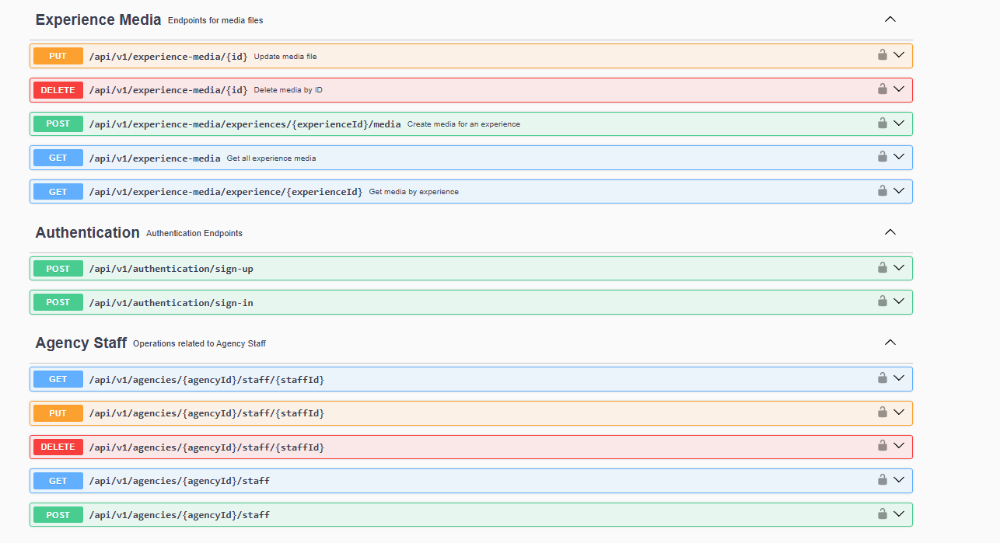    
</p>

<p align="center">
    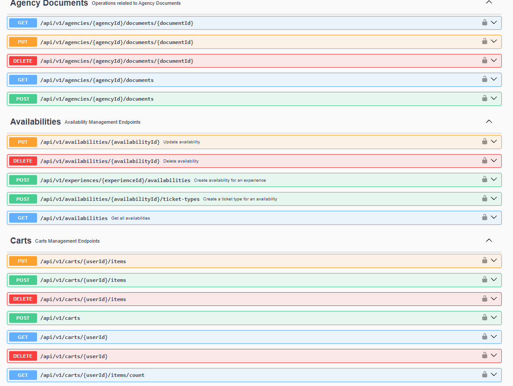    
</p>

<p align="center">
    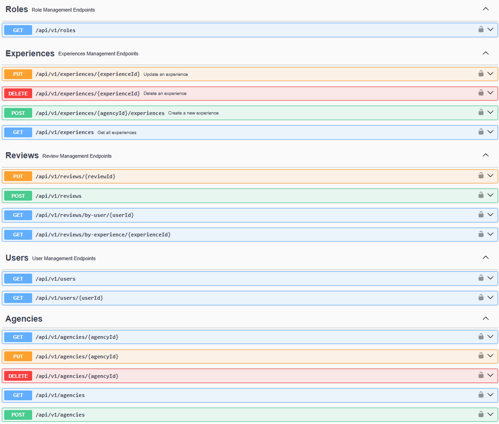    
</p>


##### 5.2.3.6. Services Documentation Evidence for Sprint Review.

En esta sección se presenta la evidencia de documentación de los servicios desarrollados durante el sprint, los cuales están disponibles y visibles mediante Swagger en la aplicación TravelMatch, una plataforma de turismo y viajes personalizados. A continuación, se detallan los principales endpoints implementados para cada uno de los módulos funcionales, incluyendo su método HTTP, ruta y descripción correspondiente.

### Experience Media

| Método     | Endpoint                                                    | Descripción                              |
| ---------- | ----------------------------------------------------------- | ---------------------------------------- |
| **POST**   | `/api/v1/experience-media/experiences/{experienceId}/media` | Crear media para una experiencia         |
| **GET**    | `/api/v1/experience-media`                                  | Obtener todas las medias de experiencias |
| **GET**    | `/api/v1/experience-media/experience/{experienceId}`        | Obtener medias por ID de experiencia     |
| **PUT**    | `/api/v1/experience-media/{id}`                             | Actualizar media por ID                  |
| **DELETE** | `/api/v1/experience-media/{id}`                             | Eliminar media por ID                    |

---
### Authentication
| Método   | Endpoint                         | Descripción             |
| -------- | -------------------------------- | ----------------------- |
| **POST** | `/api/v1/authentication/sign-up` | Registrar nuevo usuario |
| **POST** | `/api/v1/authentication/sign-in` | Iniciar sesión          |

---
### Agency Staff
| Método     | Endpoint                                      | Descripción                                 |
| ---------- | --------------------------------------------- | ------------------------------------------- |
| **POST**   | `/api/v1/agencies/{agencyId}/staff`           | Crear personal para la agencia              |
| **GET**    | `/api/v1/agencies/{agencyId}/staff`           | Listar personal de la agencia               |
| **GET**    | `/api/v1/agencies/{agencyId}/staff/{staffId}` | Obtener detalles de un miembro del personal |
| **PUT**    | `/api/v1/agencies/{agencyId}/staff/{staffId}` | Actualizar datos del personal               |
| **DELETE** | `/api/v1/agencies/{agencyId}/staff/{staffId}` | Eliminar personal de la agencia             |

---
### Agency Documents
| Método     | Endpoint                                             | Descripción                     |
| ---------- | ---------------------------------------------------- | ------------------------------- |
| **POST**   | `/api/v1/agencies/{agencyId}/documents`              | Subir documento de agencia      |
| **GET**    | `/api/v1/agencies/{agencyId}/documents`              | Listar documentos de la agencia |
| **GET**    | `/api/v1/agencies/{agencyId}/documents/{documentId}` | Obtener documento por ID        |
| **PUT**    | `/api/v1/agencies/{agencyId}/documents/{documentId}` | Actualizar documento de agencia |
| **DELETE** | `/api/v1/agencies/{agencyId}/documents/{documentId}` | Eliminar documento de agencia   |

---
### Availabilities
| Método     | Endpoint                                               | Descripción                              |
| ---------- | ------------------------------------------------------ | ---------------------------------------- |
| **POST**   | `/api/v1/experiences/{experienceId}/availabilities`    | Crear disponibilidad para experiencia    |
| **POST**   | `/api/v1/availabilities/{availabilityId}/ticket-types` | Crear tipo de ticket para disponibilidad |
| **GET**    | `/api/v1/availabilities`                               | Obtener todas las disponibilidades       |
| **PUT**    | `/api/v1/availabilities/{availabilityId}`              | Actualizar disponibilidad                |
| **DELETE** | `/api/v1/availabilities/{availabilityId}`              | Eliminar disponibilidad                  |

---
### Carts
| Método     | Endpoint                             | Descripción                           |
| ---------- | ------------------------------------ | ------------------------------------- |
| **POST**   | `/api/v1/carts`                      | Crear carrito                         |
| **GET**    | `/api/v1/carts/{userId}`             | Obtener carrito de usuario            |
| **DELETE** | `/api/v1/carts/{userId}`             | Eliminar carrito de usuario           |
| **POST**   | `/api/v1/carts/{userId}/items`       | Agregar ítem al carrito               |
| **PUT**    | `/api/v1/carts/{userId}/items`       | Actualizar ítem del carrito           |
| **DELETE** | `/api/v1/carts/{userId}/items`       | Eliminar ítem del carrito             |
| **GET**    | `/api/v1/carts/{userId}/items/count` | Obtener número de ítems en el carrito |

---
### Favorites
| Método     | Endpoint                                                     | Descripción                                         |
| ---------- | ------------------------------------------------------------ | --------------------------------------------------- |
| **POST**   | `/api/v1/favorites`                                          | Agregar una experiencia a favoritos                 |
| **GET**    | `/api/v1/favorites/by-user/{userId}`                         | Obtener experiencias favoritas de un usuario        |
| **DELETE** | `/api/v1/favorites/users/{userId}/experience/{experienceId}` | Eliminar una experiencia de favoritos de un usuario |

---
### Roles

| Método  | Endpoint        | Descripción                         |
| ------- | --------------- | ----------------------------------- |
| **GET** | `/api/v1/roles` | Obtener todos los roles disponibles |

---
### Experiences
| Método     | Endpoint                                     | Descripción                              |
| ---------- | -------------------------------------------- | ---------------------------------------- |
| **POST**   | `/api/v1/experiences/{agencyId}/experiences` | Crear nueva experiencia para una agencia |
| **GET**    | `/api/v1/experiences`                        | Obtener todas las experiencias           |
| **PUT**    | `/api/v1/experiences/{experienceId}`         | Actualizar experiencia por ID            |
| **DELETE** | `/api/v1/experiences/{experienceId}`         | Eliminar experiencia por ID              |

---
### Reviews
| Método   | Endpoint                                       | Descripción                     |
| -------- | ---------------------------------------------- | ------------------------------- |
| **POST** | `/api/v1/reviews`                              | Crear reseña                    |
| **PUT**  | `/api/v1/reviews/{reviewId}`                   | Actualizar reseña               |
| **GET**  | `/api/v1/reviews/by-user/{userId}`             | Obtener reseñas por usuario     |
| **GET**  | `/api/v1/reviews/by-experience/{experienceId}` | Obtener reseñas por experiencia |

---
### Users

| Método  | Endpoint                 | Descripción                |
| ------- | ------------------------ | -------------------------- |
| **GET** | `/api/v1/users`          | Obtener todos los usuarios |
| **GET** | `/api/v1/users/{userId}` | Obtener usuario por ID     |
---
### Agencies
| Método     | Endpoint                      | Descripción                 |
| ---------- | ----------------------------- | --------------------------- |
| **POST**   | `/api/v1/agencies`            | Crear agencia               |
| **GET**    | `/api/v1/agencies`            | Obtener todas las agencias  |
| **GET**    | `/api/v1/agencies/{agencyId}` | Obtener agencia por ID      |
| **PUT**    | `/api/v1/agencies/{agencyId}` | Actualizar datos de agencia |
| **DELETE** | `/api/v1/agencies/{agencyId}` | Eliminar agencia            |


##### 5.2.3.7. Software Deployment Evidence for Sprint Review.

##### 5.2.3.8. Team Collaboration Insights during Sprint


### 5.3. Validation Interviews

#### 5.3.1. Diseño de Entrevistas

Para realizar las entrevistas de validación, primero se han planteado 7 preguntas para cada segmento de acuerdo a lo que se quiere saber del usuario para así tener un análisis más enfocado.

### Segmento 1: Agencias de turismo locales

1. ¿Considera que la plataforma facilitó la gestión y recepción de reservas para su agencia?
2. ¿Le resultó sencillo publicar y actualizar sus tours o servicios en la plataforma?
3. ¿La visibilidad que obtuvo su agencia a través del producto cumplió con sus expectativas?
4. ¿El sistema de notificaciones y alertas fue útil para gestionar a tiempo sus reservas?
5. ¿Recomendaría el uso de esta plataforma a otras agencias de turismo? ¿Por qué?
6. ¿Sintió que las herramientas de análisis y métricas le ayudaron a mejorar su oferta?
7. ¿Qué tan satisfecho está con el soporte o atención brindada por la plataforma?

### Segmento 2: Turistas nacionales e internacionales

1. ¿Encontró fácilmente actividades o experiencias que se ajustaran a sus intereses y presupuesto?
2. ¿La información presentada sobre los tours y agencias le generó confianza al reservar?
3. ¿El proceso de reserva y pago fue rápido y libre de complicaciones?
4. ¿Las recomendaciones personalizadas de la plataforma fueron relevantes para usted?
5. ¿Qué tan satisfecho/a está con la experiencia general de uso de la plataforma?
6. ¿Considera que la plataforma le ahorró tiempo en la planificación de su viaje?
7. ¿Repetiría el uso de la plataforma para futuros viajes o la recomendaría a amigos?

### Semento 3: Viajeros por trabajo (Turismo corporativo)

1. ¿La plataforma le ayudó a encontrar actividades compatibles con sus horarios laborales?
2. ¿Pudo aprovechar mejor su tiempo libre durante viajes de trabajo gracias a la plataforma?
3. ¿Las opciones de reserva rápida y confirmación inmediata fueron satisfactorias?
4. ¿Sintió que las recomendaciones se adaptaron a sus preferencias y necesidades corporativas?
5. ¿La opción de generar comprobantes o facturas funcionó correctamente y fue útil?
6. ¿Considera que la plataforma facilitó la organización de actividades para usted o su equipo?
7. ¿Qué tan probable es que utilice nuevamente la plataforma en su próximo viaje de trabajo?

#### 5.3.2. Registro de Entrevistas.

<!-- Segmento objetivo 1: AGENCIAS DE TURISMO LOCALES -->

**Entrevista 1:**

<p align="center">
    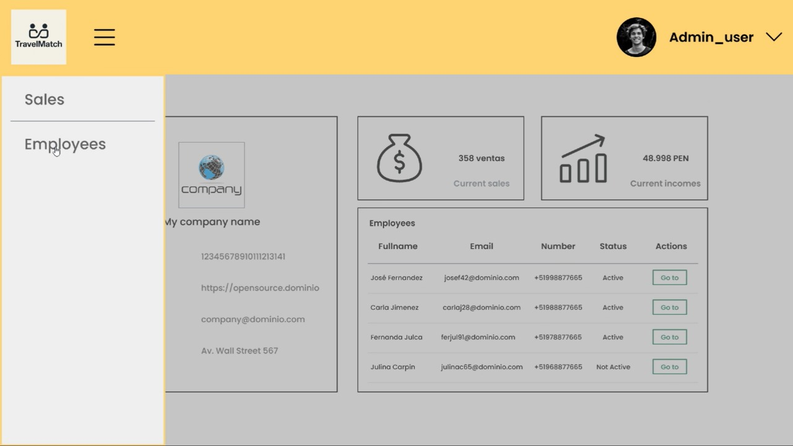
</p>

<div align="center">

| Entrevistado | Adrian Yañez Mendez |
|----|-----|
|Edad|24|
|Residencia|Villa el Salvador|
|Segmento|Agencias de turismo locales|
|Enlace de la entrevista| [https://youtu.be/U9y9BZbecxU](https://youtu.be/U9y9BZbecxU)|

</div>

_Resumen:_ El entrevistado tuvo un recorrido rápido sobre la aplicación. Manejó las transciciones de manera fluida. Él comenta que le fue fácil entender cómo utilizar la aplicación. Dice que la aplicación puede mejorar. Él espera que hayan más características en la aplicación, como la visualización de una gráfica de la cantidad de ventas diarias en intervalos de una semana y mes. Comenta que le gustaría que hayan alertas de notificación para cuando se realice alguna acción la aplicación le brinde una confirmación. Asimismo, recomendaría la aplicación a otros usuarios, le gustó la idea de la aplicación y cómo esta ayuda a los usuarios.

---

<!-- Segmento objetivo 2: TURISTAS NACIONALES E INTERNACIONALES -->

**Entrevista 4:**

<p align="center">
    
</p>

<div align="center">

| Entrevistado | Adrian Yañez Mendez |
|----|-----|
|Edad|20|
|Residencia|Lima|
|Segmento|Turista Nacional|
|Enlace de la entrevista| [https://www.youtube.com/watch?v=9PeHOlGE6K8](https://www.youtube.com/watch?v=9PeHOlGE6K8)|

</div>

_Resumen:_ El entrevistado organiza sus viajes con anticipación, priorizando experiencias personalizadas como tours culturales y fotografía. Encontró fácilmente opciones que se ajustaban a su presupuesto gracias a los filtros. Valoró la confianza que le generó la información clara y las reseñas. Destacó la rapidez del proceso de reserva desde la plataforma de escritorio y la utilidad de las recomendaciones personalizadas. Afirmó que le ahorró tiempo en la planificación y se mostró muy satisfecho con la experiencia general. Repetiría el uso y la recomendaría por su practicidad. Sugiere incluir un chat directo con las agencias y más filtros de búsqueda.

---

**Entrevista 5:**

<p align="center">
    
</p>

<div align="center">

| Entrevistado | Sebastian Arevalo Torres |
|----|-----|
|Edad|23|
|Residencia|Chile|
|Segmento|Turista Internacional|
|Enlace de la entrevista| [https://www.youtube.com/watch?v=yZrnMb7zTxI](https://www.youtube.com/watch?v=yZrnMb7zTxI)|

</div>

_Resumen:_ El entrevistado busca experiencias auténticas y fuera del turismo convencional, como actividades culturales y gastronómicas. Usó la plataforma para comparar precios y duraciones fácilmente, lo que considera esencial. Encontró la información confiable y valoró especialmente las reseñas de otros viajeros. Las recomendaciones personalizadas fueron relevantes y le permitieron organizarse sin complicaciones desde su laptop. Quedó satisfecho con la experiencia y resaltó el ahorro de tiempo. Recomendaría la plataforma a otros viajeros independientes. Como mejora, sugiere itinerarios sugeridos y más contenido visual.


---

**Entrevista 6:**

<p align="center">
    
</p>

<div align="center">

| Entrevistado | Diego Santiago Lima |
|----|-----|
|Edad|21|
|Residencia|Arequipa|
|Segmento|Turista Nacional|
|Enlace de la entrevista| [https://www.youtube.com/watch?v=ezpu8HV7a0I](https://www.youtube.com/watch?v=ezpu8HV7a0I)|

</div>

_Resumen:_ El entrevistado viaja como mochilero, improvisando sobre la marcha. Usó TravelMatch desde escritorio para encontrar actividades económicas y culturales, sin necesidad de itinerario fijo. Apreció poder comparar precios y ver valoraciones de otros mochileros. La información le generó confianza y destacó la utilidad de las recomendaciones personalizadas según ubicación. Considera que la plataforma le ahorró tiempo en cada destino. Repetiría el uso y la recomendaría a quienes viajan de forma espontánea. Sugiere integrar un mapa interactivo para facilitar la exploración de actividades cercanas.


<!-- Segmento objetivo 3: TURISTAS CORPORATIVOS  falta la entrevista 7 y 9-->
---

**Entrevista 8:**

<p align="center">
    
</p>

<div align="center">

| Entrevistado | Eduardo Montalvo |
|----|-----|
|Edad| 25 |
|Residencia|Lima|
|Enlace de la entrevista| [https://www.youtube.com/watch?v=p_GXlAOSaIU](https://www.youtube.com/watch?v=p_GXlAOSaIU)|

</div>

_Resumen:_ El entrevistado realiza viajes laborales frecuentes dentro del país y dispone de poco tiempo libre. Usó la plataforma para encontrar actividades rápidas y cercanas a su alojamiento, logrando optimizar sus pausas laborales. Valoró la velocidad de reserva y la confirmación inmediata desde escritorio. Las recomendaciones se adaptaron a su agenda y la facturación automática fue especialmente útil para su trabajo. Considera que la plataforma facilitó la organización de actividades de forma eficiente. Planea volver a usarla y la recomendaría a otros viajeros de negocios. Sugiere integrar una agenda corporativa y reportes automáticos de gastos.

---


#### 5.3.3. Evaluaciones según heurísticas.

**UX Heuristics & Principles Evaluation**

**Usability – Inclusive Design – Information Architecture**

CARRERA: Ingeniería de Software

CURSO: Desarrollo de Aplicaciones Open Source

SECCIÓN: 4328

PROFESORES: Juan Antonio Flores Moroco

AUDITOR: Pandora

CLIENTE(S): Luis Ramirez, Jose Guerrero, Leonardo Pilco, Adrian Yañez, Sebastian Arevalo, Diego Santiago, Eduardo Montalvo

**SITE o APP A EVALUAR:**

TravelMatch

**TAREAS A EVALUAR:**

El alcance de esta evaluación incluye la revisión de la usabilidad de las siguientes tareas:

1. Registro de un usuario nuevo

2. Publicación de un post

3. Búsqueda de un paquete turístico

4. Reserva de un viaje

5. Cancelación de una reserva

6. Agregar ítems a un pedido

7. Pago de un paquete turístico

8. Gestión y recepción de reservas (para agencias)

9. Publicación y actualización de tours/servicios (para agencias)

10. Recepción de notificaciones (para agencias y usuarios)

No están incluidas en esta versión de la evaluación las siguientes tareas:

1. Compartir reservas entre usuarios

2. Presentar ofertas de último minuto

3. Administrar puntos del programa de fidelización de viajes

4. Guardar “alerta de paquetes”

5. Integración de agenda corporativa

6. Reportes automáticos de gastos

**ESCALA DE SEVERIDAD:**

Los errores serán puntuados tomando en cuenta la siguiente escala de severidad

|**Nivel**|**Descripción**|
| :- | :- |
|**1**|**Problema superficial: puede ser fácilmente superado por el usuario o ocurre con muy poca frecuencia. No necesita ser arreglado a no ser que exista disponibilidad de tiempo.**|
|**2**|**Problema menor: puede ocurrir un poco más frecuentemente o es un poco más difícil de superar para el usuario. Se le debería asignar una prioridad baja resolverlo de cara al siguiente release**|
|**3**|**Problema mayor: ocurre frecuentemente o los usuarios no son capaces de resolverlos. Es importante que sean corregidos y se les debe asignar una prioridad alta.**|
|**4**|**Problema muy grave: un error de gran impacto que impide al usuario continuar con el uso de la herramienta. Es imperativo que sea corregido antes del lanzamiento.**|

**TABLA RESUMEN:**

|**#**|**Problema**|**Escala de severidad**|**Heurística/Principio violada(o)**|
| :- | :- | :- | :- |
|**1**|**Necesidad de chat directo con agencias**|**2**|**Usability: Ayuda y documentación**|
|**2**|**Falta de filtros de búsqueda adicionales**|**2**|**Usability: Flexibilidad y eficiencia de uso**|
|**3**|**Ausencia de itinerarios sugeridos**|**2**|**Information Architecture: Is it findable?**|
|**4**|**Poca cantidad de contenido visual**|**2**|**Inclusive Design: Proporciona experiencias comparables**|
|**5**|**Falta de mapa interactivo para actividades cercanas**|**2**|**Information Architecture: Is it findable?**|
|**6**|**Falta de integración de agenda corporativa y reportes automáticos de gastos**|**2**|**Usability: Flexibilidad y eficiencia de uso**|
|**7**|**Necesidad de más características, como gráficos de ventas diarios/semanales/mensuales**|**2**|**Usability: Reconocimiento antes que recuerdo / Flexibilidad y eficiencia de uso**|
|**8**|**Ausencia de alertas de notificación para confirmación de acciones**|**2**|**Usability: Visibilidad del estado del sistema**|
|**9**|**Dificultad inicial para entender cómo agregar fotos y precios de tours (para agencias)**|**2**|**Usability: Consistencia y estándares / Reconocimiento antes que recuerdo**|

**DESCRIPCIÓN DE PROBLEMAS:**

**PROBLEMA #1:** Necesidad de chat directo con agencias

**Severidad:** 2

**Heurística violada:** Usabilidad - Ayuda y documentación

**Problema:**
El entrevistado 1 sugiere la inclusión de un chat directo con las agencias, lo que indica que, a pesar de la información clara y las reseñas, existe un deseo de comunicación más inmediata y personalizada para resolver dudas o coordinar detalles que la plataforma actual no ofrece directamente. Esto podría mejorar la confianza y la eficiencia en la planificación de los viajes para algunos usuarios.

**Recomendación:**
Implementar una función de chat en vivo o mensajería directa entre usuarios y agencias dentro de la plataforma para facilitar la comunicación y resolución de consultas en tiempo real.

**PROBLEMA #2:** Falta de filtros de búsqueda adicionales

**Severidad:** 2

**Heurística violada:** Usabilidad - Flexibilidad y eficiencia de uso

**Problema:**
El entrevistado 1 menciona la necesidad de incluir más filtros de búsqueda, lo que sugiere que los filtros actuales, aunque útiles, no son lo suficientemente granulares o variados para cubrir todas las necesidades o preferencias de los usuarios que buscan experiencias muy específicas.

**Recomendación:**
Ampliar las opciones de filtrado en la búsqueda, incluyendo categorías más detalladas, opciones de personalización (ej. tipo de comida, nivel de actividad física, etc.) o la posibilidad de combinar múltiples filtros para afinar los resultados.

**PROBLEMA #3:** Ausencia de itinerarios sugeridos

**Severidad:** 2

**Heurística violada:** Information Architecture - Is it findable?

**Problema:**
El entrevistado 2 sugiere la inclusión de itinerarios sugeridos, lo que indica que, si bien la plataforma ayuda a organizar y encontrar actividades, los usuarios podrían beneficiarse de estructuras o rutas predefinidas que les faciliten aún más la planificación, especialmente a quienes buscan experiencias completas sin tener que armar todo desde cero.

**Recomendación:**
Desarrollar y ofrecer itinerarios predefinidos o sugeridos basados en temáticas, duraciones o tipos de viajero, que incluyan una secuencia lógica de actividades y faciliten la decisión del usuario.

**PROBLEMA #4:** Poca cantidad de contenido visual

**Severidad:** 2

**Heurística violada:** Inclusive Design - Proporciona experiencias comparables

**Problema:**
El entrevistado 2 menciona la necesidad de más contenido visual. Si bien la plataforma es funcional, una mayor riqueza visual podría mejorar la experiencia inmersiva del usuario, ayudándolo a tomar decisiones más informadas y a sentirse más conectado con la oferta.

**Recomendación:**
Aumentar la cantidad y calidad de las imágenes y videos de los tours y servicios, incluyendo vistas panorámicas, detalles de las actividades y testimonios visuales, para enriquecer la experiencia del usuario y proporcionar una mejor comprensión de lo que se ofrece.

**PROBLEMA #5:** Falta de mapa interactivo para actividades cercanas

**Severidad:** 2

**Heurística violada:** Information Architecture - Is it findable?

**Problema:**
El entrevistado 3, un mochilero que improvisa, sugiere integrar un mapa interactivo para facilitar la exploración de actividades cercanas. Esto indica que la actual forma de visualizar o encontrar actividades no es tan eficiente para usuarios que priorizan la espontaneidad y la cercanía geográfica.

**Recomendación:**
Integrar un mapa interactivo que muestre la ubicación de las actividades y permita a los usuarios explorar opciones cercanas a su posición actual o a un punto de interés específico, facilitando la planificación espontánea.

**PROBLEMA #6:** Falta de integración de agenda corporativa y reportes automáticos de gastos

**Severidad:** 2

**Heurística violada:** Usability - Flexibilidad y eficiencia de uso

**Problema:**
El entrevistado 4, un viajero de negocios, sugiere integrar una agenda corporativa y reportes automáticos de gastos. Esto indica una oportunidad para mejorar la utilidad de la plataforma para un segmento de usuarios que necesitan funcionalidades específicas para la gestión de viajes laborales, más allá de la simple reserva de actividades.

**Recomendación:**
Explorar la posibilidad de integrar funcionalidades específicas para viajes corporativos, como la sincronización con calendarios empresariales o la generación automática de informes de gastos, para atender las necesidades de este segmento de usuarios.

**PROBLEMA #7:** Necesidad de más características, como gráficos de ventas diarios/semanales/mensuales

**Severidad:** 2

**Heurística violada:** Usability - Reconocimiento antes que recuerdo / Flexibilidad y eficiencia de uso

**Problema:**
El entrevistado 5 menciona que la aplicación puede mejorar y que espera más características, como la visualización de una gráfica de la cantidad de ventas diarias en intervalos de una semana y mes. Esto indica una necesidad por parte de los usuarios (probablemente agencias o administradores) de herramientas de análisis y reporte más visuales e inmediatas.

**Recomendación:**
Desarrollar y añadir paneles de control o secciones de métricas con gráficos visuales que muestren datos relevantes como la cantidad de ventas por día, semana y mes, facilitando la comprensión y el seguimiento del rendimiento.

**PROBLEMA #8:** Ausencia de alertas de notificación para confirmación de acciones

**Severidad:** 2

**Heurística violada:** Usability - Visibilidad del estado del sistema

**Problema:**
El entrevistado 5 comenta que le gustaría que haya alertas de notificación para cuando se realice alguna acción la aplicación le brinde una confirmación. Esto sugiere que el sistema actual no siempre proporciona una retroalimentación clara e inmediata sobre la finalización exitosa de ciertas operaciones, lo que puede generar incertidumbre en el usuario.

**Recomendación:**
Implementar notificaciones claras y visibles (ej. mensajes pop-up, banners) que confirmen al usuario la realización exitosa de una acción, como una reserva, una publicación, o la actualización de datos.

**PROBLEMA #9:** Dificultad inicial para entender cómo agregar fotos y precios de tours (para agencias)

**Severidad:** 2

**Heurística violada:** Usability - Consistencia y estándares / Reconocimiento antes que recuerdo

**Problema:**
El entrevistado 7 (Luis Ramírez) menciona que al principio le tomó un poco entender cómo se agregaban las fotos y los precios. Aunque luego fue fácil, este punto inicial de dificultad sugiere que el proceso de carga de contenido podría ser más intuitivo o que la interfaz no sigue completamente los patrones esperados.

**Recomendación:**
Revisar la interfaz de usuario para la carga de fotos y precios para asegurar que sea más intuitiva y siga convenciones de diseño conocidas. Podría incluir mejoras en la denominación de campos, la disposición visual o la provisión de pequeñas guías o tooltips en los pasos iniciales.

### 5.4. Video About-the-Product

**Reemplazar**
En esta sección el equipo introduce y describe el contenido del Video About-the-
Product, el cual tiene como público objetivo los visitantes al Landing Page, quienes
desean conocer sobre el modelo de negocio y las características principales de los
productos de software, al igual que los usuarios de las Aplicaciones, quienes desean
realizar tareas relacionadas con los procesos soportados por la solución. El tono que
utilice en la comunicación debe ser consistente con el tono adoptado para el
producto y debe incluirse al menos un testimonio positivo de un usuario que haya
participado en las entrevistas de validación. Debe incluirse también en esta sección
un screenshot del Video, el URL de la versión publicada en Microsoft Stream (y
además, el URL de la versión publicada en YouTube utilizada para incrustarse en el
Landing Page), así como el timing (duración) del mismo. Ver otras indicaciones
importantes en el Anexo C. Indicaciones para secciones que incluyen Videos.

URL del video: []

## Conclusiones

### Conclusiones y Recomendaciones

- _Colaboración efectiva del equipo:_
    La implementación del flujo de trabajo GitHub Flow y GitFlow permitió una colaboración organizada y eficiente entre los miembros del equipo. Cada integrante asumió responsabilidades específicas, lo que facilitó el desarrollo de la landing page y la integración de funcionalidades clave.

- _Desarrollo exitoso de la landing page:_
    Durante el Sprint 1, se logró implementar una landing page funcional, responsiva y alineada con los objetivos del proyecto. Esto incluye la navegación principal, formularios de contacto, vistas de registro e inicio de sesión, y una estructura visual coherente con la identidad de TravelMatch.

- _Adopción de buenas prácticas de desarrollo:_
    El uso de convenciones de commits, control de versiones con Git, y estándares de codificación garantizó un código limpio, organizado y fácil de mantener. Además, la estructura modular y el diseño responsivo aseguran una experiencia de usuario óptima en diferentes dispositivos.

- _Despliegue exitoso:_
    La publicación de la landing page en GitHub Pages permitió validar visualmente los avances del proyecto y establecer un punto de partida sólido para futuras iteraciones. Esto demuestra la capacidad del equipo para gestionar el ciclo completo de desarrollo y despliegue.

- _Enfoque centrado en el usuario:_
    La arquitectura de información y el diseño de la landing page reflejan un enfoque claro en las necesidades del usuario, priorizando la claridad, accesibilidad y facilidad de navegación. Esto sienta las bases para una experiencia de usuario positiva en el producto final.

- _Lecciones aprendidas:_
    Durante este Sprint, se identificaron áreas de mejora en la coordinación de tareas y la gestión del tiempo. Estas lecciones serán aplicadas en futuros Sprints para optimizar la productividad y asegurar el cumplimiento de los objetivos del proyecto.

### Video About-The-Team 

**Reemplazar**
En esta sección el equipo elabora un resumen de los aspectos más relevantes del
video About-The-Team, la pauta de secuencias de contenido (secciones con el timing
de inicio de cada una, es decir hh:mm:ss de cada sección dentro del video)
incluyendo además un cuadro de video representativo del mismo, junto con el URL
de la versión publicada en Microsoft Stream (y además, el URL de la versión
publicada en YouTube utilizada para incrustarse en el Landing Page).
Este video resume el proceso de trabajo realizado, incluyendo escenas con imágenes
o video de sesiones de trabajo real del equipo, complementando con narración (voz
en off) del proceso. Incluye además el testimonio ante cámara de cada participante
describiendo actividades realizadas, logro de outcomes y desarrollo de competencias
alcanzados. Ver otras indicaciones importantes en el Anexo C. Indicaciones para
secciones que incluyen Videos.

<hr>

## Bibliografía

- Xiang, Z., Du, Q., Ma, Y., & Fan, W. (2021). Digital platforms in tourism: A review. Tourism Management Perspectives, 37, 100831. [https://doi.org/10.1016/j.tmp.2021.100831](https://doi.org/10.1016/j.tmp.2021.100831)
- Buhalis, D., & Sinarta, Y. (2019). Real-time co-creation and nowness service: Lessons from tourism and hospitality. Journal of Travel & Tourism Marketing, 36(5), 563–582. [https://doi.org/10.1080/10548408.2019.1592059](https://doi.org/10.1080/10548408.2019.1592059)
- Gutiérrez, J., & Robles, J. (2020). Plataformas colaborativas en el turismo: Oportunidades para pequeñas agencias. Revista de Estudios Sociales, 73, 86–101. [https://www.redalyc.org/articulo.oa?id=81568998006](https://www.redalyc.org/articulo.oa?id=81568998006)
- Morales, M., & Figueroa, A. (2020). El turismo experiencial como estrategia de diferenciación en destinos emergentes. Revista Mexicana de Ciencias Políticas y Sociales, 65(239), 85–108. [https://www.scielo.org.mx/scielo.php?script=sci_arttext&pid=S0188-252X2020000200085](https://www.scielo.org.mx/scielo.php?script=sci_arttext&pid=S0188-252X2020000200085)
- Marín, A., Sánchez, D., & Moreno, J. (2021). Tourism recommender systems: A review. IEEE Access, 9, 92686–92702. [https://ieeexplore.ieee.org/document/9448323](https://ieeexplore.ieee.org/document/9448323)
- Rodríguez, F., & Camargo, D. (2022). Integración de herramientas digitales para mejorar la competitividad del sector turístico. Revista Facultad de Ciencias Económicas: Investigación y Reflexión, 30(2), 267–283. [https://www.scielo.org.co/scielo.php?script=sci_arttext&pid=S0123-59232022000200267](https://www.scielo.org.co/scielo.php?script=sci_arttext&pid=S0123-59232022000200267)
<hr>

## Anexos

- Link de la Organización: [https://github.com/G2-Aplicaciones-Open-Source](https://github.com/G2-Aplicaciones-Open-Source)
- Link de la documentanción: [https://github.com/G2-Aplicaciones-Open-Source/docs](https://github.com/G2-Aplicaciones-Open-Source/docs)
- Link de la Landing Page: [https://g2-aplicaciones-open-source.github.io/landing-page-v2/](https://g2-aplicaciones-open-source.github.io/landing-page-v2/)
- Link del Deploy del FrontEnd: [https://travel-match-1f187.web.app/home](https://travel-match-1f187.web.app/home)
