<p align="center">
    
</p>

<h1 align="center">
    Universidad Peruana de Ciencias Aplicadas
</h1>

<h3 align="center">
    Carrera: Ingeniería de Software
    <br> <br>
    Curso: SI729 - Desarrollo de Aplicaciones Open Source
    <br> <br>
    Sección: 4328
    <br> <br>
    Profesor: Juan Antonio Flores Moroco
    <br> <br>
    Ciclo: 2025-01 
    <br> <br>
    Informe de Trabajo Final
    <br> <br>
    Startup: Pandora
    <br> <br>
    Producto: TravelMatch  
</h3>

<div align="center">

| <div style="width:500px">Alumno</div> | <div style="width:150px">Código</div> |
|:-------------------------------------:|:-------------------------------------:|
|        Aspajo Alvarez, Mathias        |              u202317584               |
|       Briceño De La Cruz, Farid       |              u20211f211               |
|          Galvez Chambi, Jhon          |              u202323270               |
|         Guevara Tejada, Jorge         |              u202316057               |
|        Linares Bernable, Cesar        |              u202019409               |

</div>

<div align="center"> Abril 2025 </div>

<hr>

## Registro de Versiones del Informe

| Versión | Fecha | <div style="width:250px">Autor(es) </div> | <div align="center" style="width:400px">Descripción de la modificación</div> |
|:-------:|:-----:|:-----------------------------------------:|-------------------------------------------------------------|
| TB1 | 24/04/2025 | - Aspajo Alvarez, Mathias<br>- Briceño De La Cruz, Farid<br>- Galvez Chambi, Jhon<br>- Guevara Tejada, Jorge<br>- Linares Bernable, Cesar | Para esta entrega se han desarrollado los siguientes capítulos: <br>- Carátula<br>- Registro de Versiones del Informe<br>- Project Report Collaboration Insights<br>- Contenido<br>- Student Outcome<br>- Capítulo I: Introducción<br>- Capítulo II: Requirements Elicitation & Analysis<br>- Capítulo III: Requirements Specification<br>- Capítulo IV: Product Design<br>- Capítulo V: Product Implementation, Validation & Deployment<br>- 5.1. Software Configuration Management<br>- 5.1.1. Software Development Environment Configuration<br>- 5.1.2. Source Code Management<br>- 5.1.3. Source Code Style Guide & Conventions<br>- 5.1.4. Software Deployment Configuration<br>- 5.2. Landing Page, Services & Applications Implementation<br>- 5.2.1. Sprint 1<br>- 5.2.1.1. Sprint Planning 1<br>- 5.2.1.2. Aspect Leaders and Collaborators<br>- 5.2.1.3. Sprint Backlog 1<br>- 5.2.1.4. Development Evidence for Sprint Review<br>- 5.2.1.5. Execution Evidence for Sprint Review<br>- 5.2.1.6. Services Documentation Evidence for Sprint Review<br>- 5.2.1.7. Software Deployment Evidence for Sprint Review<br>- 5.2.1.8. Team Collaboration Insights during Sprint<br>- Avance de Conclusiones, Bibliografía y Anexos |

<hr>

## Project Report Collaboration Insights  

Nuestro Project Report se encuentra en el siguiente repositorio de GitHub: 

🔗[https://github.com/G2-Aplicaciones-Open-Source/docs](https://github.com/G2-Aplicaciones-Open-Source/docs).

- **Flujo de trabajo adoptado**

    Durante el desarrollo colaborativo de este repositorio, hemos decidido adoptar el flujo de trabajo GitHub Flow, debido a su simplicidad, escalabilidad y orientación a la integración continua. Este flujo nos ha permitido:

    - Crear ramas individuales por cada integrante y sección asignada.
    - Realizar pull requests para revisión de cambios antes de integrarlos a la rama principal.
    - Discutir observaciones mediante comentarios en los commits o PRs.
    - Asegurar la integración progresiva, ordenada y sin conflictos del contenido en el informe final.

    Además, hemos establecido una convención de nombres para las ramas utilizando el siguiente esquema: cap[numero-capitulo], lo que facilita la identificación de la sección en proceso de edición. Del mismo modo, los mensajes de commit son claros y están formulados siguiendo la semántica de los commits convencionales, lo que mejora la trazabilidad y comprensión del historial de cambios.

### Colaboración por Entrega

- **TB1:**
    Para la Primera Entrega (TB1) del Project Report, cada miembro del equipo participó activamente en la redacción de secciones específicas. La coordinación se realizó de forma asincrónica y vía reuniones breves en línea para consensuar estilos de redacción y criterios de inclusión.

    - Asignación de secciones por miembro:
        - Aspajo Alvarez, Mathias (AdeXzz): Capitulo 2 (repartido), Capitulo 3
        - Briceño De La Cruz, Farid	(InjustShin): Capitulo 4 (repartido)
        - Galvez Chambi, Jhon (Chaomeum): Capitulo 1, Capitulo 4 (repartido)
        - Guevara Tejada, Jorge	(Jorgito170): Capitulo 2 (repartido)
        - Linares Bernable, Cesar (Cesar-Linares): Capitulo 4 (repartido)
        - Todos: Capitulo 5

    - A continuación, se adjuntan capturas que evidencian el trabajo distribuido:
        - Miembros del equipo en el repositorio:
        <p align="center">
            
        </p>
        - Creación de ramas por cada capítulo:
        <p align="center">
            
        </p>
        - Commits realizados en las ramas individuales:       
        <p align="center">
            
        </p>
        <p align="center">
            
        </p>
        <p align="center">
            
        </p>
        <p align="center">
            
        </p>
        <p align="center">
            
        </p>
        - Pull Requests y merges a la rama principal (master):
        <p align="center">
            
        </p>
        - Analítica del repositorio con participación de todos los miembros:
        <p align="center">
            
        </p>        

<hr>

## Tabla de Contenidos

[Registro de Versiones del Informe](#registro-de-versiones-del-informe)

[Project Report Collaboration Insights](#project-report-collaboration-insights)

[Tabla de Contenidos](#tabla-de-contenidos)

[Student Outcome](#student-outcome)

[Capítulo I: Introducción](#capítulo-i-introducción)
  - [1.1. Startup Profile](#11-startup-profile)
    - [1.1.1. Descripción de la Startup](#111-descripción-de-la-startup)
    - [1.1.2. Perfiles de Integrantes del Equipo](#112-perfiles-de-integrantes-del-equipo)
  - [1.2. Solution Profile](#12-solution-profile)
    - [1.2.1. Antecedentes y Problemática](#121-antecedentes-y-problemática)
    - [1.2.2. Lean UX Process](#122-lean-ux-process)
      - [1.2.2.1. Lean UX Problem Statements](#1221-lean-ux-problem-statements)
      - [1.2.2.2. Lean UX Assumptions](#1222-lean-ux-assumptions)
      - [1.2.2.3. Lean UX Hypothesis Statements](#1223-lean-ux-hypothesis-statements)
      - [1.2.2.4. Lean UX Canvas](#1224-lean-ux-canvas)
  - [1.3. Segmentos Objetivos](#13-segmentos-objetivos)

[Capítulo II: Requirements Elicitation & Analysis](#capítulo-ii-requirements-elicitation--analysis)
  - [2.1. Competidores](#21-competidores)
    - [2.1.1. Análisis competitivo](#211-análisis-competitivo)
    - [2.1.2. Estrategias y tácticas frente a competidores](#212-estrategias-y-tácticas-frente-a-competidores)
  - [2.2. Entrevistas](#22-entrevistas)
    - [2.2.1. Diseño de entrevistas](#221-diseño-de-entrevistas)
    - [2.2.2. Registro de entrevistas](#222-registro-de-entrevistas)
    - [2.2.3. Análisis de entrevistas](#223-análisis-de-entrevistas)
  - [2.3. Needfinding](#23-needfinding)
    - [2.3.1. User Personas](#231-user-personas)
    - [2.3.2. User Task Matrix](#232-user-task-matrix)
    - [2.3.3. User Journey Mapping](#233-user-journey-mapping)
    - [2.3.4. Empathy Mapping](#234-empathy-mapping)
        - [2.3.4.1. Empathy Mapping Turistas nacionales e internacionales](#2341-empathy-mapping-turistas-nacionales-e-internacionales)
        - [2.3.4.2. Empathy Mapping Agencias de turismo locales](#2342-empathy-mapping-agencias-de-turismo-locales)
        - [2.3.4.3. Empathy Mapping Viajeros por trabajo](#2343-empathy-mapping-viajeros-por-trabajo)
    - [2.3.5. As-is Scenario Mapping](#235-as-is-scenario-mapping)
        - [2.3.5.1. As-is Scenario Mapping Turistas nacionales e internacionales](#2351-as-is-scenario-mapping-turistas-nacionales-e-internacionales)
        - [2.3.5.2. As-is Scenario Mapping Agencias de turismo locales](#2352-as-is-scenario-mapping-agencias-de-turismo-locales)
        - [2.3.5.3. As-is Scenario Mapping Viajeros por trabajo](#2353-as-is-scenario-mapping-viajeros-por-trabajo)
  - [2.4. Ubiquitous Language](#24-ubiquitous-language)

[Capítulo III: Requirements Specification](#capítulo-iii-requirements-specification)
  - [3.1. To-Be Scenario Mapping](#31-to-be-scenario-mapping)
    - [3.1.1. To-Be Scenario Mapping Turistas nacionales e internacionales](#311-to-Be-scenario-mapping-turistas-nacionales-e-internacionales)
    - [3.1.2. To-Be Scenario Mapping Agencias de turismo locales](#312-to-Be-scenario-mapping-agencias-de-turismo-locales)
    - [3.1.3. To-Be Scenario Mapping Viajeros por trabajo](#313-to-Be-scenario-mapping-viajeros-por-trabajo)
  - [3.2. User Stories](#32-user-stories)
  - [3.3. Impact Mapping](#33-impact-mapping)
  - [3.4. Product Backlog](#34-product-backlog)

[Capítulo IV: Product Design](#capítulo-iv-product-design)
- [](#)
- [](#-1)
    - [3.3. Impact Mapping](#33-impact-mapping)
    - [3.4. Product Backlog](#34-product-backlog)
- [](#-2)
  - [Capítulo IV: Product Design](#capítulo-iv-product-design)
    - [4.1. Style Guidelines](#41-style-guidelines)
      - [4.1.1. General Style Guidelines](#411-general-style-guidelines)
      - [4.1.2. Web Style Guidelines](#412-web-style-guidelines)
    - [4.2. Information Architecture](#42-information-architecture)
      - [4.2.1. Organization Systems](#421-organization-systems)
      - [4.2.2. Labeling Systems](#422-labeling-systems)
      - [4.2.3. SEO Tags and Meta Tags](#423-seo-tags-and-meta-tags)
      - [4.2.4. Searching Systems](#424-searching-systems)
      - [4.2.5. Navigation Systems](#425-navigation-systems)
    - [4.3. Landing Page UI Design](#43-landing-page-ui-design)
      - [4.3.1. Landing Page Wireframe](#431-landing-page-wireframe)
      - [4.3.2. Landing Page Mock-up](#432-landing-page-mock-up)
    - [4.4. Web Applications UX/UI Design](#44-web-applications-uxui-design)
      - [4.4.1. Web Applications Wireframes.](#441-web-applications-wireframes)
      - [4.4.2. Web Applications Wireflow Diagrams](#442-web-applications-wireflow-diagrams)
      - [4.4.3. Web Applications Mock-ups](#443-web-applications-mock-ups)
      - [4.4.4. Web Applications User Flow Diagrams](#444-web-applications-user-flow-diagrams)
    - [4.5. Web Applications Prototyping](#45-web-applications-prototyping)
    - [4.6. Domain-Driven Software Architecture](#46-domain-driven-software-architecture)
      - [4.6.1. Software Architecture Context Diagrams](#461-software-architecture-context-diagrams)
      - [4.6.2. Software Architecture Container Diagrams](#462-software-architecture-container-diagrams)
      - [4.6.3. Software Architecture Components Diagrams](#463-software-architecture-components-diagrams)
    - [4.7. Software Object-Oriented Design](#47-software-object-oriented-design)
      - [4.7.1. Class Diagrams](#471-class-diagrams)
      - [4.7.2. Class Dictionary](#472-class-dictionary)
    - [4.8. Database Design](#48-database-design)
      - [4.8.1. Database Diagram](#481-database-diagram)
  - [Capítulo V: Product Implementation, Validation \& Deployment](#capítulo-v-product-implementation-validation--deployment)
    - [5.1. Software Configuration Management.](#51-software-configuration-management)
      - [5.1.1. Software Development Environment Configuration.](#511-software-development-environment-configuration)
      - [5.1.2. Source Code Management](#512-source-code-management)
      - [5.1.3. Source Code Style Guide \& Conventions](#513-source-code-style-guide--conventions)
      - [5.1.4. Software Deployment Configuration](#514-software-deployment-configuration)
    - [5.2. Landing Page, Services \& Applications Implementation](#52-landing-page-services--applications-implementation)
      - [5.2.1. Sprint 1](#521-sprint-1)
        - [5.2.1.1. Sprint Planning 1](#5211-sprint-planning-1)
        - [5.2.1.2. Aspect Leaders and Collaborators](#5212-aspect-leaders-and-collaborators)
        - [5.2.1.3. Sprint Backlog 1](#5213-sprint-backlog-1)
        - [5.2.1.4. Development Evidence for Sprint Review](#5214-development-evidence-for-sprint-review)
        - [5.2.1.5. Execution Evidence for Sprint Review](#5215-execution-evidence-for-sprint-review)
        - [5.2.1.6. Services Documentation Evidence for Sprint Review](#5216-services-documentation-evidence-for-sprint-review)
        - [5.2.1.7. Software Deployment Evidence for Sprint Review](#5217-software-deployment-evidence-for-sprint-review)
        - [5.2.1.8. Team Collaboration Insights during Sprint](#5218-team-collaboration-insights-during-sprint)
  - [Conclusiones](#conclusiones)
  - [Bibliografía](#bibliografía)
  - [Anexos](#anexos)

[Capítulo V: Product Implementation, Validation & Deployment](#capítulo-v-product-implementation-validation--deployment)
- [](#)
- [](#-1)
    - [3.3. Impact Mapping](#33-impact-mapping)
    - [3.4. Product Backlog](#34-product-backlog)
- [](#-2)
  - [Capítulo IV: Product Design](#capítulo-iv-product-design)
    - [4.1. Style Guidelines](#41-style-guidelines)
      - [4.1.1. General Style Guidelines](#411-general-style-guidelines)
      - [4.1.2. Web Style Guidelines](#412-web-style-guidelines)
    - [4.2. Information Architecture](#42-information-architecture)
      - [4.2.1. Organization Systems](#421-organization-systems)
      - [4.2.2. Labeling Systems](#422-labeling-systems)
      - [4.2.3. SEO Tags and Meta Tags](#423-seo-tags-and-meta-tags)
      - [4.2.4. Searching Systems](#424-searching-systems)
      - [4.2.5. Navigation Systems](#425-navigation-systems)
    - [4.3. Landing Page UI Design](#43-landing-page-ui-design)
      - [4.3.1. Landing Page Wireframe](#431-landing-page-wireframe)
      - [4.3.2. Landing Page Mock-up](#432-landing-page-mock-up)
    - [4.4. Web Applications UX/UI Design](#44-web-applications-uxui-design)
      - [4.4.1. Web Applications Wireframes.](#441-web-applications-wireframes)
      - [4.4.2. Web Applications Wireflow Diagrams](#442-web-applications-wireflow-diagrams)
      - [4.4.3. Web Applications Mock-ups](#443-web-applications-mock-ups)
      - [4.4.4. Web Applications User Flow Diagrams](#444-web-applications-user-flow-diagrams)
    - [4.5. Web Applications Prototyping](#45-web-applications-prototyping)
    - [4.6. Domain-Driven Software Architecture](#46-domain-driven-software-architecture)
      - [4.6.1. Software Architecture Context Diagrams](#461-software-architecture-context-diagrams)
      - [4.6.2. Software Architecture Container Diagrams](#462-software-architecture-container-diagrams)
      - [4.6.3. Software Architecture Components Diagrams](#463-software-architecture-components-diagrams)
    - [4.7. Software Object-Oriented Design](#47-software-object-oriented-design)
      - [4.7.1. Class Diagrams](#471-class-diagrams)
      - [4.7.2. Class Dictionary](#472-class-dictionary)
    - [4.8. Database Design](#48-database-design)
      - [4.8.1. Database Diagram](#481-database-diagram)
  - [Capítulo V: Product Implementation, Validation \& Deployment](#capítulo-v-product-implementation-validation--deployment)
    - [5.1. Software Configuration Management.](#51-software-configuration-management)
      - [5.1.1. Software Development Environment Configuration.](#511-software-development-environment-configuration)
      - [5.1.2. Source Code Management](#512-source-code-management)
      - [5.1.3. Source Code Style Guide \& Conventions](#513-source-code-style-guide--conventions)
      - [5.1.4. Software Deployment Configuration](#514-software-deployment-configuration)
    - [5.2. Landing Page, Services \& Applications Implementation](#52-landing-page-services--applications-implementation)
      - [5.2.1. Sprint 1](#521-sprint-1)
        - [5.2.1.1. Sprint Planning 1](#5211-sprint-planning-1)
        - [5.2.1.2. Aspect Leaders and Collaborators](#5212-aspect-leaders-and-collaborators)
        - [5.2.1.3. Sprint Backlog 1](#5213-sprint-backlog-1)
        - [5.2.1.4. Development Evidence for Sprint Review](#5214-development-evidence-for-sprint-review)
        - [5.2.1.5. Execution Evidence for Sprint Review](#5215-execution-evidence-for-sprint-review)
        - [5.2.1.6. Services Documentation Evidence for Sprint Review](#5216-services-documentation-evidence-for-sprint-review)
        - [5.2.1.7. Software Deployment Evidence for Sprint Review](#5217-software-deployment-evidence-for-sprint-review)
        - [5.2.1.8. Team Collaboration Insights during Sprint](#5218-team-collaboration-insights-during-sprint)
  - [Conclusiones](#conclusiones)
  - [Bibliografía](#bibliografía)
  - [Anexos](#anexos)

[Conclusiones](#conclusiones)

[Bibliografía](#bibliografía)

[Anexos](#anexos)

<hr>

## Student Outcome

El curso contribuye al cumplimiento del Student Outcome ABET:

**ABET – EAC - Student Outcome 3**

Criterio: Capacidad de comunicarse efectivamente con un rango de audiencias. 
En el siguiente cuadro se describe las acciones realizadas y enunciados de conclusiones por parte del grupo,
que permiten sustentar el haber alcanzado el logro del ABET – EAC - Student Outcome 3.

| <div style="width:100px">Criterio específico</div> | <div style="width:250px" align="center">Acciones Realizadas</div> | <div style="width:250px" align="center">Conclusiones</div> |
|:-------------------:|-------------------|:------------:|
|Comunica oralmente con efectividad a diferentes rangos de audiencia| Jhon Galvez | Se concluye |
|Comunica por escrito con efectividad a diferentes rangos de audiencia| Jhon Galvez | Se concluye |

<hr>

## Capítulo I: Introducción 

### 1.1. Startup Profile

#### 1.1.1. Descripción de la Startup

Nuestra startup, TravelMatch, surge a partir de una problemática latente en el sector turístico: la fragmentación de la oferta de actividades y experiencias locales, lo que dificulta a los turistas planificar sus viajes de forma personalizada, segura y eficiente. Hoy en día, quienes viajan deben navegar por múltiples sitios, redes sociales y foros para encontrar excursiones o experiencias, muchas veces enfrentándose a información incompleta, desactualizada o poco confiable.

Por otro lado, las agencias de turismo locales carecen de canales digitales eficientes para visibilizar sus servicios, competir con grandes operadores y gestionar sus reservas en tiempo real.

Ante este contexto, proponemos una plataforma web de turismo y actividades personalizadas, que actúe como puente entre turistas y agencias locales. Nuestra solución permite a los viajeros explorar y reservar experiencias según destino, tipo de actividad y presupuesto, mientras que ofrece a las agencias una interfaz intuitiva para gestionar su catálogo y atender reservas con agilidad.

La propuesta de valor se centra en:

- Para los turistas: una experiencia de búsqueda fluida, segura y adaptada a sus preferencias.
- Para las agencias: visibilidad digital, herramientas de gestión y potencial de crecimiento.

El modelo de negocio se sustentará en:

- Comisiones por cada reserva gestionada a través de la plataforma.

- Planes premium para agencias que deseen destacar sus servicios y acceder a beneficios adicionales.

| Misión | Visión |
|:-------:|:-------:|
|Ofrecer una plataforma digital intuitiva y confiable que conecte a turistas con experiencias auténticas, promoviendo el turismo local y facilitando la digitalización de pequeñas y medianas agencias.|Convertirnos en la plataforma líder en experiencias turísticas personalizadas en Peru, siendo reconocidos por nuestra innovación, impacto social y compromiso con el desarrollo del turismo sostenible.|

#### 1.1.2. Perfiles de Integrantes del Equipo

- Mathias Aspajo Alvarez - u202317584 (Ingeniería de Software)

<p align="center">
    
</p>

Mi nombre es Mathias Aspajo, tengo 19 años y actualmente me encuentro en el 5to ciclo de la carrera de Ing. de Software, me considero una persona responsable y colaborativa con cualquier trabajo que tenga. Pienso dar lo mejor de mí para desarrollar un buen proyecto.

- Farid Briceño De La Cruz - u20211f211 (Ingeniería de Software)

<p align="center">
    
</p>

Soy estudiante de Ingeniería de Software con un fuerte interés en el desarrollo de productos digitales y la tecnología. En mi tiempo libre, me gusta jugar videojuegos. También tengo un interés especial en la música, lo que me ayuda a equilibrar mi vida académica y personal. Cuento con habilidades en gestión de bases de datos y me gusta informmarme de las soluciones actuales, lo que me ayuda a tomar decisiones informadas y crear soluciones efectivas.

- Jhon Alexander Galvez Chambi - u202323270 (Ingeniería de Software)

<p align="center">
    
</p>

Soy una persona responsable y comprometida con la consecución de los mejores resultados en trabajo en equipo. Poseo experiencia en diversos lenguajes de programación, incluyendo Python, JavaScript y C++, así como en varios de los frameworks asociados a estos lenguajes. Además, tengo conocimientos en tecnologías emergentes como Cloud Computing e Internet de las Cosas (IoT), y estoy dispuesto a aportar mi experiencia en estas áreas para contribuir al éxito de los proyectos en los que participo.

- Jorge Guevara Tejada - u202316057 (Ingeniería de Software)

<p align="center">
    
</p>

Soy un estudiante que se caracteriza por su alto sentido de la responsabilidad y un fuerte compromiso con su equipo. Me esfuerzo continuamente por superar los desafíos académicos, dedicando tiempo adicional a mejorar en las áreas donde siento que puedo crecer. Mi objetivo no es sólo alcanzar un rendimiento académico satisfactorio, sino también contribuir de manera significativa al éxito del equipo, asegurando que cada proyecto en el que participó refleja nuestro esfuerzo y dedicación colectivos.

- Cesar Linares Bernable - u202019409 (Ingeniería de Software)

<p align="center">
    
</p>

Descripcion


#### 1.2. Solution Profile

#### 1.2.1. Antecedentes y problemática

En los últimos años, el sector turístico ha experimentado una transformación significativa, impulsada principalmente por la digitalización y los cambios en las preferencias de los viajeros. De acuerdo con un estudio realizado por Google, el interés por el término 'viajar' en Perú registró un incremento superior al 33% durante el año 2022. Adicionalmente, según un informe del Ministerio de Comercio Exterior y Turismo (Mincetur), la llegada de turistas internacionales al país experimentó un aumento del 39,2% entre los meses de enero y agosto de 2024.

A pesar de este creciente interés, los turistas enfrentan desafíos al planificar sus itinerarios, especialmente en lo que respecta a la reserva de actividades y experiencias locales. La información dispersa, la falta de plataformas centralizadas y la escasa presencia digital de muchas agencias locales dificultan la personalización y seguridad en la planificación de viajes.

Paralelamente, el sector de agencias de viajes en Perú enfrenta problemas de informalidad. En 2022, el Ministerio de Comercio Exterior y Turismo (Mincetur) clausuró varias agencias en Lima por operar sin licencia y sin personal calificado . Esta situación no solo afecta la confianza de los turistas, sino que también limita el desarrollo sostenible del turismo local.

Por consiguiente, con el propósito de obtener una comprensión más precisa de las necesidades de nuestros usuarios, hemos llevado a cabo un estudio de sus antecedentes históricos y la problemática en cuestión utilizando la metodología de las 5W y 2H. 

**Análisis 5W2H**

| **Pregunta** | **Respuesta** |
|:-----:|:-----:|
|**What (¿Qué?)** <br> ¿Cuál es el problema?|Existe una desconexión significativa entre los turistas y las agencias de turismo locales, dificultando la planificación y reserva de actividades auténticas y seguras.|
|**When (¿Cuándo?)** <br> ¿Cuándo sucede el problema?|Este problema se ha intensificado en los últimos años, especialmente tras la pandemia de COVID-19, que obligó a muchas agencias a cerrar o reducir sus operaciones, y con el aumento del interés en viajes nacionales e internacionales.|
|**Where (¿Dónde?)** <br> ¿Dónde se presenta el problema de negocio?|Principalmente en Perú, donde destinos turísticos populares como Cusco, Lima y Arequipa presentan una alta demanda, pero también una oferta fragmentada y, en ocasiones, informal.|
|**Who (¿Quién?)** <br> ¿Quiénes están involucrados?|Turistas nacionales e internacionales que buscan experiencias locales auténticas, y agencias de turismo locales que carecen de herramientas digitales para promocionar y gestionar sus servicios.|
|**Why (¿Por qué?)** <br> ¿Por qué se origina el problema?|La falta de plataformas digitales centralizadas, la escasa presencia en línea de muchas agencias locales y la informalidad en el sector impiden a los viajeros acceder fácilmente a experiencias personalizadas y confiables.|
|**How (¿Cómo?)** <br> ¿Cómo afecta este problema a las personas involucradas?|Los turistas enfrentan dificultades para encontrar opciones seguras, personalizadas y verificadas, lo que puede afectar negativamente su experiencia de viaje. Por otro lado, las agencias locales pierden oportunidades de negocio, visibilidad y competitividad en un mercado cada vez más digitalizado.|
|**How much (¿Cuánto?)** <br> ¿Cuánto impacto genera el problema en la sociedad?|El impacto es significativo, ya que limita el desarrollo del sector turístico formal, fomenta la informalidad y la desconfianza, y reduce el potencial económico de comunidades locales que dependen del turismo para su sustento. También frena la innovación y la digitalización del ecosistema turístico nacional.|

#### 1.2.2. Lean UX Process

#### 1.2.2.1. Lean UX Problem Statements

Nuestra plataforma fue diseñada para facilitar la conexión entre turistas que buscan experiencias personalizadas y agencias de viaje locales que desean digitalizar sus servicios. A través de nuestra solución, buscamos ofrecer un espacio seguro, confiable y fácil de usar para descubrir, comparar y reservar actividades turísticas en Perú.

Hemos observado que los turistas no logran encontrar fácilmente opciones que se ajusten a sus intereses y necesidades específicas, mientras que muchas agencias formales enfrentan dificultades para ganar visibilidad y competir con la oferta informal que prolifera en redes sociales y plataformas no reguladas. Esta situación está limitando el crecimiento del sector formal y generando desconfianza en los usuarios.

_¿Cómo podríamos mejorar nuestra plataforma para que turistas y agencias se conecten de manera más eficiente y segura, aumentando la tasa de reservas y fomentando la formalización del sector turístico?_

#### 1.2.2.2. Lean UX Assumptions

**Business Assumptions**

1. Creemos que nuestros clientes necesitan encontrar y reservar experiencias turísticas personalizadas de forma confiable y eficiente.
2. Estas necesidades se resuelven con una plataforma web que centralice ofertas de actividades de agencias verificadas, con filtros por interés, ubicación y presupuesto.
3.	Nuestros clientes iniciales serán turistas nacionales y extranjeros que visitan Perú, así como agencias de turismo formalmente constituidas que buscan digitalizar sus servicios.
4.  El valor más importante de lo que el cliente requiere de nuestro servicio es una experiencia de viaje personalizada, segura y sin complicaciones.
5.	El cliente puede tener los siguientes beneficios adicionales: acceso a reseñas de otros usuarios, itinerarios organizados, descuentos exclusivos, y soporte digital durante el viaje.
6.	Vamos a adquirir clientes mediante estrategias de marketing digital (SEO, redes sociales, influencers de viajes), alianzas con agencias y posicionamiento en buscadores de experiencias.
7.	Haremos dinero a través de comisiones por reservas realizadas a través de la plataforma y planes premium para agencias.
8.	Nuestra competencia principal serán plataformas internacionales como Booking, Airbnb Experiences y la oferta informal en redes sociales.
9.	Los venceremos ya que nuestra plataforma tiene un enfoque local, curaduría de experiencias auténticas, alianza con agencias formales, y una interfaz intuitiva con filtros relevantes.
10.	Nuestro mayor riesgo es la baja adopción por parte de agencias o la falta de confianza de los usuarios en nuevas plataformas.
11.	Resolveremos esto mediante estrategias de onboarding amigables, incentivos iniciales, verificación pública de agencias y testimonios visibles de clientes satisfechos.
12. Qué otras suposiciones tenemos que, si resultan falsas, harán que nuestro negocio/proyecto fracase?
    - Que los turistas están dispuestos a reservar experiencias turísticas por adelantado desde una plataforma digital.
    - Que las agencias formales ven valor en integrarse a un sistema centralizado y están dispuestas a adaptarse a su uso.

**User Assumptions**

1.	¿Quién será nuestro usuario? 
    - Turistas nacionales y extranjeros con acceso a internet, con intención de explorar nuevas experiencias en sus destinos.
    - Representantes de agencias de turismo interesadas en aumentar su visibilidad y reservas.
2.	¿Dónde encaja nuestro producto en su vida?
    - En la etapa de planificación de viaje, al buscar actividades que enriquezcan su experiencia.
    - En el caso de agencias, como parte de su canal de ventas y atención al cliente.
3.	¿Qué problemas resuelve nuestro producto?
    - Dificultad para encontrar experiencias confiables, personalizadas y seguras.
    - Desorganización de itinerarios.
    - Limitada presencia digital de agencias locales confiables.
4.	¿Cómo y Cuándo es usado nuestro producto?
    - Antes del viaje (exploración y reservas) y durante el viaje (gestión de itinerarios y asistencia).
    - En dispositivos móviles y de escritorio, principalmente mediante el navegador web.
5.	¿Qué características son importantes?
	- Filtros de búsqueda por intereses, ubicación, precio, reseñas.
    - Perfil y catálogo de agencias.
    - Organización del itinerario.
    - Pago seguro y notificaciones.
6.  ¿Cómo luce y se comporta nuestro producto?
    - Con una interfaz limpia, intuitiva y confiable, accesible para distintos niveles de experiencia tecnológica.
    - Rápida carga, navegación fluida, diseño adaptado a dispositivos móviles.

#### 1.2.2.3. Lean UX Hypothesis Statements

- **Creemos que**, si ofrecemos a los turistas una plataforma donde puedan explorar actividades segmentadas por tipo de experiencia, destino, presupuesto y duración, entonces podrán tomar decisiones más informadas, mejorando su experiencia de viaje. **Sabremos que** hemos logrado este resultado **cuando** observemos un incremento sostenido en la cantidad de reservas exitosas y una tasa alta de satisfacción del usuario (medida por reseñas y feedback post-actividad).

- **Creemos que**, al proporcionar a las agencias una interfaz administrativa sencilla para gestionar su catálogo, recibir notificaciones de reservas y analizar métricas básicas, aumentará su participación activa y la disponibilidad de oferta formal. **Sabremos que** esta hipótesis es válida **cuando** se registre un incremento progresivo en el número de agencias registradas y publicaciones activas.

- **Creemos que**, si promovemos exclusivamente agencias registradas y verificadas (según regulaciones del MINCETUR), entonces generaremos mayor confianza en el usuario final y fomentaremos la formalización del sector. **Sabremos que** esta hipótesis se confirma **cuando** veamos un crecimiento sostenido en la base de usuarios activos y una reducción en las quejas relacionadas a malas experiencias con proveedores.

- **Creemos que**, si integramos herramientas de personalización (como recomendaciones según el historial o intereses declarados), entonces los usuarios encontrarán actividades más alineadas a sus expectativas. **Sabremos que** esto es cierto **cuando** aumente el tiempo de navegación en la plataforma y la tasa de conversión de visitas en reservas.

#### 1.2.2.4. Lean UX Canvas

<p align="center">
    
</p>

### 1.3. Segmentos Objetivos

Los siguientes segmentos clave permiten establecer una base sólida para el lanzamiento de la aplicación.
Su elección busca facilitar la conexión entre turistas y agencias, y sentar las bases para el crecimiento
del turismo personalizado en la plataforma.

- **Segmento objetivo 1: Agencias de turismo locales**

| _Aspectos demográficos_ | _Aspectos geográficos_ | _Aspectos psicográficos_ |
|-------------------------|------------------------|--------------------------|
| Sexo: masculino y femenino <br> Edades: entre 25-60 años <br> Nivel socioeconómico: clases B y C (media-alta y media) | Nacionalidad: Peruana <br> Zona geográfica: Urbana y zonas turísticas <br> Departamento: Diversas regiones del Perú, especialmente Lima, Cusco, Arequipa, Ica, Puno y Madre de Dios | Necesidad de expandir su presencia digital y aumentar su cartera de clientes <br> Interesadas en herramientas que automaticen reservas y muestren su oferta de forma atractiva. <br> Valoran plataformas que reduzcan su carga operativa, sean fáciles de usar y mejoren su competitividad frente a grandes operadores turísticos. |


- **Segmento objetivo 2: Turistas nacionales e internacionales**

| _Aspectos demográficos_ | _Aspectos geográficos_ | _Aspectos psicográficos_ |
|-------------------------|------------------------|--------------------------|
| - Sexo: masculino y femenino <br> - Edades: entre 18-65 años <br> - Nivel socioeconómico: clases A, B y C (alta, media-alta y media) | - Nacionalidad: Peruana y extranjera <br> - Zona geográfica: Urbana (para salidas) y destinos turísticos del Perú <br> - Departamento: Origen en Lima, Cusco, Arequipa u otros, con desplazamiento hacia zonas de interés turístico | - Buscan experiencias personalizadas, prácticas y seguras durante sus viajes <br> - Valoran la facilidad de comparar, filtrar y reservar actividades desde una sola plataforma <br> - Dispuestos a pagar por experiencias únicas y auténticas, adaptadas a sus intereses y presupuesto |

- **Segmento objetivo 3: Viajeros por trabajo (Turismo corporativo)**

| _Aspectos demográficos_ | _Aspectos geográficos_ | _Aspectos psicográficos_ |
|-------------------------|------------------------|--------------------------|
| - Sexo: masculino y femenino <br> - Edades: entre 25-55 años <br> - Nivel socioeconómico: clases A y B (alta y media-alta) | - Nacionalidad: Peruana y extranjera <br> - Zona geográfica: Urbana (ciudades principales con movimiento empresarial) <br> - Departamento: Principalmente Lima Metropolitana, Arequipa, Trujillo, Cusco | - Buscan aprovechar su tiempo libre durante viajes laborales para conocer la ciudad o relajarse <br> - Valoran la eficiencia, rapidez y calidad del servicio al reservar actividades de corta duración <br> - Interesados en experiencias bien organizadas, con horarios compatibles con su agenda de trabajo y disponibles cerca de su ubicación |

<hr>

## Capítulo II: Requirements Elicitation & Analysis

### 2.1. Competidores

**1.- GetYourGuide** es una empresa tecnológica fundada en 2009 en Berlín que ofrece una plataforma para reservar tours, actividades y experiencias turísticas personalizadas en destinos de todo el mundo. La plataforma permite a los usuarios filtrar experiencias por ubicación, precio, duración y tipo de actividad. GetYourGuide trabaja directamente con proveedores locales, cobra una comisión por cada reserva y también ofrece servicios promocionales premium para sus socios. La empresa ha recibido importantes rondas de inversión y tiene presencia en más de 150 países.

**2.- Viator** es una subsidiaria de TripAdvisor, fundada en 1995, que se especializa en la reserva de tours y actividades turísticas. Su plataforma permite a los usuarios explorar miles de experiencias guiadas y autoguiadas, personalizables por destino, temática o precio. Viator ofrece a los proveedores de servicios turísticos una herramienta para gestionar sus actividades, precios y disponibilidad en tiempo real. La plataforma monetiza mediante comisiones por reserva y programas de visibilidad para agencias destacadas.

**3.- Klook** es una plataforma de viajes y actividades fundada en 2014 en Hong Kong que conecta a los viajeros con experiencias personalizadas, entradas a atracciones, transporte y paquetes turísticos. Klook permite reservar en línea con confirmación inmediata, y se enfoca en brindar experiencias locales auténticas. Los proveedores de servicios pueden gestionar su inventario mediante una herramienta integrada. Klook se financia por comisiones por venta y ha expandido su presencia a más de 100 países con apoyo de múltiples rondas de inversión.

#### 2.1.1. Análisis competitivo

<table><tr><th colspan="6" valign="top"><a name="_dns5lxqlpwhz"></a>Competitive Analysis Landscape </th></tr>
<tr><td colspan="2" rowspan="2" valign="top"><p></p><p>¿Por qué llevar a cabo este análisis?</p></td><td colspan="4" rowspan="2" valign="top"><p>El objetivo principal de realizar este análisis de la competencia es poder identificar las fortalezas, debilidades, oportunidades y amenazas de la propia empresa en comparación con los principales competidores del mercado.</p><p>Esto nos permitirá tomar decisiones informadas sobre la mejor manera de posicionarnos, diferenciarnos y aprovechar las oportunidades que el mercado nos ofrece.</p></td></tr>
<tr></tr>
</table>

<table><tr>
    <th colspan="2" valign="top"></th>
    <th valign="top">
      <p>Su startup</p>
      
    </th>
    <th valign="top">
      <p>GetYourGuide</p>
      
    </th>
    <th valign="top">
      <p>Viator</p>
      
    </th>
    <th valign="top">
      <p>Klook</p>
      
    </th>
  </tr>
<tr><td rowspan="2" valign="top"><p></p><p>Perfil</p></td><td valign="top">Overview</td><td valign="top">Es una plataforma web que conecta a turistas con agencias para reservar actividades personalizadas según destino, experiencia y presupuesto. Las agencias gestionan su catálogo y reservas en tiempo real. El modelo de negocio incluye comisiones y suscripciones premium.</td><td valign="top">Es una plataforma que permite a los viajeros reservar tours y actividades en todo el mundo. Ofrece experiencias filtradas por destino, precio y tipo, y conecta a turistas con proveedores locales. Utiliza un modelo de comisión por reserva y servicios premium para agencias.. </td><td valign="top">Es una plataforma respaldada por TripAdvisor que ofrece reservas de actividades turísticas personalizadas. Permite a los usuarios buscar experiencias por ubicación y tipo, y a los proveedores gestionar su catálogo en tiempo real. Su modelo se basa en comisiones y promoción destacada.</td><td valign="top"><p>Es una app de origen asiático que facilita la reserva de experiencias locales, entradas y transporte en más de 100 países. Brinda confirmación inmediata y herramientas para que los proveedores gestionen su oferta. Monetiza mediante comisiones y servicios de visibilidad.</p><p></p></td></tr>
<tr><td valign="top">Ventaja competitiva ¿Qué valor ofrece a los clientes?</td><td valign="top">Conecta a turistas con agencias para crear experiencias completamente personalizadas según sus preferencias y presupuesto, ofreciendo una alternativa flexible y enfocada en la personalización.</td><td valign="top">Ofrece una amplia selección de actividades verificadas en todo el mundo con una plataforma fácil de usar, lo que brinda confianza, variedad y flexibilidad a los viajeros al momento de reservar.</td><td valign="top">Permite acceder a miles de experiencias turísticas respaldadas por TripAdvisor, integrando reseñas y comparaciones que facilitan la toma de decisiones informadas al reservar.</td><td valign="top">Facilita la reserva rápida de experiencias auténticas con confirmación inmediata y precios competitivos, ideal para viajeros que buscan comodidad y eficiencia.</td></tr>
<tr><td rowspan="2" valign="top"><p></p><p>Perfil de Marketing </p></td><td valign="top">Mercado objetivo</td><td valign="top">Agencias de turismo que desean digitalizar su oferta, turistas nacionales e internacionales que buscan actividades personalizadas, y viajeros por trabajo que desean optimizar su tiempo libre con experiencias locales.</td><td valign="top">Turistas internacionales y locales que buscan experiencias organizadas, excursiones y actividades en destinos populares, principalmente de ocio y cultura.</td><td valign="top"><p>Viajeros globales interesados en tours guiados, actividades culturales y excursiones, especialmente aquellos que valoran las reseñas y la confiabilidad de una marca reconocida como TripAdvisor.</p><p></p></td><td valign="top">Turistas jóvenes, viajeros independientes y tecnológicos, especialmente en Asia y grandes ciudades, que buscan experiencias rápidas, auténticas y accesibles desde el mó</td></tr>
<tr><td valign="top">Estrategias de marketing</td><td valign="top"><p>Implementa campañas en redes sociales dirigidas a turistas y agencias, estrategias de posicionamiento SEO local e internacional, alianzas con agencias regionales y marketing de contenidos enfocado en experiencias personalizadas. Además, utiliza promociones cruzadas y testimonios para generar confianza y atraer nuevos usuarios.</p><p></p></td><td valign="top">Utiliza marketing digital intensivo, incluyendo SEO, publicidad en Google Ads, redes sociales y colaboraciones con influencers de viajes. También invierte en contenido optimizado y campañas en plataformas de video para generar confianza y visibilidad global.</td><td valign="top">Aprovecha la integración con TripAdvisor para captar tráfico orgánico, destacando actividades dentro de sus páginas. Además, emplea campañas de email marketing, publicidad digital y alianzas con operadores turísticos para ampliar su alcance.</td><td valign="top"><p>Se enfoca en marketing de contenidos, redes sociales y colaboraciones con influencers y youtubers de viajes, especialmente en el mercado asiático. También lanza promociones exclusivas, descuentos en fechas especiales y campañas móviles con notificaciones push.</p><p></p></td></tr>
<tr><td rowspan="3" valign="top"><p></p><p>Perfil de producto</p></td><td valign="top">Productos & Servicios</td><td valign="top"><p>Ofrece paquetes turísticos personalizados, excursiones, actividades locales según intereses y presupuesto, sistema de reservas en tiempo real, catálogo digital para agencias, y opciones de visibilidad premium dentro de la plataforma.</p><p></p></td><td valign="top"><p>Ofrece tours guiados, entradas a atracciones turísticas, excursiones de un día, experiencias gastronómicas, actividades de aventura, traslados y servicios personalizados en múltiples destinos.</p><p></p></td><td valign="top">Brinda acceso a tours y excursiones, entradas sin colas, actividades culturales y de entretenimiento, experiencias únicas (como clases de cocina o catas), y paquetes combinados con cancelación flexible.</td><td valign="top">Proporciona entradas a atracciones, experiencias locales, transporte (trenes, buses, tarjetas SIM), actividades temáticas, eventos especiales, paquetes turísticos y servicios adicionales como seguros de viaje.</td></tr>
<tr><td valign="top">Precios & Costos</td><td valign="top">Variados</td><td valign="top">Variados</td><td valign="top">Variados</td><td valign="top">Variados</td></tr>
<tr><td valign="top">Canales de distribución (Web y/o Móvil)</td><td valign="top">Web/Móvil</td><td valign="top">Web/Móvil</td><td valign="top">Web/Móvil</td><td valign="top">Web/Móvil</td></tr>
<tr><td rowspan="5" valign="top"><p></p><p>Análisis SWOT</p></td><td colspan="5" valign="top">Realice esto para su startup y sus competidores. Sus fortalezas deberían apoyar sus oportunidades y contribuir a lo que ustedes definen como su posible ventaja competitiva</td></tr>
<tr><td valign="top">Fortalezas</td><td valign="top"><p>Ofrece experiencias personalizadas para turistas y agencias.</p><p>Conecta directamente a agencias de turismo con clientes, eliminando intermediarios.</p><p>Sistema de reservas en tiempo real, lo que optimiza la experiencia del cliente.</p><p>Modelo de negocio flexible basado en comisiones y suscripciones.</p><p></p></td><td valign="top"><p>Gran variedad de actividades en múltiples destinos.</p><p>Reputación confiable gracias a las reseñas de usuarios.</p><p>Plataforma fácil de usar con opciones de pago flexibles.</p><p>Presencia global en más de 150 países.</p><p></p></td><td valign="top"><p>Respaldo y confianza de TripAdvisor, lo que genera credibilidad.</p><p>Amplia gama de tours y actividades a nivel mundial.</p><p>Fuerte presencia en mercados desarrollados.</p><p></p></td><td valign="top"><p>Enfoque en experiencias auténticas y locales.</p><p>Fuerte presencia en Asia y popularidad creciente en mercados occidentales.</p><p>Amplia oferta de productos (transporte, entradas, actividades).</p><p>Plataforma móvil optimizada.</p><p></p></td></tr>
<tr><td valign="top">Debilidades</td><td valign="top"><p>Necesidad de atraer a un volumen significativo de agencias para ser competitiva.</p><p>Competencia con plataformas establecidas como Viator y GetYourGuide.</p><p>Dependencia de la calidad de las agencias asociadas.</p><p></p></td><td valign="top"><p>Alta competencia con otras plataformas de reservas de actividades.</p><p>Dependencia de las comisiones de los proveedores, lo que puede afectar los márgenes.</p><p>Limitada personalización de las experiencias en algunos casos.</p><p></p></td><td valign="top"><p>Fuerte dependencia de TripAdvisor para la generación de tráfico.</p><p>Poca flexibilidad en la personalización de experiencias para turistas.</p><p>La competencia directa de plataformas como GetYourGuide y Klook.</p><p></p></td><td valign="top"><p>Dependencia de un mercado asiático que puede volverse saturado.</p><p>Limitada presencia en algunos mercados turísticos importantes como Europa y América Latina.</p><p>Escasa personalización en algunos servicios.</p><p></p></td></tr>
<tr><td valign="top">Oportunidades</td><td valign="top"><p>Expansión a mercados globales con un enfoque local.</p><p>Crecimiento de la demanda de experiencias personalizadas post-pandemia.</p><p>Colaboraciones con agencias de turismo locales y servicios complementarios.</p><p></p></td><td valign="top"><p>Expansión en mercados emergentes y destinos menos explotados.</p><p>Crecimiento en el turismo post-pandemia con nuevas experiencias.</p><p>Colaboraciones con agencias de turismo locales para diversificar la oferta.</p><p></p></td><td valign="top"><p>Expansión en mercados emergentes, especialmente en Asia y América Latina.</p><p>Innovación en la experiencia del usuario con tecnologías emergentes (realidad aumentada, inteligencia artificial).</p><p>Creación de alianzas estratégicas con agencias turísticas locales.</p><p></p></td><td valign="top"><p>Expansión en mercados globales fuera de Asia.</p><p>Alianzas con grandes empresas de turismo para ofrecer paquetes exclusivos.</p><p>Expansión de la oferta de servicios más allá de las actividades turísticas.</p><p></p></td></tr>
<tr><td valign="top">Amenazas</td><td valign="top"><p>Alta competencia en el mercado de reservas de actividades turísticas.</p><p>Cambios en las regulaciones locales o internacionales de turismo.</p><p>Riesgo de no diferenciarse suficientemente en un mercado con muchas opciones similares.</p><p></p></td><td valign="top"><p>Inestabilidad en la industria del turismo debido a factores globales (crisis económicas, pandemias).</p><p>Cambios en las regulaciones de viajes y turismo en distintos países.</p><p>Competencia creciente de plataformas como Viator, Klook y nuevas startups.</p><p></p></td><td valign="top"><p>Cambios en las regulaciones turísticas o políticas de reembolsos.</p><p>La creciente demanda de experiencias personalizadas que pueden no ser completamente cubiertas por Viator.</p><p>Aumento de la competencia con plataformas más flexibles.</p><p></p></td><td valign="top"><p>Competencia fuerte con otras plataformas globales como GetYourGuide y Viator.</p><p>Cambios en las preferencias de los viajeros hacia experiencias más personalizadas y sostenibles.</p><p>Riesgo de saturación de mercado en Asia.</p><p></p></td></tr>
</table>

#### 2.1.2. Estrategias y tácticas frente a competidores

**1. Estrategias de Crecimiento y Expansión:**

- **#1 Expansión de alianzas con agencias de turismo locales e internacionales:**

    TravelMatch forjará colaboraciones estratégicas con agencias de turismo locales y globales, permitiendo que estas se integren de manera fluida en la plataforma para ofrecer una variedad más amplia de paquetes turísticos y experiencias personalizadas. Esto impulsará el crecimiento de la plataforma al aumentar la base de agencias asociadas y diversificar la oferta para los usuarios.

- **#2 Creación de un programa de fidelización para turistas frecuentes:**

    TravelMatch lanzará un programa de recompensas y membresía premium para turistas frecuentes. Este programa incentivará a los viajeros a realizar más reservas dentro de la plataforma, con beneficios como descuentos exclusivos, acceso anticipado a ofertas especiales y experiencias VIP, fomentando la lealtad de los usuarios a largo plazo.

- **#3 Expansión a mercados internacionales con enfoque local:**

    TravelMatch se expandirá a nuevos mercados internacionales, comenzando con destinos turísticos populares, pero ofreciendo un enfoque altamente localizado, adaptado a las preferencias culturales y necesidades de los viajeros en esas regiones. Esto permitirá captar una base de usuarios diversa y brindar experiencias altamente relevantes.

**2. Estrategias de Innovación y Diferenciación:**

- **#1 Personalización mediante análisis de preferencias del usuario:**

    TravelMatch implementará un sistema que permita personalizar las recomendaciones de paquetes turísticos y actividades en función de las preferencias y comportamientos de los usuarios. Aunque no se utilicen IA avanzadas, se podrán crear filtros que permitan a los usuarios explorar opciones adaptadas a su destino, tipo de experiencia y presupuesto.

- **#2 Mejora de la experiencia de usuario a través de un diseño optimizado y funcional:**
    La plataforma se diseñará de forma sencilla, intuitiva y fácil de navegar, permitiendo a los usuarios encontrar rápidamente las actividades que desean. Esto incluirá filtros detallados, clasificación de destinos y actividades, y un proceso de reserva claro y rápido, mejorando la experiencia del usuario y facilitando la toma de decisiones.

- **#3 Ofrecimiento de paquetes de viaje personalizados por agentes locales:**
    En lugar de depender de algoritmos complejos, TravelMatch ofrecerá la posibilidad de crear itinerarios de viaje personalizados con la ayuda de agentes de viajes locales que conozcan los destinos de manera profunda. Esto agregará un valor adicional, ya que los usuarios podrán recibir recomendaciones de expertos que comprendan el destino y sus necesidades.

**3. Tácticas:**

- **Desarrollo de Producto:**
    - **Ciclos de desarrollo ágil:** Implementar procesos ágiles para realizar iteraciones rápidas en la plataforma, mejorando constantemente la experiencia del usuario basándose en los comentarios y el feedback directo de los turistas y agencias.
    - **Pruebas A/B continuas:** Realizar pruebas A/B para optimizar la experiencia de usuario, desde la interfaz de usuario hasta las funcionalidades del sistema de reservas, asegurando que las mejoras se basen en datos reales de uso y preferencias de los usuarios.

- **Fidelización del Usuario:**
    - **Programa de lealtad y membresías premium:** Crear un sistema de recompensas para los viajeros recurrentes y agencias destacadas. Las membresías premium otorgarán beneficios exclusivos, como descuentos, acceso prioritario y visibilidad aumentada en la plataforma para las agencias de turismo.
    - **Feedback y mejora continua:** Establecer canales de comunicación directa con los usuarios (tanto turistas como agencias) para recibir sugerencias y mejorar la plataforma. Utilizar análisis de datos de interacciones pasadas para ofrecer una experiencia más satisfactoria en futuras reservas.

- **Expansión Tecnológica:**
    - **Optimización multiplataforma:** Asegurar que TravelMatch funcione de manera óptima tanto en dispositivos móviles como en plataformas web, garantizando un acceso constante y sin interrupciones a la plataforma desde cualquier dispositivo, en cualquier lugar y momento.


### 2.2. Entrevistas

#### 2.2.1. Diseño de entrevistas

En esta sección de preguntas, nuestro objetivo es comprender mejor las necesidades, motivaciones y preferencias de nuestros segmentos objetivos dentro del ecosistema turístico. A continuación, se muestran las preguntas:

- **Segmento #1: Agencias de turismo locales**

    **Preguntas principales:**
    -  ¿Qué canales usas actualmente para promocionar tus paquetes turísticos? ¿Qué tan efectivos los consideras?
    -  ¿Con qué frecuencia recibes reservas online? ¿Qué retos enfrentas en su gestión?
    -  ¿Qué importancia le das a tener una presencia digital sólida frente a la competencia?
    -  ¿Estás satisfecho con las herramientas tecnológicas actuales que usas para tu agencia? ¿Por qué?
    -  ¿Qué funcionalidades consideras más útiles en una plataforma que conecte agencias con turistas?
    -  ¿Has tenido dificultades para destacar frente a agencias más grandes o con más recursos?
    -  ¿Qué valoras más al elegir una herramienta digital: facilidad de uso, alcance de clientes, personalización o soporte técnico?

    **Preguntas complementarias:**
    -  ¿Qué tipo de turistas suelen contratar tus servicios (edad, nacionalidad, intereses)?
    -  ¿Qué porcentaje de tus reservas proviene de canales digitales?
    -  ¿Te interesa acceder a planes premium o suscripciones que te den mayor visibilidad?
    -  ¿Cuáles son las temporadas donde más te gustaría tener apoyo digital para la gestión de tu oferta?
    -  ¿Qué tan dispuesto estarías a pagar una comisión por cada reserva concretada a través de una plataforma?

- **Segmento #2: Turistas nacionales e internacionales**

    **Preguntas principales:**
    -  ¿Cómo sueles planificar tus viajes dentro del Perú? ¿Qué herramientas usas para ello?
    -  ¿Qué tan importante es para ti personalizar tus experiencias de viaje según tus intereses?
    -  ¿Has tenido dificultades encontrando actividades o excursiones que se adapten a tu presupuesto o estilo de viaje?
    -  ¿Qué tipo de actividades valoras más al viajar (culturales, aventura, gastronomía, relax, etc.)?
    -  ¿Prefieres reservar todo por separado o en paquetes que combinen varias experiencias?
    -  ¿Qué tan relevante es para ti poder comparar precios, duración y valoraciones desde una sola plataforma?
    -  ¿Qué factores te dan más confianza al reservar actividades en línea (opiniones, reputación de la agencia, medios de pago, seguridad)?

    **Preguntas complementarias:**
    -  ¿Estás dispuesto a pagar un poco más por una experiencia auténtica y personalizada?
    -  ¿Te interesaría recibir recomendaciones de actividades según tu ubicación y tus intereses?
    -  ¿Qué tan cómodo te resulta hacer reservas desde tu celular cuando estás viajando?
    -  ¿Te gustaría tener la opción de contactar directamente con la agencia antes de reservar?
    -  ¿Te ha pasado que llegaste a un destino sin saber qué actividades hacer y dónde contratarlas?

- **Segmento #3: Viajeros por trabajo (Turismo corporativo)**

    **Preguntas principales:**
    - ¿Con qué frecuencia viajas por motivos laborales dentro del país?
    -  ¿Sueles tener tiempo libre entre reuniones o compromisos laborales cuando viajas?
    -  ¿Qué tipo de actividades te gustaría realizar durante tu tiempo libre? (Tours cortos, experiencias gastronómicas, relajación, etc.)
    -  ¿Qué valoras más al reservar actividades durante viajes de trabajo: rapidez, ubicación cercana, disponibilidad inmediata, etc.?
    -  ¿Utilizas apps o plataformas para organizar tu tiempo libre cuando estás fuera por trabajo? ¿Cuáles?
    -  ¿Te resulta complicado encontrar actividades con horarios flexibles o compatibles con tus jornadas laborales?
    -  ¿Estás interesado en experiencias personalizadas que se adapten a tu perfil profesional y tus gustos personales?

    **Preguntas complementarias:**
    -  ¿Prefieres reservar actividades antes de viajar o una vez ya estás en la ciudad?
    - ¿Te gustaría recibir recomendaciones automáticas según tu horario, ubicación y tipo de viaje?
    -  ¿Qué tan cómodo te sentirías usando una app que combine actividades turísticas y servicios prácticos para viajeros de negocio?
    -  ¿Qué nivel de confianza necesitas para reservar con una agencia nueva o desconocida?
    -  ¿Consideras útil una opción para generar comprobantes o facturas automáticamente al reservar?

#### 2.2.2. Registro de entrevistas

#### 2.2.3. Análisis de entrevistas

### 2.3. Needfinding

#### 2.3.1. User Personas
Basados en los resultados de las entrevistas y el análisis de datos, hemos definido las características clave de cada segmento objetivo estudiado. Esta información nos permitió desarrollar User Personas detallados para cada grupo, con el fin de comprender a profundidad su contexto, metas, motivaciones, dolores y perfil general. Para la creación de estos User Personas, empleamos la plataforma colaborativa UXPressia como herramienta principal de diseño.

<p align="center">
    
</p>

<p align="center">
    
</p>

<p align="center">
    
</p>

#### 2.3.2. User Task Matrix

<p align="center">
    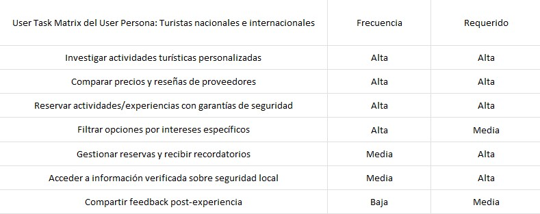
</p>

<p align="center">
    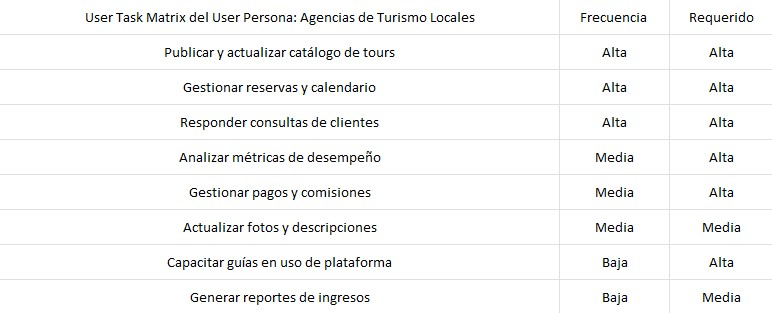
</p>

<p align="center">
    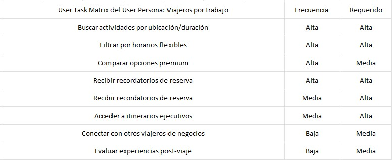
</p>

#### 2.3.3. User Journey Mapping

<p align="center">
    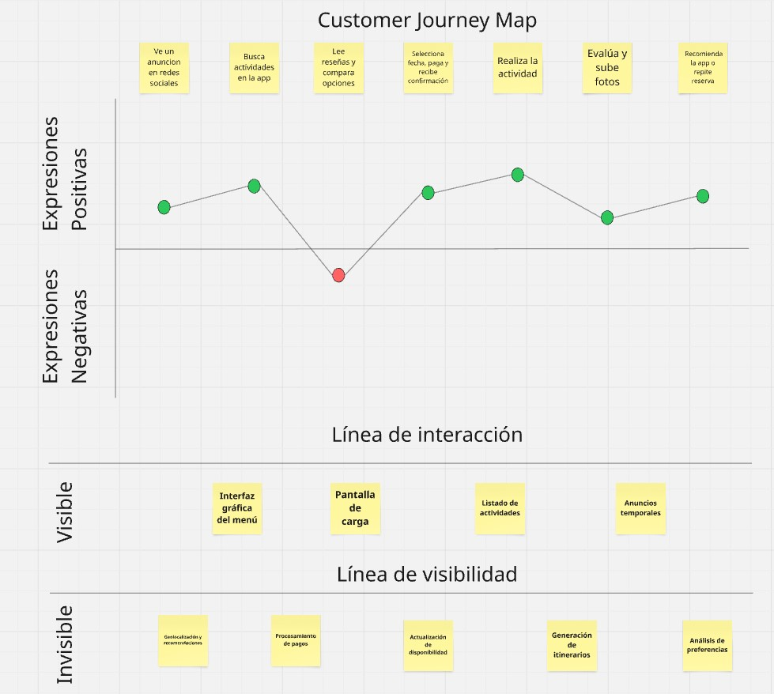
</p>

#### 2.3.4. Empathy Mapping

#### 2.3.4.1. Empathy Mapping Turistas nacionales e internacionales

<p align="center">
    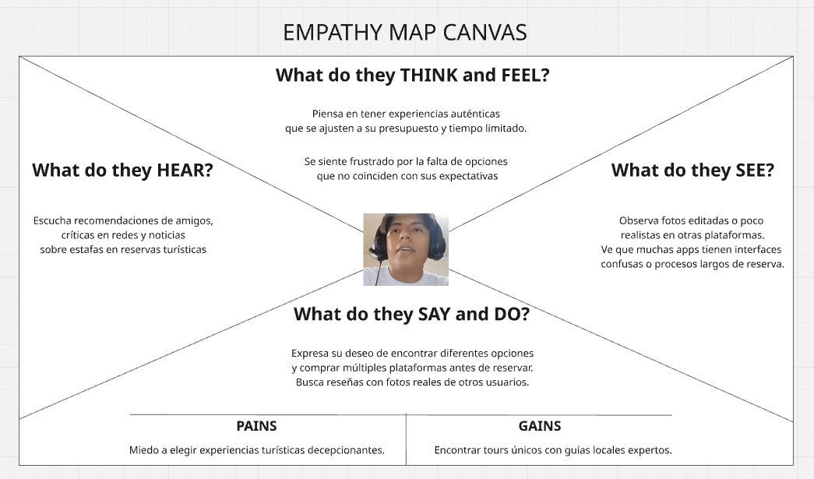
</p>

#### 2.3.4.2. Empathy Mapping Agencias de turismo locales

<p align="center">
    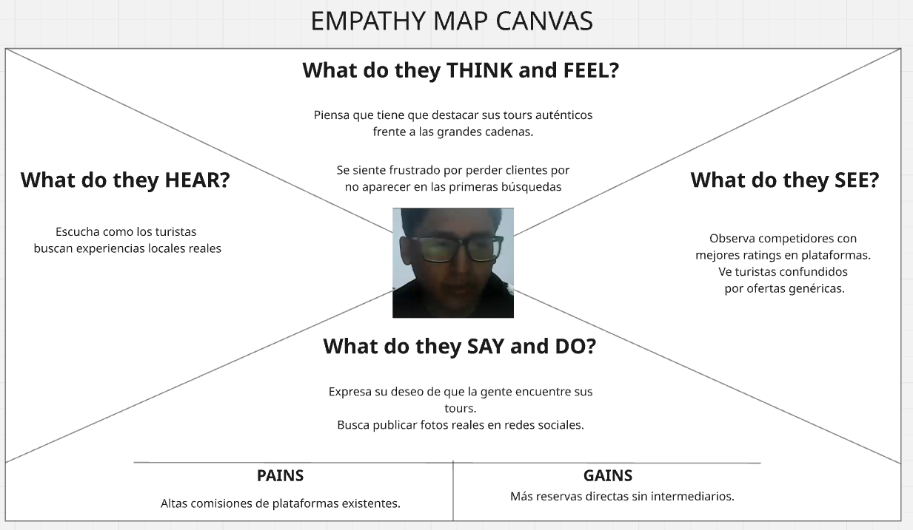
</p>

#### 2.3.4.3. Empathy Mapping Viajeros por trabajo

<p align="center">
    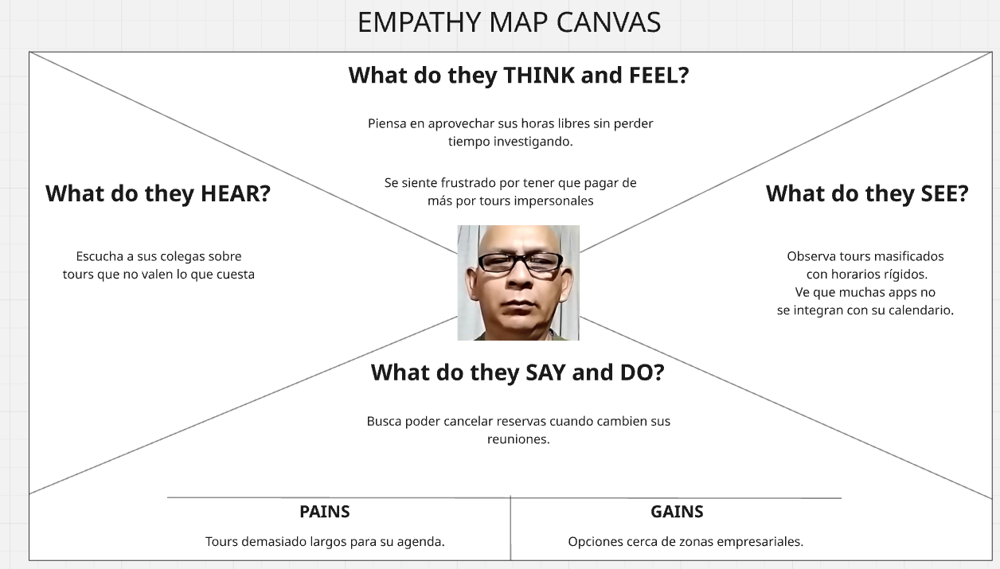
</p>

#### 2.3.5. As-is Scenario Mapping

#### 2.3.5.1. As-is Scenario Mapping Turistas nacionales e internacionales

<p align="center">
    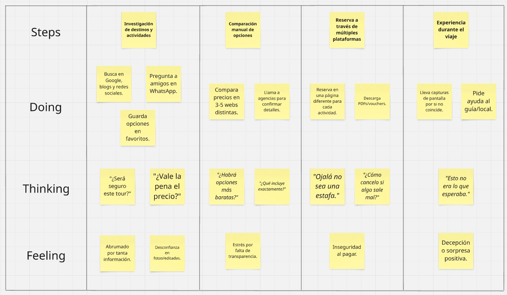
</p>

#### 2.3.5.2. As-is Scenario Mapping Agencias de turismo locales

<p align="center">
    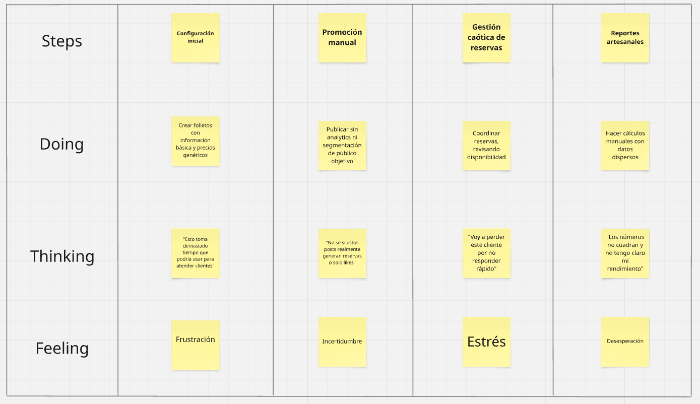
</p>

#### 2.3.5.3. As-is Scenario Mapping Viajeros por trabajo

<p align="center">
    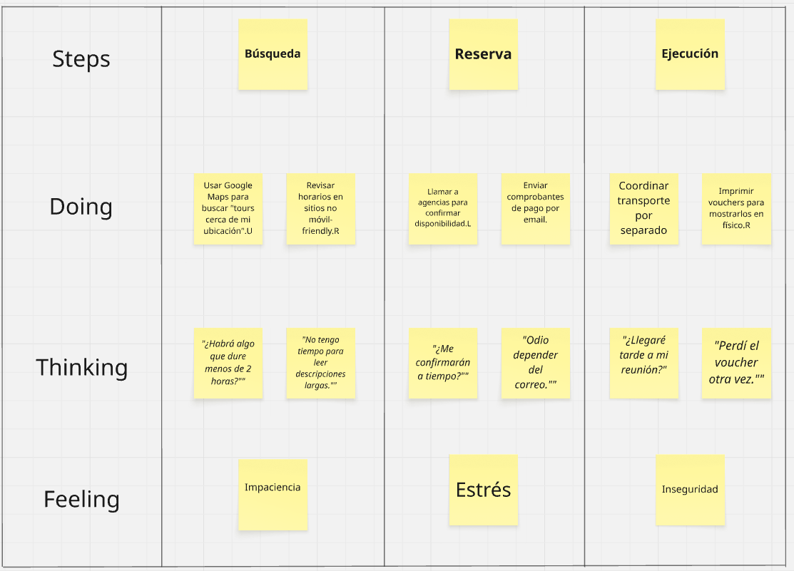
</p>

### 2.4. Ubiquitous Language

| **Término (Inglés)**       | **Término (Español)**       | **Descripción** |
|----------------------------|----------------------------|----------------|
| **Traveler**               | Viajero                    | Usuario de la plataforma que busca descubrir, reservar o personalizar experiencias turísticas, ya sea de forma individual o en grupo. |
| **Travel Agency**          | Agencia de viajes          | Entidad registrada en la plataforma que ofrece paquetes turísticos, experiencias personalizadas o servicios relacionados con viajes. |
| **Experience**             | Experiencia                | Actividad o conjunto de actividades que conforman un paquete turístico (cultural, gastronómico, deportivo, etc.). |
| **Recommended Plan**       | Plan recomendado           | Propuesta de actividades generadas automáticamente según los intereses, preferencias y perfil del viajero. |
| **Match**                  | Coincidencia / Compatibilidad | Grado de afinidad entre un viajero y una agencia o experiencia, basado en intereses, presupuesto y ubicación. |
| **Booking Request**        | Solicitud de reserva       | Acción mediante la cual un viajero inicia el proceso de reservar una experiencia o paquete. |
| **Availability**           | Disponibilidad             | Periodo de tiempo y capacidad en los que una agencia puede ofrecer una experiencia. |
| **Profile**                | Perfil                     | Datos personales y preferencias de viaje asociados a un usuario (viajero o agencia). |
| **Feedback**               | Retroalimentación          | Opiniones, comentarios o calificaciones de los viajeros después de realizar una experiencia. |
| **Tour Package**           | Paquete turístico          | Conjunto de servicios y actividades agrupadas (transporte, alojamiento, alimentación, etc.). |
| **Local Partner**          | Aliado local               | Proveedor asociado a una agencia que ofrece servicios específicos (guías, restaurantes, transportistas). |
| **Seasonality**            | Estacionalidad             | Variación en la demanda o disponibilidad según la época del año, festividades o clima. |
| **Target Audience**        | Audiencia objetivo         | Grupo de personas con características específicas (edad, intereses) al que va dirigida una experiencia. |

<hr>

## Capítulo III: Requirements Specification

### 3.1. To-Be Scenario Mapping

#### 3.1.1. To-Be Scenario Mapping Turistas nacionales e internacionales

<p align="center">
    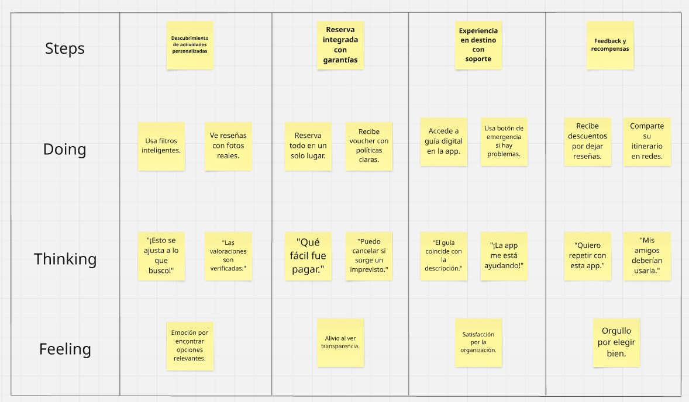
</p>

#### 3.1.2. To-Be Scenario Mapping Agencias de turismo locales

<p align="center">
    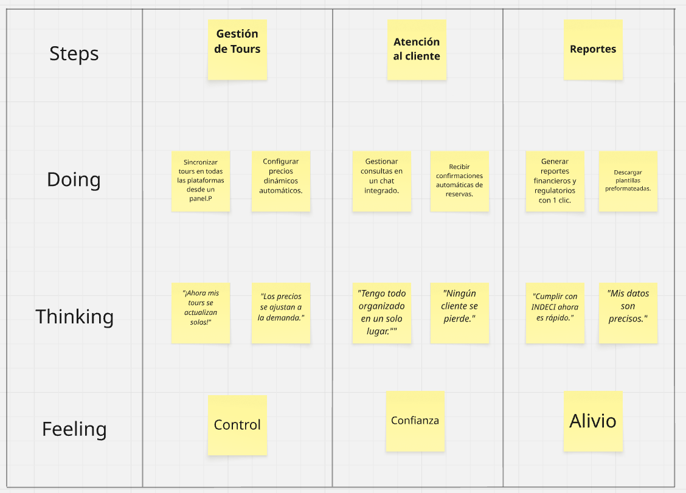
</p>

#### 3.1.3. To-Be Scenario Mapping Viajeros por trabajo

<p align="center">
    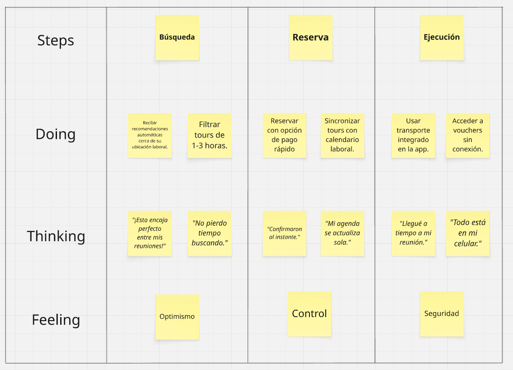
</p>

### 3.2. User Stories
#

|<p><a name="_yrbaaa2wximh"></a>Epic / Story</p><p>ID</p>|Título |Descripción |Criterios de Aceptación |Relacionado con (Epic ID)|
| :- | :- | :- | :- | :- |
|` `EP01|Gestión de usuarios|Como usuario, quiero gestionar mi perfil y preferencias para personalizar mi experiencia.|-|-|
|` `EP02|Búsqueda y reserva|Como turista, quiero explorar y reservar actividades fácilmente para planificar mi viaje sin estrés.|-|-|
|` `EP03|Herramientas para agencias|Como agencia, quiero administrar mis tours y clientes para optimizar mis operaciones.|-|-|
|US01|Registro básico|Como nuevo usuario, quiero registrarme con un email para acceder a la plataforma.|<p>- Scenario 1: Registro exitoso<br>  Dado que estoy en la pantalla de registro, cuando ingreso mi email y contraseña válida, entonces recibo un email de confirmación.</p><p>- Scenario 2: Email inválido<br>  Dado que estoy en la pantalla de registro, cuando ingreso un email sin "@", entonces el sistema muestra "Ingrese un email válido".</p>|EP01|
|US02|Inicio de sesión|Como usuario registrado, quiero iniciar sesión para gestionar mis reservas.|<p>- Scenario 1: Credenciales correctas<br>  Dado que tengo credenciales válidas, cuando las ingreso, entonces accedo a mi perfil.</p><p>- Scenario 2: Contraseña incorrecta<br>  Dado que ingreso un email válido, cuando ingreso una contraseña errónea, entonces el sistema muestra "Credenciales inválidas".</p>|EP01|
|US03|Perfil corporativo|Como viajero corporativo, quiero vincularme con mi empresa para obtener beneficios exclusivos.|<p>- Scenario 1: Verificación exitosa<br>  Dado que soy usuario corporativo, cuando subo mi credencial laboral válida, entonces mi perfil muestra un sello verificador.</p><p>- Scenario 2: Documento rechazado<br>  Dado que subo un documento ilegible, cuando el sistema lo revisa, entonces muestra "Documento no válido".</p>|EP01|
|US04|Preferencias de viaje|Como turista, quiero seleccionar mis intereses para recibir recomendaciones personalizadas.|<p>- Scenario 1: Actualización exitosa<br>  Dado que actualizo mis preferencias, cuando busco actividades, entonces veo opciones relevantes.</p><p>- Scenario 2: Sin preferencias</p><p>&emsp;Dado que no selecciono intereses, cuando busco actividades, entonces veo recomendaciones generales.</p>|EP01|
|US05|Recuperar contraseña|Como usuario, quiero restablecer mi contraseña si la olvido para recuperar el acceso.|<p>- Scenario 1: Solicitud exitosa<br>  Dado que solicito restablecer contraseña, cuando ingreso mi email registrado, entonces recibo un enlace temporal.</p><p>- Scenario 2: Email no registrado<br>  Dado que ingreso un email no existente, cuando solicito restablecer, entonces el sistema muestra "Email no encontrado".</p>|EP01|
|US06|Verificación de identidad|Como usuario premium, quiero verificar mi identidad para desbloquear reservas exclusivas.|<p>- Scenario 1: Verificación aprobada<br>  Dado que subo mi documento de identidad válido, cuando es aprobado, entonces puedo reservar tours premium.</p><p>- Scenario 2: Documento vencido<br>  Dado que subo un DNI vencido, cuando el sistema lo revisa, entonces muestra "Documento no válido".</p>|EP01|
|US07|Notificaciones push|Como usuario, quiero recibir alertas sobre ofertas para no perderme promociones.|<p>- Scenario 1: Notificación recibida<br>  Dado que activo notificaciones, cuando hay una oferta en mis favoritos, entonces recibo una alerta.</p><p>- Scenario 2: Notificación desactivada<br>  Dado que desactivo notificaciones, cuando hay una oferta, entonces no recibo alertas.</p>|EP01|
|US08|Idiomas|Como usuario internacional, quiero cambiar el idioma de la app para entender mejor.|<p>- Scenario 1: Cambio a inglés<br>  Dado que selecciono "Inglés", cuando guardo los cambios, entonces toda la interfaz se traduce.</p><p>- Scenario 2: Idioma no disponible<br>  Dado que selecciono un idioma no soportado, cuando intento guardar, entonces el sistema muestra "Idioma no disponible".</p>|EP01|
|US09|Perfil público|Como viajero, quiero compartir mis reseñas para ayudar a otros turistas.|<p>- Scenario 1: Reseña publicada<br>  Dado que completo una actividad, cuando escribo una reseña, entonces aparece en mi perfil público.</p><p>- Scenario 2: Reseña vacía<br>  Dado que no ingreso texto, cuando intento publicar, entonces el sistema muestra "Escribe tu opinión".</p>|EP01|
|US10|Eliminar cuenta|Como usuario, quiero borrar mi cuenta para proteger mi privacidad.|<p>- Scenario 1: Eliminación confirmada<br>  Dado que solicito eliminar mi cuenta, cuando confirmo, entonces todos mis datos se borran en 72h.</p><p>- Scenario 2: Cancelación de eliminación</p><p>&emsp;Dado que inicio el proceso, cuando cancelo, entonces mi cuenta permanece activa.</p>|EP01|
|US11|Filtros avanzados|Como turista, quiero filtrar actividades por precio y tipo para encontrar opciones relevantes.|<p>- Scenario 1: Filtrado por precio exitoso<br>  Dado que uso los filtros, cuando aplico "precio < $50", entonces veo solo tours económicos.</p><p>- Scenario 2: Sin resultados coincidentes<br>  Dado que filtro por "precio < S/.20", cuando no hay tours disponibles, entonces el sistema muestra "No encontramos coincidencias".</p>|EP02|
|US12|Comparar tours|Como usuario, quiero comparar múltiples tours en una vista para tomar la mejor decisión.|<p>- Scenario 1: Comparación exitosa<br>  Dado que selecciono 3 tours, cuando hago clic en "Comparar", entonces veo diferencias claras en una tabla.</p><p>- Scenario 2: Selección insuficiente<br>  Dado que selecciono solo 1 tour, cuando intento comparar, entonces el sistema muestra "Seleccione al menos 2 tours".</p>|EP02|
|US13|Reserva flexible|Como turista, quiero cancelar gratis hasta 48h antes para mayor seguridad.|<p>- Scenario 1: Cancelación dentro del plazo<br>  Dado que reservo un tour, cuando cancelo 24h antes, entonces recibo reembolso automático.</p><p>- Scenario 2: Cancelación tardía<br>  Dado que cancelo 12h antes, cuando intento reembolsar, entonces el sistema muestra "Fuera del plazo de cancelación".</p>|EP02|
|US14|Reservas grupales|Como viajero corporativo, quiero reservar para mi equipo para simplificar la logística.|<p>- Scenario 1: Reserva grupal exitosa<br>  Dado que añado 5 participantes, cuando completo el pago, entonces todos reciben confirmación por email.</p><p>- Scenario 2: Límite excedido<br>  Dado que intento añadir 15 personas, cuando el tour tiene límite de 10, entonces el sistema muestra "Cupo máximo alcanzado".</p>|EP02|
|US15|Favoritos|Como usuario, quiero guardar actividades interesantes para revisarlas después.|<p>- Scenario 1: Guardar en favoritos<br>  Dado que hago clic en "Guardar", cuando voy a "Mis Favoritos", entonces veo la actividad listada.</p><p>- Scenario 2: Eliminar de favoritos<br>  Dado que elimino un tour de favoritos, cuando actualizo la página, entonces desaparece de la lista.</p>|EP02|
|US16|Chat con guías|Como usuario, quiero preguntar detalles a los guías antes de reservar para aclarar dudas.|<p>- Scenario 1: Respuesta rápida</p><p>&emsp;Dado que abro el chat, cuando envío una pregunta, entonces recibo respuesta en menos de 10 minutos.</p><p>- Scenario 2: Fuera de horario<br>  Dado que pregunto a las 3 AM, cuando el guía no está disponible, entonces el sistema muestra "Respuesta en 8-12h".</p>|EP02|
|US17|Mapas interactivos|Como turista, quiero ver la ubicación exacta de los tours para planificar mi ruta.|<p>- Scenario 1: Visualización de ruta<br>  Dado que abro un tour, cuando hago clic en "Ver mapa", entonces se muestra la ruta exacta con puntos de interés.</p><p>- Scenario 2: Sin conexión a internet<br>  Dado que no tengo internet, cuando intento cargar el mapa, entonces el sistema muestra "Active su conexión".</p>|EP02|
|US18|Chat con guías|Como turista, quiero previsualizar tours con RA para imaginarme la experiencia.|<p>- Scenario 1: Vista RA exitosa<br>  Dado que selecciono "Vista RA", cuando apunto mi cámara, entonces veo un modelo 3D del tour.</p><p>- Scenario 2: Dispositivo no compatible<br>  Dado que mi teléfono no soporta RA, cuando intento acceder, entonces el sistema muestra "Función no disponible".</p>|EP02|
|US19|Realidad aumentada|Como viajero, quiero generar un itinerario diario automático para optimizar mi tiempo.|<p>- Scenario 1: Itinerario generado<br>  Dado que selecciono actividades, cuando hago clic en "Planificar", entonces recibo una agenda ordenada por horarios.</p><p>- Scenario 2: Actividades incompatibles<br>  Dado que selecciono tours con horarios superpuestos, cuando intento planificar, entonces el sistema muestra "Conflicto de horarios".</p>|EP02|
|US20|Itinerarios automáticos|Como usuario, quiero dividir el pago en cuotas para gestionar mejor mi presupuesto.|<p>- Scenario 1: Pago fraccionado<br>  Dado que selecciono "Pagar en cuotas", cuando elijo 3 meses, entonces el monto total se divide en partes iguales.</p><p>- Scenario 2: Límite de cuotas excedido<br>  Dado que intento dividir en 12 cuotas, cuando el límite es 6, entonces el sistema muestra "Máximo 6 cuotas permitidas".</p>|EP02|
|US21|Pago en cuotas|Como agencia, quiero subir nuevos tours con fotos y descripciones para atraer clientes.|<p>- Scenario 1: Publicación exitosa<br>  Dado que completo el formulario, cuando lo envío, entonces el tour aparece tras aprobación en 24h.</p><p>- Scenario 2: Fotos faltantes<br>  Dado que no subo imágenes, cuando intento publicar, entonces el sistema muestra "Agregue al menos 3 fotos".</p>|EP03|
|US22|Calendario en tiempo real|Como agencia, quiero actualizar la disponibilidad para evitar sobre-reservas.|<p>- Scenario 1: Actualización exitosa<br>  Dado que modifico fechas, cuando guardo cambios, entonces los usuarios ven slots actualizados al instante.</p><p>- Scenario 2: Fechas inválidas<br>  Dado que ingreso una fecha pasada, cuando intento guardar, entonces el sistema muestra "Seleccione una fecha futura".</p>|EP03|
|US23|Analytics|Como agencia, quiero ver métricas de reservas para mejorar mis estrategias.|<p>- Scenario 1: Visualización de datos<br>  Dado que accedo al dashboard, cuando filtro por mes, entonces veo gráficos de rendimiento con porcentajes.</p><p>- Scenario 2: Sin datos disponibles<br>  Dado que no tengo reservas en el mes, cuando reviso analytics, entonces el sistema muestra "No hay datos para mostrar".</p>|EP03|
|US24|Alertas de reservas|Como agencia, quiero recibir notificaciones de nuevas reservas para prepararme.|<p>- Scenario 1: Notificación inmediata<br>  Dado que hay una reserva nueva, cuando se confirma, entonces recibo un email/app notification con detalles.</p><p>- Scenario 2: Notificaciones silenciadas<br>  Dado que desactivo alertas, cuando hay una reserva, entonces no recibo notificaciones.</p>|EP03|
|US25|Crear promociones|Como agencia, quiero ofrecer descuentos en temporada baja para atraer más clientes.|<p>- Scenario 1: Promoción activada<br>  Dado que creo una promoción, cuando la publico, entonces aparece un sello "Oferta" en el tour.</p><p>- Scenario 2: Descuento inválido<br>  Dado que intento aplicar un 200% de descuento, cuando guardo, entonces el sistema muestra "Máximo 50% de descuento".</p>|EP03|
|US26|Gestión de guías|Como agencia, quiero asignar guías a tours específicos para organizar mi equipo.|<p>- Scenario 1: Asignación exitosa<br>  Dado que asigno un guía, cuando guardo los cambios, entonces el guía recibe una notificación con detalles.</p><p>- Scenario 2: Guía no disponible<br>  Dado que selecciono un guía en otra actividad, cuando intento asignar, entonces el sistema muestra "Guía ocupado en esas fechas".</p>|EP03|
|US27|Encuestas a clientes|Como agencia, quiero enviar encuestas post-viaje para medir la satisfacción.|<p>- Scenario 1: Encuesta enviada<br>  Dado que un tour finaliza, cuando envío la encuesta, entonces recibo respuestas en mi dashboard en 48h.</p><p>- Scenario 2: Cliente no responde<br>  Dado que pasan 7 días, cuando el cliente no contesta, entonces el sistema marca "No respondida".</p>|EP03|
|US28|Verificación de agencia|Como agencia, quiero verificar mi negocio para ganar confianza de los clientes.|<p>- Scenario 1: Cuenta verificada<br>  Dado que subo mis documentos, cuando son aprobados, entonces mi perfil muestra un sello "Verificado".</p><p>- Scenario 2: Documentación incompleta<br>  Dado que no subo mi RUC, cuando intento verificar, entonces el sistema muestra "Falta documentación legal".</p>|EP03|
|US29|Soporte prioritario|Como agencia, quiero acceder a soporte rápido para resolver problemas urgentes.|<p>- Scenario 1: Respuesta inmediata<br>  Dado que contacto a soporte, cuando envío mi consulta, entonces recibo respuesta en menos de 5 minutos.</p><p>- Scenario 2: Consulta no urgente</p><p>&emsp;Dado que pregunto por mejoras, cuando no marco "Urgente", entonces recibo respuesta en 24h.</p>|EP03|
|US30|Integración con redes|Como agencia, quiero compartir mis tours en redes sociales para aumentar mi visibilidad.|<p>- Scenario 1: Publicación automática</p><p>&emsp;Dado que hago clic en "Compartir", cuando elijo Instagram, entonces se publica con fotos y descripción.</p><p>- Scenario 2: Red no conectada<br>  Dado que no vincule mi Facebook, cuando intento compartir, entonces el sistema muestra "Conecte su cuenta primero".</p>|EP03|
#

### 3.3. Impact Mapping

<p align="center">
    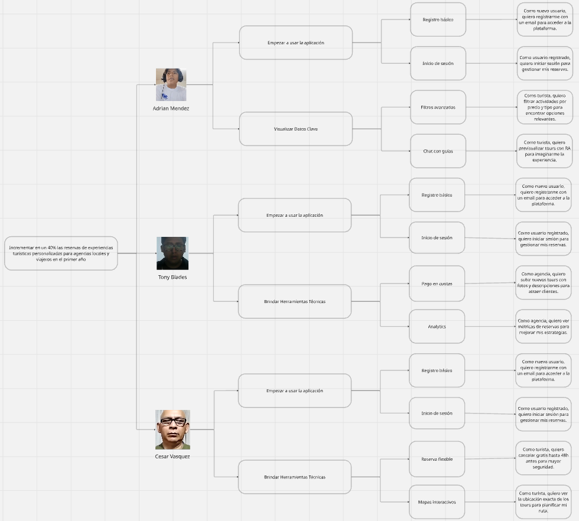
</p>

### 3.4. Product Backlog

#

|<a name="_lphm1b3yegrj"></a># Orden|User Story Id|Título|Descripción|Story Points (1 / 2 / 3 / 5 / 8)|
| :- | :- | :- | :- | :- |
|1|US01|Gestión de usuarios|Como usuario, quiero gestionar mi perfil y preferencias para personalizar mi experiencia.|3|
|2|US02|Búsqueda y reserva|Como turista, quiero explorar y reservar actividades fácilmente para planificar mi viaje sin estrés.|2|
|3|US03|Herramientas para agencias|Como agencia, quiero administrar mis tours y clientes para optimizar mis operaciones.|5|
|4|US04|Registro básico|Como nuevo usuario, quiero registrarme con un email para acceder a la plataforma.|5|
|5|US05|Inicio de sesión|Como usuario registrado, quiero iniciar sesión para gestionar mis reservas.|8|
|6|US06|Perfil corporativo|Como viajero corporativo, quiero vincularme con mi empresa para obtener beneficios exclusivos.|8|
|7|US07|Preferencias de viaje|Como turista, quiero seleccionar mis intereses para recibir recomendaciones personalizadas.|5|
|8|US08|Recuperar contraseña|Como usuario, quiero restablecer mi contraseña si la olvido para recuperar el acceso.|3|
|9|US09|Verificación de identidad|Como usuario premium, quiero verificar mi identidad para desbloquear reservas exclusivas.|3|
|10|US10|Notificaciones push|Como usuario, quiero recibir alertas sobre ofertas para no perderme promociones.|8|
|11|US11|Idiomas|Como usuario internacional, quiero cambiar el idioma de la app para entender mejor.|2|
|12|US12|Perfil público|Como viajero, quiero compartir mis reseñas para ayudar a otros turistas.|5|
|13|US13|Eliminar cuenta|Como usuario, quiero borrar mi cuenta para proteger mi privacidad.|5|
|14|US14|Filtros avanzados|Como turista, quiero filtrar actividades por precio y tipo para encontrar opciones relevantes.|2|
|15|US15|Comparar tours|Como usuario, quiero comparar múltiples tours en una vista para tomar la mejor decisión.|3|
|16|US16|Reserva flexible|Como turista, quiero cancelar gratis hasta 48h antes para mayor seguridad.|3|
|17|US17|Reservas grupales|Como viajero corporativo, quiero reservar para mi equipo para simplificar la logística.|8|
|18|US18|Favoritos|Como usuario, quiero guardar actividades interesantes para revisarlas después.|5|
|19|US19|Chat con guías|Como usuario, quiero preguntar detalles a los guías antes de reservar para aclarar dudas.|5|
|20|US20|Mapas interactivos|Como turista, quiero ver la ubicación exacta de los tours para planificar mi ruta.|3|
|21|US21|Chat con guías|Como turista, quiero previsualizar tours con RA para imaginarme la experiencia.|5|
|22|US22|Realidad aumentada|Como viajero, quiero generar un itinerario diario automático para optimizar mi tiempo.|3|
|23|US23|Itinerarios automáticos|Como usuario, quiero dividir el pago en cuotas para gestionar mejor mi presupuesto.|5|
|24|US24|Pago en cuotas|Como agencia, quiero subir nuevos tours con fotos y descripciones para atraer clientes.|2|
|25|US25|Calendario en tiempo real|Como agencia, quiero actualizar la disponibilidad para evitar sobre-reservas.|2|
|26|US26|Analytics|Como agencia, quiero ver métricas de reservas para mejorar mis estrategias.|5|
|27|US27|Alertas de reservas|Como agencia, quiero recibir notificaciones de nuevas reservas para prepararme.|3|
|28|US28|Crear promociones|Como agencia, quiero ofrecer descuentos en temporada baja para atraer más clientes.|3|
|29|US29|Gestión de guías|Como agencia, quiero asignar guías a tours específicos para organizar mi equipo.|5|
|30|US30|Encuestas a clientes|Como agencia, quiero enviar encuestas post-viaje para medir la satisfacción.|3|

<hr>

## Capítulo IV: Product Design

### 4.1. Style Guidelines

Esta sección establece un conjunto de directrices visuales y de interacción coherentes que funcionarán como fuente central de referencia para el equipo de diseño, desarrollo y comunicación de TravelMatch.
El objetivo es garantizar una presentación unificada, profesional y alineada con la esencia de la marca: conectar a turistas con experiencias auténticas, de manera simple y confiable.

#### 4.1.1. General Style Guidelines

- _Branding:_    
    - La identidad visual de TravelMatch es moderna, cercana y confiable. El logotipo incorpora dos figuras humanas estilizadas unidas en un gesto de conexión, lo que simboliza el espíritu colaborativo y humano de la plataforma.
    - Uso del logotipo: El logotipo debe usarse preferentemente sobre fondos claros (beige, blanco o pastel neutro). En fondos oscuros, se permite una versión monocromática blanca o en azul marino (#1C1F2B).
    - No se permite:
        - Rotar el logotipo.
        - Aplicar sombras, contornos o degradados.
        - Cambiar la tipografía original de la palabra TravelMatch.

<p align="center">
    
</p>

- _Typography:_
    - La tipografía utilizada en el logotipo es una fuente sans-serif geométrica, amigable y legible. Para mantener coherencia, se adoptará un sistema tipográfico similar en toda la aplicación.

    - Fuente primaria: Nunito Sans
        - Uso: Títulos, botones, navegación.
        - Estilos permitidos: Regular, SemiBold, Bold.

    - Fuente secundaria: Inter
        - Uso: Cuerpos de texto largos, formularios.

    - Tamaños recomendados:
        - Título principal (H1): 32px / 700
        - Subtítulo (H2): 24px / 600
        - Texto normal: 16px / 400
        - Nota o ayuda: 12px / 400

<div align="center">    

| Nombre de fuente | Tipografia |
|:----------------:|:----------:|
| Nunito Sans |  |
| Inter |  |  
    
</div>      
              
- _Colors:_
    - La paleta de TravelMatch se basa en contrastes suaves y un color protagonista: azul marino profundo, que transmite confianza y estabilidad. Se acompaña de colores neutros y un acento cálido para llamados a la acción

<div align="center">    

| Color | Hex | Uso Principal | 
|:-----:|:---:|:-------------:|
|Azul Marino| #1C1F2B | Texto principal, logotipo, botones|
|Beige Claro| #F5F0E6 | Fondo base|
|Gris Suave| #B3B3B3 | Bordes, textos secundarios|
|Azul Claro| #3A71C1 | Enlaces, botones secundarios|
|Amarillo Arena| #FFD479| Llamado a la acción / iconos |
|Blanco| #FFFFFF|Fondos, tarjetas, formularios|

</div>

<p align="center">
    
</p>

- _Spacing:_
    - La coherencia en el espaciado es clave para una interfaz limpia y clara.
        - Espaciado entre secciones principales: 32px
        - Margen interno de botones y campos: 12px vertical / 20px horizontal
        - Separación entre elementos repetitivos (cards, ítems): 16px
        - Padding general de contenedores: 24px

- _Tono de comunicación y lenguaje:_
    - El tono de TravelMatch es cercano, entusiasta y profesional.

<div align="center">    

| Estilo de redacción | Tono predominante |
|---------------------|-------------------|
| 1. Amigable y claro <br> 2. Sin tecnicismos innecesarios <br> 3. Verbos en voz activa <br> 4. Enfocado en beneficios (“Descubre experiencias únicas”, “Reserva en segundos”)| 1. Formal-casual: Respetuoso, pero no rígido. <br> 2. Entusiasta: Inspirador, motivador, acogedor. <br> 3. Directo: Frases cortas y llamadas a la acción claras. |

</div>


#### 4.1.2. Web Style Guidelines

- _Responsive Design Standards:_  
    TravelMatch está diseñado como una aplicación web mobile-first, adaptándose fluidamente a diferentes dispositivos:

    - **Mobile (360px - 768px):**  
        - Navegación tipo hamburguesa.  
        - Cards apiladas en columna.  
        - Botones grandes y legibles.  

    - **Tablet (769px - 1024px):**  
        - Layout en 2 columnas.  
        - Menú lateral colapsable.  

    - **Desktop (1025px en adelante):**  
        - Menú principal visible.  
        - Layout de 3 columnas donde sea posible.  

    Todos los componentes deben utilizar **flexbox/grid** con puntos de quiebre en 768px y 1024px.

- _Interactivity:_  
    - **Botones:**  
        - Bordes redondeados (border-radius: 12px).  
        - Hover: cambio de fondo o sombra suave (box-shadow: 0px 2px 8px rgba(0, 0, 0, 0.1)).  
        - Feedback claro al clic (cambio de color, animación sutil).  

    - **Transiciones y animaciones:**  
        - Duración: 200–300ms.  
        - Usar ease-in-out.  
        - Aplicables en sliders, modales, tooltips y feedback de formularios.

- _Accessibility:_  
    - Contrastes de texto cumplen con **WCAG AA** como mínimo.  
    - Todo ícono debe tener alternativa textual (aria-label o alt).  
    - Navegación compatible con teclado (Tab, Enter, Esc).  
    - Uso de role, aria-expanded, aria-hidden en componentes dinámicos.  
    - Fuente mínima: 16px.

- _UI Consistency:_  
    - Uso de un sistema de componentes reutilizables: botones, tarjetas, inputs, modales.  
    - Evitar cambios de estilo arbitrarios entre páginas.  
    - Todos los formularios deben compartir un estilo común:  
        - Etiqueta arriba, campo debajo, mensaje de error abajo.  
        - Validaciones claras y mensajes amigables.

### 4.2. Information Architecture

La arquitectura de la información de TravelMatch está diseñada para asegurar que tanto visitantes nuevos como usuarios recurrentes puedan encontrar, descubrir e interactuar con el contenido de manera natural e intuitiva. Esta estructura se adapta a las necesidades específicas de cada entorno (Landing Page, Aplicación Web y Aplicación Móvil) manteniendo consistencia visual, semántica y funcional.

Los sistemas de organización, etiquetado, navegación y búsqueda han sido definidos considerando la diversidad de usuarios, el volumen de información creciente y la importancia de una experiencia centrada en el usuario.

#### 4.2.1. Organization Systems

La estructura de organización de contenido en TravelMatch combina distintas estrategias según el tipo de información presentada y la etapa del recorrido del usuario:

- _Visual Hierarchy (Jerarquía Visual)_

    Se utilizará ampliamente en todas las interfaces (Landing Page, Home de la App, Detalles de experiencia) para facilitar la comprensión inmediata del contenido. La disposición jerárquica prioriza los elementos según su importancia relativa, estableciendo tamaños, colores y posiciones diferenciadas para:    

    - Títulos y encabezados principales.
    - Imágenes destacadas (experiencias recomendadas, destinos top).
    - Llamados a la acción (botones de "Reservar", "Explorar", "Ver más").

    Esto permitirá que el usuario escanee el contenido rápidamente y entienda qué acciones tomar en cada momento.

- _Sequential Organization (Organización Secuencial)_

    Se aplicará principalmente en los flujos de interacción del usuario, especialmente en procesos donde se requiere una acción paso a paso, como:

    - Registro de usuario y onboarding personalizado.
    - Filtros para construir recomendaciones de experiencia.
    - Proceso de reserva y confirmación.
    - Creación de perfil o preferencias de viaje.

    Cada uno de estos pasos se presentará de forma clara y continua, indicando el progreso del usuario y minimizando fricciones en la interacción.

- _Matricial (Matrix Organization)_

    Este sistema será utilizado en secciones donde el usuario debe explorar múltiples opciones simultáneamente, sin un orden específico, como:

    - Búsqueda de experiencias por filtros combinables.
    - Exploración de destinos por tipo de actividad (gastronomía, aventura, cultura, etc.).
    - Vista de resultados personalizados o tendencias.

    Los usuarios podrán elegir entre distintos atributos (ubicación, duración, tipo de experiencia, nivel de actividad, etc.) y la interfaz responderá dinámicamente.

- _Categorización de Contenido_

    Para optimizar la navegación y la personalización de la experiencia del usuario, TravelMatch adopta una categorización estratégica que responde tanto a las expectativas de los turistas como a las necesidades operativas de la plataforma. Los esquemas de categorización se aplicarán según el contexto de uso y el tipo de información, permitiendo al usuario filtrar, explorar y decidir con facilidad.

    - **Por tópicos:** Las experiencias se agruparán por categorías temáticas (Ej. “Aventura al aire libre”, “Gastronomía local”, “Arte y cultura”).
    - **Por audiencia:** Algunas secciones estarán personalizadas para distintos perfiles de usuario (parejas, viajeros solitarios, familias, etc.).
    - **Cronológico:** Se utilizará en listas de reservas pasadas y próximas, así como en contenido destacado por temporada o eventos locales.
    - **Alfabético:** Aplicable para listados largos como ciudades, destinos o idiomas disponibles en preferencias.

#### 4.2.2. Labeling Systems

En TravelMatch, el sistema de etiquetado ha sido diseñado para maximizar la claridad y minimizar la carga cognitiva del usuario. Todas las etiquetas empleadas en la plataforma —tanto en la navegación como en el contenido— están orientadas a la simplicidad, consistencia semántica y a un lenguaje cercano, inclusivo y fácil de comprender, sin sacrificar la precisión funcional.

- _Principios clave del sistema de etiquetado:_  
    - **Claridad ante todo:**  
        Las etiquetas evitarán tecnicismos o ambigüedades. Se utilizarán palabras comunes para que cualquier usuario —sin importar su nivel de experiencia digital o cultural— pueda entenderlas.  
    - **Consistencia terminológica:**  
        Un mismo concepto se nombrará de la misma forma en todos los entornos (web, móvil, comunicaciones, emails transaccionales).  
    - **Longitud mínima:**  
        Se privilegiará el uso de etiquetas cortas (1 a 3 palabras), pero descriptivas.  
    - **Prioridad visual:**  
        Se jerarquizará tipográficamente cada tipo de etiqueta, destacando acciones o categorías principales con estilos tipográficos definidos en la guía de estilo.

- _Etiquetas principales por área:_  
    - **Navegación global:**  
        - Explorar  
        - Mi Perfil  
        - Favoritos  
        - Recomendaciones  
        - Mis Reservas  
        - Ayuda  

    - **Landing Page:**  
        - Encuentra tu próxima aventura  
        - ¿Cómo funciona TravelMatch?  
        - Experiencias destacadas  
        - Únete como agencia  
        - Testimonios  

    - **Filtrado y búsqueda:**  
        - Tipo de experiencia (Ej. “Cultural”, “Aventura”, “Relax”)  
        - Duración (Ej. “Medio día”, “1 día completo”, “Fin de semana”)  
        - Nivel de actividad (Ej. “Baja”, “Moderada”, “Alta”)  
        - Destino  
        - Precio  

    - **Acciones del usuario:**  
        - Reservar ahora  
        - Guardar experiencia  
        - Compartir  
        - Ver más detalles  
        - Editar perfil  
        - Cerrar sesión  

    - **Agencias (vista especial):**  
        - Publicar nueva experiencia  
        - Gestionar reservas  
        - Estadísticas  
        - Planes y visibilidad  
        - Mensajes recibidos  

- _Asociaciones entre etiquetas:_  
    - Se utilizarán etiquetas compuestas en ciertos casos para clarificar relaciones entre conceptos, como:  
        - “Experiencia recomendada”  
        - “Destino popular”  
        - “Nuevo mensaje”  
        - “Agencia verificada”  

    - Las etiquetas de acciones estarán siempre acompañadas de íconos representativos para reforzar la asociación visual y acelerar la comprensión.  
    - En formularios y filtros, los campos estarán precedidos por etiquetas que indiquen claramente qué se espera del usuario (Ej. “Selecciona una fecha”, “Elige un destino”).

#### 4.2.3. SEO Tags and Meta Tags

Para TravelMatch, contar con una estructura sólida de SEO y metadatos es esencial para maximizar la visibilidad orgánica en motores de búsqueda y mejorar la experiencia al compartir enlaces en redes sociales y otras plataformas. A continuación, se definen los valores clave que serán implementados tanto en la Landing Page como en la Web Application, alineados con nuestra propuesta de valor y el tono de la marca.

- _Landing Page:_  
    - **Title:**  
        TravelMatch | Conecta con tu próxima experiencia de viaje personalizada  
    - **Meta Description:**  
        Descubre viajes únicos con agencias locales verificadas. En TravelMatch conectamos turistas con experiencias a medida, sin complicaciones.  
    - **Meta Keywords:**  
        viajes personalizados, agencias locales, experiencias de viaje, turismo inteligente, tours recomendados, actividades, destinos  
    - **Meta Author:**  
        TravelMatch Team  
    - **Open Graph Tags (para redes sociales):**  
        ```html
        <meta property="og:title" content="TravelMatch | Conecta con tu próxima experiencia de viaje personalizada" />
        <meta property="og:description" content="Descubre viajes únicos con agencias locales verificadas. En TravelMatch conectamos turistas con experiencias a medida, sin complicaciones." />
        <meta property="og:image" content="https://travelmatch.app/assets/social-preview.jpg" />
        <meta property="og:url" content="https://travelmatch.app" />
        <meta property="og:type" content="website" />
        ```
    - **Twitter Cards (formato enriquecido):**  
        ```html
        <meta name="twitter:card" content="summary_large_image" />
        <meta name="twitter:title" content="TravelMatch | Conecta con tu próxima experiencia de viaje personalizada" />
        <meta name="twitter:description" content="Descubre viajes únicos con agencias locales verificadas. En TravelMatch conectamos turistas con experiencias a medida, sin complicaciones." />
        <meta name="twitter:image" content="https://travelmatch.app/assets/social-preview.jpg" />
        ```

- _Web Application (post-login):_  
    - **Title:**  
        TravelMatch | Tu espacio de viajes personalizados  
    - **Meta Description:**  
        Gestiona tus experiencias, descubre nuevas aventuras y mantente en contacto con agencias confiables. Todo en un solo lugar.  
    - **Meta Keywords:**  
        perfil viajero, gestionar reservas, recomendaciones de viaje, experiencias favoritas, viajes a medida  
    - **Meta Author:**  
        TravelMatch Platform  
    - **Canonical URL:**  
        Las páginas clave de la app tendrán URLs canónicas bien definidas para evitar problemas de contenido duplicado, especialmente en vistas filtradas.

- _Consideraciones adicionales:_  
    - Se implementarán etiquetas dinámicas en la web app para experiencias individuales y perfiles de agencia, lo cual permitirá SEO personalizado por contenido.  
    - Se aplicarán **alt attributes** descriptivos y útiles en todas las imágenes, especialmente aquellas que se vinculen con experiencias o destinos.  
    - Se cuidará el rendimiento de carga (**Core Web Vitals**) como parte del SEO técnico, priorizando tiempos rápidos de respuesta en dispositivos móviles. 

#### 4.2.4. Searching Systems

El sistema de búsqueda de TravelMatch está diseñado para facilitar a los usuarios la localización rápida y eficiente de experiencias turísticas relevantes. El objetivo es minimizar la frustración del usuario y maximizar la descubribilidad del contenido, aún ante grandes volúmenes de información y diversidad de ofertas.

- _Turistas: Búsqueda de experiencias:_  
    Los turistas acceden a un motor de búsqueda central ubicado en la vista principal de la plataforma. Este sistema incluirá:  
    - **Barra de búsqueda por palabra clave:**  
        - Autocompletado inteligente para sugerir términos relevantes.  
    - **Filtros dinámicos combinables:**  
        - Tipo de actividad (aventura, cultural, gastronómica, relajación, etc.).  
        - Ubicación geográfica (país, ciudad, región).  
        - Precio (rango mínimo y máximo).  
        - Duración estimada de la experiencia.  
        - Idioma del guía.  
        - Fecha de disponibilidad.  
        - Valoración promedio.  
    - **Sistema de etiquetado (tags):**  
        Los resultados podrán filtrarse también por etiquetas asignadas por agencias o derivadas del comportamiento de otros usuarios (ej. “para familias”, “eco-friendly”, “pet-friendly”).  

    Los resultados serán presentados en formato de tarjetas visuales, que incluirán:  
    - Imagen destacada.  
    - Nombre de la experiencia.  
    - Ubicación.  
    - Duración.  
    - Precio base.  
    - Valoración promedio.  

    Además, se ofrecerán opciones para:  
    - Ordenar los resultados por relevancia, precio, popularidad o evaluación.  
    - Guardar filtros personalizados para futuras búsquedas.  

- _Agencias: Búsqueda en publicaciones y reservas:_  
    Las agencias contarán con una funcionalidad de búsqueda interna dentro del panel de administración:  
    - **Búsqueda por nombre de experiencia publicada.**  
    - **Filtros por estado:**  
        - Activa, inactiva, pendiente de revisión.  
    - **Filtro por número de reservas recibidas.**  
    - **Búsqueda en histórico de reservas:**  
        - Por fecha, turista, experiencia o estado de pago.  

    Este sistema permitirá una gestión ágil de contenido y facilitará la toma de decisiones basada en información organizada y accesible.

- _Resultados adaptables y responsivos:_  
    Todos los resultados de búsqueda están diseñados para ser responsive y adaptables a dispositivos móviles, manteniendo legibilidad, interactividad y consistencia visual. El sistema incluye:  
    - Vista en cuadrícula o lista, según preferencia del usuario.  
    - Indicadores visuales para destacar promociones o nuevos lanzamientos.  

- _Mejoras futuras:_  
    Está prevista la integración de un sistema de búsqueda semántica e inteligencia artificial, que permitirá sugerencias personalizadas basadas en:  
    - Historial de navegación.  
    - Comportamiento previo.  
    - Perfiles similares.  

    Esto enriquecerá la experiencia del usuario y aumentará la conversión de búsquedas en reservas concretadas.  

#### 4.2.5. Navigation Systems

La navegación en TravelMatch está diseñada para ser intuitiva, fluida y centrada en la experiencia del usuario, tanto en la Landing Page como en la Web Application. El objetivo es que cada tipo de usuario —turista o agencia— pueda alcanzar sus metas con el menor número de clics y sin fricción.

- _Landing Page:_  
    La navegación principal está orientada a captar y guiar nuevos visitantes. Se estructura mediante una barra superior fija con los siguientes elementos:  
    - **Logo**  
    - **Cómo Funciona**  
    - **Explorar**
    - **Para Agencias**  
    - **Nosotros**
    - **Iniciar sesión / Registrarse** (con botón destacado)  

    Se emplea una navegación jerárquica horizontal con anclas que guían a secciones específicas del mismo sitio (scroll suave), y una estructura de **one-page design** para mantener la continuidad narrativa.  

    Además, en la sección inferior se encuentra un footer informativo, con accesos a:  
    - **Política de privacidad**  
    - **Términos y condiciones**  
    - **Contacto**  
    - **Redes sociales**  

- _Web Application (Post-login):_  
    Una vez autenticado, el usuario accede a un entorno altamente funcional, que prioriza la usabilidad y eficiencia en la navegación.  

    - **Para Turistas:**  
        Barra lateral con:  
        - 🏠 Inicio  
        - 🔍 Buscar experiencias  
        - ❤️ Mis favoritos  
        - 🧾 Mis reservas  
        - 👤 Perfil  
        - 🚪 Cerrar sesión  

    - **Para Agencias:**  
        Barra lateral con:  
        - 🏠 Panel de control  
        - ✍️ Publicar experiencia  
        - 📈 Mis publicaciones  
        - 📥 Reservas recibidas  
        - 👤 Perfil de agencia  
        - 🚪 Cerrar sesión  

    Se utilizará una navegación persistente y contextual:  
    - **Breadcrumbs:** Se mostrarán en vistas con múltiples niveles para reforzar el contexto.  
    - **Accesos rápidos:** Las acciones importantes estarán disponibles a través de FAB (Floating Action Button) o menús flotantes en dispositivos móviles.  
    - **Diseño responsive:** La navegación lateral se adaptará a un menú hamburguesa en dispositivos móviles, sin perder funcionalidad.  

- _Comportamientos adicionales:_  
    - **Estado activo:** El ítem de navegación actual se resaltará para reforzar el contexto del usuario.  
    - **Transiciones suaves:** Se aplicarán animaciones ligeras en los cambios de vista, favoreciendo la comprensión del flujo.  
    - **Redirección inteligente:** Después del login, el usuario será redirigido al dashboard o sección de interés dependiendo de su rol (turista o agencia).  

### 4.3. Landing Page UI Design

El Landing Page de TravelMatch representa la materialización visual de las decisiones tomadas en torno a la arquitectura de información, la identidad de marca y las guías de estilo establecidas previamente.

El diseño del Landing Page ha sido pensado para captar la atención de los visitantes desde el primer momento, comunicar de forma clara el valor diferencial de la plataforma, y facilitar una navegación intuitiva y responsiva hacia los distintos componentes clave del sitio.

Este diseño refleja:

- La jerarquía visual establecida en los Organization Systems, priorizando elementos como el mensaje principal, el buscador de experiencias, y los llamados a la acción (CTAs).

- La coherencia con el Design System de TravelMatch, respetando la paleta cromática corporativa inspirada en su logotipo, el uso tipográfico moderno y legible, y los principios de accesibilidad e inclusión.

- Una arquitectura de información que orienta al usuario de manera fluida, reduciendo la carga cognitiva y facilitando la conversión desde la primera interacción.

- La incorporación de patrones reconocibles en UI/UX para generar confianza, claridad y familiaridad con la experiencia.

#### 4.3.1. Landing Page Wireframe

Los wireframes del Landing Page de TravelMatch definen la estructura base de la interfaz, enfocándose en la distribución de contenido y elementos interactivos antes de aplicar el diseño visual definitivo. Se han diseñado versiones específicas para navegadores de escritorio y navegadores móviles, con el objetivo de garantizar una experiencia consistente, accesible y optimizada para cada tipo de dispositivo.
Principios Aplicados

- Jerarquía visual clara: Se priorizan los elementos esenciales como el hero section, buscador de experiencias, CTA de registro, y testimonios. Esto facilita la exploración progresiva del contenido por parte del usuario.

- Diseño inclusivo: Las estructuras propuestas contemplan contrastes adecuados, fuentes legibles y navegación intuitiva tanto por clic como por scroll.

- Consistencia estructural: Se respeta la arquitectura de información definida, agrupando secciones por tópicos (e.g., ¿cómo funciona?, beneficios para agencias, beneficios para turistas, etc.).

- Adaptabilidad: Los wireframes aseguran una transición fluida entre vistas de escritorio y móviles mediante una disposición responsiva, donde los elementos se reorganizan verticalmente sin perder prioridad visual.

**Desktop:**

<p align="center">
    
</p>

**Mobile:**

<p align="center">
    
</p>

#### 4.3.2. Landing Page Mock-up

Los mock-ups de la Landing Page de TravelMatch representan la traducción visual completa del wireframe, incorporando la identidad visual, la paleta cromática, la tipografía, iconografía y todos los elementos del Design System previamente definido. Estos mock-ups ofrecen una vista precisa de cómo lucirá el producto final en navegadores web de escritorio y dispositivos móviles.

**Desktop:**

<p align="center">
    
</p>

**Mobile:**

<p align="center">
    
</p>

### 4.4. Web Applications UX/UI Design

#### 4.4.1. Web Applications Wireframes.

#### 4.4.2. Web Applications Wireflow Diagrams

#### 4.4.3. Web Applications Mock-ups

#### 4.4.4. Web Applications User Flow Diagrams

### 4.5. Web Applications Prototyping

### 4.6. Domain-Driven Software Architecture

#### 4.6.1. Software Architecture Context Diagrams
<p align="center">
    
</p>

#### 4.6.2. Software Architecture Container Diagrams
 

#### 4.6.3. Software Architecture Components Diagrams


<br></br>

### 4.7. Software Object-Oriented Design

La orientación a objetos será fundamental en nuestro proyecto. Organizamos el software siguiendo nuestras reglas de negocio, lo que nos permite desarrollar componentes claros para su implementación en un sistema real, además de facilitar su adaptación y mantenimiento.

#### 4.7.1. Class Diagrams

<p align="center">
    
</p>

#### 4.7.2. Class Dictionary

| **Clase** | **Nombre de atributo** | **Descripción** | **Tipo de dato**
|:---------:|:----------------------:|:---------------:|:----------------:|
| Usuario | id | Identificador único | String |
| Usuario | nombre | Nombre de usuario | String |
| Usuario | email | Correo electrónicio del usuario | String |
| Usuario | contrasenia | Contraseña encriptada | String |
| Usuario | telefono | Contacto opcional | String |
| Turista | nacionalidad | País de origen | String |
| Turista | pasaporte | Número de documento | String |
| ViajeroCorporativo | empresa | Nombre de la compañía | String |
| ViajeroCorporativo | ruc | Identificador fiscal | String |
| AgenciaTurismo | ruc | Identificador fiscal | String |
| AgenciaTurismo | direccionLegal | Domicilio registrado | String |
| AgenciaTurismo | licenciaTuristica | Número de autorización | String |
| Reserva | fechaCreacion | Fecha de registro | Date |
| Reserva | fechaServicio | Fecha agendada | Date |
| Reserva | estado | El estado de la reserva (Pendiente/Confirmada/Cancelada) | ENUM |
| Reserva | montoTotal | Precio final | Float |
| Pago | metodo | El método de pago usado en la reserva (Tarjeta/Transferencia/Efectivo) | ENUM |
| Pago | monto | Valor pagado | Float |
| Pago | fecha | Fecha de realización del pago | Date |
| Pago | estado | Estado del pago (Pendiente/Confirmado/Denegado) | ENUM |
| Disponibilidad | fechaInicio | Fecha del inicio del rango disponible | Date |
| Disponibilidad | fechaFin | Fecha del fin del rango disponible | Date |
| Disponibilidad | cuposDisponibles | Cantidad restante de cupos | Int |
| ServicioTuristico | nombre | Título del servicio | String |
| ServicioTuristico | descripcion | Descripción concisa del servicio | String |
| ServicioTuristico | precioBase | Precio del servicio | Float |
| Ubicacion | direccion | Ubicación exacta | String |
| Ubicacion | coordenadas | Latitud/Longitud | String |
| Notificacion | fecha | Fecha de generación de la notificación | Date |
| Notificacion | contenido | Texto personalizado | String |
| Notificacion | canal | Medio en el que se envían las notificaciones (Email/SMS) | ENUM |
| Notificacion | estado | Estado de la notificación (Enviada, Pendiente, Fallida) | ENUM |
| PlantillaNotificacion | asunto | Línea de asunto | String |
| PlantillaNotificacion | cuerpo | Texto base con placeholders | String |
| PlantillaNotificacion | tipo | Tipo de notificación enviada (Mantenimiento, Noticias) | ENUM |

### 4.8. Database Design

El diseño de base de datos es funamental para estructurar y almacenar todos los datos a utilizar en el proyecto. Su propósito principal es el de organizar los datos de forma lógica y cohesiva, permitiendo el recuperar, modificar o borrar según las acciones de los usuarios.

#### 4.8.1. Database Diagram

<p align="center">
    
</p>

<hr>

## Capítulo V: Product Implementation, Validation & Deployment

### 5.1. Software Configuration Management.

#### 5.1.1. Software Development Environment Configuration.

#### 5.1.2. Source Code Management

#### 5.1.3. Source Code Style Guide & Conventions

#### 5.1.4. Software Deployment Configuration

### 5.2. Landing Page, Services & Applications Implementation

#### 5.2.1. Sprint 1

##### 5.2.1.1. Sprint Planning 1

##### 5.2.1.2. Aspect Leaders and Collaborators

##### 5.2.1.3. Sprint Backlog 1

##### 5.2.1.4. Development Evidence for Sprint Review

##### 5.2.1.5. Execution Evidence for Sprint Review

##### 5.2.1.6. Services Documentation Evidence for Sprint Review

##### 5.2.1.7. Software Deployment Evidence for Sprint Review

##### 5.2.1.8. Team Collaboration Insights during Sprint

<hr>

## Conclusiones

<hr>

## Bibliografía

<hr>

## Anexos

